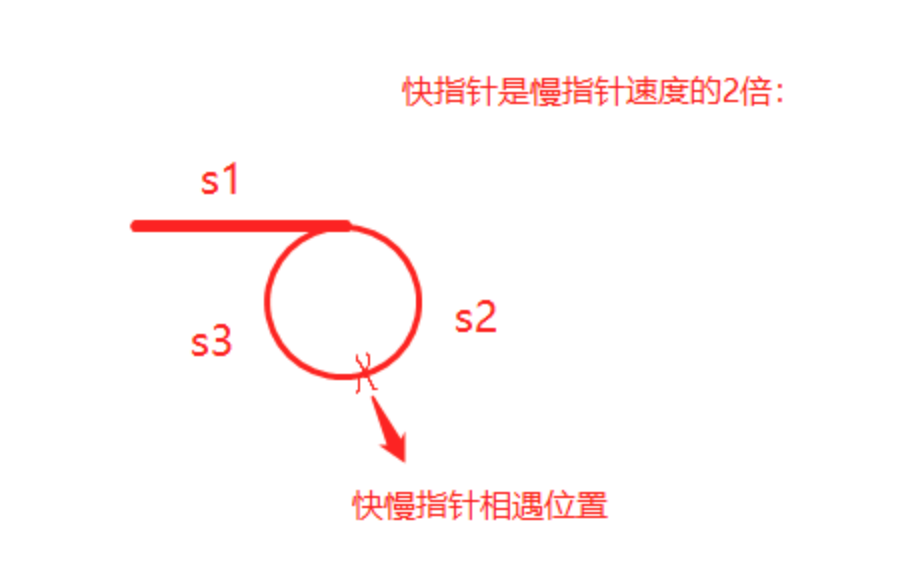

<center><font size='60'>编码总结</font></center>

[TOC]

​		常见的数据结构：链表、二叉树、图、队列、栈、哈希表

​		常见算法：二分查找、动态规划、全排列、滑动窗口、贪心、分治、排序、位运算、DFS、BFS

## 1.数组、链表、哈希表

### 1.1 数组

#### 1.1.1 数组优缺点

​		数组，所有元素都连续的存储于一段内存中，且每个元素占用的内存大小相同，这使得数组具备了通过下标快速访问数据的能力。

​		连续存储的缺点也很明显，增加容量，删除元素的成本都很高，时间复杂度均为O(n)

​		数组优缺点：

- 优点：可以根据偏移快速的随机读写

- 缺点：扩容，增删元素极慢

  

### 1.2 链表

​		链表常见问题：插入、删除、反转、合并、查找、排序

#### 1.2.1 优缺点

​		链表的节点在内存中是分散存储的，通过指针连在一起。

​		链表的储存方式使它可以高效的在指定位置插入与删除，时间复杂度均为O(1)。

​		无法高效获取长度，无法根据偏移快速访问元素，是链表的两个劣势。

#### 1.2.2 解题

**1.使用双指针技巧解题**

​		[环形链表](https://leetcode-cn.com/problems/linked-list-cycle/)：判断链表中是否有环

​		[环形链表 II](https://leetcode-cn.com/problems/linked-list-cycle-ii/)：返回链表开始入环的第一个节点。如果链表无环，则返回null

​		[相交链表](https://leetcode-cn.com/problems/intersection-of-two-linked-lists/)：找出并返回两个单链表headA和headB相交的起始节点，如果两个链表不存在相交节点，返回null

​		解题思路：使用两个指针分别遍历headA、headB，当走到公共node，走的步数相同

​                           pA先遍历headA，再遍历headB

​							pB先遍历headB，再遍历headA

​		[删除链表的倒数第N个节点](https://leetcode-cn.com/problems/remove-nth-node-from-end-of-list/)：删除链表的倒数第n个节点，并返回链表的头节点

​		解题思路：

​		（1）常用技巧添加一个哑节点（dummy node），它的next指针指向链表的头节点，这样就不需要对头节点进行特殊的判断。

​		（2）使用双指针fast、slow，fast先遍历n个节点，然后再一起遍历，直到fast指向Node，slow恰好到倒数第n个节点，删除：slow.next = slow.next.next


**2.链表反转解题步骤**

​	（1）链表反转首先需要创建3个结点：

​			pre=None,   cur=head,   next=cur.next

​	（2）依次遍历节点使：

​				更新下一个节点：next = cur.next

​				当前节点指向前一个节点：cur.next = pre

​				更新前一个节点：pre = cur

​				更新当前节点：cur = next

​	（3）循环结束条件：cur节点为空


**3.链表合并**

​		[合并两个有序链表](https://leetcode-cn.com/problems/merge-two-sorted-lists/)

​		[合并K个升序链表](https://leetcode-cn.com/problems/merge-k-sorted-lists/)：将K个升序链表合并到一个升序链表中，返回合并后的链表

​		解题思路：先合并两个有序链表，再用归并排序的方式进行递归操作。


**4.排序链表**

​		[排序链表](https://leetcode-cn.com/problems/sort-list/)：将链表按升序排列并返回排序后的链表

​		解题思路：归并排序（递归法）

​							（1）分割：使用快慢指针从链表的中间进行分割，找出mid index

​												mid, slow.next = slow.next, None

​							（2）递归终止：递归分割后的链表

​												left, right = self.sortList(head), self.sortList(mid)

​							（3）合并：合并左右子链表


#### 1.2.3 例题

**1.反转链表 - reverse linked list**

```python
def reverseList(self, head):
  cur, prev = head, None
  while cur:
    cur.next, prev, curr = prev, cur, cur.next
  return prev
```

**2.链表交互相邻元素**

```python
def swapPairs(self, head):
  dummyHead = ListNode(0) # dummy node
  pre, pre.next = dummyHead, head
  while pre.next and pre.next.next:
    a = pre.next
    b = a.next
    pre.next, b.next, a.next = b, a, b.next
    pre = a
  return dummyHead.next
  
```

3. **K个一组翻转链表**

[ LeetCode 25.K 个一组翻转链表](https://leetcode-cn.com/problems/reverse-nodes-in-k-group/)

```python
def reverse(self, head: ListNode, tail:ListNode):
    """
    翻转一组链表，返回新的head、tail
    """
    prev = tail.next
    curr = head
    while prev != tail:                        
        nex = curr.next
        curr.next = prev
        prev = curr
        curr = nex
    return tail, head

def reverseKGroup(self, head: Optional[ListNode], k: int) -> Optional[ListNode]:
    # 使用指针head指向每组的头节点，这个指针每次移动k步，直至链表的尾部
    dummyHead = ListNode(0)
    dummyHead.next = head
    pre = dummyHead
    # 每个分组：tail指针从head每次移动1步，判断长度是否大于k，若是进行翻转，否则不需要翻转
    while head:
        tail = pre
        for i in range(k):
            tail = tail.next
            if not tail:
                return dummyHead.next
        nex = tail.next
        head, tail = self.reverse(head, tail)
        # 翻转后的子链表再接回去：需要子链表head的上一个节点pre，但是对于第一个子链表，它head前面没有节点pre，需要创建一个新节点，连接到链表的头部，作为pre的初始值
        pre.next = head
        tail.next = nex
        pre = tail
        head = tail.next
    return dummyHead.next
```


#### 1.2.4 链表输入处理

**1.链表反转**

```python
class ListNode:
    def __init__(self, x):
        self.val = x
        self.next = None

class Solution:
    def reverseList(self, head: ListNode) -> ListNode:
        prev,curr = None, head
        while curr:
            curr.next, prev, curr = prev, curr, curr.next
        return prev

def stringToIntegerList(input):
    return json.loads(input)

def stringToListNode(input):
    # Generate list from the input
    numbers = stringToIntegerList(input)

    # Now convert that list into linked list
    dummyRoot = ListNode(0)
    ptr = dummyRoot
    for number in numbers:
        ptr.next = ListNode(number)
        ptr = ptr.next

    ptr = dummyRoot.next
    return ptr

def listNodeToString(node):
    if not node:
        return "[]"

    result = ""
    while node:
        result += str(node.val) + ", "
        node = node.next
    return "[" + result[:-2] + "]"

def main():
    import sys
    import io
    def readlines():
        for line in io.TextIOWrapper(sys.stdin.buffer, encoding='utf-8'):
            yield line.strip('\n')

    lines = readlines()
    while True:
        try:
            line = next(lines)
            head = stringToListNode(line);
            
            ret = Solution().reverseList(head)

            out = listNodeToString(ret);
            print(out)
        except StopIteration:
            break

if __name__ == '__main__':
    main()
```


3. 

### 1.3 哈希表HashTable

**1.哈希表**

​		是根据关键码值（Key value）而直接进行访问的数据结构。它通过把关键码值映射到表中一个位置来访问记录，以加快查找的速度。这个映射函数叫做散列函数，存放记录的数组叫做散列表。

​		用于查找数组中缺失的数组，hashset数据有去重的功能。

**2.解题步骤**

​		将数组元素添加进hashset数据结构中，就可以查找缺失的数值。


### 2.堆栈、队列

### 2.1 解题

**1.堆栈法**

​		解决具有回文或字符匹配等问题的时候，可以采用堆栈数据类型来解决。比如含有退格的字符串、有效的括号、最长有效括号

**2.解题步骤**

（1）通常定义一个堆栈stack或者ArrayList数据类型

（2）循环结束条件：遍历整个数组或着字符串

### 2.2 例题

**1.最长有效括号**

[LeetCode 32.最长有效括号](https://leetcode-cn.com/problems/longest-valid-parentheses/)：找出最长有效（格式正确且连续）括号子串的长度

```python
def longestValidParentheses(self, s: str) -> int:
    """
    栈操作：
    1.初始栈为stack=[-1]即哨兵节点，老套路。。
    2.开始遍历s的下标
    3.当s[i]为左括号时，无脑入栈
    4.当s[i]为右括号时：
       先pop栈顶
       如果栈为空，则将哨兵pop掉了，没有正确匹配，把当前的i压栈继续当哨兵
       当pop出的栈顶为左括号时，更新ret = max(ret, i - 此时栈顶)
    """
    ans, stack = 0, [-1]
    for i in range(len(s)):
        if s[i] == "(":
            stack.append(i)
        else:
            stack.pop()
            if not stack:
                stack.append(i)
            else:
                ans = max(ans, i-stack[-1])
    return ans
```


## 3.树、二叉树

### 3.1 二叉树

​		二叉树的常见问题：前序遍历、中序遍历、后序遍历、层次遍历

#### 3.1.1 解题

**1.前、中、后序遍历**

​	（1）前序遍历：根、左、右

​	（2）中序遍历：左、根、右

​	（3）后序遍历：左、右、根 

​		遍历可以采用递归遍历和非递归遍历，非递归遍历可以借助栈数据结构

递归解法套路：

（1）确定递归的结束条件：通常是if(root == null): return null

（2）递归遍历左子树和右子树：digui(root.left)       digui(root.right)

递归非常重要的点：不去管函数的内部细节是如何处理的，只看其函数作用及输入与输出

**比如：求解二叉树的最大深度**

- 创建一个递归函数，返回该树的最大深度
- 找到左子树的最大深度
- 找到右子树的最大深度
- 返回左子树的最大深度和右子树最大深度的较大值


**2.层次遍历**

​		利用队列先进先出的特点，依次将结点的左、右孩子入队，然后依次出队访问，以此循环。题目要求按行输出每行结点的值，这里的**关键问题是如何分层**？


**3.使用前序遍历、中序遍历、后序遍历中的两种构建二叉树**

​		根据三种遍历的节点顺序，只有前序+中序、中序+后序才能实现二叉树的构造。而前序+后序不能构建二叉树，因为没法通过根节点的位置将左右子树分开。

​		构造思路：先根据根节点确定左右子树，然后依次找到以每个节点的左右子树，递归实现构造二叉树。


**4.求和问题**

常见问题：

（1）求根节点到叶子节点数字之和 leetcode129

（2）二叉树中的最大路径和 leetcode124

（3）路径总和 leetcode112

​		判断给定的树中是否存在根节点到叶子节点的路径，路径上所有节点值相加等于目标和targetSum，返回Ture和False

（4）路径总和II   leetcode113

​		找出给定二叉树从根节点到叶子节点路径总和等于给定目标和的路径，返回可能的路径。

（5）二叉树的直径 leetcode543

​		给定一棵二叉树，你需要计算它的直径长度。一棵二叉树的直径长度是任意两个结点路径长度中的最大值。这条路径可能穿过也可能不穿过根结点。

（6）二叉树的最大深度 leetcode104


**5.一般二叉树的特殊情况**

常见问题：


**6.二叉搜索树**

​		二叉搜索树：所有节点互不相等，满足：在任一节点root的左（右）子树中，所有节点（若存在）均小于（大于）root。

​		任何一颗二叉树是二叉搜索树，当且仅当其中序遍历序列单调非降。

​		常见问题：验证二叉搜索树、二叉搜索树第k大节点

​		**解题思路：要紧紧的围绕二叉搜索树的中序遍历是非降序列来解题**

​		（1）定义一个指针指向当前节点的前一个节点，利用二叉树中序遍历的思路，将两者的值进行比较，只要前大于后者就不是二叉搜索树

​		（2）利用中序遍历将节点值存入一个数组中，然后遍历数组是否为非降序列。


**7.二叉树的公共祖先**

#### 3.1.2 例题

**1.层序遍历**

[二叉树的层序遍历](https://leetcode-cn.com/problems/binary-tree-level-order-traversal/)：给出二叉树根节点root，返回其结点的层序遍历。（逐层的，从左到右访问所有节点）

```python
def levelOrder(self, root: TreeNode) -> List[List[int]]:
    ans = []
    if not root:
        return ans
    stack = deque([root])
    while stack:
        sub = []
        for i in range(len(stack)):
            node = stack.popleft()
            sub.append(node.val)
            if node.left:
                stack.append(node.left)
            if node.right:
                stack.append(node.right)
        ans.append(sub)
    return ans
```


**2.三种遍历中构造二叉树**

[LeetCode 105.从前序与中序遍历序列构造二叉树](https://leetcode-cn.com/problems/construct-binary-tree-from-preorder-and-inorder-traversal/)：给二叉树的前序遍历数组preorder、中序遍历数组inorder，构成出二叉树并返回其根节点

```python
def buildTree(self, preorder: List[int], inorder: List[int]) -> TreeNode:
    """
    递归：
        1.通过前序找到root
        2.根据root的值找到中序root的index
        3.分别递归左右子树
            left：前序左子树[1:i+1]；中序左子树[:i]
            right：前序右子树[i+1:]；中序右子树[i+1:]
    """
    if not preorder and not inorder: return None

    root = TreeNode(preorder[0])
    i = inorder.index(preorder[0])
    root.left = self.buildTree(preorder[1:i + 1], inorder[:i])
    root.right = self.buildTree(preorder[i+1:], inorder[i + 1:])
    return root
```


**1.二叉树的最近公共祖先**

```python
def lowestCommonAncestor(self, root: 'TreeNode', p: 'TreeNode', q: 'TreeNode') -> 'TreeNode':
  """
  若root是p，q的最近公共祖先，则只可能为以下情况之一：
  1.p和q在root的子树中，且分列root的异侧（分别在左、右子树中）
  2.p=root，且q在root的左子树或右子树中
  3.q=root，且p在root的左子树或右子树中
  """
  			# 终止条件
        if not root or root == p or root==q: return root
        # 递归处理
        left = self.lowestCommonAncestor(root.left, p, q)
        right = self.lowestCommonAncestor(root.right, p, q)
        # 返回值
        # left为空，right不为空，p，q都不在root的左子树中，直接返回right
        if not left:
            return right
        elif not right:
            return left
        # left 和right都不为空，p，q在root的两侧，root为最近公共祖先
        elif left and right:
            return root
```

#### 3.1.3 二叉树如何处理输入输出

**1.输入方式为层序遍历**

[LeetCode 515.在每个树行值中找最大值](https://leetcode-cn.com/problems/find-largest-value-in-each-tree-row/)：给定一棵二叉树的根节点 `root` ，请找出该二叉树中每一层的最大值。

```python
import json
from typing import List, Optional


# Definition for a binary tree node.
class TreeNode:
    def __init__(self, val=0, left=None, right=None):
        self.val = val
        self.left = left
        self.right = right


class Solution:
    def largestValues(self, root: Optional[TreeNode]) -> List[int]:
        ans = []
        if not root: return ans
        queue = [root]
        while queue:
            _max = queue[0].val
            for _ in range(len(queue)):
                node = queue.pop(0)
                _max = max(_max, node.val)
                if node.left:
                    queue.append(node.left)
                if node.right:
                    queue.append(node.right)
            ans.append(_max)
        return ans


def stringToTreeNode(input):
    input = input.strip()
    input = input[1:-1]
    if not input:
        return None

    inputValues = [s.strip() for s in input.split(',')]
    root = TreeNode(int(inputValues[0]))
    nodeQueue = [root]
    front = 0
    index = 1
    while index < len(inputValues):
        node = nodeQueue[front]
        front = front + 1

        item = inputValues[index]
        index = index + 1
        if item != "null":
            leftNumber = int(item)
            node.left = TreeNode(leftNumber)
            nodeQueue.append(node.left)

        if index >= len(inputValues):
            break

        item = inputValues[index]
        index = index + 1
        if item != "null":
            rightNumber = int(item)
            node.right = TreeNode(rightNumber)
            nodeQueue.append(node.right)
    return root


def integerListToString(nums, len_of_list=None):
    if not len_of_list:
        len_of_list = len(nums)
    return json.dumps(nums[:len_of_list])


def main():
    import sys
    import io
    def readlines():
        for line in io.TextIOWrapper(sys.stdin.buffer, encoding='utf-8'):
            yield line.strip('\n')

    lines = readlines()
    while True:
        try:
            line = next(lines)
            root = stringToTreeNode(line);
            ret = Solution().largestValues(root)
            out = integerListToString(ret);
            print(out)
        except StopIteration:
            break


if __name__ == '__main__':
    main()
```

**2.TreeNodeToString**

[LeetCode 105.从前序和中序遍历序列构造二叉树](https://leetcode-cn.com/problems/construct-binary-tree-from-preorder-and-inorder-traversal/)：给定两个整数数组preorder和inorder，其中preorder是二叉树的先序遍历，inorder是同一棵树的中序遍历，请构造二叉树并返回其根节点。

```python
import json
from typing import List


class TreeNode:
    def __init__(self, val=0, left=None, right=None):
        self.val = val
        self.left = left
        self.right = right


class Solution:
    def buildTree(self, preorder: List[int], inorder: List[int]) -> TreeNode:
        """
        递归：
            1.通过前序找到root
            2.根据root的值找到中序root的index
            3.分别递归左右子树
                left：前序左子树[1:i+1]；中序左子树[:i]
                right：前序右子树[i+1:]；中序右子树[i+1:]
        """
        if not preorder and not inorder: return None

        root = TreeNode(preorder[0])
        i = inorder.index(preorder[0])
        root.left = self.buildTree(preorder[1:i + 1], inorder[:i])
        root.right = self.buildTree(preorder[i + 1:], inorder[i + 1:])
        return root


def stringToIntegerList(input):
    return json.loads(input)


def treeNodeToString(root):
    if not root:
        return "[]"
    output = ""
    queue = [root]
    current = 0
    while current != len(queue):
        node = queue[current]
        current = current + 1

        if not node:
            output += "null, "
            continue

        output += str(node.val) + ", "
        queue.append(node.left)
        queue.append(node.right)
    return "[" + output[:-2] + "]"


def main():
    import sys
    import io
    def readlines():
        for line in io.TextIOWrapper(sys.stdin.buffer, encoding='utf-8'):
            yield line.strip('\n')

    lines = readlines()
    while True:
        try:
            line = next(lines)
            preorder = stringToIntegerList(line);
            line = next(lines)
            inorder = stringToIntegerList(line);

            ret = Solution().buildTree(preorder, inorder)

            out = treeNodeToString(ret);
            print(out)
        except StopIteration:
            break


if __name__ == '__main__':
    main()
```


## 4.递归、分治、回溯、贪心

### 4.1 递归

​		**通过函数体来进行循环**

#### 4.1.1递归原理

​		计算n!

​		n! = 1 * 2 * 3 * ... * n

​		

```python
def Factorial(n):
  if n <= 1:
    return 1
  return n * Factorial(n - 1)
```


Recursive

factorial(6)

6 * factorial(5)

6 * (5 * factorial(4))

6 * (5 * (4 * factorial(3)))

6 * (5 * (4 * (3 * factorial(2))))

6 * (5 * (4 * (3 * (2 * factorial(1)))))

6 * (5 * (4 * (3 * (2 * 1))))

6 * (5 * (4 * (3 * 2)))

6 * (5 * (4 * 6))

6 * (5 * 24)

6 * 120

720


#### 4.1.2 递归模板

递归编写模版

```python
def recursion(level, param1, param2, ...):
  # recursion terminator递归终止条件
  if level > MAX_LEVEL:
    print_result
    return
  
  # 当前层的处理逻辑 process logic in current level
  process_data(level, data...)
  
  # drill down 下钻
  self.recursion(level+1, p1, ...)
  
  # reverse the current level status if needed
  reverse_state(level)
  
```


## 5.深度优先DFS + 广度优先BFS

### 5.1DFS

####  5.1.1 解题

**1.树形DFS**

​		Depth First Search（DFS）深度优先搜索实现树的遍历。可以用递归（或者显示栈）来记录遍历过程中访问过的父节点。

​		识别树形DFS：需要按前中后序的DFS方式遍历树


**2.解题步骤**

（1）通常用来处理二叉树的前序、中序、后序遍历、遍历二叉树的所有路径

（2）可以采用栈数据结构存储二叉树的节点，还可以采用递归的方法

（3）如果遍历二叉树的所有路径和：node存储当前遍历的节点，allsum存储当前的和。每次遍历时弹出node的最后一个节点，并添加最后一个节点的左右节点，先将右节点添加进去。


**3.递归写法模版**

```python
visited = set()
def dfs(node, visited):
  visited.add(node)
  # process current node here
  ...
  for next_node in node.children():
    if not next_node in visited:
      dfs(next_node, visited)
```

2.非递归写法模版

```python
def dfs(tree):
  if tree.root is None:
    return []
  
  visited, stack = [], [tree.root]
  
  while stack:
    node = stack.pop()
    visited.add(node)
    
    process(node)
    nodes = generate_related_nodes(node)
    stack.push(nodes)
  # other processing work
  ...
```


### 5.2 BFS

### 5.2.1 解题

**1.树的层次遍历**

​		Breadth First Search（BFS）广度优先搜索，适用于需要遍历一棵树。借助于队列数据结构，从而能保证数的节点按照他们的层数打印出来。打印完当前层所有元素，才能执行到下一层。

​		所有需要遍历数且需要一层一层遍历的问题，都能用这种模式高效解决。

​		识别树上的BFS模式：层序遍历


**2.解题步骤**

（1）用于解决二叉树按层进行遍历的情况、二叉树的最大和最小深度

（2）采用队列数据结构，从树的根节点开始，每次将树的每一层节点添加进队列，再进行操作。每次将每一层呢的节点pop弹出来，将该节点的左右子节点添加进队列

（3）循环结束条件：while循环，知道队列为空跳出循环


**3.广度优先模版**

```python
def bfs(graph, start, end):
  queue = []
  queue.append([start])
  visited.add(start)
  
  while queue:
    node = queue.pop()
    visited.add(node)
    
    process(node)
    nodes = generate_related_nodes(node)
    queue.push(nodes)
  # other processing work
  ...
```


## 6.位运算操作

​		程序中的所有树在计算机内存中都是以二进制的形式存储的，位运算说穿了，就是直接对整数在内存中的二进制位进行操作。不需要转成十机制，因此处理速度非常快。

| 符号 | 描述 | 运算规则                                                     |
| :--: | :--: | ------------------------------------------------------------ |
|  &   |  与  | 两个位都为1时，结果为1                                       |
|  \|  |  或  | 两个位都为0时，结果为0                                       |
|  ^   | 异或 | 两个位相同为0，相异为1                                       |
|  ～  | 取反 | 0变1， 1变0                                                  |
|  <<  | 左移 | 各二进位全部左移若干位，高位丢弃，低位补0                    |
|  >>  | 右移 | 各二进位全部右移若干位，对无符号数，高位补0，有符号数，各编译器处理方法不一样，有的补符号位（算术右移），有的补0（逻辑右移） |

常用位运算：

1. x&1 ==1 or == 0判断奇偶（x % 2 ==1）
2. x = x&(x-1)  => 清零最低位1
3. x & -x  => 得到最低位的1


## 7.动态规划

### 7.1 理论

**1.何时采用动态规划**

​		整个数组或在固定大小的滑动窗口中找到**总和**或者**最大值**或**最小值**问题，可以通过动态规划（DP）在线性时间内解决。


**2.动态规划解题步骤**

​		定义状态、状态转移方程、初始化、输出

- 定义状态

  问题要求什么，要什么，我们dp的因变量就是什么，自变量根据题目要求，为物品和容量

  常见状态定义方法：

  一维动态规划：

  - dp[i]定义为数组前i个元素的最值或者总和
  - dp[i]定义为num[i]作为结尾元素的最值或总和

  二维动态规划：

  - dp\[i][j]定义为数组或字符串从num[i...j]之间的最值
  - dp\[i][j]定义为以num[i]开始并且以num[j]结尾的子数组的最值
  - dp\[i][j]定义为两个数组分别以num[i]和num[j]结尾的最值
  - dp\[i][j]在01背包问题中表示添加前i个数值后剩余的容量为j

- 状态转移方程

  确定好了状态，就要看看这个父问题如何转化为子问题了，这也是状态方程要解决的


**3.对比动态规划 vs 回溯 vs 贪心算法**

- 回溯（递归）：重复计算
- 贪心算法：永远局部最优
- 动态规划：记录局部最优子结构/多种记录值


### 7.2 常见题目

#### 7.2.1 斐波那契数列、爬楼梯问题

**1.斐波那契数列、爬楼梯问题**

（1）斐波那契数列[LeetCode509](https://leetcode-cn.com/problems/fibonacci-number/)

（2）爬楼梯[LeetCode70](https://leetcode-cn.com/problems/climbing-stairs/)

​	状态转移方程：$f[n] = f[n-1] + f[n-2]$


#### 7.2.2 不同路径问题

**1.不同路径问题**

（1）不同路径[LeetCode62](https://leetcode-cn.com/problems/unique-paths/)    [LeetCode63](https://leetcode-cn.com/problems/unique-paths-ii/)    [LeetCode980](https://leetcode-cn.com/problems/unique-paths-iii/)

定义状态：

状态转移方程：$opt[i][j] = opt[i -1][j] + opt[i, j-1]$

```python
if a[i][j] = "空地":
  opt[i][j] = opt[i-1][j] + opt[i][j-1]
else: //石头
  opt[i][j] = 0
```


#### 7.2.3 背包问题

**1.0-1背包问题**

​		从数组中选出一些数值，使其满足特定的容量，从而求其最大值。

​		比如有n个物品，它们有各自的体积w和价值v，现有给定容量的背包bagV，如何让背包里装入的物品有最大的价值总和？（0/1背包问题就是n个物品中某个物品选还是不选，分别表示1和0）

​		状态转移方程：$dp[i][j] = max(dp[i-1][j], dp[i-1][j-w[i]]+v(i))$

​		初始值：i=1， j=1

**总结：如果是0-1背包问题，数组中的元素不可重复使用，nums放在外循环，target在内循环，且内循环倒序：**

```python
for num in nums:
  for i in range(target, num-1, -1):
    
```

[0-1背包]()

问题描述：存在一个容量为C的背包，和N类物品。这些物品分别有两个属性，重量w和价值v，每个物品的重量为w[i]，价值为v[i]，每个物品只有一个。在不超过背包容量的情况下能装入最大的价值为多少？（这个背包可以不装满）

```python
def knapstack(self, w: List[int], v: List[int], bagV: int) -> int:
  """
  动态规划：
  1.定义状态：dp[i][j]表示前i件物品装进容量为j的背包可以获得的最大价值
  2.状态转移方程：dp[i][j] = max(dp[i-1][j], dp[i-1][j-w[i]] + v[i])
        不装入第i件物品：dp[i][j] = dp[i-1][j]
        装入第i件物品：dp[i][j] = dp[i-1][j-w[i]] + v[i] (j > w[i]背包容量大于w[i]物体体积)
  3.初始化：dp[0][:] = 0 第0个物品时不存在的，价值为0
  4.输出：dp[len(w)][bagV]
  """
  n = len(w)
  dp = [[0 for _ in range(c+1)] for _ in range(bagV+1)]
  # 初始化
  for j in range(c+1):
    dp[0][j] = 0
  
  for i in range(1, n+1):
    for j in range(bagV, i-1, -1):
      dp[i][j] = dp[i-1][j]
      if j >= w[i]:
        dp[i][j] = max(dp[i-1][j], dp[i-1][j-w[i]] + v[i])
  return dp[n][bagV]

```

[LeetCode 416.分割等和子集](https://leetcode-cn.com/problems/partition-equal-subset-sum/)：数组nums分割成两个子集，使得两个子集元素和相等

```python
def canPartition(self, nums: List[int]) -> bool:
    """
    动态规划：
    1.定义状态：dp[i][j]表示从前i个元素中挑选子序列是否可以计算出和j；当j=sum/2时，dp[i][j]是否为true
    2.状态转移方程：dp[i][j] = dp[i-1][j]          至少是这个答案
                            true                 nums[i] = j
                            dp[i-1][j-num[i]]    nums[i] < j
      dp[i-1][j]已经为true，已经可以由前i-1个元素中挑选子序列计算出和j，那么d[i][j]自然为true
      dp[i-1][i-num[j]]为ture，前i-1个元素中挑选子序列计算出和j-nums[i]，那么加上nums[i]刚好可以完成
    3.初始化: d[0][0] = fase
    4.输出：dp[nums.len][degV]

    优化方法：用nums中数字凑出sum(nums) // 2的问题
    """
    target = sum(nums)
    if target % 2 != 0: return False
    target = target // 2

    dp = [False] * (target + 1)
    dp[0] = True
    for num in nums:
        for i in range(target, num - 1, -1):
            dp[i] =  dp[i] or dp[i - num]
    return dp[-1]
```


**2.无限背包问题**

​		与01背包不同之处在于，**数组中的元素可以重复选择**。比如：硬币找零问题、切割钢条、剪绳子等。

​		状态转移方程：$dp[i] = max(dp[i], dp[i-len[j]]+price[j])$

​		初始值：i=1...len, j=0...num2.len

**总结：如果是完全背包问题，即数组中的元素可重复使用，nums放在外循环，target在内循环。且内循环正序：**

```python
for num in nums:
  for i in range(num, target+1):
    
```

**如果组合问题需要考虑元素之间的顺序，需要将target放在外循环，将nums放在内循环**

```python
for i in range(1, target+1):
  for num in nums:
    
```

[LeetCode322 零钱兑换](https://leetcode-cn.com/problems/coin-change/) ：最少硬币个数

```python
def coinChange(self, coins: List[int], amount: int) -> int:
    """
    动态规划：
    状态定义：dp[i]表示组成金额i所需最少的硬币
    状态转移方程：dp[i] = min(dp[i], dp[i-coins[j]]+1)
    时间复杂度：O(Sn) S是金额，n是面额数
    空间负责度：O(S)
    """
    Max = amount + 1
    dp = [Max for i in range(amount+1)]
    dp[0] = 0

    for i in range(1, amount+1):
        for j in range(len(coins)):
            if i >= coins[j]:
                dp[i] = min(dp[i], dp[i-coins[j]]+1)
    return dp[amount] if dp[amount] <= amount else -1
```

[LeetCode518 零钱兑换二](https://leetcode-cn.com/problems/coin-change/) ：凑成总金额的硬币组合数

```python
def change(self, amount: int, coins: List[int]) -> int:
    """
    动态规划：跳台阶问题的思考方式一样，将每次跳台阶数变成了输入数组coins
    1.定义动态：dp[j] 代表装满容量为j的背包有几种硬币组合
    2.动态转移方程：dp[j] = dp[j] + dp[j - coin]
    3.初始化：dp[0] = 1
    4.输出结果: dp[amount]
    """
    dp = [0] * (amount + 1)
    dp[0] = 1

    for coin in coins:
        for j in range(coin, amount+1):
            dp[j] += dp[j - coin]
    return dp[amount]
```

[LeetCode剑指 Offer 14- I. 剪绳子](https://leetcode-cn.com/problems/jian-sheng-zi-lcof/) ：长度n的绳子剪成m段，得到最大乘积是多少

```python
def cuttingRope(self, n: int) -> int:
    """
    动态规划：
    1.状态定义：dp[i]表示剪断长度为i的绳子得到最大的乘积
    2.状态转移方程：dp[i] = max(dp[i], dp[i-j]*j), j=1...i (i>=j, i的初始值为3)
    3.初始值：初始值全为1，dp[3] = 2
    4.输出：dp[n]
    """
    dp = [1] * (n+1)
    if n == 3: return 2

    for i in range(3, n+1):
        for j in range(1, i+1):
            dp[i] = max(dp[i], dp[i-j]*j)
    return dp[n]
```

[LeetCode剑指 Offer 49.丑数](https://leetcode-cn.com/problems/chou-shu-lcof/) ：只包含因子2、3、5的数称作丑数，求按从小到大的顺序的第n个丑数

```python
def nthUglyNumber(self, n: int) -> int:
    """
    动态规划：
    1.定义状态：dp[i]表示第i个丑数的值，除此之外要定义三个变量，分别保存了当前{2, 3, 5}三个数的个数num2, num3, num5
    2.定义状态转移方程：dp[i] = min(dp[num2]*2, min(dp[num3]*3, dp[num5]*5))
    3.初始化：num2 = 0, num3 = 0, num5 = 0
    4.输出：dp[n-1]
    """
    dp = [0] * n
    num2 = num3 = num5 = 0
    dp[0] = 1

    for i in range(1, n):
        dp[i] = min(dp[num2] * 2, min(dp[num3] * 3, dp[num5] * 5))
        if dp[i] == dp[num2] * 2:
            num2 += 1
        if dp[i] == dp[num3] * 3:
            num3 += 1
        if dp[i] == dp[num5] * 5:
            num5 += 1
    return dp[n-1]
```


#### 7.2.4 回文子序列与最长字符串系列

##### 7.2.4.1 子序列问题

​		**子序列问题不要求数组元素连续**

**1.最长回文子序列**

```python
# 由于方程式中含有i+1，所以初始时要倒序遍历i，i=len-1...0
# 包含j-1, 所以要整虚遍历j，j=i+1...len
if s[i] == s[j]:
  dp[i][j] = dp[i+1][j-1] + 2 
else:
  dp[i][j] = max(dp[i+1][j], dp[i][j-1])
```

[LeetCode 516.最长回文子序列](https://leetcode-cn.com/problems/longest-palindromic-subsequence/)：返回最长回文子序列的长度

```python
def longestPalindromeSubseq(self, s: str) -> int:
    """
    动态规划:
    1.状态定义：dp[i][j]从第i个字符到第j个字符之间最长回文子序列的长度
    2.状态转移方程：dp[i][j] = dp[i+1][j-1] + 2             s[i] == s[j]
                            max(dp[i+1][j], dp[i][j-1])   s[i] != s[j]
        如果s[i] == s[j]，则等于第i+1到j-1字符之间的最长子串加上2
        如果s[i] != s[j]，则需要计算i和j之间子串的最大值，也即是i向左移j向右移
        由于在计算dp[i][j]时要提前知道dp[i+1]，所以i从字符串最后往前遍历
        同理要知道dp[j-1]所以j需要从前往后遍历
    3.初始化：dp[i][i] = 1 单个字符的最长回文序列是1
    4.输出： dp[0][s.len-1]
    """
    n = len(s)
    dp = [[0] * n for _ in range(n)]
    for i in range(n-1, -1, -1):
        dp[i][i] = 1
        for j in range(i+1, n):
            if s[i] == s[j]:
                dp[i][j] = dp[i+1][j-1] + 2
            else:
                dp[i][j] = max(dp[i+1][j], dp[i][j-1])
    return dp[0][n-1]
```


**2.最长公共子序列**

[LeetCode 1143.最长公共子序列](https://leetcode-cn.com/problems/longest-common-subsequence/)：返回两个字符串text1和text2最长公共子序列的长度

```python
 def longestCommonSubsequence(self, text1: str, text2: str) -> int:
    """
    动态规划
    1.定义状态：dp[i][j]表示s1[0...i]和s2[0...j]最长公共子序列的长度；其中i表示s1前i个字符，j表示s2前j个字符
    2.状态转移方程：if s[i] == s[j]:
                      dp[i][j] = dp[i-1][j-1] + 1
                  else:
                      dp[i][j] = max(dp[i-1][j], dp[i][j-1])
    3.初始化：dp[i][0] = dp[0][j] = 0空字符串与字符串s的公共子序列的长度都为0
    4.输出：dp[len1][len2]
    """
    m, n = len(text1), len(text2)
    dp = [[0] * (n + 1) for _ in range(m + 1)]
    
    for i in range(1, m + 1):
        for j in range(1, n + 1):
            if text1[i - 1] == text2[j - 1]:
                dp[i][j] = dp[i - 1][j - 1] + 1
            else:
                dp[i][j] = max(dp[i - 1][j], dp[i][j - 1])
    
    return dp[m][n]
```


**3.最长递增子序列**

```python
# 只需要判断后一个值大于前一个值：
if nums[i] > nums[j]:
  dp[i] = max(dp[i], dp[j]+1)
```

[LeetCode300](https://leetcode-cn.com/problems/longest-increasing-subsequence/)

```python
def lengthOfLIS(self, nums: List[int]) -> int:
    """
    动态规划：
    1.定义状态：dp[i]表示从头到第i个元素（且包括第i个元素）最长子序列的长度
    2.动态转移方程：dp[i]=max(dp[j])+1,其中0≤j<i且num[j]<num[i]
    3.返回结果：max(dp[0]...dp[n-1])
    """
    if not nums: return 0
    n = len(nums)
    dp = [1] * n
    for i in range(n):
        for j in range(i):
            if nums[i] > nums[j]:
                dp[i] = max(dp[i], dp[j] +1)
    return max(dp)
```

[LeetCode 647.回文子串二](https://leetcode-cn.com/problems/palindromic-substrings/)：统计字符串s回文子串的数目

```python
 def countSubstrings(self, s: str) -> int:
    n = len(s)
    dp = [[False] * n for _ in range(n)]
    cnt = 0
    for i in range(n-1, -1, -1):
        dp[i][i] = True
        for j in range(i, n):
            if s[i] == s[j]:
                dp[i][j] = True and (j-i<3 or dp[i+1][j-1])
                if dp[i][j]:
                    cnt += 1
            else:
                dp[i][j] = False
    return cnt
```


**4.最长定差子序列**

[LeetCode 1218.最长定差子序列](https://leetcode-cn.com/problems/longest-arithmetic-subsequence-of-given-difference/)

问题描述：给你一个整数数组arr和一个整数difference，请你找出并返回arr中最长等差子序列的长度，该子序列中相邻元素之间的差等于difference。
子序列：是指在不改变其余元素顺序的情况下，通过删除一些元素或不删除任何元素而从 arr 派生出来的序列。

```python
def longestSubsequence(self, arr: List[int], difference: int) -> int:
    """
    动态规划：
    1.状态定义： dp[v]表示以数组中数字v为结尾的最长定差子序列，v不是索引而是数值
    2.动态转移方程：dp[v] = dp[v - d] + 1
    3.初始化：dp = defaultdict(int) defaultdict：如果key值不存在，不会报KeyError，而是返回默认值
    4.输出：max(dp.values())
    """
    dp = defaultdict(int)
    for v in arr:
        dp[v] = dp[v-difference] + 1
    return max(dp.values())
```


**5.最长等差序列**

[LeetCode 1027.最长等差数列](https://leetcode-cn.com/problems/longest-arithmetic-subsequence/)：给你一个整数数组 `nums`，返回 `nums` 中最长等差子序列的**长度**。

```python
def longestArithSeqLength(self, nums: List[int]) -> int:
    dp = dict()
    for i in range(1, len(nums)):
        for j in range(i):
            step = nums[i] - nums[j]
            dp[(i, step)] = dp.get((j, step), 1) + 1
    return max(dp.values())
```


##### 7.2.4.2 子字符串问题

**1.最长回文子串**

```python
# 初始时i=len-1...0,  j=i...len
dp[i][j] = (s[i] == s[j]) and (j-i < 3 or dp[i+i][j-1])

或者
if s[i] == s[j]:
  dp[i][j] = True and (j-i < 3 or dp[i+i][j-1])
else:
  dp[i][j] = False
```

[LeetCode 5.最长回文子串](https://leetcode-cn.com/problems/longest-palindromic-substring/)：返回s中最长的回文子串

```python
def longestPalindrome(self, s: str) -> str:
    """
    动态规划
    1.状态定义：dp[i][j]表示为起始位置分别为i到j组成的子串s[i:j]是否是回文字符串，bool类型
    2.状态转移方程：dp[i][j] = (s[i] == s[j]) & (j-i<3 || dp[i+1][j-1])
         边界条件：子串长度j-1 - (i+1) + 1如果小于2，要么长度为0的空串，要么长度为1的单个字符串，都是回文子串
    """
    n = len(s)
    dp = [[False] * n for _ in range(n)]
    start = end = 0

    for i in range(n-1, -1, -1):
        dp[i][i] = True
        for j in range(i, n):
            if s[i] == s[j]:
                dp[i][j] = True and (j-i<3 or dp[i+1][j-1])
            else:
                dp[i][j] = False
            if dp[i][j] and j-i+1 >= end - start:
                start = i
                end = j + 1
    return s[start:end]
```

**2.最长公共子串**

**3.最长递增子串**


#### 7.2.5 数组问题

**1.最大子数组和**

[LeetCode53](https://leetcode-cn.com/problems/maximum-subarray/)

```python
def maxSubArray(self, nums: List[int]) -> int:
  # 动态规划：f(i)=max{f(i−1)+nums[i],nums[i]}
  pre = 0
  maxAns = nums[0]
  for i in nums:
    pre = max(pre+i, i)
    maxAns = max(pre, maxAns)
  return maxAns
```


**2.乘积最大子数组**

[LeetCode152](https://leetcode-cn.com/problems/maximum-subarray/)

```python
def maxProduct(self, nums: List[int]) -> int:
    """
    动态规划：
    1.状态定义：
       dp[i][0]: 表示第i个元素结尾的乘积的最大子数组的乘积
       dp[i][1]: 表示第i个元素结尾的乘积的负的最大子数组的乘积
       a 表示输入参数nums
    2.动态转移方程：
       dp[i][0] = if a[i] >=0:  dp[i-1][0] * a[i]
                  else:         dp[i-1][1] * a[i]
       dp[i][1] = if a[i] >=0:  dp[i-1][1] * a[i]
                  else:         dp[i-1][0] * a[i]
    """
    if not nums: return 0

    res, curMax, curMin = nums[0], nums[0], nums[0]
    for i in range(1, len(nums)):
        num = nums[i]
        curMax, curMin = curMax * num, curMin * num
        curMin, curMax = min(curMin, curMax, num), max(curMax, curMin, num)

        res = curMax if curMax > res else res
    return res
```


**3.三角形最小路径和**

[LeetCode120](https://leetcode-cn.com/problems/triangle/)

```python
def minimumTotal(self, triangle: List[List[int]]) -> int:
    """
    动态规划：
    1.定义状态：dp[i,j]: bottom ——>[i,j] path sum min
    2.动态转移方程：dp[i,j] = min(dp(i+1, j), dp(i+1, j+1)) + triangle[i,j]
              初始化：dp[m-1,j] = triangle[m-1,j]
    """
    if not triangle: return 0

    res = triangle[-1]
    for i in range(len(triangle)-2, -1, -1):
        for j in range(len(triangle[i])):
            res[j] = min(res[j], res[j+1]) + triangle[i][j]
    return res[0]
```


#### 7.2.6 股票问题

**1.买卖股票最佳时机**

[LeetCode121](https://leetcode-cn.com/problems/best-time-to-buy-and-sell-stock/)    [LeetCode122](https://leetcode-cn.com/problems/best-time-to-buy-and-sell-stock-ii/)    [LeetCode123](https://leetcode-cn.com/problems/best-time-to-buy-and-sell-stock-iii/)   [LeetCode188](https://leetcode-cn.com/problems/best-time-to-buy-and-sell-stock-iv/)

```python
def maxProfit(self, k: int, prices: List[int]) -> int:
    """
    动态规划：
    1.动态定义：mp[i][k][j]：表示第i天进行k次交易获取的最大利润
              i：表示股票在第i天的价格0～n-1
              k：表示第k笔交易0～k
              j：0:当前手上没有股票；1:当前手上持有一支股票
    2.动态转移方程：
       mp[i][k][0] = max( 
                         mp[i-1][k][0]   # 不动
                         mp[i-1][k-1][1] + a[i] # 卖掉           
       )
       mp[i][k][1] = max(
                         mp[i-1][k][1]   #不动
                         mp[i-1][k][0] - a[i]  # 买入
       )
    """
    if not prices: return 0

    n = len(prices)
    k = min(k, n // 2)
    maxprof = 0

    profit = [[[0 for _ in range(2)] for _ in range(k+1)]for _ in range(n)]

    profit[0][0][0], profit[0][0][1] = 0, -prices[0]

    for m in range(1, k+1):
        profit[0][m][0] = profit[0][m][1] = float("-inf")

    for i in range(1, n):
        profit[i][0][1] = max(profit[i-1][0][1], profit[i-1][0][0] - prices[i])
        for m in range(1, k+1):
            profit[i][m][0] = max(profit[i-1][m][0], profit[i-1][m-1][1] + prices[i])
            profit[i][m][1] = max(profit[i-1][m][1], profit[i-1][m][0] - prices[i])
            maxprof = max(profit[i][m][0], profit[i][m][1], maxprof)
    return maxprof
```


## 8.滑动窗口

### 8.1 解题方法

**1.常用于解决的问题**

​		经常用来执行**数组或是链表上某个区间（窗口）上的操作**。比如找最长的全为1的子数组长度。滑动窗口一般从第一个元素开始，一直往右一个一个元素挪动，当然了，根据题目要求，可能有固定窗口大小的情况，也有窗口大小变化的情况。

​		滑动窗口经常用于寻找连续的子串和数组。

​		下面是一些用来判断我们可能需要上滑动窗口策略的方法：

​	（1）这个问题的输入是一些线性结构：比如链表，数组，字符串等
​	（2）求最长/最短字符串或者某些特定的长度要求


**2.解决步骤**

（1）通常需要两个指针：left、right

（2）循环结束条件：首先保持左指针不动，移动右指针，右指针遍历整个数组

### 8.2例题

**1.和为s的两个数字**

[LeetCode 剑指offer 57.和为s的两个数字](https://leetcode-cn.com/problems/he-wei-sde-liang-ge-shu-zi-lcof/)

```python
def twoSum(self, nums: List[int], target: int) -> List[int]:
    i, j = 0, len(nums) - 1
    while i < j:
        s = nums[i] + nums[j]
        if s > target: 
            j -= 1
        elif s < target: 
            i += 1
        else: 
            return nums[i], nums[j]
    return []
```


[LeetCode 剑指offer 57-2.和为s的两个数字](https://leetcode-cn.com/problems/he-wei-sde-lian-xu-zheng-shu-xu-lie-lcof/):输入一个正整数 `target` ，输出所有和为 `target` 的连续正整数序列（至少含有两个数）。

```python
def findContinuousSequence(self, target: int) -> List[List[int]]:
    n = target // 2 +1
    left = right = 1
    s = 0
    res = []
    while left < n:
        while s < target:
            s += right
            right += 1
        if s == target:
            sub = [i for i in range(left, right)]
            res.append(sub)
        left += 1
        right, s = left, 0
    return res
```


**2.乘积小于K的子数组**

[LeetCode 713.乘积小于K的子数组](https://leetcode-cn.com/problems/subarray-product-less-than-k/)：给定一个正整数nums和整数k，请找出该数组内乘积小于k的连续的子数组的个数。

```python
def numSubarrayProductLessThanK(self, nums: List[int], k: int) -> int:
    """
    采用滑动窗口的方法：如果窗口内乘积大于等于k，左指针右移，右指针右移
                     每次增加子数组的个数就是窗口元素的个数
    """
    if k <= 1: return 0
    n = len(nums)
    prod = 1
    left = ans = 0
    for right, val in enumerate(nums):
        prod *= val
        while prod >= k:
            prod /= nums[left]
            left += 1
        ans += right - left + 1
    return ans
```


## 9. 双指针法

### 9.1 解题方法

**1.双指针模式**

​		两个指针朝着**左右方向移动**（双指针分为同向指针和异向指针），直到他们有一个或是两个都满足某种条件。双向指针通常用在**排好序的数组或者链表**中寻找对子。比如，需要去比较数组中每个元素和其他元素的关系时，需要使用到双指针。

​		使用双指针的策略方法：

​	（1）一般来说，数组或是链表是排好序的，在里头找一些组合满足某些限制条件

​	（2）这种组合可能是一对数、三个数、或者一个子数组


**2.解题步骤**

（1）通常左右两个指针分别为left和right，左右指针的初始位置不一定是0和lenght-1，还可能为0和1

（2）循环结束条件：**while(left <= right)**

（3）比如求两数之和、三数之和、四数之和

​		在三数之和中，先选择一个target目标值，可以遍历整个数组作为两数之和。而left指针从i+1开始，right指针从length-1开始。计算方式与两数之和类似

​		去重：在求多数之和中最常见的就是要去重，需要考虑两部：

​		（1）target去重，去除重复的target目标和

​		（2）左右指针去重，去除遍历重复的左指针和右指针


### 9.2 例题

**1.盛最多水的容器**

[LeetCode 11.盛最多水的容器](https://leetcode-cn.com/problems/container-with-most-water/)：返回容器可以储存的最大水量

```python
def maxArea(self, height: List[int]) -> int:
    left, right, ans = 0, len(height) - 1, 0
    while left < right:
        area = (right-left) * min(height[left], height[right])
        ans = max(area, ans)
        # height值小的移动，保留大值
        if height[left] <= height[right]:
            left += 1
        else:
            right -= 1
    return ans
```


**2.颜色分类**

[LeetCode 75.颜色分类](https://leetcode-cn.com/problems/sort-colors/)：使用O(N)、O(1)来解决

```python
def sortColors(self, nums: List[int]) -> None:
    """
    Do not return anything, modify nums in-place instead.
    双指针：
    用指针p0交互0，p1交互1，初始值都为0
    1.连续的0之后是连续的1，因此如果将0与nums[p0]进行交换，那么可能会把一个1交换出去。当p0<p1时，已经将一些1连续地放在头部，此时一定会把一个1交换出去，导致答案错误。
    2.因此，如果p0<p1，那么需要再将nums[i]与nums[p1]进行交换，其中i是当前遍历到的位置，在进行了第一次交换后，nums[i]的值为1，需要将这个1 放到「头部」的末端。
    3.最后，无论是否有 p0<p1，我们需要将p0和p1均向后移动一个位置，而不是仅将p0向后移动一个位置。
    """
    n = len(nums)
    p0 = p1 = 0
    for i in range(n):
        if nums[i] == 1:
            nums[i], nums[p1] = nums[p1], nums[i]
            p1 += 1
        elif nums[i] == 0:
            nums[i], nums[p0] = nums[p0], nums[i]
            if p0 < p1:
                nums[i], nums[p1] = nums[p1], nums[i]
            p0 += 1
            p1 += 1
```


## 10.快慢指针法

### 10.1 解题

**1.快慢指针模式**

​		这种算法的两个指针在数组上（或链表上，序列上）的移动速度不一样。这种方法在解决有环的链表和数组时特别有用。通过控制指针不同的移动速度，最终两个指针肯定会相遇的，快的一个指针肯定会追上慢的一个。

​		怎么知道需要用快慢指针模式？

​		（1）问题需要处理环上的问题，比如环形链表和环形数组

​		（2）当你需要知道链表的长度或者某个特别位置的信息的时候

**2.解题步骤**

（1）常见问题：链表的中间节点、链表的倒数第N个节点、判断是否为环形链表、快乐数

（2）采用快慢两个指针，fast和slow，快指针移动2步，慢指针移动1步

（3）循环结束条件：遍历整个链表


### 10.2 例题

**1.删除链表的倒数第N个结点**

[LeetCode 19.删除链表的倒数第N个结点](https://leetcode-cn.com/problems/remove-nth-node-from-end-of-list/)：删除链表的倒数第n个结点，并返回链表的头结点

```python
def removeNthFromEnd(self, head: ListNode, n: int) -> ListNode:
    dummy = ListNode(0, head)
    fast, slow = head, dummy

    for _ in range(n):
        fast = fast.next

    while fast:
        fast = fast.next
        slow = slow.next
    slow.next = slow.next.next
    return dummy.next
```


**2.寻找重复数**

[LeetCode 287.寻找重复数](https://leetcode-cn.com/problems/find-the-duplicate-number/)：nums中只有一个重复数，返回这个重复数



```python
def findDuplicate(self, nums: List[int]) -> int:
    """
    快慢指针：通过快慢指针的方法判断数组是否有环，并找出数组存在环的入口结点
            快指针是慢指针速度的2倍，当它们相遇时走的路程也是2倍
            2 *(s1 + s2) = s1 + s2 + s3 + s2 ==> s1 = s3
        如果两个指针同时同速从0和相遇位置出发，相遇的位置一定在环的入口结点
    """
    fast = slow = 0
    while True:
        slow = nums[slow]
        fast = nums[nums[fast]]
        # 快慢指针相遇
        if slow == fast:
            # 快指针从0位置出发，慢指针从相遇位置出发
            fast = 0
            while nums[fast] != nums[slow]:
                fast = nums[fast]
                slow = nums[slow]
            return nums[slow]
```


## 11.循环排序

### 11.1 解题

1.循环排序法

​		可以用来处理**数组中的数值限定在一定区间的问题**。这种模式一个个遍历数组的元素，如果当前这个数它不在其应该在的位置的话，咱们就把它和它应该在的那个位置上的数交换一下。

​		如何鉴别这种模式？

​	（1）这些问题一般设计到排序好的数组，而且数值一般满足于一定的区间

​	（2）如果问题让你需要在排好序/翻转过的数组中，寻找丢失的/重复的/最小的元素

2.解题步骤：

（1）采用循环排序遍历的方法，这就好比一个萝卜一个坑。将nums[i]所对应的索引位置的数据标记为负数，最终查看不是负数的数据索引就是缺失的数据或者重复的数据。

（2）循环结束标志：遍历整个数组

### 11.2 例题

**1.扑克牌中的顺子**

[剑指 Offer 61. 扑克牌中的顺子](https://leetcode-cn.com/problems/bu-ke-pai-zhong-de-shun-zi-lcof/)

```python
def isStraight(self, nums: List[int]) -> bool:
    if len(nums) != 5: return False
    nums2 = [x for x in nums if x > 0]
    minV = min(nums2)
    nums3 = [0] * 5
    for i in range(len(nums)):
        if nums[i] == 0:
            continue
        else:
            index = nums[i] - minV
            if index <= 4 and nums3[index] == 0:
                nums3[index] = nums[i]
            else:
                return False
    return True
        
```


## 12.二分查找

### 12.1 二分查找模板

**1.符合二分查找的题目**

（1）Sorted（单调递增或者递减）

（2）Bounded（存在上下界）

（3）Accessible by index（能够通过索引访问）


**2.二分查找代码模板**

```python
left, right = 0, len(nums) - 1
while left <= right:
  mid = (left + right) // 2
  if nums[mid] == target:
    // find the target
    break or return result
  elif nums[mid] < target:
    left = mid + 1
  else:
    right = mid - 1
```


