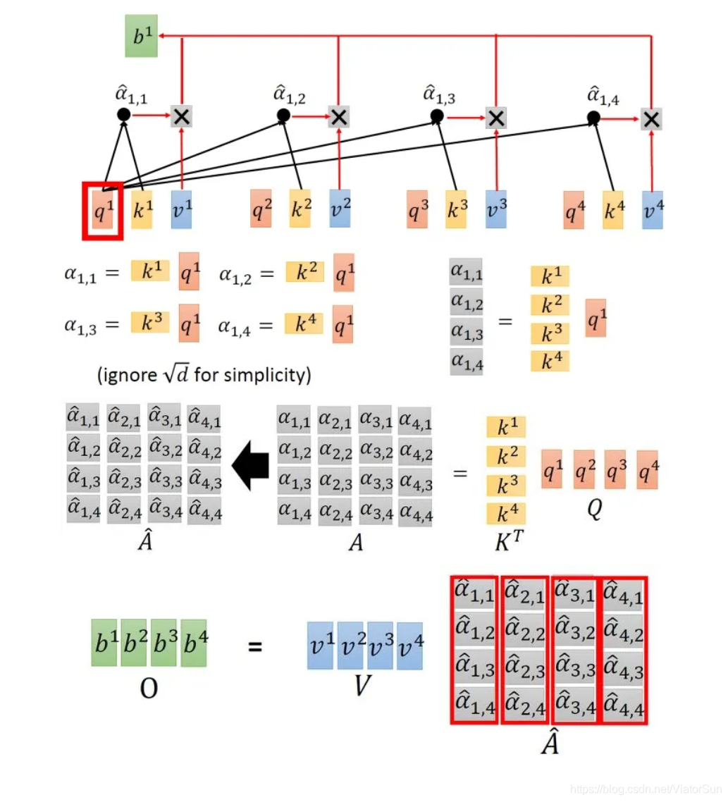

注意力机制

## 1.人类视觉的注意力机制

​		视觉注意力机制是人类视觉所特有的大脑信号处理机制。人类视觉通过快速扫描全局图像，获得需要重点关注的目标区域，也就是一般所说的注意力焦点，而后对这一区域投入更多注意力资源，以获取更多所需要关注目标的细节信息，而抑制其他无用信息。人类视觉注意力机制极大地提高了视觉信息处理的效率和准确性。

​		深度学习中的注意力机制从本质上讲和人类选择视觉注意力机制类似，**核心目标是从众多信息中选择出对当前任务目标更关键的信息。**

## 2.为什么要引入Attention机制

根据通用近似定理，前馈网络和循环网络都有很强的能力，但为什么还要引入注意力机制呢？

- **计算能力的限制**

  当要记住很多“信息”，模型就要变得更复杂，然而目前计算能力依然是限制神经网络发展的瓶颈

- **优化算法的限制**

  虽然局部连接、权重共享以及pooling等优化操作可以让神经网络变得简单一些，有效缓解模型复杂度和表达能力之间的矛盾；但是，如循环神经网络中的长距离带来的问题，信息“记忆”能力并不高

可以借助人脑处理信息过载的方式，例如Attention机制可以提高神经网络处理信息的能力。

## 3.Attention机制的本质思想

### 3.1 简述Encoder-Decoder框架

​		Encoder-Decoder框架可以看作是一种深度学习领域的研究模式，应用场景非常广泛，下图是文本处理领域常用的Encoder-Decoder框架最抽象的一种表示：

​		Encoder-Decoder框架可以看作处理一个句子（或篇章）生成另外一个句子（或篇章）的通用处理模型。对于句子对<Source，Target>，目标是给定输入句子Source，期待通过Encoder-Decoder框架来生成目标句子Target。Source和Target可以是同一种语言，也可以是两种不同的语言。而Source和Target分别由各自的单词序列构成：

​													$Source = <x_1, x_2...x_m>$

​													$Target = <y_1, y_2...y_n>$

​		Encoder顾名思义就是对输入句子Source进行编码，将输入句子通过非线性变换转化为中间语义表示C：

​													$C = F(x_1, x_2...x_m)$

​		对于Decoder来说，其任务是根据句子Source的中间语义表示C和之前已经生成的历史信息$y_1, y_2, ...y_{i-1}$来生成i时刻要生成的单词$y_i$:

​													$y_i = g(C, y_1, y_2, ... y_{i-1})$

​		每个$y_i$都依次这么产生，那么整个系统根据输入句子Source生成了目标句子Target。

### 3.2 从Encoder-Decoder框架抽象出来理解Attention

​		将Source中的构成元素想象成是由一系列<Key, Value>数据对构成，Key：元素标识id，Value：元素值；此时给定Target中的某个元素Query，通过计算Query和各个Key的相似性或者相关性，得到每个Key对应Value的权重系数，然后对Value进行加权求和，即得到了最终的Attention数值。

​		本质上Attention机制是对Source中元素的Value值进行加权求和，而Query和Key用来计算对应Value的权重系数。即可以将本质思想改写为如下公式：

​                              $Attention(Query,Source) = \sum_{i=1}^{L_{x}}Similarity(Query, Key_i) * Value_i$

​		其中，$L_x$表示Source的长度。

### 3.3通过软寻址（Soft Addressing）理解Attention

​		可以将Attention机制看作一种软寻址（Soft Addressing）：Source可以看作存储器内存储的内容，元素由地址Key和值Value组成，当前有个Query查询，目的是取出存储器中对应的Value值，即Attention数值。

​		通过Query和存储器内元素key的地址进行相似性比较来寻址，之所以说是软寻址，指的不像一般寻址只从存储内容里面找出一条内容，而是可能从每个Key地址都会取出内容，取出内容的重要性根据Query和Key的相似性来决定，之后对Value进行加权求和，这样就可以取出最终的Value值，即Attention值。

### 3.4 更通俗的来理解Attention

​		图书管（Source）里有很多书（Value），为了方便查找，我们给书做了编号（key）。当想要了解漫威（Query）的时候，可以看看那些动漫、电影、甚至二战（美国队长）相关书籍。

​		为了提高效率，并不是所有的书都会仔细看，针对漫威来说，动漫、电影相关的会看的仔细一些（权重高），但是二战的就只需要简单扫一下即可（权重低）。

## 4.Attention计算过程

​		Attention的计算过程可以分为3个阶段：

- **step1-从输入信息中确定Key和Value，并计算相似度**

  用$X = [x_1,...,x_N]$表示N个输入信息，令Key=Value=X，query和key进行相似度计算，得到权值；

  可以引入不同的函数和计算机制，最常见的方法包括：求两者的向量点积、求两者的向量Cosine相似性或者通过引入额外的神经网络来求值：

  ​				点积：                        $Sim(Q,K_i) = Q \cdot K_i$

  ​				Cosine相似性：        $Sim(Q,K_i) = \frac{Q \cdot K_i}{||Q|| \cdot ||K_i||} $

  ​				MLP网络：                $Sim(Q,K_i) = MLP(Q, K_i)$

- **step2-权值归一化（softmax）计算注意力分布**

  利用softmax进行权值归一化：

  ​                                                  $\alpha_i = Softmax(Sim_i) = \frac{e^{Sim_i}}{\sum_{j=1}^{L_x}e^{Sim_j}}$

- **step3-信息加权平均，即权重和Value进行加权求和**

  ​                                                 $Attention(Query, Source) = \sum_{i=1}^{L_x}\alpha_i \cdot Value_i$

## 5.Self Attention

​		一般任务的Encoder-Decoder框架中，输入Source和输出Target内容是不一样的，比如对于英-中机器翻译来说，Source是英文句子，Target是对应翻译出的中文句子，**Attention机制发生在Target的元素Query和Source中的所有元素之间**。**而Self Attention，指的不是Target和Source之间的Attention机制，而是Source内部元素之间或者Target内部元素之间发生的Attention机制，也可以理解为Target=Source这种特殊情况下的注意力计算机制**。其具体计算过程是一样的，只是计算对象发生了变化而已。

### 5.1 Self Attention解决了什么问题

​		在transformer之前，NLP领域常见的处理序列数据方法主要是RNN/LSTM：

- 不能并行，训练时间较长

  由于RNN/LSTM在计算时需要考虑前序信息，所以不能并行，导致训练时间较长

  

- 长距依赖问题

  当序列长度过长时，由于模型深度增加，序列开始部分对末端部分影响几乎消失，虽然记忆网络/attention机制加入可以降低一部分影响，但长距依赖问题仍然存在。

  

  

self-attention内部结构示意图

Self-attention可以很好的处理上面两个问题，首先，**self-attention通过位置编码保证序列关系，计算上不依赖序列关系，所以可以实现完全的并行**，其次，**在计算相关性时候，任何一个点都会与整个序列中的所有输入做相关计算，避免了长距依赖的问题。**

### 5.2 Self-attention的输入输出

​		输入是一排vector，输出一排vector。

​		**输出的vector是考虑了输入的所有向量的信息**

​		如上图所示，一个self-attention块的输入是input sequence或者是上一层的输出。每个输出b都会考虑整个输入序列的信息。

### 5.3 Self-attention的计算过程

计算公式：$Attention(Q, K, V) =  softmax(\frac{QK^T}{\sqrt{d_k}})V$

根据paper self-attention实现机制如下：

- 将单词转化为embedding向量

  假设input是上图的$x^1 -x^4$, 是一个sequence，每个input（vector）先乘上一个矩阵W得到embedding，即向量$a^1 - a^4$

- 根据embedding向量得到q，k，v三个向量

  接着embedding进入self-attention层，每一个向量$a^1 - a^4$分别乘上3个不同的transformation matrix $W_q, W_k, W_v$，以向量$a^1$为例，分别得到3个不同的向量$q^1, k^1, v^1$

  **注意：$W_q, W_k, W_v$就是模型需要训练的参数**

- 为每个向量计算一个attention score：$score = q \cdot k$ ；为了梯度的稳定，self-attention使用了score归一化，即除以$\sqrt{d_k}$

  每个query q去对每个key k做attention，attention就是匹配这2个向量有多接近。

  比如要对$q^1和k^1$做attention，就可以把这2个向量做Scaled Dot-Product，得到$\alpha_{1,1}$。再拿$q^1和k^2$做attention，得到$\alpha_{1,2}$，再拿$q^1和k^3$做attention，得到$\alpha_{1,3}$，再拿$q^1和k^4$做attention，得到$\alpha_{1,4}$。那么scaled dot-product具体是怎么计算的呢：

  ​                                                         $\alpha_1,i = q^1 \cdot k^i / \sqrt{d}$

  其中，**d是q跟k的维度，因为$q \cdot k$的数值会随着dimension的增大而增大，所以要除以$\sqrt{dimension}$的值，相当于归一化的效果。**

- 对score施以softmax激活函数

  把计算得到的所有$\alpha_{1, i}$值取softmax操作

  

- softmax点乘value值v，得到加权的每个输入向量的评分v

  取完softmax 操作后，得到了$\hat\alpha_{1,i}$，我们用它和所有的$v^i$值进行相乘。

  具体来讲，把 $\hat\alpha_{1,1}$乘上$v^1$，把 $\hat\alpha_{1,2}$乘上$v^2$，把$\hat\alpha_{1,3}$乘上$v^3$，把 $\hat\alpha_{1,4}$乘上$v^4$，把结果通通加起来得到$b^1$

- 相加之后得到最终的输出结果z：$z = \sum v$

#### 5.3.1 解输入vector之间的相关性权重$\alpha$

​		查看上面的 self-attention内部结构示意图，它的架构是这样的，**输出的一排b是a经过计算输出的：$b^1$ 是考虑了$a^1,a^2,a^3,a^4$后产生的。$b^2,b^3,b^4$也是考虑了$a^1,a^2,a^3,a^4$后产生的。**

比较常见的两种计算方法：**dot product**和**additive**

#### 5.3.2 矩阵角度

公式：              $\hat{A} = softmax(A) = K^T \cdot Q$

​                         $O = V \cdot \hat{A}$

- **step1: 对每一个向量a，分别乘上3个系数$W^q, W^k, W^k$得到q，k， v 3个值**

  ​					$Q = W^q \cdot I$

  ​					$K = W^k \cdot I$

  ​					$V = W^v \cdot I$

  得到的Q，K，V分别表示query，key和value；**这3个W就是需要学习的参数**

  

  

- **step2: 利用得到的Q和K计算每两个输入向量之间的相关性，也就是计算attention的值$\alpha$， $\alpha$的计算方法有多种，通常采用点乘的方式**

  $\alpha_{i, j} = (q^i)^T \cdot k^j$ 写成向量形成：$A = K^T \cdot Q$

  矩阵A中的每一个值记录了对应的两个输入向量的Attention的大小$\alpha$

- **step3: 对矩阵A进行softmax操作或者relu操作得到$A^{\prime}$**

- **step4: 利用得到的$A^{\prime}$和V计算每个输入向量a对应的self-attention层的输出向量b**

  $b_i = \sum_{j=1}^nv_i \cdot \alpha_{i, j}^{\prime}$，写成向量形式$O = V \cdot A^{\prime}$

  

  Self-attention就是一堆矩阵乘法，可以实现GPU加速。

  ### 5.4 Multi-head Sel-attention

  ​		如果想把注意力集中在一个单词上，这个机制足够了，但是如果想从几个角度看这个句子，然后并行计算几次注意力，会怎么样？这就是所谓的多头注意力 Multi-Head Attention。

  ​		以2个head为例：由$a^i$生成的 $q^i$进一步乘以2个转移矩阵变成$q^{i, 1}$和$q^{i,2}$，同理由$a^i$生成的$k^i$进一步乘以2个转移矩阵变成$k^{i,1}和k^{i,2}$，由$a^i$生成的$v^i$进一步乘以2个转移矩阵变成$v^{i, 1}$和$v^{i, 2}$。接下来$q^{i, 1}$再与$k^{i, 1}$做attention，得到weighted sum的权重$\alpha$，再与$v^{i, 1}$做weighted sum得到最终的$b^{i, 1}(i = 1,2,...,N)$。同理得到$b^{i, 2}(i = 1,2,...,N)$，可以把它们concat起来，再通过一个transformation matrix调整维度，使之与刚才的$b^i(i = 1,2,...,N) \in R(d,1)$维度一致。

  

  

​		从下图看到Multi-Head Attention包含多个Sef-Attention层，首先将输入X分别传递到2个不同的Self-Attention中，计算得到2个输出结果。得到2个输出矩阵之后，Multi-Head Attention将它们拼接在一起（Concat），然后传入一个Linear层，得到Multi-Head Attention最终的输出Z。可以看到Multi-Head Attention输出的矩阵Z与其输入的矩阵X的维度是一样的。

​		

