<center><font size='60'>Tensorflow2.0</font></center>

## 1.神经网络计算过程

知识点：搭建第一个神经网络模型

### 1.1 神经网络设计过程

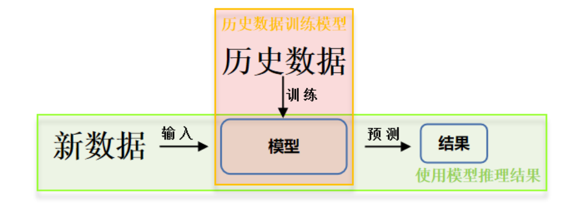

- 准备数据：采集大量“特征/标签”数据
- 搭建网络：搭建神经网络结构
- 优化参数：训练网络获取最佳参数（反传）
- 应用网络：将网络保存为模型，输入新数据，输出分类或预测结果（前传）

### 1.2 给鸢尾花分类 搭建神经网络

*1.需要解决的分类描述*

​		根据采集的特征（比如花萼长、花萼宽、花瓣长、花瓣宽）预测鸢尾花的类别（0狗尾草鸢尾、1杂色鸢尾、2弗吉尼亚鸢尾）。

**2.采集数据**

​		采集大量输入特征（花萼长、花萼宽、花瓣长、花瓣宽）、标签类别（对应的类别，需要人工标定）数据对构成数据集

​		把数据喂到搭建好的神经网络结构，网络优化参数得到模型，模型读入新输入特征，输出识别结果

**3.搭建网络**

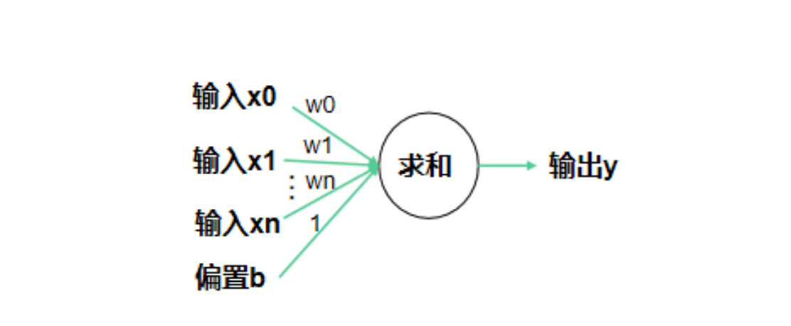

​		搭建包含输入层与输出层的神经网络模型，通过对输入值乘权值，并于偏置值求和的方式得到输出值。

​		公式：y = x * w + b，即所有的输入x乘以各自线上的权重w求和加上偏置项b得到输出y。

​		输入特征x形状应为(1, 4)1行4列，输出y形状应为(1, 3)1行3列， w形状应为(4, 3)4行3列，b形状应为(3, )3个偏置项。

**4.初始化权重w与偏置b**

​		搭建好基本网络后，需要输入特征数据，并对线上权重w与偏置b进行初始化，w，b初始化矩阵如下图，在这里，我们输入标签为0的狗尾草鸢尾。

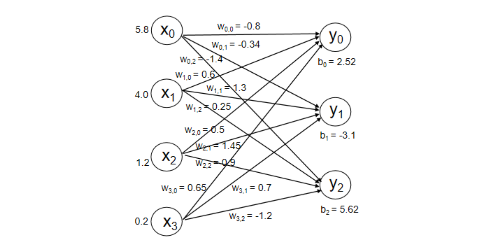

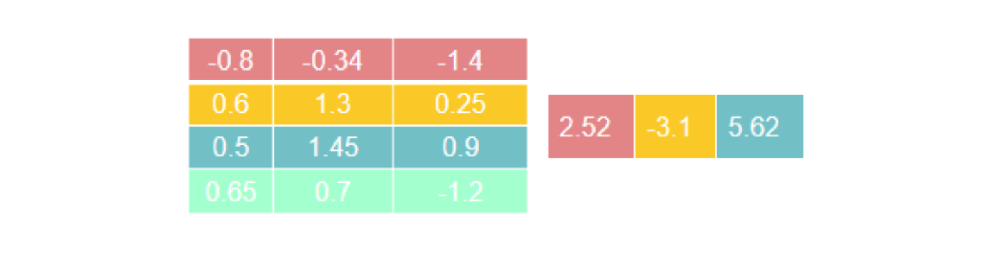

**5.前向传播**

​		有了输入数据与线上权重等数据，即可按照y = x * w + b方式进行前向传播，计算过程如下图：

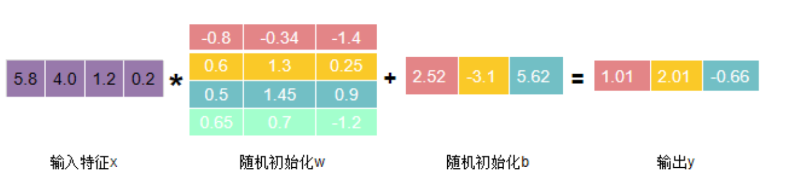

​		图中输出y中，1.01代表0类鸢尾得分，2.01代表1类鸢尾得分，-0.66代表2类鸢尾得分。通过输出y可以看出数值最大（可能性最高）的是1类鸢尾，而不是标签0类鸢尾。这是由于最初的参数w和b是随机产生的，现在输出的结果是蒙的。

**6.定义损失函数**

​		为了修正这一结果，用损失函数，定义预测值y和标准答案（标签）y_的差距，损失函数可以定量的判断当前这组参数w和b的优劣，当损失函数最小时，即可得到最优w的值和b的值。

​		损失函数的定义有多种方法，均方误差就是一种常用的损失函数，它计算每个前向传播输出y和标准答案y_的差求平方再求和再除以n求平均值，表征了网络前向传播推理结果和标准答案之间的差距。

​		通过上述损失函数的介绍，其目的是寻找一组参数w和b使得损失函数最小。为了达成这一目的，采用梯度下降的方法。损失函数的梯度表示损失函数对各参数求导后的向量，损失函数梯度下降的方向，就是损失函数减小的方向。梯度下降法即沿着损失函数梯度下降的方向，寻找损失函数的最小值，从而得到最优的参数。梯度下降法涉及的公式如下：

​								$w_{t+1} = w_t + lr * \frac{\partial loss}{\partial w_t}$

​								$b_{t+1} = b_t + lr * \frac{\partial loss}{\partial w_b}$

​								$w_{t+1} * x + b_{t+1} \to y$

​		学习率（learning rate， lr）：是一个超参数，表征梯度下降的速度。如学习率设置过小，参数更新会很慢，如果学习率设置过大，参数更新可能会跳过最小值。

**7.反向传播**

​		上述梯度下降更新的过程为反向传播，下面通过例子感受反向传播。利用如下公式对参数w进行更新：

​								$w_{t+1} = w_t + lr * \frac{\partial loss}{\partial w_t}$

​		设损失函数为$(w+1)^2$，对w的偏导数为2w+2。设w在初始化时被随机初始化为5，学习率设置为0.2。则按照上述公式对w进行更新：

​							5 - 0.2 * (2 * 5 + 2) = 2.6

​		同理第二次计算得到参数为1.16.第三次计算得到参数为0.296......

​		画出损失函数$(w+1)^2$的图像，可知w=-1时损失函数最小，反向传播优化参数的目的即为找到这个损失函数的最小为w=-1值。

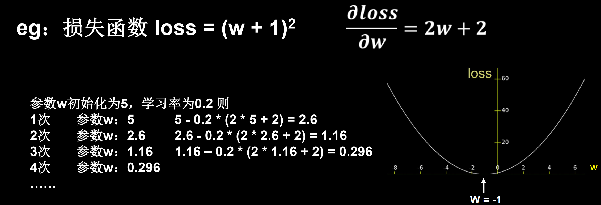

**8.应用网络**

​		将网络保存为模型


### 1.2.3 神经网络实现鸢尾花分类

**1.神经网络代码编写逻辑**

- 准备数据
  - 数据集读入
  - 数据集乱序
  - 数据集分出永不相见的训练集和测试集
  - 配成[输入特征，标签]对，每次喂入一小撮（batch）

- 搭建网络
  - 定义神经网络中所有可训练参数
- 参数优化
  - 嵌套循环迭代，with结构更新参数，显示当前loss
- 测试效果
  - 计算当前参数前向传播后的准确率，显示当前acc
- acc/loss可视化

**2.全部代码**

```python
# -*- coding: UTF-8 -*-
# 利用鸢尾花数据集，实现前向传播、反向传播，可视化loss曲线

# 导入所需模块
import tensorflow as tf
from sklearn import datasets
from matplotlib import pyplot as plt
import numpy as np

# 1.准备数据
# 1.1 数据集读入
# 导入数据，分别为输入特征和标签
x_data = datasets.load_iris().data
y_data = datasets.load_iris().target

# 1.2 数据乱序
# 随机打乱数据（因为原始数据是顺序的，顺序不打乱会影响准确率）
# seed: 随机数种子，是一个整数，当设置之后，每次生成的随机数都一样（为方便教学，以保每位同学结果一致）
np.random.seed(116)  # 使用相同的seed，保证输入特征和标签一一对应
np.random.shuffle(x_data)
np.random.seed(116)
np.random.shuffle(y_data)
tf.random.set_seed(116)

# 1.3 数据集分出永不相见的训练集和测试集
# 将打乱后的数据集分割为训练集和测试集，训练集为前120行，测试集为后30行
x_train = x_data[:-30]
y_train = y_data[:-30]
x_test = x_data[-30:]
y_test = y_data[-30:]

# 转换x的数据类型，否则后面矩阵相乘时会因数据类型不一致报错
x_train = tf.cast(x_train, tf.float32)
x_test = tf.cast(x_test, tf.float32)

# 1.4 配成[输入特征，标签]对，每次喂入一小撮（batch）
# from_tensor_slices函数使输入特征和标签值一一对应。（把数据集分批次，每个批次batch组数据）
train_db = tf.data.Dataset.from_tensor_slices((x_train, y_train)).batch(32)
test_db = tf.data.Dataset.from_tensor_slices((x_test, y_test)).batch(32)

# 2.搭建网络
# 2.1 定义神经网络中所有可训练参数
# 生成神经网络的参数，4个输入特征故，输入层为4个输入节点；因为3分类，故输出层为3个神经元
# 用tf.Variable()标记参数可训练
# 使用seed使每次生成的随机数相同（方便教学，使大家结果都一致，在现实使用时不写seed）
w1 = tf.Variable(tf.random.truncated_normal([4, 3], stddev=0.1, seed=1))
b1 = tf.Variable(tf.random.truncated_normal([3], stddev=0.1, seed=1))

lr = 0.1  # 学习率为0.1
train_loss_results = []  # 将每轮的loss记录在此列表中，为后续画loss曲线提供数据
test_acc = []  # 将每轮的acc记录在此列表中，为后续画acc曲线提供数据
epoch = 500  # 循环500轮
loss_all = 0  # 每轮分4个step，loss_all记录四个step生成的4个loss的和

# 3.参数优化
# 训练部分
for epoch in range(epoch):  #数据集级别的循环，每个epoch循环一次数据集
    for step, (x_train, y_train) in enumerate(train_db):  #batch级别的循环 ，每个step循环一个batch
      	# 3.1 嵌套循环迭代，with结构更新参数，显示当前loss
        with tf.GradientTape() as tape:  # with结构记录梯度信息
            y = tf.matmul(x_train, w1) + b1  # 神经网络乘加运算
            y = tf.nn.softmax(y)  # 使输出y符合概率分布（此操作后与独热码同量级，可相减求loss）
            y_ = tf.one_hot(y_train, depth=3)  # 将标签值转换为独热码格式，方便计算loss和accuracy
            loss = tf.reduce_mean(tf.square(y_ - y))  # 采用均方误差损失函数mse = mean(sum(y-out)^2)
            loss_all += loss.numpy()  # 将每个step计算出的loss累加，为后续求loss平均值提供数据，这样计算的loss更准确
        # 计算loss对各个参数的梯度
        grads = tape.gradient(loss, [w1, b1])

        # 实现梯度更新 w1 = w1 - lr * w1_grad    b = b - lr * b_grad
        w1.assign_sub(lr * grads[0])  # 参数w1自更新
        b1.assign_sub(lr * grads[1])  # 参数b自更新

    # 每个epoch，打印loss信息
    print("Epoch {}, loss: {}".format(epoch, loss_all/4))
    train_loss_results.append(loss_all / 4)  # 将4个step的loss求平均记录在此变量中
    loss_all = 0  # loss_all归零，为记录下一个epoch的loss做准备

    # 测试部分
    # total_correct为预测对的样本个数, total_number为测试的总样本数，将这两个变量都初始化为0
    total_correct, total_number = 0, 0
    for x_test, y_test in test_db:
        # 使用更新后的参数进行预测
        y = tf.matmul(x_test, w1) + b1
        y = tf.nn.softmax(y)
        pred = tf.argmax(y, axis=1)  # 返回y中最大值的索引，即预测的分类
        # 将pred转换为y_test的数据类型
        pred = tf.cast(pred, dtype=y_test.dtype)
        # 若分类正确，则correct=1，否则为0，将bool型的结果转换为int型
        correct = tf.cast(tf.equal(pred, y_test), dtype=tf.int32)
        # 将每个batch的correct数加起来
        correct = tf.reduce_sum(correct)
        # 将所有batch中的correct数加起来
        total_correct += int(correct)
        # total_number为测试的总样本数，也就是x_test的行数，shape[0]返回变量的行数
        total_number += x_test.shape[0]
    # 总的准确率等于total_correct/total_number
    acc = total_correct / total_number
    test_acc.append(acc)
    print("Test_acc:", acc)
    print("--------------------------")

# 绘制 loss 曲线
plt.title('Loss Function Curve')  # 图片标题
plt.xlabel('Epoch')  # x轴变量名称
plt.ylabel('Loss')  # y轴变量名称
plt.plot(train_loss_results, label="$Loss$")  # 逐点画出trian_loss_results值并连线，连线图标是Loss
plt.legend()  # 画出曲线图标
plt.show()  # 画出图像

# 绘制 Accuracy 曲线
plt.title('Acc Curve')  # 图片标题
plt.xlabel('Epoch')  # x轴变量名称
plt.ylabel('Acc')  # y轴变量名称
plt.plot(test_acc, label="$Accuracy$")  # 逐点画出test_acc值并连线，连线图标是Accuracy
plt.legend()
plt.show()

```


## 2.神经网络优化

知识点：学习率、激活函数、损失函数、正则化、自写优化器（SGD、Momentum、Adagrad、RMSProp、Adam）

### 2.1 神经网络的复杂度

#### 2.1.1 时间复杂度

​		模型的运算次数，可用浮点运算次数（FPLOPs，Floating-point Operations）或者乘加运算次数衡量。

#### 2.1.2 空间复杂度

​		空间复杂度（访存量），严格来讲包括两部分：总参数量 + 各层输出特征图。

- 参数量：模型所有带参数的层的权重参数总量
- 特征图：模型在实时运行过程中每层所计算出的输出特征图大小。

### 2.2 学习率策略

#### 2.2.1 指数衰减

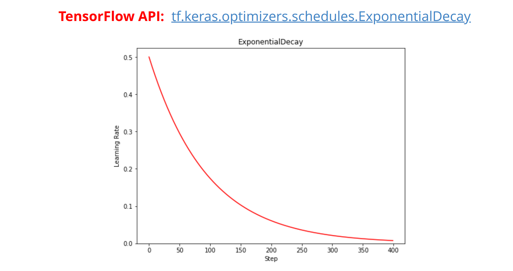

​				$decayed\_learning\_rate = learning\_rate * decay\_rate^{(global\_step/decay\_steps})$

​		其中，learning_rate是初始学习率，decay_rate是衰减率，global_step表示从0到当前的训练次数，decay_steps用来控制衰减速度。

​		指数衰减学习率是先使用较大的学习率来快速得到一个较优的解，然后随着迭代的继续，逐步减小学习率，使得模型在训练后期更加稳定。指数型学习率衰减法是最常用的衰减方法，在大量模型中都广泛使用。

#### 2.2.2 分段常数衰减

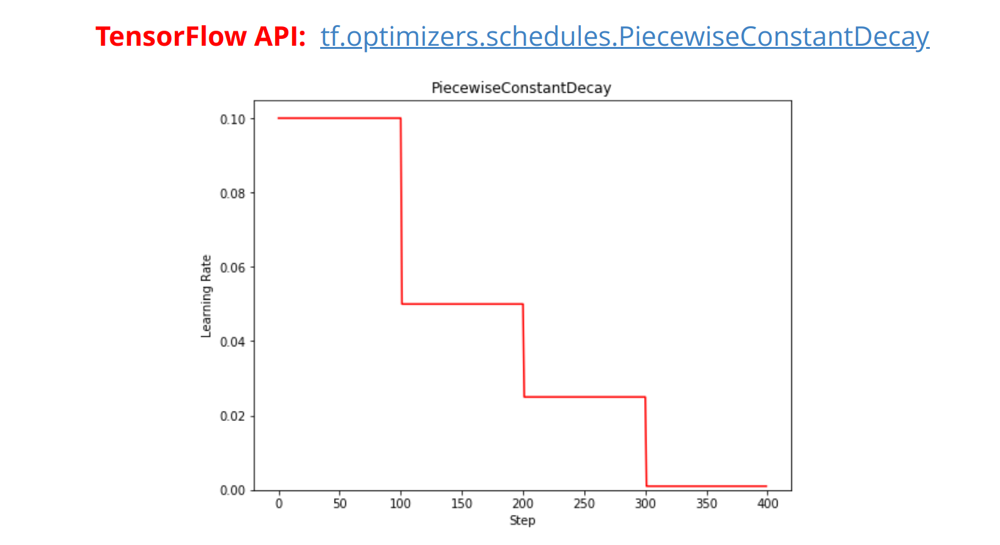

​		分段常数衰减可以让调试员针对不同任务设置不同的学习率，进行精细调参，在任意步长后下降任意数值的learning rate，要求调试人员对模型和数据集有深刻认识。

### 2.3 激活函数

#### 2.3.1 激活函数的作用

​		激活函数的作用：激活函数是用来加入非线性因素的，因为线性模型的表达能力不够。引入非线性激活函数，可使深层神经网络的表达能力更加强大。

**1.如果没有激活函数会怎么样？**

​		对于y = ax + b这样的函数，当x的输入很大时，y的输出也是无限大小的，经过多层网络叠加后，值更加膨胀的没边了，这显然不符合我们的预期，很多情况下我们希望的输出是一个概率。

​		线性的表达能力太有限了，即使经过多层网络的叠加，**y=ax+b无论叠加多少层最后仍然是线性的，增加网络的深度根本没有意义。**

#### 2.3.2 激活函数特性

​		优秀的激活函数应满足：

- 非线性：激活函数非线性时，多层神经网络可逼近所有函数
- 可微性：优化器大多用梯度下降更新参数
- 单调性：当激活函数是单调的，能保证单层网络的损失函数是凸函数
- 近似恒等性：f(x) ≈ x, 当参数初始化为随机小值时，神经网络更稳定

激活函数输出值的范围：

- 激活函数输出为有限值时，基于梯度的优化方法更稳定
- 激活函数输出为无限值时，建议调小学习率

#### 2.3.3 sigmoid

​											$f(x) = \frac{1}{1+e^{-x}}$

函数图像：

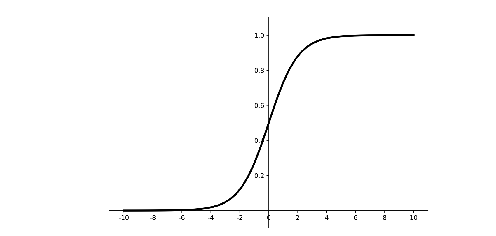

导数图像：

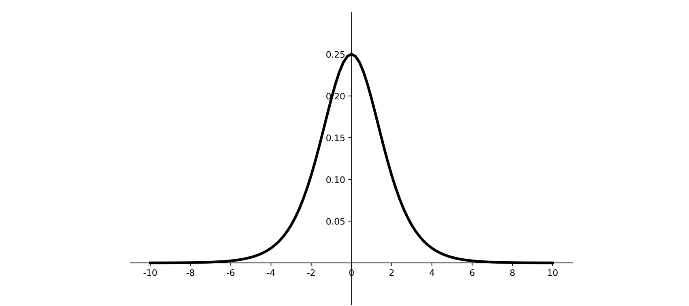

- 优点
  - 输出映射在(0,1)之间，单调连续，输出范围有限，优化稳定，可用作输出层
  - 求导容易
- 缺点
  - 易造成梯度消失
  - 输出非0均值，收敛慢
  - 幂运算复杂，训练时间长

sigmoid函数可应用在训练过程中。然而，当处理分类问题作为输出时，sigmoid却无能为力。简单地说，sigmoid函数只能处理两个类，不适用于多分类问题。

#### 2.3.4 tanh

​													$f(x) = \frac{1-e^{-2x}}{1+e^{-2x}}$

函数图像：

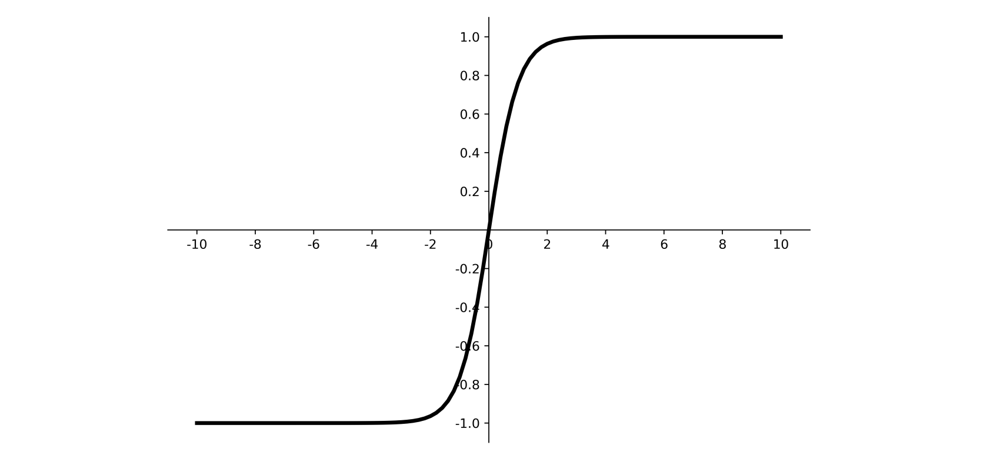

导数图像：

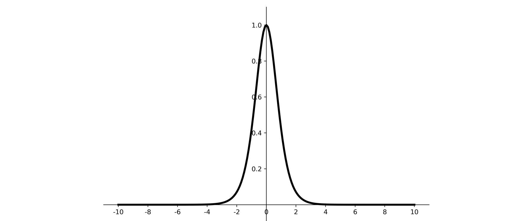

- 优点
  - 比sigmoid函数收敛速度更快
  - 相比sigmoid函数，其输出以0为中心
- 缺点
  - 易造成梯度消失
  - 幂运算复杂，训练时间长

#### 2.3.5 Relu

​										$f(x) = max(0, x) = \begin{cases} 0 && x<0 \\ x && x >=0 \end{cases}$

函数图像：

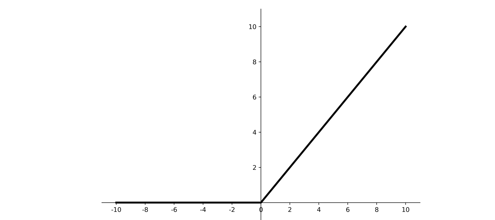

导数图像：

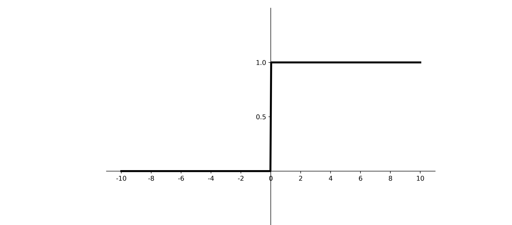

- 优点
  - 解决了梯度消失问题（在正区间）
  - 只需判断输入是否大于0，计算速度快
  - 收敛速度远快于sigmoid和tanh，因为sigmoid和tanh涉及很多expensive的操作
  - 提供了神经网络的稀疏表达能力
- 缺点
  - 输出非0均值，收敛慢
  - Dead ReLU问题：某些神经元可能永远不会被激活，导致相应的参数永远不能被更新。

#### 2.3.6 Leaky ReLU

​									$f(x) = max(\alpha x, x)$

函数图像：

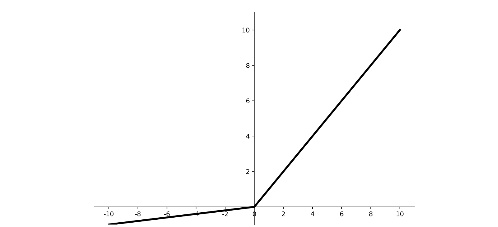

导数图像：

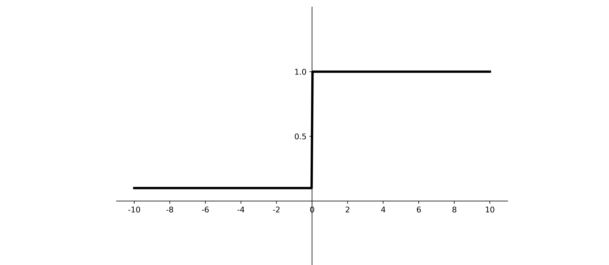

​		理论上来讲，Leaky ReLU有ReLU的所有优点，外加不会有Dead ReLU问题，但是在实际操作当中，并没有完全证明Leaky ReLU总是好于ReLU。

#### 2.3.7 softmax

​							$\sigma(z)_j = \frac{e^{zj}}{\sum_{k=1}^K e^{zk}}  for j=1,...,K$

​		对神经网络全连接层输出进行变换，使其服从概率分布，即每个值都位于[0,1]区间且和为1.

#### 2.3.8 建议

对于初学者的建议：

​	1.首选ReLU激活函数

​	2.学习率设置较小值

​	3.输入特征标准化，即让输入特征满足以0为均值，1为标准差的正太分布；

​	4.初始化问题：初始参数中心化，即让随机生成的参数满足以0为均值，$\sqrt{\frac{2}{当前层输入特征个数}}$为标准差的正态分布。

### 2.4 损失函数

​		神经网络模型的效果及优化的目标是通过损失函数来定义的。回归和分类是监督学习中的两个大类。

#### 2.4.1 均方误差损失函数

​		均方误差（Mean Square Error）是回归问题最常用的损失函数。回归问题解决的是对具体数值的预测，比如房价预测、销量预测等。这些问题需要预测的不是一个事先定义好的类别，而是一个任意实数。均方误差定义如下：

​										$MSE(y, y^,) = \frac{\sum_{i=1}^n (y_i - y_i^,)^2}{n}$

​		其中$y_i$为一个batch中第i个数据的真实值，而$y_i^,$为神经网络的预测值。

#### 2.4.2 交叉熵损失函数

​		交叉熵（Cross Entropy）表征两个概率分布之间的距离，交叉熵越小说明二者分布越近，是分类问题中使用广泛的损失函数。

​										$H(y_, y) = -\sum y_ * lny $

​		其中y_代表数据的真实值，y代表神经网络的预测值。

​		对于多分类问题，神经网络的输出一般不是概率分布，因此需要引入softmax层，使得输出服从概率分布。Tensorflow中可计算交叉熵损失函数的API有：

​		tf.keras.losses.categorical_crossentropy

​		tf.nn.softmax_cross_entropy_with_logits

​		tf.nn_sparse_softmax_cross_entropy_with_logits

### 2.5 欠拟合和过拟合

​		欠拟合的解决方法：

- 增加输入特征项
- 增加网络参数
- 减少正则化参数

​		过拟合的解决方法：

- 数据清洗
- 增大训练集
- 采用正则化
- 增大正则化参数

### 2.6 正则化减少过拟合

​		正则化在损失函数中引入模型复杂度指标，利用给W加权值，弱化了训练数据的噪声（一般不正则化b）

​		$loss = loss(y与y\_)+REGULARIZER * loss(W)$

​		loss(y与y_)：模型中所有参数的损失函数如：交叉熵、均方误差

​		REGULARIZER：用超参数REGULARIZER给出参数w在总loss中的比例，即正则化的权重

​		loss(W)：需要正则化的参数

#### 2.6.1 L1与L2正则化

L1正则化：

​					$loss_{L1}(W) = \sum_i|w_i|$

L1正则化大概率会使很多参数变为零，因此该方法可通过稀疏参数，即减少参数的数据，降低复杂度

L2正则化：

​					$loss_{L2}(w)= \sum_i|w_i^2|$

L2正则化会使参数很接近零但不为零，因此该方法可通过减小参数值的大小降低复杂度。


#### 2.6.2 demo实现

```python
with tf.GradientTape() as tape: # 记录梯度信息
  h1 = tf.matmul(x_train, w1) + b1  # 记录神经网络乘加运算
  h1 = tf.nn.relu(h1)
  y = tf.matmual(h1, w2) + b2
  
  # 采用均方误差损失函数mse=mean(sum(y-out)^2)
  loss_mse = tf.reduce_mean(tf.square(y_train - y))
  #添加l2正则化
  loss_regularization = []
  loss_regularization.append(tf.nn.l2_loss(w1))
  loss_regularization.append(tf.nn.l2_loss(w2))
  loss_regularization = tf.reduce_sum(loss_regularization)
  loss = loss_mse + 0.03 * loss_regularization
  
# 计算loss对各个参数的额梯度
variables = [w1, b1, w2, b2]
grads = tape.gradient(loss, variables)
```

​		

### 2.7 优化器更新网络参数

​		优化算法可以分为一阶优化和二阶优化算法，其中一阶优化就是指的梯度算法及其变种，而二阶优化一般是用二阶导数（Hessian矩阵）来计算，如牛顿法，由于需要计算Hessian阵和其逆矩阵，计算量较大，因此没有流行开来。这里主要总结一阶优化的各种梯度下降方法。

​		深度学习优化算法经历了SGD—>SGDM—>NAG—>AdaGrad—>AdaDelta—>Adam—>Nadam这样的发展历程。

优化步骤：

**定义：待优化参数w，损失函数f(w)，初始学习率$\alpha$，每次迭代一个batch，t表示当前batch迭代的总次数。**

**1.计算损失函数关于当前参数的梯度：$g_t = \nabla f(w_)=\frac{\partial f}{\partial w_t}$**

**2.根据历史梯度计算一阶动量和二阶动量：$m_t = \phi(g_1,g_2, ..., g_t), V_t = \psi (g_1, g_2,..., g_t)$**

**3.计算当前时刻的下降梯度：$\eta_t = \alpha * m_t/\sqrt{V_t}$**

**4.根据下降梯度进行更新：$w_{t+1} = w_t - \eta_t$**


## 3.神经网络八股

知识点：六步法 编写手写数字识别训练模型

## 4.神经网络八股扩展

知识点：增加6项扩展功能，自制数据集、数据增强、断点续训、参数提取和acc/loss可视化，实现给图识物

## 5.卷积神经网络

知识点：用基础CNN、LeNet、AlexNet、VGGNet、InceptionNet和ResNet实现图像识别

## 6.循环神经网络

知识点：用基础RNN、LSTM、GRU实现股票预测。


