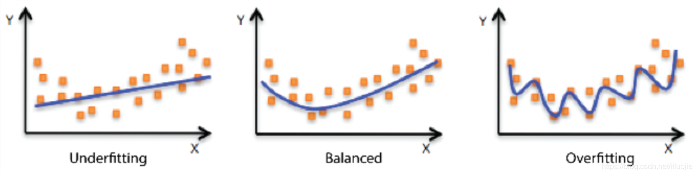

深度学习调参总结

## 1.参数介绍

### 1.1 batch size

### 1.2 train、dev、test拆分

### 1.3 dnn结构

### 1.4 dropout

### 1.5 BN

### 1.6 L1、L2

### 1.7 Optimizer

## 2.过拟合解决方法

### 2.1 过拟合表现

过拟合现象（overfitting）现象：训练集（loss、acc、auc）高与验证集低，差异过大

欠拟合（underfitting）现象：训练集和验证集（loss、acc、auc）都偏低

### 2.2 过拟合原因

1. 训练集的数量级和模型的复杂度不匹配，训练集的数量级要小于模型的复杂度
2. 训练集和测试集特征分布不一致
3. 样本里的噪声数据干扰过大，大到模型过分记住了噪声特征，反而忽略了真实的输入输出间的关系
4. 权值学习迭代次数够多（Overtraining），拟合了训练数据中的噪声和训练样本中没有代表行的特征

### 2.3 解决方法

1. simpler model structure

   调小模型复杂度，使其适合自己训练的数量级（缩小宽度和减小深度）

2. data augmentation

   数据扩充，训练集越多，过拟合的概率越小

   在计算机视觉领域，增广的方式时对图像旋转，缩放，剪切，添加噪声等

3. regularization

   参数太多，会导致模型复杂度上升，容易过拟合，训练误差会很小

   正则化是通过引入额外新信息来解决机器学习中过拟合问题的一种方法。这种额外信息通常的形式是模型复杂性带来的惩罚度。正则化可以保持模型简单，另外，规则项的使用可以约束我们模型的特性。

4. dropout

   dropout方法在训练的时候让神经元以一定的概率不工作

5. early stopping

   对模型进行训练的过程即是对模型的参数进行学习更新的过程，这个参数学习的过程中往往会用到一些迭代方法，如梯度下降（Gradient descent）学习算法。

   Early stopping是一种迭代次数截断的方法防止过拟合的方法，在模型对训练数据迭代收敛之前停止迭代来防止过拟合。

6. ensemble

   集成学习方法也可以有效的减轻过拟合

   Bagging通过平均多个模型的结果，来降低模型的方差。Boosting不仅能够减小偏差，还能减小方差。

   Boosting可以解决欠拟合

### 2.4 loss各种表现

​	神经网络具有两大能力：

​		学习能力，在训练集上的精度

​		泛化能力，在测试集上的精度

​	对于一个大型神经网络，在一个大数据集上跑，loss持续下降，如果loss不下降，说明网络没有学习能力，任何一个网络都有学习能力。

- train loss 不断下降，test loss 不断下降，说明网络仍在学习
- train loss 不断下降，test loss 趋于不变，说明网络过拟合
- 

## 3.调参常遇问题

#### 3.1 模型训练时，为什么1～2个epoch后，loss就很低

问题比较简单，但是设计的模型复杂，网络结构层数太多了，这种情况后面很容易过拟合

### 3.2 验证集loss比训练集loss低

现象：验证集loss比较训练集loss低

​           验证集auc比训练集auc高

原因：

1. 正则化

   - 表现：验证loss始终低于训练loss，但它们之间的差距随着时间的推移而缩小
   - 分析：如果使用了L1或者L2正则化，正则化项仅在训练期间使用，增大了训练集上的loss，但是验证或者预测时只有预测损失，所以导致了loss比训练集的低

   训练loss和验证loss的差距会随着训练次数增加而减小，这是因为网络在学习减小正则项，但是网络实际上还是在训练集上表现的更好。

2. Dropout

   - 表现：验证loss始终低于训练loss，它们之间的差距或多或少保持相同大小，并且训练loss有波动
   - 分析：Dropout通过在模型训练期间随机冻结层中的神经元来惩罚模型方差。与L1和L2正则化一样，Dropout只适用于训练过程，会影响训练loss，导致验证loss低于训练loss情况

3. 在每个epoch期间计算训练loss，在每个epoch之后计算验证loss

   - 表现：训练一开始验证集loss小于训练loss，后来逐渐训练loss更小
   - 分析：训练过程中如果数据是一个个batch进行训练的，每个batch训练结束后都会有一次反向传播，一个epoch里会有多次反向传播，每次都会提高网络的表现

   当每次反向传播对模型进行较大更新时，可能会在前几个epochs中得到较低的验证loss

4. 数据集划分不均衡

   在划分数据集的时候刚好把较多噪音分给了训练集，重新划分数据集即可

