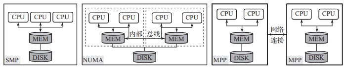
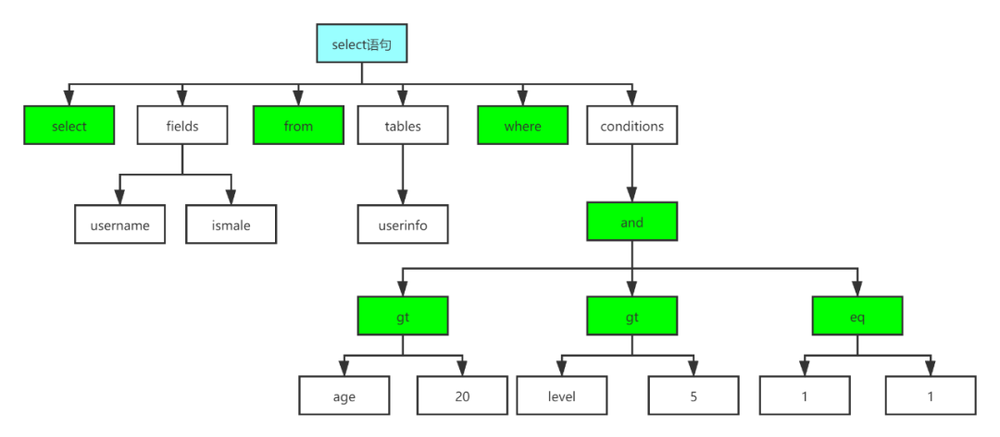
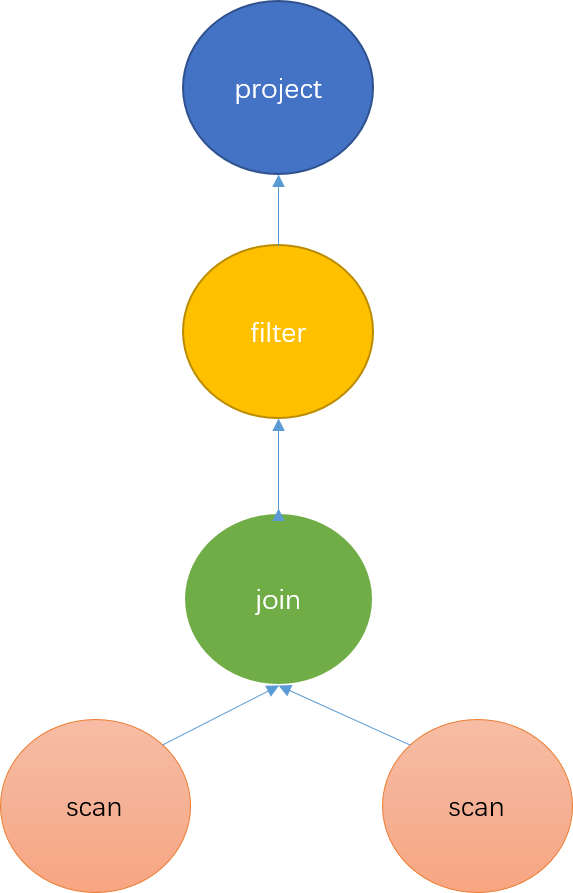

<center><font size='60'>Doris</font></center>

[TOC]


## 1.Doris整体架构

### 1.1 Doris架构介绍

#### 1.1.1 整体架构

​		Doris架构非常简单，只有两类进程

- Frontend（FE）

  - 接收用户连接请求（Mysql协议层）

  - 元数据存储与管理

  - 查询语句的解析与查询计划的生成

  - 集群管控

- Backend（BE）

  - 数据存储与管理
  - 查询计划的执行

  

  这两个进程都是可以横向扩展的，单集群可以支持到数百台机器，数十PB的存储容量。并且这两类进程通过一致性协议来保证服务的高可用和数据的高可靠。


#### 1.1.2 Doris定位

​		Doris的定位是Online层面的数据服务，主要是数据分析。

​		Doris目标：实现低成本（主要针对商业产品），可**线性扩展**，支持云化部署，**高可用**、**高查询**、高加载性能。

### 1.2 MPP架构

#### 1.2.1 并行硬件架构的发展

​		为了提高计算机系统的处理能力，在处理单元（CPU）性能确定的情况下，就需要增加处理单元的数量，此时从计算单元（CPU）对资源（特别是内存）访问的角度来看，并行硬件架构分为三种：

- SMP（Symmetric Multi Processing，对称多处理器）架构。

  这里的“对称”是指所有处理器之间是平等的，并且共享包括物理内存在内的所有资源，处理器访问不同资源的能力（速度）是一致的，每个处理器访问内存中的任何地址所需的时间是相同的，因此SMP架构也称为UMA（Uniform Memory Access，一致存储器访问）架构。

- NUMA（Non-Uniform Memory Access，非一致存储访问）架构。

  NUMA架构服务器内部有多个处理模块（节点），每个模块有多个CPU核本地内存，但每个CPU页可以访问整个系统内存，当然访问本地内存要比访问其他模块内存的速度快，这也是非一致存储访问架构名称的由来。

- MPP（Massively Parallel Processing，大规模并行处理）架构

  MPP架构是将多个处理节点通过网络连接起来，每个节点是一台独立的机器，节点内的处理单元独占自己的资源，包括内存、硬盘、IO等，也就是每个节点内的CPU不能访问另一个节点的内存（这是MPP与NUMA的主要区别），MPP架构服务器需要通过软件实现复杂的调度机制以及并行处理过程。

  


​		

## 2.数据表设计

### 2.1 数据模型

#### 2.1.1 基本概念

##### 2.1.1.1 Row & Column

​		在Doris中，数据以表（Table）的形式进行逻辑上的描述。一张表包括行（Row）和列（Column）。Row即用户的一行数据。Column用于描述一行数据中的不同的字段。

​		Column可以分为两大类：key和Value。从业务角度看，Key和Value可以分别对应维度列和指标列。

##### 2.1.1.2 Partition & Tablet

​		在Doris的存储引擎中，用户数据首先被划分成若干个分区（Partition），划分的规则通常是按照用户指定的分区进行范围划分，比如按时间划分。而在每个分区内，数据被进一步的按照Hash的方式分桶，分桶的规则是要找用户指定的分桶列的值进行Hash后分桶。每个分桶就是一个数据分片（Tablet），也是数据划分的最小逻辑单元。

- Tablet之间数据是没有交集的，独立存储的。Tablet也是数据移动、复制等操作的最小**物理**存储单元。
- Partition可以视为逻辑上最小的管理单元。数据的导入与删除，都可以或仅能针对一个Partition进行。

#### 2.1.2 Aggregate模型

​		表中的列按照是否设置AggregationType，分为Key（维度列）和Value（指标列）。没有设置AggregationType的称为Key，设置了AggregationType的称为Value。

​		当导入数据时，对于Key列相同的行会聚合成一行，而Value列会按照设置的AggregationType进行聚合。AggregationType目前有以下四种聚合方式：

- sum：求和，多行的value进行累加

- replace：替代，下一批数据中的value会替代之前导入过的行中的value

  replace_if_not_null：当遇到null值则不更新

- max：保留最大值

- min：保留最小值

​		数据的聚合，在Doris中有如下三个阶段发生：

1. 每一批次数据导入ETL阶段。该阶段会在每一批次导入的数据内部进行聚合。
2. 底层BE进行数据Compaction的阶段。该阶段，BE会对已导入的不同批次的数据进行进一步的聚合。
3. 数据查询阶段。在数据查询时，对于查询涉及到的数据，会进行对应的聚合。

​		数据在不同时间，可能聚合的程度不一致。比如一批数据刚导入时，可能还未与之前已存在的数据进行聚合。但是对于用户而言，用户只能查询到聚合后的数据。即不同的聚合程度对于用户查询而言是透明的。用户始终认为数据以最终的完成的聚合程度存在，而不应假设某些聚合还未发生。

创建表语句：

```sql
CREATE TABLE IF NOT EXISTS example_db.example_tbl(
	user_id largeint not null comment "用户ID",
  date DATE not null comment "数据灌入日期时间",
  city varchar(20) comment "用户所在城市",
  age smallint comment "用户年龄",
  sex tinyint comment "用户性别",
  last_visit_date datetime replace default "1970-01-01 00:00:00" comment "用户最后一次访问时间",
  cost bigint sum default "0" comment "用户总消费",
  max_dwell_time int max default "0" comment "用户最大停留时间",
  min_dwell_time int min default "99999" comment "用户最小停留时间"
)
aggregate key(user_id, date, city, age, sex)
distributed by hash(user_id) buckets 1
properties(
  "relication_allocation" = "tag.location.default: 1"
)
```

#### 2.1.3 Unique模型

​		在某些多维分析场景下，用户更关注是如何保证Key的唯一性，即如何获得Primary Key唯一性约束。因此，引入了Unique数据模型。在1.2版本之前，该模型本质上是聚合模型的一个特例，也是一种简化的表结构表示方式。由于聚合模型的实现方式是读时合并（merge on read），因此在一些聚合查询上性能不佳，在1.2 版本引入了Unque模型新的实现方式，写时合并（merge on write），通过在写入时做一些额外的工作，实现了最优的查询性能。写时合并将在未来替换读时合并成为Unique模型的默认实现方式，两者将会短暂的共存一段时间。

创建表语句：

```sql
CREATE TABLE IF NOT EXISTS example_db.example_tbl(
	user_id largeint not null comment "",
  username varchar(50) not null comment "",
  city varchar(20) comment "",
  age smallint comment "",
  sex tinyint comment "",
  phone largeint comment "",
  address varchar(500) comment "",
  register_time datetime comment ""
)
unique key(user_id, username)
distributed by hash(user_id) buckets 1
properties(
	"replication_allocation" = "tag.location.default: 1"
)
```

这个表结构，完全等同于使用以下聚合模型的创建表语句：

```sql
CREATE TABLE IF NOT EXISTS example_db.example_tbl
(
    `user_id` LARGEINT NOT NULL COMMENT "用户id",
    `username` VARCHAR(50) NOT NULL COMMENT "用户昵称",
    `city` VARCHAR(20) REPLACE COMMENT "用户所在城市",
    `age` SMALLINT REPLACE COMMENT "用户年龄",
    `sex` TINYINT REPLACE COMMENT "用户性别",
    `phone` LARGEINT REPLACE COMMENT "用户电话",
    `address` VARCHAR(500) REPLACE COMMENT "用户地址",
    `register_time` DATETIME REPLACE COMMENT "用户注册时间"
)
AGGREGATE KEY(`user_id`, `username`)
DISTRIBUTED BY HASH(`user_id`) BUCKETS 1
PROPERTIES (
"replication_allocation" = "tag.location.default: 1"
);
```

#### 2.1.4 Duplicate模型

​		在某些多维分析场景下，数据既没有主键，也没有聚合需求。Duplicate数据模型可以满足这类需求。数据完全按照导入文件的数据进行存储，不会有任何聚合。即使两行数据完全相同，也都会保留。而在建表语句中指定的duplicate key，只是用来指明底层数据按照哪些列进行排序。

建表语句：

```sql
CREATE TABLE IF NOT EXISTS test_db.example_log(
	timestamp datetime not null comment "",
  type int not null comment "",
  error_code int comment "",
  error_msg varchar(1024) comment "",
  op_id bigint comment "",
  op_time datetime comment ""
)duplicate key(timestamp, type)
distributed by hash(timestamp) buckets 10;
```

## 3.数据操作

### 3.1 数据导入

​		导入（Load）功能就是将用户的原始数据导入到Doris中。导入成功后，用户即可通过Mysql客户端查询数据。为适配不同的数据导入需求，Doris系统提供了6中不同的导入方式。每种导入方式支持不同的数据源，存在不同的使用方式（异步，同步）。

​		所有导入方式都支持csv数据格式。其中Broker load还支持parquet和orc数据格式。

#### 3.1.1 Broker Load

​		通过Broker进程访问并读取外部数据源（如HDFS）导入到Doris。用户通过Mysql协议提交导入作业后，异步执行。通过show load命令查看导入结果。

​		Broker Load是一个异步的导入方式，支持的数据源取决于Broker进程支持的数据源。

​		因为Doris表里的数据是有序的，所以Broker load在导入数据时是要利用doris集群资源对数据进行排序，相对于Spark load来完成海量历史数据迁移，对Doris的集群资源占用要比较大，这种方式是在用户没有spark这种计算资源的情况下使用，如果有spark计算资源建议使用Spark load。

**适用场景：**

- 源数据在Broker可以访问的存储系统中，如HDFS
- 数据量在几十到百GB级别

**基本原理：**

​		用户在提交导入任务后，FE会生成对应的Plan并根据目前BE的个数和文件的大小，将Plan分给多个BE执行，每个BE执行一部分导入数据。

​		BE在执行的过程中会从Broker拉取数据，在对数据transform之后将数据导入系统。所有BE均完成导入，由FE最终决定导入是否成功。

```
                 +
                 | 1. user create broker load
                 v
            +----+----+
            |         |
            |   FE    |
            |         |
            +----+----+
                 |
                 | 2. BE etl and load the data
    +--------------------------+
    |            |             |
+---v---+     +--v----+    +---v---+
|       |     |       |    |       |
|  BE   |     |  BE   |    |   BE  |
|       |     |       |    |       |
+---+-^-+     +---+-^-+    +--+-^--+
    | |           | |         | |
    | |           | |         | | 3. pull data from broker
+---v-+-+     +---v-+-+    +--v-+--+
|       |     |       |    |       |
|Broker |     |Broker |    |Broker |
|       |     |       |    |       |
+---+-^-+     +---+-^-+    +---+-^-+
    | |           | |          | |
+---v-+-----------v-+----------v-+-+
|       HDFS/BOS/AFS cluster       |
|                                  |
+----------------------------------+

```


#### 3.1.2 Stream Load

​		用户通过HTTP协议提交请求并携带原始数据创建导入。主要用于快速将本地文件或数据流中的数据导入到Doris。导入命令同步返回导入结果。

​		Stream load主要适用于导入本地文件，或通过程序导入数据流中的数据。

**基本原理：**


​		Stream load中，Doris会选定一个节点作为Coordinator节点。该节点负责接收数据并分发数据到其他数据节点。

​		用户通过HTTP协议提交导入命令。如果提交到FE，则FE会通过HTTP redirect指令将请求转发给某一个BE。用户也可以直接提交导入命令给某一指定BE。导入的最终结果由Coordinator BE返回给用户。

#### 3.1.3 Routine Load

#### 3.1.4 Binlog Load

#### 3.1.5 Insert Into

#### 3.1.6 S3 Load


### 3.2 数据导出

## 4.Doirs SQL

​		Doris分成两部分FE和BE，FE负责存储以及维护集群元数据、接收、解析、查询、设计规划整体查询流程，BE负责数据存储和具体的实施过程。

### 4.1 SQL解析简介

​		SQL解析是将一条sql语句经过一系列的解析最后生成一个完整的物理执行计划的过程。这个过程包括四个步骤：词法分析、语法分析、生成逻辑计划、生成物理计划。


#### 4.1.1 词法分析

​		词法分析主要负责将字符串形式的sql识别成一个个token，为语法分析做准备。

```
select ......  from ...... where ....... group by ..... order by ......

SQL 的 Token 可以分为如下几类：
￮ 关键字（select、from、where）
￮ 操作符（+、-、>=）
￮ 开闭合标志（(、CASE）
￮ 占位符（?）
￮ 注释
￮ 空格
......
```

#### 4.1.2 语法分析

​		语法分析主要负责根据语法规则，将词法分析生成的token转成抽象语法树（Abstract Syntax Tree）



#### 4.1.3 逻辑计划

​		逻辑计划负责将抽象语法树转成代数关系。代数关系是一颗算子树，每个节点代表一种对数据的计算方式，整棵树代表了数据的计算方式以及流动方向。



#### 4.1.4 物理计划

​		物理计划是在逻辑计划的基础上，根据机器的分布，数据的分布，决定去哪些机器上执行哪些计算操作。

Doris系统的SQL解析也是采用这些步骤，只不过根据Doris系统结构的特点和数据存储方式，进行了细化和优化，最大发挥机器的计算能力。

### 4.2 设计目标

​		Doris SQL解析架构的设计有以下目标：

1. 最大化计算的并行性
2. 最小化数据的网络传输
3. 最大化减少需要扫描的数据

### 4.3 Doris SQL解析

​		Doris SQL解析具体包括了五个步骤：词法分析、语法分析、生成单机逻辑计划、生成分布式逻辑计划、生成物理执行计划。具体代码实现上包含以上五个步骤：Parse、Analyze、SinglePlan、DistributedPlan、Schedule

#### 4.3.1 Parse阶段

​		词法分析采用jflex技术，语法分析采用java cup parser技术，最后生成抽象语法树（Abstract Syntax Tree）AST，这些都是现有的、成熟的技术。

#### 4.3.2 Analyze阶段

#### 4.3.3 生成单机逻辑Plan阶段

#### 4.3.4 生成分布式Plan阶段


## 6.Doris选型

### 6.1 为什么选择Doris

​		目前开源的OLAP引擎很多，只考察比较出名的几个：ClickHouse、Druid和Doris。

最终选择Doris，主要基于以下几方面的考虑：

- Doris的查询速度是亚秒级的，并且相对ClickHouse来说，Doris对高并发的支持要优秀的多。

- Doris扩容方便，数据可以自动进行负载均衡，解决了原系统的痛点。ClickHouse在扩容时需要进行数据重分布，工作量比较大

- Doris支持Rollup和Online Schema Change，这对日常业务需求十分友好。而且由于支持Mysql协议，Doris可以很好地和之前已有的系统进行融合。而Druid对标准SQL的支持有限，并且不支持Mysql协议，改造成本很高。

  

## 7.Doris实际应用优化

### 7.1 需求

​		满足数据报表工具的数据展示，要求可以实现自助式拖拽设计图表、支持多种自带函数自建、数据实时更新等功能。数据报表工具满足以下特点：

- 支持复杂查询

  自助拖拽设计图表时，将生成一段复杂的SQL查询语句直查数据库，且语句复杂未知，这将对数据库带来不小的压力，从而影响查询性能。

- 高并发低延迟

  至少可以支撑100个并发，并在1秒内得到查询结果

- 数据实时同步

  要求报表数据要与系统实现实时同步

- 低成本易部署

  降低部署成本，要求架构部署及运维要足够简单

### 7.2 ClickHouse存在的问题

​		ClickHouse存在严重的并发问题，即10个并发就会导致ClickHouse宕机。数据同步时ClickHouse和Zookeeper的频繁交互，会对稳定性产生较大的压力。

### 7.3 Doris优势

​		通过对比Doris、ClickHouse、Kudu3个产品，Doris在多方面表现优异：

1. 高并发

   可以支持上百甚至上千并发，轻松解决10并发导致ClickHouse宕机问题。

2. 查询性能

   可以实现毫秒级查询响应，在单表查询中，虽Doris与ClickHouse查询性能基本持平，但在多表查询中，Doris远胜于ClickHouse，Doris可以实现在较高的并发下，QPS不下降。

3. 数据更新

   Doris的数据模型可以满足我们对数据更新的需求，以保障系统数据和业务数据的一致性。

4. 使用成本

   Doris架构简单，整体部署简单快速，具有完备的导入功能，很好的弹性伸缩能力；同时，Doris内部可以自动做副本平衡，运维成本极低。而ClickHouse及Kudu对组件依赖较高，在使用上需要许多准备工作，要求具备一支专业的运维支持团队来处理大量的日常运维工作。

5. 标准SQL

   Doris兼容Mysql协议，使用标准SQL，开发人员上手简单，不需要付出额外的学习成本。

6. 分布式Join

   Doris支持分布式Join，而ClickHouse由于Join查询限制、函数局限性、以及可维护性较差等原因。

7. 社区活跃

   国内自研数据库，开源社区相当活跃

### 7.4 Doris存在的瓶颈

#### 7.4.1 Doris Compaction优化

​		当Flink抽取业务库全量数据、持续不断高频写入Doris时，将产生了大量数据版本，Doris的Compaction合并版本速度跟不上新版本生产速度，从而造成数据版本堆积。BE Compaction Score分数很高，最高可以达到400，而健康状态分数应在100以下。

​		优化方法：

- 全量数据不使用实时写入的方式，先导出到CSV，再通过Stream Load写入Doris

- 降低Flink写入频率，增大Flink单一批次数据量；该调整会降低数据的实时性，需根据业务方对实时性要求调整相关数值，最大程度降低写入压力。

- 调节Doris BE参数，使更多CPU资源参与到Compaction操作中

  - compaction_task_num_per_disk

    单磁盘Compaction任务线程数默认值2，提升后会大量占用CPU资源，阿里云16核，提升1个线程多占用6%左右CPU

  - max_compaction_threads

    compaction线程总数默认为10

  - max_cumulative_compaction_num_singleton_deltas

    参数控制一个CC任务最多合并1000个数据版本，适当改小后单个Compaction任务的执行时间变短，执行频率变高，集群整体版本数会更稳定。

  通过调整集群，Compaction Score稳定在50～100，有效解决了版本堆积问题。

  ​		在Doris1.1版本中对Compaction进行了一系列的优化，在任务调度层面，增加了主动触发式的Compaction任务调度，结合原有的被动式扫描，高效的感知数据版本的变化，主动触发Compaction。在任务执行层面，对资源进行隔离，将重量级的Base Compaction和轻量级的Cumulative Compaction进行了物理分离，防止任务的相互影响。同时，针对高频小文件导入，优化文件合并策略，采用梯度合并的方式，保证单次合并的文件都属于同一数量级，逐渐有层次的进行数据合并，减少单个文件参与合并的次数，大幅节省系统消耗。

  


​	


