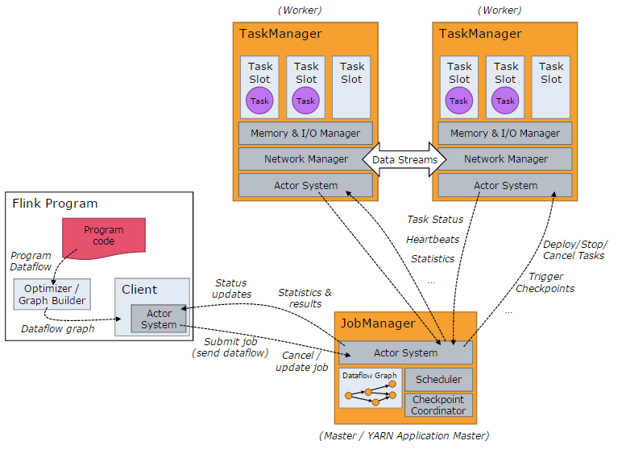
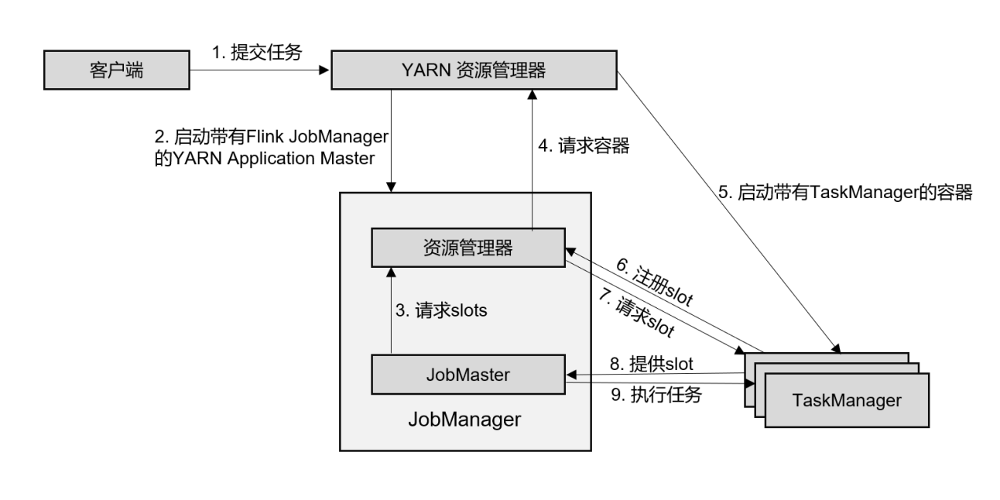

<center><font size='60'>Flink</font></center>

[TOC]


## 1.架构

#### 1.1Flink运行架构





简单来说：当Flink启动集群后，首先会启动一个JobManager和一个或多个TaskManager。由Client提交任务给JobManager，JobManager再调度任务到各个TaskManager去执行，然后TaskManager将心跳和统计信息汇报给JobManger。TaskManager之间以流的形式进行数据的传输。

- Client

  提交Job的客户端，可以是运行在任何机器上。调用程序的main方法，将代码转换成“数据流图”（Dataflow Graph），并最终生成作业图（JobGraph），一并发送给JobManager。

- JobManager

  主要负责调度Job并协调Task做checkpoint。从Client处接收到Job和Jar包等资源后，会生成优化后的执行计划，并以Task为单元调度到各个TaskManger去执行

- TaskManager

  在启动的时候就设置好了槽位数（Slot），每个 slot 能启动⼀个 Task，Task 为线程。从JobManager 处接收需要部署的 Task，部署启动后，与⾃⼰的上游建⽴ Netty 连接，接收数据并处理。

  Slot是资源调度的最小单位，slot的数量限制了TaskManager能够并行的任务数量

#### 1.2Flink作业执行流程



以yarn模式Per-Job方式为例作业提交执行流程：

在作业模式下，Flink集群不会预先启动，而是在提交作业时，才启动新的JobManager。

- 客户端将作业提交给Yarn的资源管理器，这一步会同时将Flink的Jar包和配置上传到HDFS，以便后续启动Flink相关组件的容器
- Yarn资源管理器分配Container资源，启动Flink JobManager，并将作业提交给JobMaster
- JobMaster向资源管理器请求资源（slots）
- 资源管理器向YARN的资源管理器请求container资源。
- YARN 启动新的TaskManager容器
- TaskManager启动之后，向Flink的资源管理器注册自己的可用任务槽。
- 资源管理器通知TaskManager为新的作业提供slots。
- TaskManager连接到对应的JobMaster，提供 slots。
- JobMaster 将需要执行的任务分发给 TaskManager，执行任务。

### 1.3 任务提交


**3.公司怎么提交的实时任务，有多少 Job Manager、Task Manager？**

我们使用 yarn pre-job 模式提交任务，该方式特点：每次提交都会创 建一个新的 Flink 集群，为每一个 job 提供资源，任务之间互相独立，互不影响， 方便管理。任务执行完成之后创建的集群也会消失。线上命令脚本如下：

bin/yarn-session.sh -n 7 -s 8 -jm 3072 -tm 32768 -qu root.. -nm - -d

其中申请7个taskManager，每个8核，每个taskmanager有32768M内存。

对于yarn模式，yarn在Job Mananger 故障会自动进行重启，所以只需要一个，我们配置的最大重启次数是10次

## 2.DataStream API


## 3.时间与窗口

**1.Flink中有几种时间语义**

（1）处理时间（Processing Time）

​		处理时间指执行处理操作的机器系统时间

（2）事件事件（Event Time）

​		事件时间，是指每个事件在对应设备上发生的事件，也就是数据生成的时间

**2.什么是watermark？**

​		在事件时间语义下，我们不依赖系统时间，而是基于数据自带的时间戳去定义一个时钟，用来表示当前时间的进展。并且这个时钟以数据的形式传递出去，告诉下游任务当前时间的进展；而且这个时钟的传递不会因为窗口聚合之类的运算而停滞。

​		做法是在数据流中加入一个时钟标记，记录当前事件时间；这个标记可以直接广播到下游，当下游任务收到这个标记，就可以更新自己的时钟了。

​		在Flink中，用来衡量事件事件（Event Time）进展的标记，被称作“水位线”Watermark

​		具体实现，**水位线可以看作一条特殊的数据记录，它是插入到数据流中的一个标记点，主要内容就是一个时间戳，用来指示当前的事件时间。而它插入流中的位置，就应该是在某个数据到来之后；这样就可以从这个数据中提取时间戳，作为当前水位线的时间戳了。**

**3.水位线是如何处理乱序数据的？**

​		乱序数据：在分布式系统中，数据在节点间传输，会因为网络传输延迟的不确定性，导致顺序发生改变。

​		简单处理：每来一个数据就提取它的时间戳、插入一个水位线，但是**乱序数据**，可能新的时间戳比之前的还小，那么插入新的水位线时，先判断一下时间戳是否比之前的大，否则就不再生成新的水位线。考虑到**大量数据同时到来的处理效率**，必须得**周期性地生成水位线**，解决方法是保存一下之前所有数据的最大时间戳，需要插入水位线时，就直接以它为时间戳生成新的水位线。

​		如何正确处理“迟到”的数据：用当前已有数据最大时间戳减去延迟时间比如2秒，就是要插入的水位线的时间戳

​		水位线 = 观察到的最大事件时间 - 最大延迟时间 - 1毫秒

**4.水位线的特性？**

- 水位线是插入到数据流中的一个标记， 可以认为是一个特殊的数据
- 水位线主要的内容是一个时间戳，用来表示当前事件时间的进展
- 水位线是基于数据的时间戳生成的
- 水位线的时间戳必须单调递增，以确保任务的事件时间时钟一直向前推进
- 水位线可以通过设置延迟，来保证正确处理乱序数据
- 一个水位线 Watermark(t)， 表示在当前流中事件时间已经达到了时间戳 t, 这代表 t 之前的所有数据都到齐了，之后流中不会出现时间戳 t’ ≤ t 的数据

**5.水位线是如何传递的？**

​		如果下游有多个并发子任务：当前水位线，广播给所有的下游子任务

​		重分区的传输模式，一个任务有可能会收到来自不同分区上游子任务的数据，取上游子任务最小水位线

**6.如何生成水位线？**

​		.assignTimestampsAndWatermarks()，主要用来为流中的数据分配时间戳，并生成水位线来指示事件时间。传入一个WatermarkStrategy作为参数，这就是所谓的“水位线生成策略”

WatermarkStrategy：

- TimestmpAssiger：主要负责从流中数据元素的某个字段中提取时间戳，并分配给元素。时间戳的分配是生成水位线的基础。
- WaterMarkGenerator：基于时间戳生成水位线
  - onEvent() ：每个事件数据到来都会调用的方法，它的参数有当前事件、时间戳
  - onPeriodicEmit()：周期性调用的方法，可以由WatermarkOutput()发出水位线，周期时间为处理时间，可以调用环境配置的.setAutoWatermarkInterval()方法来设置，默认为200ms。

Flink内置水位线生成器：

**有序流：WatermarkStrategy.<Event>forMonotonousTimestamps()**

**乱序流：WatermarkStrategy.<Event>forBoundedOutOfOrderness()**

**7.窗口的理解**

​		把窗口理解成一个“桶”，窗口可以把流切割成有限大小的多个“存储桶（bucket）”；每个数据都会分发到对应的桶中，当到达窗口结束时间时，就对每个桶中收集的数据进行计算处理。

​		Flink中窗口并不是静态准备的，而是动态创建，当有落在这个窗口区间范围的数据到达时，才创建对应的窗口。到达窗口结束时间时，窗口就触发计算并关闭。

**8.窗口分类，都有哪些窗口**

（1）按照驱动类型分类：以什么标准来开始和结束数据的截取

- 时间窗口：按照时间段截取数据
- 计算窗口：按照固定个数，来截取一段数据集

（2）按照窗口分配数据的规则分类

- 滚动窗口（Tumbling Window）

  滚动窗口有固定大小，是一种对数据进行“均匀切片”的划分方式。窗口之间没有重叠，也不会有间隔，是“首尾相接”的状态。

  可以基于时间定义，也可以基于数据定义；需要的参数只有一个，就是窗口大小（window size）

- 滑动窗口（Sliding Window）

  滑动窗口的大小也是固定的，窗口之间并不是首尾相接的，而是可以“错开”一定的位置

  定义滑动窗口有2个参数：窗口大小（window size）、滑动步长（window slide）

- 会话窗口（Session Window）

  基于“会话”session来对数据进行分组的。数据来了之后就开启一个会话窗口，如果接下来还有数据陆续到来，那么就一直保持会话；如果一段时间一直没收到数据，那就认为会话超时失效，窗口自动关闭。

- 全局窗口（Global Window）

  把相同key的所有数据分配到同一个窗口中，说直白一点，就跟没分窗口一样。无界流的数据永无止尽，所以这种窗口也没有结束的时候，默认是不会做触发计算的。如果希望它能对数据进行计算处理，还需要自定义“触发器”（Trigger）。

9.迟到的数据的处理

（1）设置水位线延迟时间

​		水位线是整个应用的全局逻辑时钟。水位线生产之后，会随着数据在任务间流动，从而给每个任务指明当前事件时间。水位线的延迟主要是用来对付分布式网络传输导致的数据乱序，而网络传输的乱序程度一般不会很大，大多集中在几毫秒～几百毫秒，一般设置毫秒～秒级

（2）允许窗口处理迟到数据

​		大部分乱序数据已经被水位线的延迟等到了，所以往往迟到的数据不会太多。在水位线到达窗口结束时间时，先快速输出一个近似正确计算结果；然后保持窗口继续等待到延迟数据，每来一条数据，窗口就会再次计算，并将更新后的结果输出。这样可以逐步修改计算结果，最终得到准确的统计值

（3）将迟到数据放入窗口侧输出流

​		用窗口的侧输出流来收集关窗以后的迟到数据，将之前的窗口计算结果保存下来，然后获取侧输出流中的迟到数据，判断数据所属窗口，手动对结果进行合并更新。

4.水位线是如何传递的？

如何理解flink的watermark，当水位线涨到window 的 endTime时，如果后续还有数据过来，窗口还会继续被触发吗？

怎么去重？考虑一个实时场景：双十一场景，滑动窗口长度为 1 小时，滑动距离为 10 秒钟，亿级用户，怎样计算 UV？


## 4.多流转换

## 5. 状态编程

**1. 什么是状态**

​		每个任务进行计算处理时，可以基于当前数据直接转换得到输出结果；也可以依赖一些其他数据。这些由一个任务维护，并且用来计算输出结果的所有数据，就叫做这个任务的状态。

**2. 更好的理解Flink中的状态**

​		算子任务可以分为无状态和有状态，无状态算子，如map、filter、flatMap，计算时不依赖其他数据。

​		有状态算子，如sum，需要保存之前所有数据的和

**3. 有状态算子一般处理流程**

（1）算子任务接收到上游发来的数据

（2）获取当前状态

（3）根据业务逻辑进行计算，更新状态

（4）得到计算结果，输出发送到下游任务

**4. 状态分类**

- 托管状态（Managed State）

  由Flink统一管理，状态的存储访问、故障恢复和重组等一系列问题都由Flink实现

  - 算子状态（Operator State）

    状态作用范围限定为当前的算子任务实例，也就是只对当前并行子任务实例有效

    （1）列表状态（ListState）

    （2）联合列表状态（UnionListState）

    （3）广播状态（BroadcastState）

  - 按键分区状态

    状态是根据输入流中定义的键（key）来维护和访问的，所以只能定义在按键分区流（KeyedStream）中，也就keyBy之后才可以使用

    （1）值状态（ValueState）

    （2）列表状态（ListState）

    （3）映射状态（MapState）

    （4）归约状态（ReducingState）

    （5）聚合状态（AggregatingState）

- 原始状态（Raw State）

  自定义，开辟一块内存，自己管理，实现状态的序列化和故障恢复


## 6.容错机制

**1.Flink是如何保障系统容错性的？**

​		Flink容错机制的核心就是检查点，它通过巧妙的分布式快照算法保障了故障恢复后的一致性，并且尽可能地降低对处理性能的影响

**检查点是如何保存的？什么时间点保存？**

​		周期性的触发保存，每隔一段时间做一次存档；当所有任务都恰好处理完一个相同的输入数据的时候，将他们的状态保存下来。

**检查点算法—基于Chandy-Lamport算法的分布式快照**

​		实现的目标是，在不暂停流处理的前提下，让每个任务“认出”触发检查点保存的那个数据。

​		在数据流中插入一个特殊的数据结构（Checkpoint Barrier），专门用来表示触发检查点保存的时间点，收到保存检查点的指令后，Source任务可以在当前数据流中插入这个结构，之后的所有任务只要遇到它就开始对状态做持久化快照保存。

**分布式快照算法—异步分界线快照（asynchronous barrier snapshotting）**

​		算法的核心就是2个原则：当上游任务向多个并行任务发送barrier时，需要广播出去；而多个上游任务向同一个下游任务传递barrier时，需要在下游执行“分界线对齐”（barrier alignment）操作，也就是需要等到所有并行分区的barrier都到齐，才可以开始状态的保存。

**从检查点恢复状态的具体步骤：**

（1）重启应用

​		遇到故障之后，第一步就是重启。应用重启后，所有任务的状态会清空

（2）读取检查点，重置状态

​		找到最近一次保存的检查点，从中读取出每个算子任务状态的快照，分别填充到对应的状态中

（3）重放数据

​		如果直接继续处理数据，那么保存检查点之后、到发生故障这段时间内的数据，就相当于丢掉了；会造成计算结果错误。

​		为了不丢数据，应该从保存检查点后开始重新读取数据，可以通过Source任务向外部数据源 重新提交偏移量（offset）来实现。

（4）继续处理数据

**2.检查点存储**

​		检查点默认是存储在JobManager的堆（heap）内存中，也可以设置存储到文件系统中，比如HDFS

**3.状态一致性（状态 Exactly-once）**

​		对于Flink来说，一致性指的是多个节点并行处理不同的任务，我们要保证计算结果是正确的，就必须不漏掉任何一个数据，而且也不会重复处理同一个数据。

​		exactly-once要求数据不丢，需要有数据重放机制来保证这一点，Flink使用的是一种轻量级快照机制—检查点（checkpoint）来保证exactly-once语义。

**4.端到端一致性（端到端 Exactly - once）**

​		完整的流处理应用，包括数据源、流处理器和外部存储系统三个部分。

- 输入端

  外部数据源必须拥有重放数据的能力，像Kafka

- 流处理

  检查点机制可以保证故障恢复后数据不丢失，并且只处理一次，可以做到exactly-once一致性语义

- 输出端

  能够保证exactly-once一致性写入方式有2种：幂等写入和事务写入

  - 幂等（idempotent）写入

    一个操作可以重复执行很多次，但只导致一次结果更改，后面再重复执行就不会对结果起作用。

    Redis中键值存储、Mysql

    出现短暂不一致

  - 事务（transactional）写入

    事务是应用程序中一系列严密的操作，所有操作必须成功完成，否则在每个操作中所做的所有更改都会被撤销。事务有4个基本特性：原子性（Atomicity）、一致性（Correspondence）、隔离性（Isolation）、持久性（Durability） ACID

    当Sink任务遇到barrier时，开始保存状态的同时开启一个事务，接下来所有数据的写入都在这个事务中；待到当前检查点保存完毕时，将事务提交，所有写入的数据就真正可用了。如果中间过程出现故障，状态会回退到上一个检查点，而当前事务没有正常关闭（因为当前检查点没有保存完），所以会回滚，写入到外部的数据就被撤销了

    - 预写日志（write-ahead-log，WAL）

      （1）先把结果数据作为日志（log）状态保存起来

      （2）进行检查点保存时，也会将这些结果数据一并做持久化存储

      （3）在收到检查点完成的通知时，将所有结果一次性写入外部系统

      DataStream API提供了一个模板类GenericWriteAheadSink，来实现这种事务型的写入方式

      缺点：如果检查点已经成功保存、数据也成功地一批写入到外部系统，但是最终保存确认信息时出现故障，Flink最终还是会认为没有成功写入。于是发生故障时，不会使用这个检查点，而是需要回退到上一个，这样就会导致这批数据的重复写入。

    - 两阶段提交（2PC）

      （1）当第一条数据到来时，或者收到检查点的分界线时，Sink任务都会启动一个事务

      （2）接下来接收到的所有数据，都通过这个事务写入外部系统；这是由于事务没有提交，所以数据尽管吸入了外部系统，但是不可用，是“预提交”的状态

      （3）当Sink任务收到JobManager发来检查点完成的通知时，正式提交事务，写入的结果就真正可用了

## 7.Flink SQL

### 7.1 API

​		Table API和SQL可以看作联合在一起的一套API，程序处理中，输入数据可以定义成一张表，然后对这张表进行查询，得到新的表，相当于数据流的转换操作。最后定义一张用于输出的表。

#### 7.1.1 程序架构

程序基本架构：

```sql
// 创建表环境
TableEnvironment tableEnv = ...;
// 创建输入表，连接外部系统读取数据
tableEnv.executeSql("CREATE TEMPORARY TABLE inputTable ... WITH('connector = ...')");
// 注册一个表，连接到外部系统，用于输出
tableEnv.executeSql("CREATE TEMPORARY TABLE outputTable ... WITH('connector = ...')");
// 执行SQL对表进行查询转换，得到一个新的表
Table table1 = tableEnv.sqlQuery("SELECT ... FROM inputTable...");
// 使用Table API对表进行查询转换，得到一个新的表
Table table2 = tableEnv.from("inputTable").select(...);
// 将得到的结果写入输出表
TableResult tableResult = table.executeInsert("outputTable");
```

​		通过执行DDL直接创建一个表，执行CREATE语句中用WITH指定外部系统的连接器，就可以连接外部系统读取数据了。直接用SQL语句实现全部的流处理过程。

#### 7.1.2 表环境TableEnvironment

​		Flink在使用Table API和SQL需要一个特别的运行时环境，这就是所谓的“表环境（TableEnvironment）”，它主要负责：

1. 注册Catalog和表

   这里的Catalog就是“目录”，与标准SQL中的概念一致，主要用来管理所有数据库（database）和表（table）的元数据（metadata）。

   在表环境中可以由用户自定义Catalog，并组册表和自定义函数（UDF）。

2. 执行SQL查询

3. 注册用户自定义函数（UDF）

4. DataStream和表之间的转换

使用默认配置创建表环境：

```sql
import org.apache.flink.streaming.api.environment.StreamExecutionEnvironment;
import org.apache.flink.table.api.EnvironmentSettings;
import org.apache.flink.table.api.bridge.java.StreamTableEnvironment;

StreamExecutionEnvironment env = StreamExecutionEnvironment.getExecutionEnvironment();
StreamTableEnvironment tableEnv = StreamTableEnvironment.create(env);
```


#### 7.1.3 创建表

​		创建表的方式，有连接器（connector）和虚拟表（virtual tables）2种。

- 连接器表（Connector Tables）

  通过连接器（connector）连接到一个外部系统，然后定义出对应的表结构。对表的读写就可以通过连接器转换成对外部系统的读写了。

  ```sql
  tableEnv.executeSql("CREATE [TEMPORARY] TABLE MyTable ... WITH ('connector = ...)")
  ```

  

- 虚拟表（Virtual Tables）

  调用表环境的sqlQuery()方法，直接传入一条SQL语句作为参数执行查询，得到一个Table对象。

  ```sql
  Table newTable = tableEnv.sqlQuery("SELECT ... FROM MyTable...")
  ```

  得到的newTable是一个中间转换结果，如果希望直接使用这个表执行SQL，需要将这个中间结果表注册到环境中。

  ```java
  tableEnv.createTemporaryView("NewTable", newTable);
  ```

  

#### 7.1.4 表和流转换

- 将表转换成流（Table—>DataStream）

  - 调用toDataStream()方法

    ```java
    tableEnv.toDataStrem(visitTable).print();
    ```

    

  - 调用toChangelogStream()方法

    对于有更新操作的表，进行打印输出，会抛出TableException异常，因为print本身可以看作一个Sink操作，打印输出的Sink操作不支持数据进行更新。解决方法是不要转换成DataStream打印输出，而是记录它的“更新日志”（change log），变成一条更新日志的流，就可以打印输出了。

    ```java
    tableEnv.toChangelogStream(urlContTable).print();
    ```

    

- 将流转换成表（DataStream—>Table）

  - 调用fromDataStream()方法

    ```java
    Table eventTable = tableEnv.fromDataStream(eventStream, $("timestamp").as("ts"), $("url"));
    ```

    由于流中的数据本身就是定义好的POJP类型Event，将流转换成表之后，每一行数据就对应着一个Event，而表中的列名就对应着Event中的属性。

  - 调用createTemporaryView()方法

    如果希望直接在SQL中引用这张表，可以调用createTemporaryView()方法来创建虚拟视图

    ```java
    tableEnv.createTemporaryView("EventTable", eventStream, $("timestamp").as("ts"), $("url"));
    ```

  -  调用fromChangelogStream()方法

    将一个更新日志流转换成表。

#### 7.1.5 支持的数据类型

​		DataStream中支持的数据类型，Table也都支持

- 原子类型

  Integer、Double、String

  原子类型不做重命名时，默认的字段名“f0”，将原子类型看作了一元组Tuple1的处理结果。

- Tuple类型

  表中字段默认是元组中元素的属性名f0、f1、f2...

  ```java
  // 将数据流转换成只包含 f1 字段的表
  Table table = tableEnv.fromDataStream(stream, $("f1"));
  // 将数据流转换成包含 f0 和 f1 字段的表，在表中 f0 和 f1 位置交换
  Table table = tableEnv.fromDataStream(stream, $("f1"), $("f0"));
  // 将f1 字段命名为 myInt， f0 命名为 myLong
  Table table = tableEnv.fromDataStream(stream, $("f1").as("myInt"),
  $("f0").as("myLong"));
  ```

- POJO类型

  将 POJO 类型的 DataStream 转换成 Table，如果不指定字段名称，就会直接使用原始 POJO
  类型中的字段名称

- Row类型

  Row 类型也是一种复合类型，它的长度固定，而且无法直接推断出每个字段的类型，所以在使用时必须指明具体的类型信息

  创建 Table 时调用的 CREATE语句就会将所有的字段名称和类型指定，这在 Flink 中被称为表的“模式结构”（ Schema）。除此之外， Row 类型还附加了一个属性 RowKind，用来表示当前行在更新操作中的类型。这样，Row 就可以用来表示更新日志流（ changelog stream）中的数据。

  ```java
  DataStream<Row> dataStream = 
    env.fromElements(
    Row.ofKind(RowKind.INSERT, "Alice", 12),
    Row.ofKind(RowKind.INSERT, "Bob", 5),
    Row.ofKind(RowKind.UPDATE_BEFORE, "Alice", 12),
    Row.ofKind(RowKind.UPDATE_AFTER, "Alice", 100));
  // 将更新日志流转换为表
  Table table = tableEnv.fromChangelogStream(dataStream);
  ```

### 7.2 流处理中的表


### 7.2 查询案例

count distinct 求uv场景，同一个设备刷了很多记录


## 8.压测与监控

## 9. 实时数仓

### 9.1 事实数仓案例

#### 9.1.1 菜鸟仓配实时数据仓库


**1.实时数仓的架构是什么样的？**

​		实时数仓采用Lambda架构，相对比于Kappa架构，他的优点是灵活性高、容错性高、成熟度高和迁移成本低；缺点是实时、离线数据用两套代码，可能存在一个口径修改了，另一个没改的问题

​		实时计算引擎采用Flink，Flink具有Exactly-once的准确性、轻量级Checkpoint容错机制、低延时高吞吐和易用性高的特点。

​		实时存储引擎采用的redis，ClickHouse是比较好的选择，实时存储引擎要求有维度索引、支持高并发、预聚合、高性能事实多维OLAP查询。

1.事实数仓是如何建设的，都有哪些数据


Flink SQL维表关联


从0-1处理过多少亿级别的数据 具备设计、调优能力，数据治理

实时
1.整体设计

数据应用：实时大屏、实时运营、推荐系统
数据服务层：日志服务SLS、Redis
数据计算：Flink
数据模型：dwd实时明细层、dwm轻度汇总层、dws高度汇总层

业务系统、埋点数据

2.数据模型
实时明细层
   数据清洗
   多流join
   解决方案：数据延迟如何解决
   输出实时明细数据到kafka

   实时计算主要是订阅业务消息队列SLS，通过数据清洗ETL，多流join，多数据源join，流式实时数据和静态离线维度数据进行关联组合，将一些相同粒度的业务系统 维度表中维度属性全部关联在一起，做维度退化，增加数据的易用性和服用性，最终得到实时明细数据，将这些数据分成两个分支，一个分支落到CK，支持明细查询使用，一个分支发送到消息队列SLS中供下一层使用

汇总层：（实时计算）
  轻度汇总层：轻度汇总数据落地到olap引擎，做报表 clickhouse
  高度汇总层：高度汇总层落地供KV查询的大屏


3.数据保障能力 灾难备份能力

正常链路：业务系统——>消息队列——>实时计算——>数据应用

压测链路：              ——>消息队列——>实时计算——>数据应用

   消息队列：压缩时间，构造峰值数据

​	实时计算：作业代码 Job任务 复制

​	压测目的：测试产出实时计算在该场景下资源配置

主备链路：业务系统——>消息队列——>实时计算——>数据存储——>数据应用

灾备链路：                                                  实时计算——>数据存储——>数据应用

目的：主链路出现问题，备链路提供服务，针对高优先级的job

4.离线数仓和实时数仓的区别


## 10. 性能优化


