<center><font size='60'>Flink</font></center>

[TOC]

## 1.架构

### 1.1Flink运行架构


简单来说：当Flink启动集群后，首先会启动一个JobManager和一个或多个TaskManager。由Client提交任务给JobManager，JobManager再调度任务到各个TaskManager去执行，然后TaskManager将心跳和统计信息汇报给JobManger。TaskManager之间以流的形式进行数据的传输。

- Client（任务提交客户端）

  是Flink作业任务提交客户端，主要将批处理或流处理应用程序编译为数据流图（JobGraph），然后提交给JobManager。

- JobManager（任务协调者）

  是Flink的中心工作协调组件，它根据作业提交模型，并针对不同的资源管理程序（Resource Provider），实现不同的高可用性、资源分配行为。

- TaskManager

  实际执行Flink作业的服务。

  在启动的时候就设置好了槽位数（Slot），每个 slot 能启动⼀个 Task，Task 为线程。从JobManager 处接收需要部署的 Task，部署启动后，与⾃⼰的上游建⽴ Netty 连接，接收数据并处理。
  
  Slot是资源调度的最小单位，slot的数量限制了TaskManager能够并行的任务数量

### 1.2Flink作业提交方式

​		Flink作业提交方式主要有三种：Yarn session、Yarn PerJob、Yarn Application

##### 1.2.1 Yarn session

​		会话模式需要先启动新的Yarn Session集群：通过Yarn Client向yarn提交Flink创建集群的申请，Yarn分配资源，在申请的yarn container中初始化并启动JobManager进程，初始化Dispatcher、ResourceManager，启动相关的RPC服务，等待Client通过Rest接口提交作业。

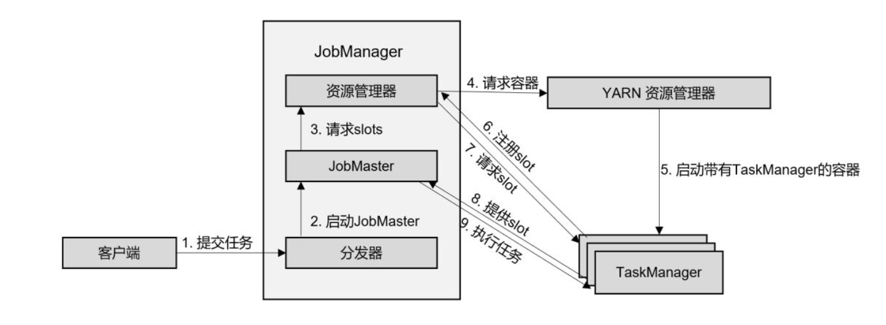

**作业提交：**

（1）Client通过Rest向分发器Dispatcher提交JobGraph

（2）Dispatcher是Rest接口，不负责实际的调度、执行方面的工作，当收到JobGraph后，为作业创建一个JobMaster，将工作交给JobMaster（负责作业调度、管理作业和Task的生命周期）

**作业调度执行：**

（3）JobMaster向资源管理器请求资源（slots）

（4）资源管理器向Yarn ResourceManager请求container资源

（5）Yarn启动新的TaskManager容器

（6）TaskManager启动之后，向Flink的资源管理器注册自己的可用slots。

（7）资源管理器通知TaskManager为新的作业提供slots

（8）TaskManager连接到对应的JobManager，提供slots

（9）JobMaster将需要执行的任务分发给TaskManager，执行任务。

##### 1.2.2 Yarn PerJob


在作业模式下，Flink集群不会预先启动，而是在提交作业时，才启动新的JobManager。

（1）客户端将作业提交给Yarn的资源管理器，这一步会同时将Flink的Jar包和配置上传到HDFS，以便后续启动Flink相关组件的容器

（2）Yarn资源管理器分配Container资源，启动Flink JobManager，并将作业提交给JobMaster

（3）JobMaster向资源管理器请求资源（slots）

（4）资源管理器向YARN的资源管理器请求container资源。

（5）YARN 启动新的TaskManager容器

（6）TaskManager启动之后，向Flink的资源管理器注册自己的可用任务槽。

（7）资源管理器通知TaskManager为新的作业提供slots。

（8）TaskManager连接到对应的JobMaster，提供 slots。

（9）JobMaster 将需要执行的任务分发给 TaskManager，执行任务。

##### 1.2.3 Yarn Application

​		Application Mode与Per-job Mode类似，主要解决Per-job Mode的不足，初始提交给Yarn 资源管理器的不再是具体的作业，而是整个应用，一个应用中可能包含多个作业。另外client是在JobManager上执行的，可以避免宽带、CPU的热点问题。

##### 1.2.4 三种作业提交方式对比

- session mode

  JobManager和TaskManager共享

  - 优点：集群资源仅分配一次，充分利用资源，程序App启动较快

  - 缺点：可能会连锁式的重启，JobManager负载大

  - 启动命令

    ```shell
    ./bin/yarn-session.sh -n 4 -tm 8192 -s 8
    ./bin/flink run -c com.demo.wangzhiwu.WordCount $DEMO_DIR/target/flink-demo-1.0.SNAPSHOT.jar --port 9000
    
    ```

- per-job mode

  单独Job独享JobManager和TaskManager

  - 优点：资源隔离，粒度更细，方便管理单个job

  - 缺点：当某个机器上有多个client时，会有较高的网络负载（下载jar、传输jar）以及消费大量的CPU来执行main方法

  - 运行命令

    ```
    ./bin/flink run -m yarn-cluster -c com.demo.wangzhiwu.WordCount -ys 2 ./examples/batch/WordCount.jar --input hdfs://user/hadoop/input.txt --output hdfs://user/hadoop/output.txt
    ```

    

- application mode

  主要解决Pre-job mode的不足

  - 运行命令

  ```
  ./bin/flink run-application -t yarn-application \
  -Djobmanager.memory.process.size=1024m \
  -Dtaskmanager.memory.process.size=1024m \
  -Dyarn.application.name="MyFlink" \
  ./examples/batch/AAA.jar --output hdfs://node01:8020/output_51
  ```


##### 1.2.5 公司怎么提交的实时任务，有多少 Job Manager、Task Manager？

​		我们使用 yarn pre-job 模式提交任务，该方式特点：每次提交都会创 建一个新的 Flink 集群，为每一个 job 提供资源，任务之间互相独立，互不影响， 方便管理。任务执行完成之后创建的集群也会消失。线上命令脚本如下：

bin/yarn-session.sh -n 7 -s 8 -jm 3072 -tm 32768 -qu root.. -nm - -d

其中申请7个taskManager，每个8核，每个taskmanager有32768M内存。

对于yarn模式，yarn在Job Mananger 故障会自动进行重启，所以只需要一个，我们配置的最大重启次数是10次	

### 1.3 任务调度原理

​		一个具体的作业，是怎样从我们编写的代码，转换成TaskManager可以执行的任务呢？JobManager收到提交的作业，又是怎样确定总共有多少任务、需要多少资源呢？

#### 1.3.1 数据流图（Dataflow Graph）

​		编写的程序结构，其实就是定义一连串的处理操作，每个数据输入之后都会依次调用每一步计算。在Flink代码中，定义的每一个处理转换操作都叫做“算子”（Operator）。

​		Flink程序可以归纳为3部分构成：

- Source：表示“源算子”，负责读取数据源。
- Transformation：表示“转换算子”，利用各种算子进行处理加工。
- Sink：表示“下沉算子”，负责数据的输出

​		在运行时，**Flink程序会被映射成所有算子按照逻辑顺序连接在一起的一张图，这被称为“逻辑数据流”（logical dataflow）或者叫“数据流图”（dataflow graph）。**数据流图类似于任意的有向无环图（DAG），这一点与spark等其他框架是一致的。

#### 1.3.2 并行度（Parallelism）

##### 1.3.2.1 什么是并行计算

​		Spark是根据程序生成DAG划分阶段（stage），进而分配任务的。对于Flink流式引擎，没有必要划分stage。因为数据是连续不断到来的，完全可以按照数据流图建立一个“流水线”，前一个操作处理完成，就发往处理下一步操作的节点。

​		Spark具有MapReduce架构思想是“数据不懂代码动”，Flink类似“代码不动数据流动”

​		任务并行：将不同的算子操作任务，分配到不同的节点上执行，对任务做了分摊，实现了并行处理。但这种“并行”其实并不彻底，因为算子之间是有执行顺序的，对一条数据来说必须依次执行；而一个算子在同一时刻只能处理一个数据。

​		数据并行：多条数据同时到来，可以同时读入，同时在不同节点执行flatMap操作。

##### 1.3.2.2 并行子任务和并行度

​		怎么实现数据并行呢？把一个算子操作，“复制”多份到多个节点，数据来了之后就可以到其中任意一个执行。一个算子任务就被拆分成了多个并行的“子任务”（subtasks）。

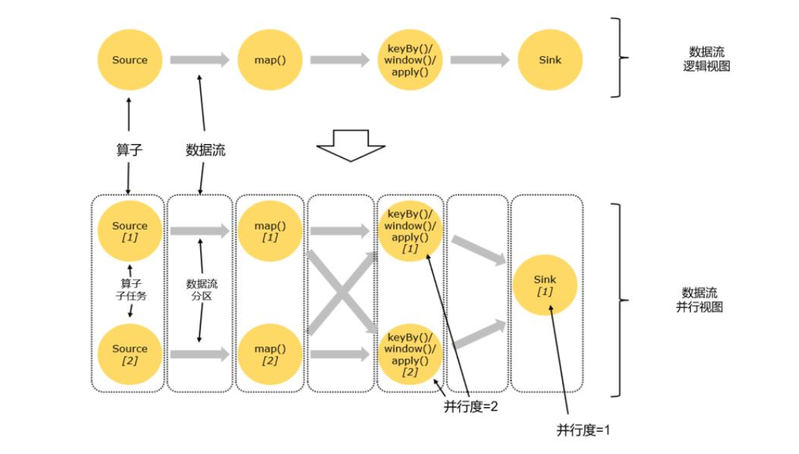

​		**一个特定算子的子任务（subtask）的个数被称之为其并行度（parallelism）。** 它需要多个分区（stream partition）来配合并执行任务

##### 1.3.2.3 并行度设置

- 代码中设置

  setParallelism()方法

- 提交应用时设置

  bin/flink run -p 2 使用-p参数来指定并行度

- 配置文件中设置

  flink-conf.yaml更改默认并行度：parallelism.default:2

  在开发环境中，没有配置文件，默认并行度是当前机器CPU核心数

并行度设置方法优先级：代码中设置 > 提交应用时设置 > 配置文件中设置

#### 1.3.3 分区策略

##### 1.3.3.1 什么是Partition

​		在分布式存储中，Partition分区的概念是把数据集切分成块，每一块数据存储在不同的机器上。

​		对于分布式计算引擎，是将数据切分，交给位于不同物理节点上的Task计算。**Flink中，就是把一个作业切分成子任务Task，将不同的数据交给不同的Task计算。**

##### 1.3.3.2 分区策略

​		目前Flink支持8中分区策略实现：

1. GlobalPartitioner

   数据会被分发到下游算子的第一个实例中进行处理

   使用场景：并行度降为1

2. ForwardPartitioner

   用于在用一个Operator Chain中上下游算子之间的数据转发，实际上数据是直接传递给下游的，要求上下游并行度一样。

   使用场景：一对一的数据分发，map、flatMap、filter等都是这种分区策略

3. ShufflePartitioner

   随机将元素进行分区，可以确保下游的Task能够均匀地获得数据

   dataStream.shuffle()

   使用场景：增大分区、提高并行度，解决数据倾斜

4. RebalancePartitioner

   以Round-robin（轮询调度算法）的方式为每个元素分配分区，确保下游的Task可以均匀地获得数据，避免数据倾斜。

   dataStream.rebalance()

   使用场景：增大分区、提高并行度，解决数据倾斜

5. RescalePartitioner

   根据上下游Task的数量进行分区，使用Round-robin寻找下游的一个task进行数据分区。

   如果上游有2 Source，下游有6个Map，那么每个 Source 会分配3个固定的下游Map，不会向未分配给自己的分区写人数据。这一点与ShufflePartitioner 和RebalancePartitioner 不同， 后两者会写入下游所有的分区。

   dataStream.rescale()

   使用场景：减少分区，防止发生大量的网络传输 不会发生全量的重分区

6. BroadcastPartitioner

   将记录广播给所有分区，即有N个分区，就把数据复制N份，每个分区1份

   dataStream.broadcast()

   使用场景：需要使用映射表、并且映射表会经常发生变动的场景

7. KeyGroupStreamPartitioner

   在API层面，KeyGroupStreamPartitioner应用在KeyedStream上，生成一个新的KeyedStream。

   KeyedStream根据keyGroup索引编号进行分区，会将数据按照key的Hash值输出到下游算子实例中。该分区器不是提供给用户使用的。

8. CustomPartitioner

   用户自定义分区器。需要用户自己实现Partitioner接口，来定义自己的分区逻辑。

#### 1.3.4 算子链（Operator Chain）

##### 1.3.4.1  算子间的数据传输

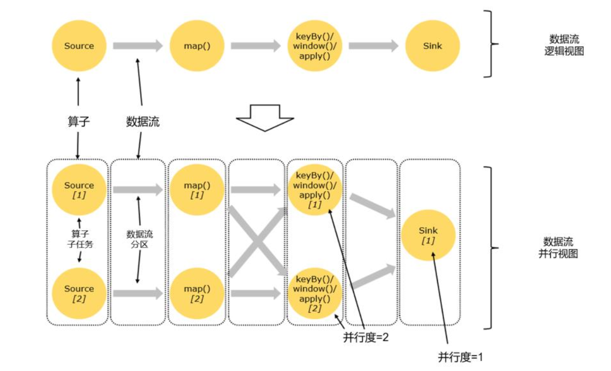

​		如上图所示，一个数据流在算子之间传输数据的形式可以是一对一（one-to-one）的直通（forwarding）模式，也可以是打乱的重分区（redistribute）模式

- 一对一（one-to-one，forwarding）

  数据流维护着分区以及元素的顺序，这种one-to-one的对应关系，类似于spark中的窄依赖。

- 重分区（redistributing）	

  数据流的分区发生改变，每一个算子的子任务，会根据数据传输的策略，把数据发送到不同的下游目标任务。

  例如：keyBy()是分组操作，本质上基于键（key）的哈希值（hashCode）进行了重分区。类似于spark中的shuffle。类似于spark中宽依赖。

##### 1.3.4.2 合并算子链

​		在flink中，并行度相同的一对一（one to one）算子操作，可以直接链接在一起形成一个“大”的任务（task），原来的算子成为了task中的一部分。每个task会被一个线程执行，这样的技术被称为“算子链”（Operator Chain）。

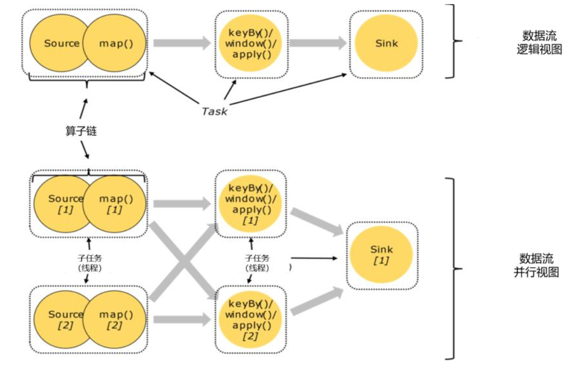

​		Flink为什么要有算子链这样一个设计呢？因为降算子链接成task是非常有效的优化：可以减少线程之间的切换和基于缓存区的数据交换，减少延迟的同时提升吞吐量。

#### 1.3.5 作业图（JobGraph）与执行图（ExecutionGraph）

​		梳理总结一下由代码生成任务的过程，包括需要考虑并行子任务的分配、数据在任务间的传输，以及合并算子链的优化。

​		代码  —> 逻辑流图（StreamGraph）  —> 作业图（JobGraph）  —>执行图（ExecutionGraph）  —>物理图（Physical Graph）

#### 1.3.6 任务（Tasks）和任务槽（Task Slots）

##### 1.3.6.1 什么是任务槽

​		任务槽（task slot）是TaskManager拥有计算资源的一个固定大小的子集，这些资源就是用来独立执行一个子任务的。

​		可以通过集群的配置文件来设定TaskManager的slot数量: taskmanager.numberOfTaskSlots: 8。通过调整slot数量，可以控制子任务之间的隔离级别。

​		slot目前仅仅用来隔离内存，不会涉及CPU隔离。在具体应用时，可以将slot数量配置为机器的CPU核心数，尽量避免不同任务之间对CPU的竞争。

##### 1.3.6.2 任务对任务槽的共享

##### 1.3.6.3 任务槽和并行度的关系


## 2.DataStream API


## 3.时间与窗口

### 3.1 水位线

##### 3.1.1 Flink中有几种时间语义

（1）处理时间（Processing Time）

​		处理时间指执行处理操作的机器系统时间

（2）事件事件（Event Time）

​		事件时间，是指每个事件在对应设备上发生的事件，也就是数据生成的时间

##### 3.1.2 什么是watermark？

​		在事件时间语义下，我们不依赖系统时间，而是基于数据自带的时间戳去定义一个时钟，用来表示当前时间的进展。并且这个时钟以数据的形式传递出去，告诉下游任务当前时间的进展；而且这个时钟的传递不会因为窗口聚合之类的运算而停滞。

​		做法是在数据流中加入一个时钟标记，记录当前事件时间；这个标记可以直接广播到下游，当下游任务收到这个标记，就可以更新自己的时钟了。

​		在Flink中，用来衡量事件事件（Event Time）进展的标记，被称作“水位线”Watermark

​		具体实现，**水位线可以看作一条特殊的数据记录，它是插入到数据流中的一个标记点，主要内容就是一个时间戳，用来指示当前的事件时间。而它插入流中的位置，就应该是在某个数据到来之后；这样就可以从这个数据中提取时间戳，作为当前水位线的时间戳了。**

##### 3.1.3 水位线是如何处理乱序数据的？

​		乱序数据：在分布式系统中，数据在节点间传输，会因为网络传输延迟的不确定性，导致顺序发生改变。

​		简单处理：每来一个数据就提取它的时间戳、插入一个水位线，但是**乱序数据**，可能新的时间戳比之前的还小，那么插入新的水位线时，先判断一下时间戳是否比之前的大，否则就不再生成新的水位线。考虑到**大量数据同时到来的处理效率**，必须得**周期性地生成水位线**，解决方法是保存一下之前所有数据的最大时间戳，需要插入水位线时，就直接以它为时间戳生成新的水位线。

​		如何正确处理“迟到”的数据：用当前已有数据最大时间戳减去延迟时间比如2秒，就是要插入的水位线的时间戳

​		水位线 = 观察到的最大事件时间 - 最大延迟时间 - 1毫秒

##### 3.1.4水位线的特性？

- 水位线是插入到数据流中的一个标记， 可以认为是一个特殊的数据
- 水位线主要的内容是一个时间戳，用来表示当前事件时间的进展
- 水位线是基于数据的时间戳生成的
- 水位线的时间戳必须单调递增，以确保任务的事件时间时钟一直向前推进
- 水位线可以通过设置延迟，来保证正确处理乱序数据
- 一个水位线 Watermark(t)， 表示在当前流中事件时间已经达到了时间戳 t, 这代表 t 之前的所有数据都到齐了，之后流中不会出现时间戳 t’ ≤ t 的数据

##### 3.1.5 水位线是如何传递的？

​		如果下游有多个并发子任务：当前水位线，广播给所有的下游子任务

​		重分区的传输模式，一个任务有可能会收到来自不同分区上游子任务的数据，取上游子任务最小水位线

##### 3.1.6 如何生成水位线？

​		.assignTimestampsAndWatermarks()，主要用来为流中的数据分配时间戳，并生成水位线来指示事件时间。传入一个WatermarkStrategy作为参数，这就是所谓的“水位线生成策略”

WatermarkStrategy：

- TimestmpAssiger：主要负责从流中数据元素的某个字段中提取时间戳，并分配给元素。时间戳的分配是生成水位线的基础。
- WaterMarkGenerator：基于时间戳生成水位线
  - onEvent() ：每个事件数据到来都会调用的方法，它的参数有当前事件、时间戳
  - onPeriodicEmit()：周期性调用的方法，可以由WatermarkOutput()发出水位线，周期时间为处理时间，可以调用环境配置的.setAutoWatermarkInterval()方法来设置，默认为200ms。

Flink内置水位线生成器：

**有序流：WatermarkStrategy.<Event>forMonotonousTimestamps()**

**乱序流：WatermarkStrategy.<Event>forBoundedOutOfOrderness()**

### 3.2 窗口

##### 3.2.1 窗口的理解

​		把窗口理解成一个“桶”，窗口可以把流切割成有限大小的多个“存储桶（bucket）”；每个数据都会分发到对应的桶中，当到达窗口结束时间时，就对每个桶中收集的数据进行计算处理。

​		Flink中窗口并不是静态准备的，而是动态创建，当有落在这个窗口区间范围的数据到达时，才创建对应的窗口。到达窗口结束时间时，窗口就触发计算并关闭。

##### 3.2.2 窗口分类，都有哪些窗口

（1）按照驱动类型分类：以什么标准来开始和结束数据的截取

- 时间窗口：按照时间段截取数据
- 计算窗口：按照固定个数，来截取一段数据集

（2）按照窗口分配数据的规则分类

- 滚动窗口（Tumbling Window）

  滚动窗口有固定大小，是一种对数据进行“均匀切片”的划分方式。窗口之间没有重叠，也不会有间隔，是“首尾相接”的状态。

  可以基于时间定义，也可以基于数据定义；需要的参数只有一个，就是窗口大小（window size）

- 滑动窗口（Sliding Window）

  滑动窗口的大小也是固定的，窗口之间并不是首尾相接的，而是可以“错开”一定的位置

  定义滑动窗口有2个参数：窗口大小（window size）、滑动步长（window slide）

- 会话窗口（Session Window）

  基于“会话”session来对数据进行分组的。数据来了之后就开启一个会话窗口，如果接下来还有数据陆续到来，那么就一直保持会话；如果一段时间一直没收到数据，那就认为会话超时失效，窗口自动关闭。

- 全局窗口（Global Window）

  把相同key的所有数据分配到同一个窗口中，说直白一点，就跟没分窗口一样。无界流的数据永无止尽，所以这种窗口也没有结束的时候，默认是不会做触发计算的。如果希望它能对数据进行计算处理，还需要自定义“触发器”（Trigger）。

##### 3.2.3 迟到的数据的处理

（1）设置水位线延迟时间

​		水位线是整个应用的全局逻辑时钟。水位线生产之后，会随着数据在任务间流动，从而给每个任务指明当前事件时间。水位线的延迟主要是用来对付分布式网络传输导致的数据乱序，而网络传输的乱序程度一般不会很大，大多集中在几毫秒～几百毫秒，一般设置毫秒～秒级

（2）允许窗口处理迟到数据

​		大部分乱序数据已经被水位线的延迟等到了，所以往往迟到的数据不会太多。在水位线到达窗口结束时间时，先快速输出一个近似正确计算结果；然后保持窗口继续等待到延迟数据，每来一条数据，窗口就会再次计算，并将更新后的结果输出。这样可以逐步修改计算结果，最终得到准确的统计值

（3）将迟到数据放入窗口侧输出流

​		用窗口的侧输出流来收集关窗以后的迟到数据，将之前的窗口计算结果保存下来，然后获取侧输出流中的迟到数据，判断数据所属窗口，手动对结果进行合并更新。

##### 3.2.4 水位线是如何传递的？

​		如何理解flink的watermark，当水位线涨到window 的 endTime时，如果后续还有数据过来，窗口还会继续被触发吗？

​		当水位线到达窗口结束时间时，窗口就会闭合不再接收迟到的数据，因为根据水位线的定义，所有小于等于水位线的数据都已经到达，所以显然Flink会认为窗口中的数据都到达了（尽管可能存在迟到数据，也就是时间戳小于当前水位线的数据）	

##### 3.2.5 海量Key去重

​		怎么去重？考虑一个实时场景：双十一场景，滑动窗口长度为 1 小时，滑动距离为 10 秒钟，亿级用户，怎样计算 UV？

​		使用set数据结构或者redis的set显然不行的，因为可能有上亿个key，内存放不下。可以考虑布隆过滤器（Bloom Filter）来去重。

​		布隆过滤器的原理：当一个元素被加入集合时，通过K个散列函数将这个元素映射成一个位数组的K个点，把它们置为1。检索时，只要看这些点是不是都是1就大约知道集合中有没有它了，如果这些点有任何一个0，则被捡元素一点不在，如果都是1，则被捡元素很可能在。

​		


## 4.多流转换

## 5. 状态编程

### 5.1 状态机制

##### 5.1.1 说一下Flink状态机制？

​		Flink内置的很多算子，包括source，sink都是有状态的。在Flink中，状态始终与特定算子相关联。Flink会以checkpoint的形式对各个任务的状态进行快照，用于保证故障恢复时的状态一致性。

##### 5.1.2 什么是状态？

​		每个任务进行计算处理时，可以基于当前数据直接转换得到输出结果；也可以依赖一些其他数据。这些由一个任务维护，并且用来计算输出结果的所有数据，就叫做这个任务的状态。

​		算子任务可以分为无状态和有状态，无状态算子，如map、filter、flatMap，计算时不依赖其他数据。

​		有状态算子，如sum，需要保存之前所有数据的和

##### 5.1.3 有状态算子一般处理流程

1. 算子任务接收到上游发来的数据
2. 获取当前状态
3. 根据业务逻辑进行计算，更新状态
4. 得到计算结果，输出发送到下游任务

##### 5.1.4 状态分类

- 托管状态（Managed State）

  由Flink统一管理，状态的存储访问、故障恢复和重组等一系列问题都由Flink实现

  - 算子状态（Operator State）

    状态作用范围限定为当前的算子任务实例，也就是只对当前并行子任务实例有效

    （1）列表状态（ListState）

    （2）联合列表状态（UnionListState）

    （3）广播状态（BroadcastState）

  - 按键分区状态

    状态是根据输入流中定义的键（key）来维护和访问的，所以只能定义在按键分区流（KeyedStream）中，也就keyBy之后才可以使用

    （1）值状态（ValueState）

    （2）列表状态（ListState）

    （3）映射状态（MapState）

    （4）归约状态（ReducingState）

    （5）聚合状态（AggregatingState）

- 原始状态（Raw State）

  自定义，开辟一块内存，自己管理，实现状态的序列化和故障恢复


## 6.容错机制

### 6.1 Checkpoint机制

##### 6.1.1 什么是checkpoint

​		Flink为了达到容错和exactly-once语义的功能，定期将state持久化下来，这个过程叫做checkpoint，它是flink job在某一个时刻全局状态的快照。

##### 6.1.2 如何实现一个分布式系统的全局状态保留功能

​		checkpoint在flink中引入了Barrier流，定时向数据流中发送Barrier（分界线）。

**实例分析：**

举例一个简单的ETL过程：

​		source、trans、sink三个算子，source和sink都是kafka，operator之间没有chaining，通过forward strategy分组

1. 数据从kafka中抽过来
2. 进行一个trans的转换操作
3. 再发送到一个下游的kafka
4. 当设置parallism=2时

**Checkpoint分析过程：**

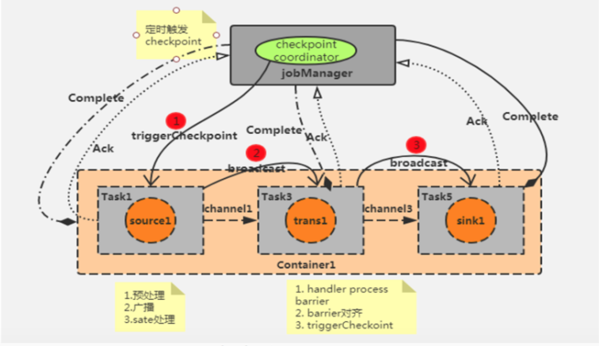

​		每个Flink作业都会产生一个JobManager，JobManager里面又会有一个checkpoint coordinator来管理整个checkpoint的过程，可以设置一个时间间隔让checkpoint coordinator将一个checkpoint的事件发送给每一个Container中的source task，也就是第一个任务。

​		当某个source算子收到一个barrier时，暂停自身的数据处理，将自己的当前state制作成snapshot（快照），并保存到指定的持久化存储中，最后向checkpoint coordinator异步发送一个ack（acknowledge character）确认字符，同时向自身所有下游算子广播该barrier后恢复自身的数据。

​		每个算子按照上面不断制作snapshot并向下游广播，直到最后barrier传递到sink算子，此时快照便制作完成。

需要注意：上游算子可能是多个数据源，对应多个barrier，需要全部到齐才一次性触发checkpoint，即对齐。所以在遇到checkpoint时间较长的情况时，有可能是因为数据对齐需要消费的事件比较长所造成的。

##### 6.1.3 Flink中exactly once和at least once checkpoint的时候有什么区别

- exactly once（精准一次）Barrier对齐

  在多并行度下，同一时间可以来源于多个不同快照的多个barrier分界线，如果想要实现精准一次性，需要使用barrier对齐，以便当前快照能够包含消费多个输入流barrier之前（但不超过）的所有envents而产生的状态。

  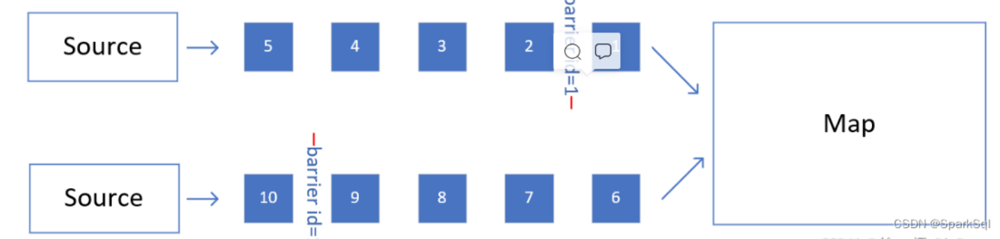

  上游有两个并行度，中间都被source task插入了barrier，目的地是下游的map task。

  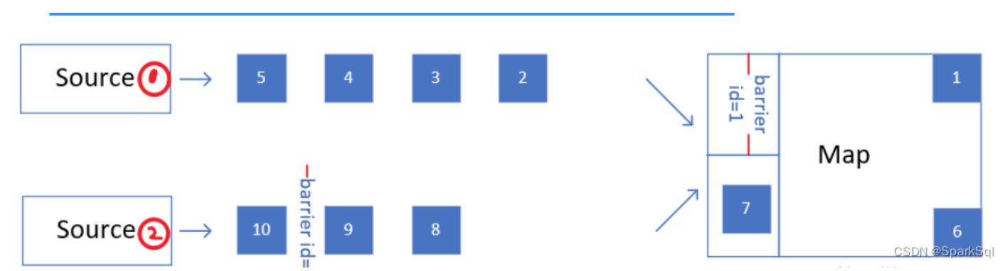

  随着数据的流动，source1的barrier已经进入Map中，此时因为规则是barrier对齐，map需要等待source2的barrier也到达，才可以做快照。并且为了保证barrier可以划分出明确的前后两部分，在等待source2的barrier到来的过程中，source1流到map的数据不会被处理，先放到一个缓存区内，等到barrier对齐之后，再把他们读出来处理。

- at least once（至少一次） Barrier不对齐

  在恢复故障时，需要使用最新的、完整的checkpoint，如果不用等对齐，就可以向下流动，这个时候要是恢复故障，因为barrier id=n不完整，这个checkpoint不可用，要用之前的完整的checkpoint，存在重复处理的数据。

##### 6.1.4 checkpoint制作的snapshot快照存储方式有哪些？

​		Flink主要提供了2中检查的存储方式：

- JobManagerCheckpointStorage作业管理器的堆内存

  默认情况，检查点存储在JobManager的堆（heap）内存中。

- FileSystemCheckpointStorage文件系统

检查点配置可以使用.setCheckpointStrorage()来设置

```java
// 配置存储检查点到JobManager堆内存
env.getCheckpointConfig().setCheckpointStorage(new JobManagerCheckpointStorage());
// 配置存储检查点到文件系统
env.getCheckpointConfig().setCheckpointStorage(new FileSystemCheckpointStorage("hdsf://namenode:40010/flink/checkpoints"));
```

	##### 6.1.5 checkpoint相关配置

```java
StreamExecutionEnvironment env = StreamExecutionEnvironment.getExecutionEnvironment();

// 启动检查点，间隔时间1秒
env.enableCheckpointing(1000);
Checkpoint checkpointConfig = env.getCheckpointConfig();
// 设置精确一次模式
checkpointConfig.setCheckpointMode(CheckpointingMode.EXACTLY_ONCE);
// 最小间隔时间500毫秒，最快等多久可以发出保存下一个检查点的指令
checkpointConfig.setMinPauseBetweenCheckpoints(500);
// 超时时间1分钟，超时没完成就会被丢弃掉
checkpointConfig.setCheckpointTimeout(60000);
// 同时只能有一个检查点
checkpointConfig.setMaxConcurrentCheckpoints(1);
// 开启检查点的外部持久化保存，作业取消后依然保留
chcekpointConfig.enableExternalizedCheckpoints(ExternalizedCheckpointCleanup.RERAIN_ON_CANCELLATION);
// 启用不对齐的检查点保存方式
checkpointConfig.enableUnlignedCheckpoints();
// 设置检查点存储，可以直接穿入一个string，指定文件系统的路径
checkpointConfig.setCheckpointStorage("hdfs://my/checkpoint/dir")
```

##### 6.1.6 从检查点恢复状态的具体步骤？

1. 重启应用

   遇到故障之后，第一步就是重启。应用重启后，所有任务的状态会清空

2. 读取检查点，重置状态

   找到最近一次保存的检查点，从中读取出每个算子任务状态的快照，分别填充到对应的状态中

3. 重放数据

   如果直接继续处理数据，那么保存检查点之后、到发生故障这段时间内的数据，就相当于丢掉了；会造成计算结果错误。

   为了不丢数据，应该从保存检查点后开始重新读取数据，可以通过Source任务向外部数据源 重新提交偏移量（offset）来实现。

4. 继续处理数据

##### 6.1.7 检查点算法—基于Chandy-Lamport算法的分布式快照**

​		实现的目标是，在不暂停流处理的前提下，让每个任务“认出”触发检查点保存的那个数据。

​		在数据流中插入一个特殊的数据结构（Checkpoint Barrier），专门用来表示触发检查点保存的时间点，收到保存检查点的指令后，Source任务可以在当前数据流中插入这个结构，之后的所有任务只要遇到它就开始对状态做持久化快照保存。

##### 6.1.8 分布式快照算法—异步分界线快照（asynchronous barrier snapshotting）

​		算法的核心就是2个原则：当上游任务向多个并行任务发送barrier时，需要广播出去；而多个上游任务向同一个下游任务传递barrier时，需要在下游执行“分界线对齐”（barrier alignment）操作，也就是需要等到所有并行分区的barrier都到齐，才可以开始状态的保存。

### 6.2 exactly-onec精确一次

##### 6.2.1 状态一致性（状态 Exactly-once）

​		对于Flink来说，一致性指的是多个节点并行处理不同的任务，我们要保证计算结果是正确的，就必须不漏掉任何一个数据，而且也不会重复处理同一个数据。

​		exactly-once要求数据不丢，需要有数据重放机制来保证这一点，Flink使用的是一种轻量级快照机制—检查点（checkpoint）来保证exactly-once语义。

##### 6.2.2 端到端一致性（端到端 Exactly - once）

​		完整的流处理应用，包括数据源、流处理器和外部存储系统三个部分。

- 输入端

  外部数据源必须拥有重放数据的能力，像Kafka

- 流处理

  检查点机制可以保证故障恢复后数据不丢失，并且只处理一次，可以做到exactly-once一致性语义

- 输出端

  输出端最大的问题是“覆水难收”，写入到外部系统的数据难以撤回，那怎样可以收回一条写入的数据呢？

  能够保证exactly-once一致性写入方式有2种：幂等写入和事务写入

  - 幂等（idempotent）写入

    一个操作可以重复执行很多次，但只导致一次结果更改，后面再重复执行就不会对结果起作用。

    Redis中键值存储、Mysql

    出现短暂不一致

  - 事务（transactional）写入

    事务是应用程序中一系列严密的操作，所有操作必须成功完成，否则在每个操作中所做的所有更改都会被撤销。事务有4个基本特性：原子性（Atomicity）、一致性（Correspondence）、隔离性（Isolation）、持久性（Durability） ACID

    当Sink任务遇到barrier时，开始保存状态的同时开启一个事务，接下来所有数据的写入都在这个事务中；待到当前检查点保存完毕时，将事务提交，所有写入的数据就真正可用了。如果中间过程出现故障，状态会回退到上一个检查点，而当前事务没有正常关闭（因为当前检查点没有保存完），所以会回滚，写入到外部的数据就被撤销了

    - 预写日志（write-ahead-log，WAL）

      （1）先把结果数据作为日志（log）状态保存起来

      （2）进行检查点保存时，也会将这些结果数据一并做持久化存储

      （3）在收到检查点完成的通知时，将所有结果一次性写入外部系统

      DataStream API提供了一个模板类GenericWriteAheadSink，来实现这种事务型的写入方式

      缺点：如果检查点已经成功保存、数据也成功地一批写入到外部系统，但是最终保存确认信息时出现故障，Flink最终还是会认为没有成功写入。于是发生故障时，不会使用这个检查点，而是需要回退到上一个，这样就会导致这批数据的重复写入。

    - 两阶段提交（2PC）

      （1）当第一条数据到来时，或者收到检查点的分界线时，Sink任务都会启动一个事务

      （2）接下来接收到的所有数据，都通过这个事务写入外部系统；这是由于事务没有提交，所以数据尽管吸入了外部系统，但是不可用，是“预提交”的状态
  
      （3）当Sink任务收到JobManager发来检查点完成的通知时，正式提交事务，写入的结果就真正可用了

##### 6.2.3 如果下级存储不支持事务，Flink怎么保证exactly-once？

​		端到端的exactly-one对sink要求比较高，具体实现主要有幂等写入和事务性写入两种方式。密等写入的场景依赖于业务逻辑，更常见的是用事务性写入。而事务性写入又有预写日志（WAL）和两阶段提交（2PC）两种方式。

​		如果外部系统不支持事务，那么可以用预写日志的方式，把结果数据先当成状态保存，然后再收到checkpoint完成通知时，一次性写入sink系统。

## 7.Flink SQL

### 7.1 API

​		Table API和SQL可以看作联合在一起的一套API，程序处理中，输入数据可以定义成一张表，然后对这张表进行查询，得到新的表，相当于数据流的转换操作。最后定义一张用于输出的表。

#### 7.1.1 程序架构

程序基本架构：

```sql
// 创建表环境
TableEnvironment tableEnv = ...;
// 创建输入表，连接外部系统读取数据
tableEnv.executeSql("CREATE TEMPORARY TABLE inputTable ... WITH('connector = ...')");
// 注册一个表，连接到外部系统，用于输出
tableEnv.executeSql("CREATE TEMPORARY TABLE outputTable ... WITH('connector = ...')");
// 执行SQL对表进行查询转换，得到一个新的表
Table table1 = tableEnv.sqlQuery("SELECT ... FROM inputTable...");
// 使用Table API对表进行查询转换，得到一个新的表
Table table2 = tableEnv.from("inputTable").select(...);
// 将得到的结果写入输出表
TableResult tableResult = table.executeInsert("outputTable");
```

​		通过执行DDL直接创建一个表，执行CREATE语句中用WITH指定外部系统的连接器，就可以连接外部系统读取数据了。直接用SQL语句实现全部的流处理过程。

#### 7.1.2 表环境TableEnvironment

​		Flink在使用Table API和SQL需要一个特别的运行时环境，这就是所谓的“表环境（TableEnvironment）”，它主要负责：

1. 注册Catalog和表

   这里的Catalog就是“目录”，与标准SQL中的概念一致，主要用来管理所有数据库（database）和表（table）的元数据（metadata）。

   在表环境中可以由用户自定义Catalog，并组册表和自定义函数（UDF）。

2. 执行SQL查询

3. 注册用户自定义函数（UDF）

4. DataStream和表之间的转换

使用默认配置创建表环境：

```sql
import org.apache.flink.streaming.api.environment.StreamExecutionEnvironment;
import org.apache.flink.table.api.EnvironmentSettings;
import org.apache.flink.table.api.bridge.java.StreamTableEnvironment;

StreamExecutionEnvironment env = StreamExecutionEnvironment.getExecutionEnvironment();
StreamTableEnvironment tableEnv = StreamTableEnvironment.create(env);
```


#### 7.1.3 创建表

​		创建表的方式，有连接器（connector）和虚拟表（virtual tables）2种。

- 连接器表（Connector Tables）

  通过连接器（connector）连接到一个外部系统，然后定义出对应的表结构。对表的读写就可以通过连接器转换成对外部系统的读写了。

  ```sql
  tableEnv.executeSql("CREATE [TEMPORARY] TABLE MyTable ... WITH ('connector = ...)")
  ```

  

- 虚拟表（Virtual Tables）

  调用表环境的sqlQuery()方法，直接传入一条SQL语句作为参数执行查询，得到一个Table对象。

  ```sql
  Table newTable = tableEnv.sqlQuery("SELECT ... FROM MyTable...")
  ```

  得到的newTable是一个中间转换结果，如果希望直接使用这个表执行SQL，需要将这个中间结果表注册到环境中。

  ```java
  tableEnv.createTemporaryView("NewTable", newTable);
  ```

  

#### 7.1.4 表和流转换

- 将表转换成流（Table—>DataStream）

  - 调用toDataStream()方法

    ```java
    tableEnv.toDataStrem(visitTable).print();
    ```

    

  - 调用toChangelogStream()方法

    对于有更新操作的表，进行打印输出，会抛出TableException异常，因为print本身可以看作一个Sink操作，打印输出的Sink操作不支持数据进行更新。解决方法是不要转换成DataStream打印输出，而是记录它的“更新日志”（change log），变成一条更新日志的流，就可以打印输出了。

    ```java
    tableEnv.toChangelogStream(urlContTable).print();
    ```

    

- 将流转换成表（DataStream—>Table）

  - 调用fromDataStream()方法

    ```java
    Table eventTable = tableEnv.fromDataStream(eventStream, $("timestamp").as("ts"), $("url"));
    ```

    由于流中的数据本身就是定义好的POJP类型Event，将流转换成表之后，每一行数据就对应着一个Event，而表中的列名就对应着Event中的属性。

  - 调用createTemporaryView()方法

    如果希望直接在SQL中引用这张表，可以调用createTemporaryView()方法来创建虚拟视图

    ```java
    tableEnv.createTemporaryView("EventTable", eventStream, $("timestamp").as("ts"), $("url"));
    ```

  -  调用fromChangelogStream()方法

    将一个更新日志流转换成表。

#### 7.1.5 支持的数据类型

​		DataStream中支持的数据类型，Table也都支持

- 原子类型

  Integer、Double、String

  原子类型不做重命名时，默认的字段名“f0”，将原子类型看作了一元组Tuple1的处理结果。

- Tuple类型

  表中字段默认是元组中元素的属性名f0、f1、f2...

  ```java
  // 将数据流转换成只包含 f1 字段的表
  Table table = tableEnv.fromDataStream(stream, $("f1"));
  // 将数据流转换成包含 f0 和 f1 字段的表，在表中 f0 和 f1 位置交换
  Table table = tableEnv.fromDataStream(stream, $("f1"), $("f0"));
  // 将f1 字段命名为 myInt， f0 命名为 myLong
  Table table = tableEnv.fromDataStream(stream, $("f1").as("myInt"),
  $("f0").as("myLong"));
  ```

- POJO类型

  将 POJO 类型的 DataStream 转换成 Table，如果不指定字段名称，就会直接使用原始 POJO
  类型中的字段名称

- Row类型

  Row 类型也是一种复合类型，它的长度固定，而且无法直接推断出每个字段的类型，所以在使用时必须指明具体的类型信息

  创建 Table 时调用的 CREATE语句就会将所有的字段名称和类型指定，这在 Flink 中被称为表的“模式结构”（ Schema）。除此之外， Row 类型还附加了一个属性 RowKind，用来表示当前行在更新操作中的类型。这样，Row 就可以用来表示更新日志流（ changelog stream）中的数据。

  ```java
  DataStream<Row> dataStream = 
    env.fromElements(
    Row.ofKind(RowKind.INSERT, "Alice", 12),
    Row.ofKind(RowKind.INSERT, "Bob", 5),
    Row.ofKind(RowKind.UPDATE_BEFORE, "Alice", 12),
    Row.ofKind(RowKind.UPDATE_AFTER, "Alice", 100));
  // 将更新日志流转换为表
  Table table = tableEnv.fromChangelogStream(dataStream);
  ```

### 7.2 流处理中的表

### 7.3 时间属性和窗口

#### 7.3.1 时间

#### 7.3.2 窗口

		##### 7.3.2.1 窗口表值函数（Windowing TVFs，新版本）

​		从1.13版本开始，Flink开始使用窗口表值函数（Windowing table-valued functions，Windowing TVFs）来定义窗口。

​	目前Flink提供了以下几个窗口TVF：

- 滚动窗口（Tumbling Windows）

  长度固定、时间对齐、无重叠的窗口，一般用于周期性的统计计算

  TUMBLE(TABLE EventTable, DESCRIPTOR(ts), INTERVAL '1' HOUR)

- 滑动窗口（Hop Windows，跳跃窗口）

  设置滑动步长来控制统计输出的频率

  HOP(TABLE EventTable, DESCRIPTOR(ts), INTERVAL '5' MINUTES, INTERVAL '1' HOURS)

  基于时间属性ts，在表EventTable上创建了大小为1小时的滑动窗口，每5分钟滑动一次。

- 累积窗口（Cumulate Windows）

  场景：统计周期较长，希望中间每隔一段时间就输出一次当前的统计值；与滑动窗口不同的是，在一个统计周期内，会多次输出统计值，应该是不断叠加累积的。

  例如：按天统计网站的PV，每隔1小时输出一次当天到目前为止的PV值。

  CUMULATE(TABLE EventTable,DESCRIPTOR(ts), INTERVAL '1' HOURS, INTERVAL '1' DAYS)

  两个核心参数：最大窗口长度（max window size）和累积步长（step）

- 会话窗口（Session Windows，目前尚未完全支持）

### 7.4 聚合

#### 7.4.1 窗口聚合

​		使用窗口TVF实现分组窗口的聚合：

```sql
select user,
       window_end as endT,
       count(url) as cnt
from TABLE(
	TUMBLE(TABLE EventTable, DESCRIPTOR(ts), INTERVAL '1' HOUR)
)
group by user, window_start, window_end
```

​		以ts作为时间属性字段、基于EventTable定义了1小时的滚动窗口，统计出每小时每个用户点击url的次数。分组字段是用户名user，表示窗口的window_start、window_end

#### 7.4.2 开窗聚合

​		具体实例：

```sql
select user, ts,
       count(url) over(partition by user order by ts range between interval '1' HOUR preceding and current row) as cnt
from EventTable
```

​		以ts作为时间属性字段，对EventTable中的每行数据都选取它之前1小时的所有数据进行聚合，统计每个用户访问url的总次数，并重命名为cnt。

​		使用window字句在select外部单独定义一个over窗口：

```sql
select user, ts,
       count(url) over w as cnt,
       max(char_length(url)) over w as max_url
from EventTable
window w as(
  partition by user order by ts rows between 2 preceding and current row
)
```

​		定义了选取前2行数据的over窗口，并重命名为w；接下来可以基于它调用多个聚合函数，扩展出更多的列提取出来。

#### 7.4.3 窗口TopN

```sql
select *
from
(
  select *,
         row_number() over(partition by window_start, window_end order by cnt desc) as row_num
  from
  (
    select window_start, window_end, user, count(url) as cnt
    from TABLE(
      tumble(table EventTable, descriptor(ts), interval '1' hour)
    )
    group by window_start, window_end, user
  ) as t
) as t
where row_num <= 2
```


### 7.5 Join

​		Flink双流Join主要分为两大类，一类是基于原生State的Connect算子操作，另一类是基于窗口Join操作。其中给予窗口的Join可细分为Window join 和Interval join两种。

#### 7.5.1 双流Join（Regular Join）

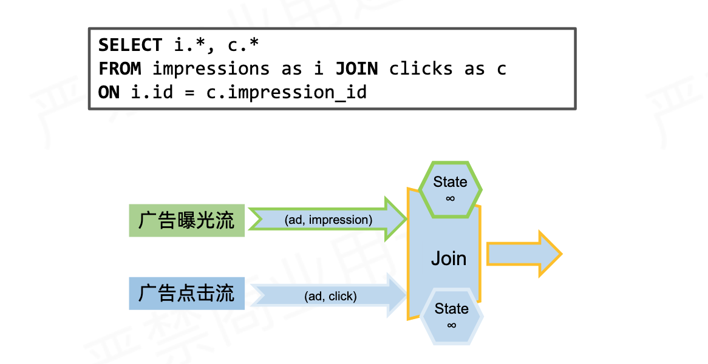

​		Join机制实现原理：依赖Flink的State状态存储，通过将数据存储到State中进行关联join，最终输出结果。

- 支持Inner join、left join、right join、full outer join

- 语法，语义均和传统SQL一致

- 左右流都会触发结果更新

- 状态持续增长，一般结合state TTL使用

  configuration.setString("table.exec.state.ttl", "1h")

#### 7.5.2 Window Join

​		利用Flink的窗口机制实现双流Join，将两条实时流中元素分配到同一个时间窗口中完成Join。

​		底层原理：两条实时流数据缓存在Window State中，当窗口触发计算时，执行join操作


#### 7.5.2 区间Join（Interval Join）

#### 7.5.3 时态表 Join（Temproal Join）

#### 7.5.4 自定义函数 UDTF


## 8.压测与监控

### 8.1 Flink反压机制

#### 8.1.1 Flink数据交换

​		Flink的数据交换有3种：

- 同一个Task的数据交换

  通过算子链operator chain串联多个算子，主要作用是避免序列化和网络通信的开销。

  算子链operator chain串联多个算子的条件：

  - 上下游的并行度一致
  - 下游节点的入度为1
  - 上下游节点共享同一个slot
  - 下游节点的chain策略为ALWAYS（例如map、flatmap、filter等默认是ALWAYS）
  - 上游节点chain策略为ALWAYS或HEAD（source默认是HEAD）
  - 两个节点间数据分区方式是forward
  - 用户没有禁用chain

- 不同Task同JVM下的数据交换

  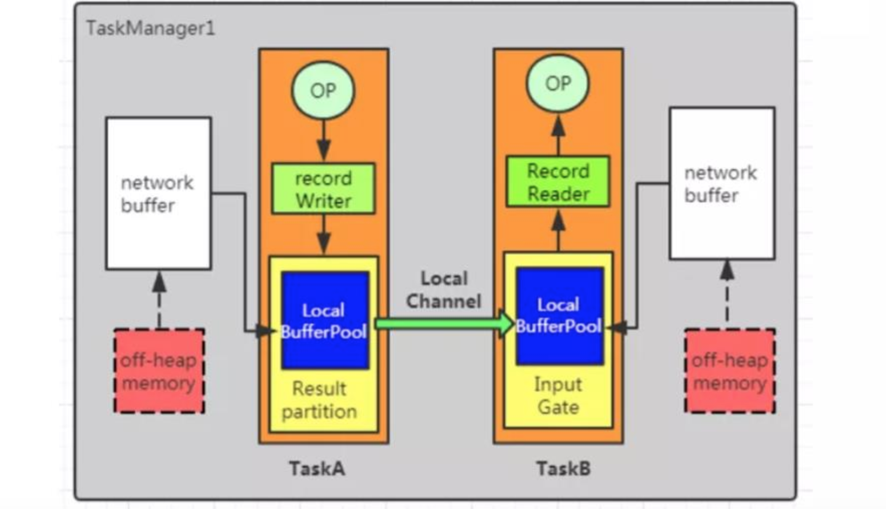

  在TaskA中，算子输出的数据首先通过record Writer进行序列化，然后传递给result Partition。接着，数据通过local channel传递给TaskB的input Gate，然后传递给record reader进行反序列。

- 不同Task且不同TaskManager之间的交换

  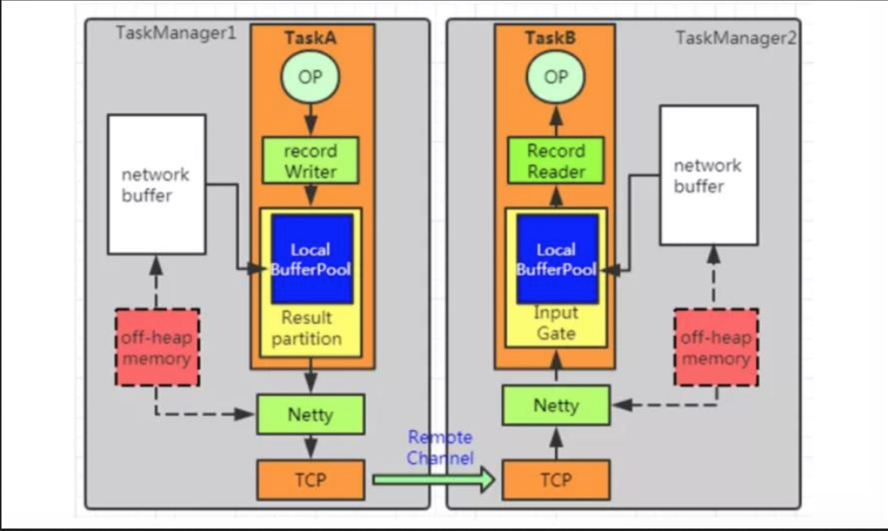

  与上述2不同点是数据先传递给netty，通过netty把数据推送到远程段的task。

#### 8.1.2 Flink的Credit-based反压机制

​		在Flink层面实现反压机制，通过ResultPartition和InputGate传输feedback。

​		Credit-base的feedback步骤：

- 每一次ResultPartition向InputGate发送数据的时候，都会发送一个backlog size告诉下游准备发送多少消息，下游就会计算游多少Buffer去接收消息。（backlog的作用是为了让消费端感知到我们生产端的情况）

- 如果下游有充足的Buffer，就会返还给上游Credit（表示剩余buffer数量），告知发送消息（图上两个虚线是采用Netty和Socket进行通信）。

  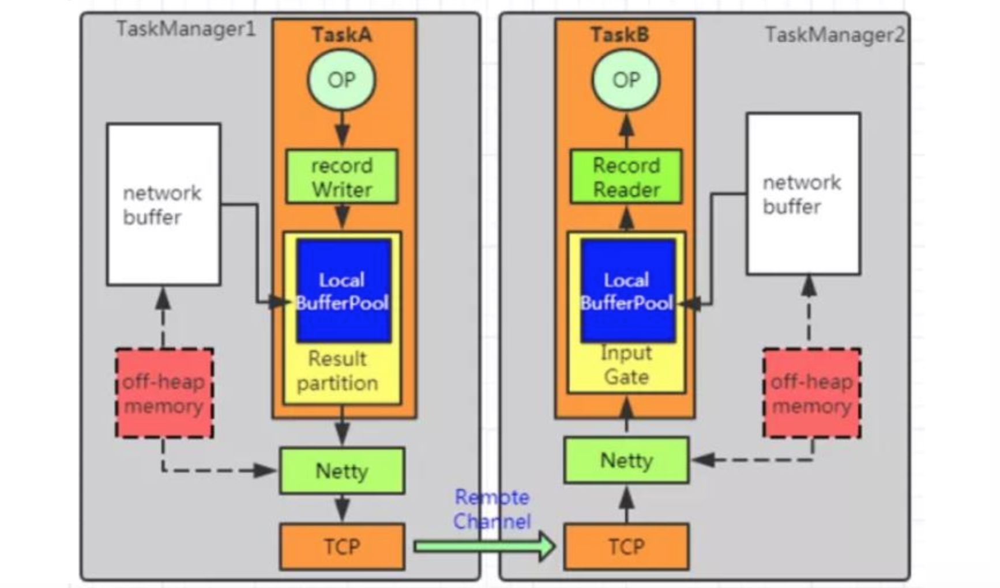

  ​													                  生成段发送backlog = 1

  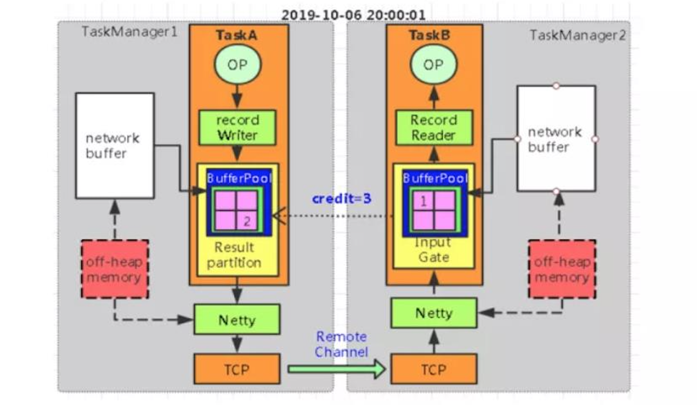

  ​																消费端返回credit = 3

  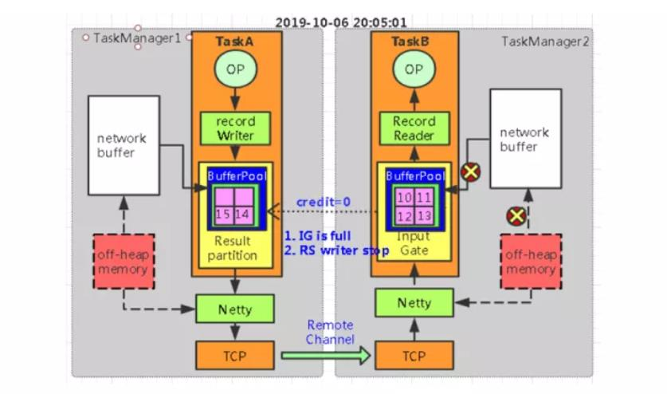

  ​                                                           当生产端用完buffer， 返回credit = 0

  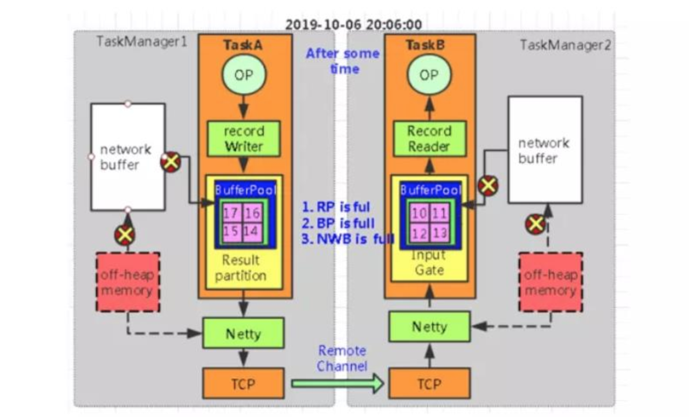

  

  ​																生产端也出现了数据积压

##### 8.1 怎么做压力测试和监控？

​		一般碰到的压力来自以下几个方面：

1. 产生数据流速度如果过快，而下游的算子消费不过来的话，会产生**背压**。背压的监控可以使用Flink Web UI来可视化监控，一旦报警就能知道。一般情况下背压问题的产生可能是由于sink这个操作符没有优化好，做一下优化就可以，比如如果写入ElasticSearch，那么可以改成批量写入，可以调大ElasticSearch队列的大小等策略。
2. 设置watermark的最大延迟时间这个参数，如果设置的过大，可能会造成内存的压力。可以设置最大延迟时间小一些，然后把迟到元素发送到侧输出流中去。晚一点更新结果。或者使用类似RocksDB这样的状态后端，RocksDB会开辟堆外存储空间，但IO速度会变慢，需要权衡。
3. 还有就是滑动窗口的长度如果过长，而滑动距离很短的话，Flink的性能会下降的很厉害。主要通过时间分片的方法，将每个元素只存入一个“重叠窗口”，这样可以减少窗口处理中状态的写入。

## 9. 实时数仓

### 9.1 事实数仓案例

#### 9.1.1 菜鸟仓配实时数据仓库


**1.实时数仓的架构是什么样的？**

​		实时数仓采用Lambda架构，相对比于Kappa架构，他的优点是灵活性高、容错性高、成熟度高和迁移成本低；缺点是实时、离线数据用两套代码，可能存在一个口径修改了，另一个没改的问题

​		实时计算引擎采用Flink，Flink具有Exactly-once的准确性、轻量级Checkpoint容错机制、低延时高吞吐和易用性高的特点。

​		实时存储引擎采用的redis，ClickHouse是比较好的选择，实时存储引擎要求有维度索引、支持高并发、预聚合、高性能事实多维OLAP查询。

1.事实数仓是如何建设的，都有哪些数据


Flink SQL维表关联


从0-1处理过多少亿级别的数据 具备设计、调优能力，数据治理

实时
1.整体设计

数据应用：实时大屏、实时运营、推荐系统
数据服务层：日志服务SLS、Redis
数据计算：Flink
数据模型：dwd实时明细层、dwm轻度汇总层、dws高度汇总层

业务系统、埋点数据

2.数据模型
实时明细层
   数据清洗
   多流join
   解决方案：数据延迟如何解决
   输出实时明细数据到kafka

   实时计算主要是订阅业务消息队列SLS，通过数据清洗ETL，多流join，多数据源join，流式实时数据和静态离线维度数据进行关联组合，将一些相同粒度的业务系统 维度表中维度属性全部关联在一起，做维度退化，增加数据的易用性和服用性，最终得到实时明细数据，将这些数据分成两个分支，一个分支落到CK，支持明细查询使用，一个分支发送到消息队列SLS中供下一层使用

汇总层：（实时计算）
  轻度汇总层：轻度汇总数据落地到olap引擎，做报表 clickhouse
  高度汇总层：高度汇总层落地供KV查询的大屏


3.数据保障能力 灾难备份能力

正常链路：业务系统——>消息队列——>实时计算——>数据应用

压测链路：              ——>消息队列——>实时计算——>数据应用

   消息队列：压缩时间，构造峰值数据

​	实时计算：作业代码 Job任务 复制

​	压测目的：测试产出实时计算在该场景下资源配置

主备链路：业务系统——>消息队列——>实时计算——>数据存储——>数据应用

灾备链路：                                                  实时计算——>数据存储——>数据应用

目的：主链路出现问题，备链路提供服务，针对高优先级的job

4.离线数仓和实时数仓的区别


## 10. 性能优化

### 10.1 数据倾斜

#### 10.1.1 原理

​		产生数据倾斜的原因主要有2方面：

- 业务上有严重的数据热点

  比如滴滴打车的订单数据中北京、上海等几个城市的订单远远超过其他地区

- 技术上大量使用KeyBy、GroupBy等操作

  错误的使用了分组Key，人为产生数据热点

​		分组聚合使用KeyGroupStreamPartitioner分区策略，Flink中，就是把一个作业切分成子任务Task，partition将不同的数据交给不同的Task计算。会将数据按照key的Hash值输出到下游算子实例中。

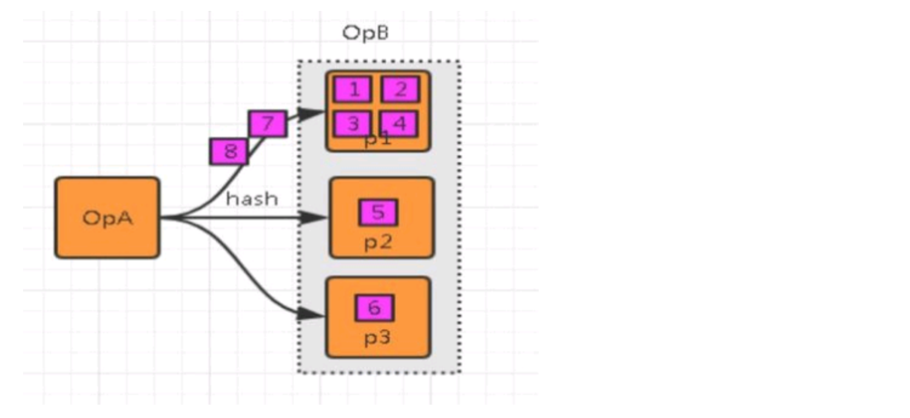

#### 10.1.2 数据倾斜的影响

1. 单点问题

   数据集中在某些分区上（subtask），导致数据严重不平衡

2. GC频繁

   过多的数据集中在某些JVM（TaskManager），使得JVM的内存资源短缺，导致频繁GC

3. 吞吐下降、延迟增大

   数据单点和频繁GC导致吞吐下降、延迟增大

4. 系统崩溃

   严重情况下，过长的GC导致TaskManager失联，系统崩溃。

#### 10.1.3 如何定位数据倾斜

步骤1：定位反压

​		定位反压有2种方式：Flink Web UI自带的反压监控（直接方式）、Flink Task Metrics（间接方式）

​		通过监控反压的信息，可以获取到数据处理瓶颈的subtask。

步骤2：确定数据倾斜

​		Flink Web UI自带subtask接收和发送的数据量。当subtask之间处理的数据量有较大的差距，则该subtask出现数据倾斜。如下图所示，红框的subtask出现数据热点。

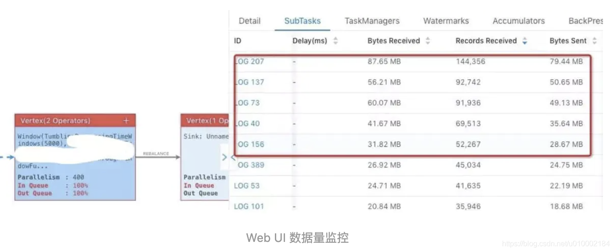

#### 10.1.4 解决方法

​		不同场景出现的数据倾斜，使用不同的解决方案

##### 10.1.4.1 keyBy 之前发生数据倾斜

​		如果keyBy之前就存在数据倾斜，上游算子的某些实例可能处理的数据较多，某些实例可能处理的数据较少，产生该情况可能是因为数据源的数据本身就不均匀。

​		**场景：**Flink消费kafka上下游并行度不一致导致的数据倾斜

​		**解决思路：**需要让Flink任务强制进行shuffle。使用shuffle、rebalance或rescale算子即可将数据均匀分配。

通过调整并发度，解决数据源消费不均匀或者数据源反压的情况。调整并发度的原则：KafkaSource并发度与kafka分区数一样的，或者kafka分区数是KafkaSource并发度的整数倍。

​		但是会有一种情况，为了加快数据的处理速度，来设置Flink消费者的并行度大于kafka的分区数。如果不做任何的设置会导致部分Flink Consumer线程永远消费不到数据，需要设置redistributing，也就是数据重分配。

```java
dataStream.setParallelism(2)
  .rebalance() // .rescale()
  .print()
  .setParallelism(4)
```

​		其中，Rebalance分区策略，数据会以round-robin的方式对数据进行再次分区，可以全局负载均衡。Rescale分区策略基于上下游并行度，会将数据以循环的方式输出到下游的每个实例中。

##### 10.1.4.2 keyBy后的聚会操作存在数据倾斜

**1.为什么不能直接用二次聚合来处理**

​		Flink是实时流处理，如果keyBy之后的聚合操作存在数据倾斜，且没有开窗口（没攒批）的情况下，简单的认为使用两阶段聚合，是不能解决问题的。因为这个时候Flink是来一条处理一条，且向下游发送一条结果，对原来keyBy的维度（第二阶段聚合）来讲，数据并没有减少，且结果重复计算。

​		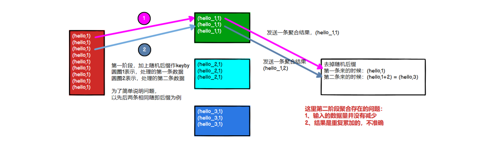

**2.使用LocalKeyBy的思想**

​		在keyBy上游算子数据发送之前，首先在上游算子的本地对数据进行聚合后，再发送到下游，使下游接收到的数据量大大减少，从而使得keyBy之后的聚合操作不再是任务的瓶颈。类似MapReduce中Combiner的思想，**但是这要求聚合操作必须是多条数据或者一批数据才能聚合，单条数据没有办法通过聚合来减少数据量**。从Flink LocalKeyBy实现原理来讲，必然会存在一个**积攒批次**的过程，在上游算子中必须攒够一定的数据量，对这些数据聚合后再发送到下游。

实现方式：SQL可以指定参数，开启miniBatch和LocalGlobal功能

```java
// 初始化table environment
TableEnvironment env = ...
// 获取 tableEnv的配置对象
Configuration conf = env.getConfig().getConfiguation();
// 设置参数：
// 开启miniBatch
conf.setString("table.exec.mini-batch.enabled", "true");
// 批量输出的间隔时间
conf.setString("table.exec.mini-batch.allow-latency", "5s");
// 防止OOM设置每个批次最多缓存数据的条数，可以设置为2万条
conf.setString("table.exec.mini-batch.size", "20000");
// 开启LocalGlobal
conf.setString("table.optimizer.agg-phase-strategy", "TWO_PHASE");
```


##### 10.1.4.3keyBy后的窗口聚合操作存在数据倾斜

​		因为使用了窗口，变成了有届数据（攒批）的处理，窗口默认是触发时才会输出一条结果发往下游，所以可以使用两阶段聚合的方式：

**实现思路：**

- 第一阶段聚合：key拼接随机数前缀或后缀，进行keyBy、开窗、聚合

  注意：聚合完不再是windowedStream，要获取WindowEnd作为窗口标记作为第二阶段分组依据，避免不同窗口的结果聚合到一起。

- 第二阶段聚合：按照原来的key及windowEnd作keyBy、聚合

​		举例：统计一个网站各个端的每分钟的pv

```sql
-- 最内层，讲分组的key，也就是plat加上一个随机打散
select winEnd,split_index(plat1, '_', 0) as plat2, sum(pv)
from
(
  select TUMBLE_END(proc_time, INTERVAL '1' MINUTE) as winEnd, 
         plat1, count(1) as pv
  from
  (
    select plat || '_' || cast(cast(RAND() * 100 as int)as string) as plat1,
           proc_time
    from source_kafka_table
  ) as t
  group by TUMBLE(proc_time. INTERVAL '1' MINUTE), plat1
) as t
group by winEnd,split_index(plat1, '_', 0)
```

```java
env.addSource(new CustomBeanSource()).keyBy(ele -> ele.getDeviceName() + "-" + new Random().nextInt(10))
  .timeWindow(Time.secons(60))
  .sum("bandWidth")
  .keyBy(ele -> ele.getDeviceName())
  .sum("bandWidth")
  .addSink(...)
```

​		

### 10.2 并行度设置

#### 10.2.1 全局并行度计算

​		开发完成后，先进行压测。任务并行度给10个以下，测试单个并行度的处理上限。

**总QPS / 单并行度的处理能力 = 并行度**

​		开发完Flink作业，压测的方式很简单，先在kafka中积压数据，之后开启flink任务，出现反压，就是处理瓶颈。相当于水库先积水，一下子泄洪。

​		不能只从QPS去得出并行度，因为有些字段少、逻辑简单的任务，单并行度一秒处理几万条数据。而有些数据字段多，处理逻辑复杂，单并行度一秒只能处理1000条数据。

​		最好根据高峰期QPS压测，并行度 x 1.2倍，富余一些资源。	


### 10.3 Flink SQL优化

#### 10.3.1 设置空闲状态保留时间

​		忘记设置空闲状态保留时间导致状态爆炸，列举两个场景：

- FlinkSQL 的regular join（inner、left、right），左右表的数据都会一直保存在状态里，不会清理！要么设置TTL，要么使用FlinkSQL的interval join
- 使用Top-N语法进行去重，重复数据的出现一般都位于特定区间内（例如一个小时或一天内），过了这段时间之后，对应的状态就不再需要了。

Flink SQL可以指定空闲状态（即未更新的状态）被保留的最小时间，当状态中某个key对应的状态未更新的时间达到阈值时，该条状态被自动清理：

```java
// API 指定
tableEnv.getConfig().setIdleStateRetention(Duration.ofHours(1));
// 参数指定
Configuration configuration = tableEnv.getConfig().getConfiguration();
configuration.setString("table.exec.state.ttl", "1h")
```


#### 10.3.2 开启MiniBatch

​		MiniBatch是微批处理，原理是缓存一定的数据后再触发处理，以减少对State的访问，从而提升吞吐并减少数据的输出量。Minibatch主要依靠在每个Task上注册的Timer线程来触发微批，需要消耗一定的线程调度性能。

**开启方式：**

```java
// 初始化table environment
TableEnvironment env = ...
// 获取tableEnv的配置对象
Configuration conf = env.getConfig().getConfiguration();
// 设置参数：
// 开启MiniBatch
conf.setString("table.exec.mini-batch.enabled", "true")
// 批量输出的间隔时间
conf.setString("table.exec.mini-batch.allow-latency", "5s")
// 防止OOM设置每个批次最多缓存数据的条数，可以设为2万条
conf.setString("table.exec.mini-batch.size", "20000")

```

**使用场景：**

​		微批处理通过增加延迟换取高吞吐，如果有超低延迟的要求，不建议开启微批处理。通常对于聚合的场景，微批处理可以显著提升系统性能，建议开启。


