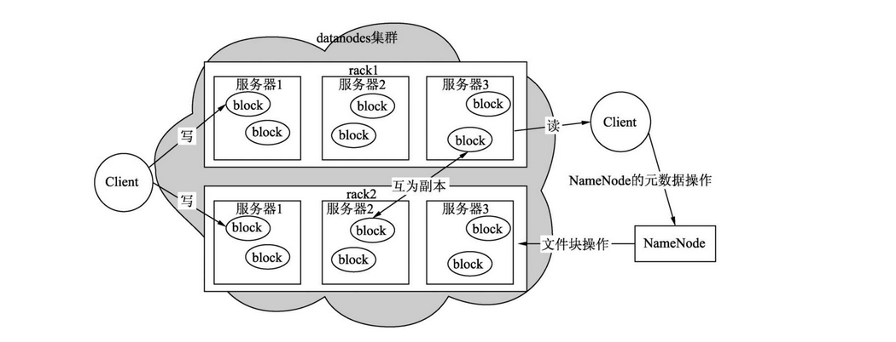
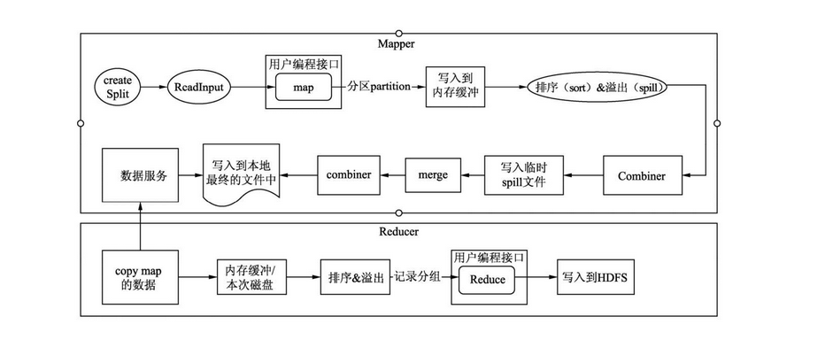
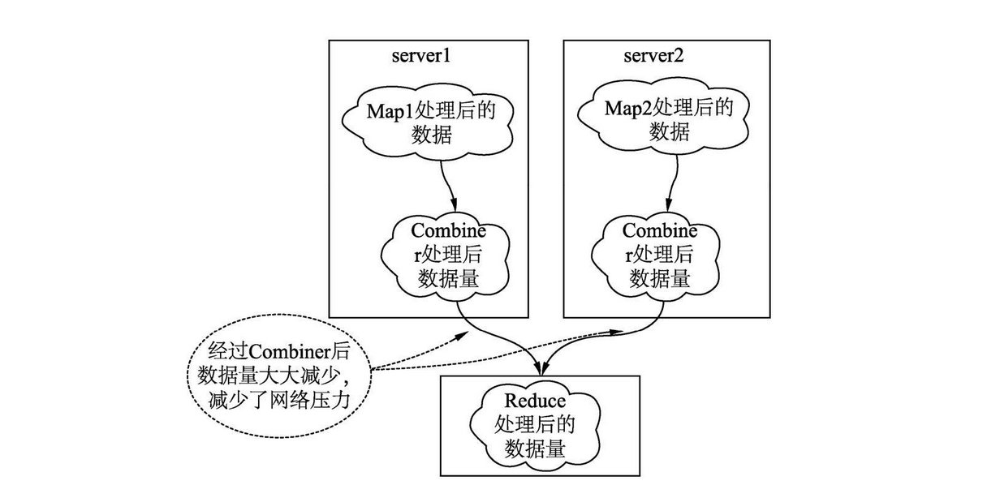
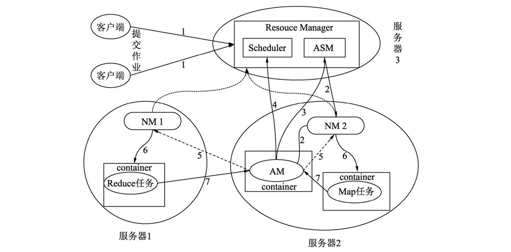
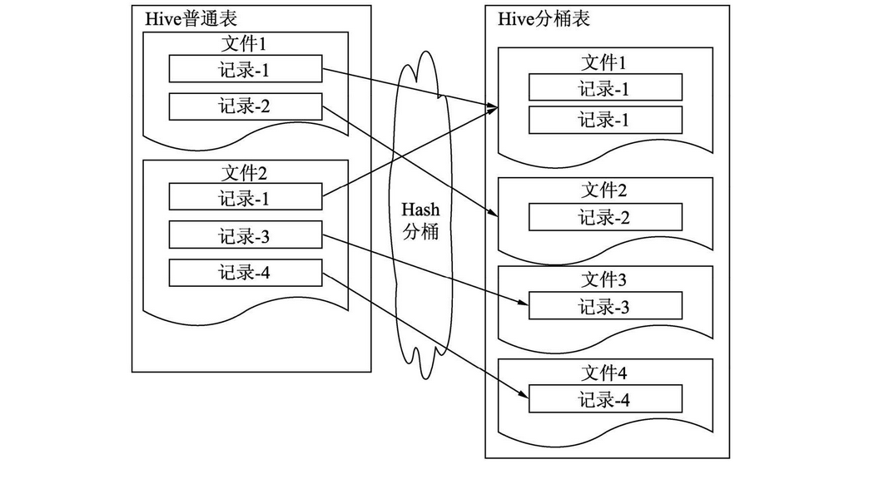
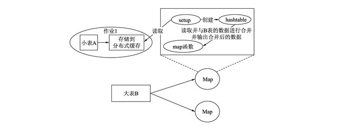
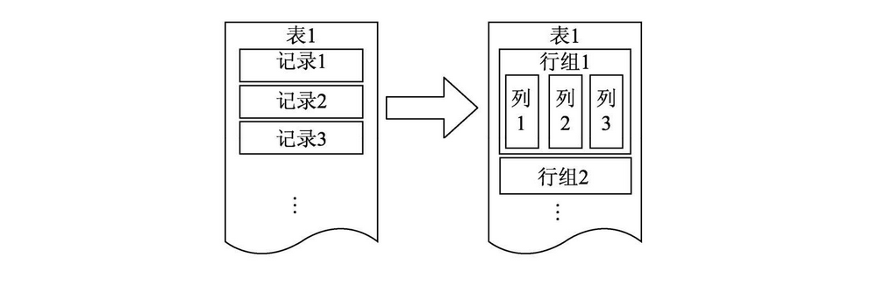
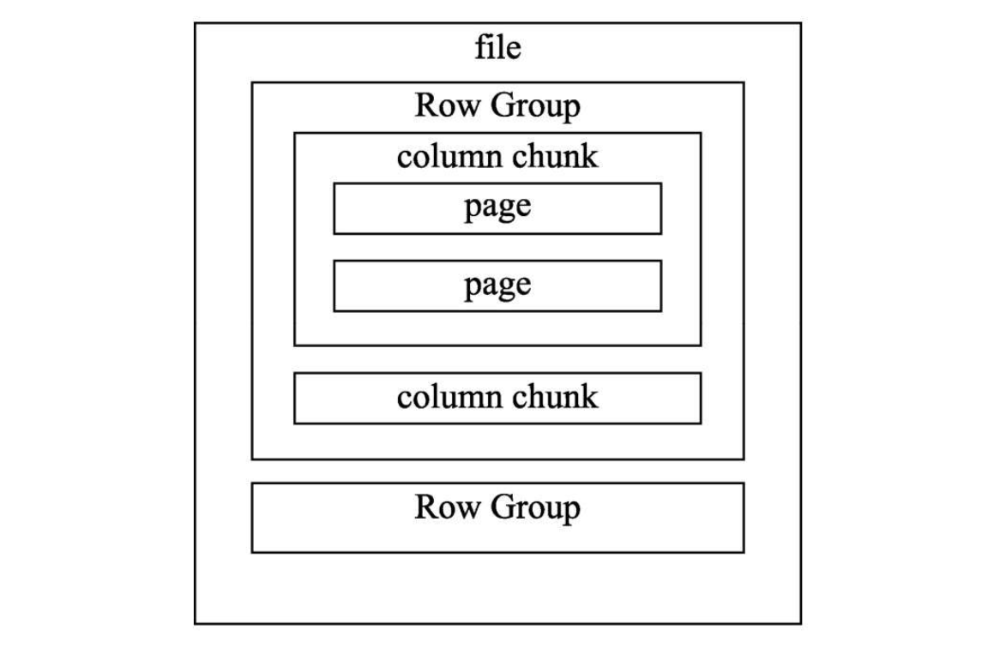

<center><font size='60'>Hive</font></center>

[TOC]

## 1. 架构

### 1.1 HDFS基本架构和读写流程

#### 1.1.1 HDFS基本架构



整个HDFS主要有3个组件：NameNode、DataNode和Client

- Client
  - 与NameNode进行交互，获取文件位置信息和文件块信息
  - 与DataNode进行交互，读取数据文件
  - 访问并管理HDFS集群
- NameNode
  - 管理HDFS的NameSpace，如打开、关闭重命名文件和目录
  - 管理数据块与DataNode的映射关系
  - 处理客户端的读写请求
  - 管理副本的配置策略
- DataNode
  - 处理客户端的读写请求
  - 存储实际的数据
  - 接收NameNode指令创建数据块

#### 1.1.2 HDFS的读流程

1. Client先与NameNode进行交互，获取数据所在DataNode的地址和文件信息
2. Client根据从NameNode得到的信息找到DataNode及对应的文件块，建立socket流
3. DataNode读取磁盘中的文件回传给Client

#### 1.1.3 HDFS的写流程

1. Client先与NameNode通信，表示要写入数据，NameNode会在NameSpace中添加一个新的空文件，并告知Client已经做好写的准备工作。
2. Client接到通知，向NameNode申请DataNode的数据块，NameNode会返回一个数据块，包含所有数据节点所在DataNode的位置信息。
3. Client得到目标数据块，建立socket流，并向目标数据块写入数据

#### 1.1.4 HDFS快速读取模型

​		Client会绕开DataNode自己去读取数据，实现方式是借助Linux操作系统中的Unix Domain Socket技术。在使用这个技术的时候要配置Unix域套接字路径。当DataNode需要读取的数据非常大且读取后数据无法缓存到操作系统的缓存中时，通过配置属性——读取后清除缓冲区中的所有文件，可以提升其他作业的读取效率。

### 1.2 MapReduce整体处理过程

#### 1.2.1 MapReduce运行过程

​		MapReduce作业整体可以分为5大环节：Input—>Mapper —> Shuffle —> Reducer —>Output。



​		MapReduce的完整运行流程：Map在读取数据时，先将数据拆分成若干数据，并读取到Map方法中被处理，数据在输出的时候，被分成若干分区并写入内存缓存（buffer）中，内存缓存被数据填充到一定程度会溢血道磁盘并排序，当Map执行完后会将一个机器上输出的临时文件进行归并存入到HDFS中。

​		当Reduce启动时，会启动一个线程去读取Map输出的数据，并写入到启动Reduce机器的内存中，在数据溢出到磁盘时会对数据进行再次排序。当读取数据完成后会将临时文件进行合并，作为Reduce函数的数据源。

#### 1.2.2作业输入Input

##### 1.2.2.1 InputFormat类

​		作业输入的核心是InputFormat类，用于MapReduce作业的输入规范，读取数据文件的规范。通过继承并实现InputFormat接口，可以读取任何想要读取的数据存储文件的格式。

​		InputFormat涉及3各接口/类：InputFormat、InputSplit、RecordReader

- InputFormat

  - getSplits()方法

    获取逻辑输入分片（InputSplit），逻辑分片用于指定输入到每个Mapper任务的文件大小

  - getRecordReader()方法

    获取记录读取器，记录读取器根据逻辑分配读取文件相应位置的数据，转化为k-v的形式给Mapper处理。

- InputSplit

  - getLength()方法：获取每个分片的大小
  - getLocations()方法：获取每个分片所在的位置

  在获取逻辑分片的时候需要验证文件是否可以分割，文件存储时文件块的大小和文件大小。对于一些压缩文件无法计算分片，会直接读取整个压缩文件。

- RecordReader

  - getCurrentKey()：获取当前的key
  - getCurrentValue()：获取当前的value
  - nextKeyValue()：读取下一个key-value对
  - getProgress()：读取当前逻辑分片的进度

##### 1.2.2.2 Map任务数如何确定

​		调优时不希望生成太多的Map，在Map的启动上消耗太多时间；或者不希望生成太多Map对某个文件进行操作，以免引起资源的争用。

​		在Hive中配置set mapper.map.tasks = task数量 无法控制map任务数，调节map任务数需要一套算法：

1. 在默认情况下Map的个数defaultNum=目标文件或数据的总大小totalSize/hdfs集群文件块的大小blockSize。
2. 当用户指定mapred.map.tasks，即为用户期望的Map大小，用expNum表示，这个期望值计算引擎不会立即采纳，它会获取mapred.map.tasks与defaultNum的较大值，用expMaxNum表示，作为待定选项。
3. 获取文件分片的大小和分片个数，分片大小为参数mapred.min.split.size 和blockSize间的较大值，用splitMaxSize表示，将目标文件或数据的总大小除以splitMaxSize即为真实的分片个数，用realSplitNum表示。
4. 获取realSplitNum与expMaxNum较小值则为实际的Map个数。

```sql
defaultNum=totalSize/blockSize
expNum=mapred.map.tasks
expMaxNum=max(expNum, defaultNum)
splitMaxSize=totalSize/max(mapred.min.split.size, blockSize)
实际的map个数=min(realSplitNum, expMaxNum)
```

优化策略：

- 减少map个数：需要增大mapred.min.split.size 的值，减少mapred.map.tasks的值
- 增大map个数：需要减少mapred.min.split.size  的值，同时增大mapred.map.tasks的值

##### 1.2.2.3 分块与分片的概念

**分块**

​		在HDFS中，为了便于文件的管理和备份，引入分块概念（block）。这里的块是HDFS中的最小单位，默认128MB。

​		上传文件大小大于设置的块的大小，该文件会被切分存储为多个块，多个块可以存放在不同的DataNode上。如果上穿文件只有几k，小于设置块的大小，该文件只占实际大小空间，不会占据整个块空间。

**分片**

​		MapReduce将输入数据划分为等长的小数据块，称为输入分片。MapReduce为每个分片构建一个map任务。

​		通过计算得到，**分片大小不小于blockSize，并且不小于mapred.min.split.size。**默认情况下，以HDFS的一个块大小（128MB）为一个分片，即分片大小等于分块大小。

##### 1.2.2.3 默认分片大小与分块大小相同的原因

​		hadoop在存储有输入数据的节点上运行map任务，可以获得高性能，就是所谓的数据本地化。所以最佳分片的大小应该与HDFS上的块的大小一样，因为如果分片跨越2个数据块，对于任何一个HDFS节点（基本不可能存储这2个数据块），分片中的另外一块数据就需要通过网络传输到map任务节点，与使用本地数据运行map任务相比，效率则更低。

 #### 1.2.3 Hive与Mapper相关的配置

1. hive.vectorized.execution.enabled = false

   默认false，表示是否开启向量模式。在run()方法中，map()方式是逐行处理数据，这样操作容易产生更多的CPU指令和CPU上下文切换，导致系统的处理性能不高。

2. hive.ignore.mapjoin.Hint = true

   默认ture，是否忽略SQL中MapJoin的Hint关键字，不建议使用Hint关键字

3. hive.auto.convert.join = true

   默认true，是否开启MapJoin自动优化

4. hive.mapjoin.smalltable.filesize = 2500000

   默认25MB，如果大小表进行表连接时，小表数据量小于这个默认值，则启动开启MapJoin优化。

5. hive.map.aggr = true

   默认true，是否开启map任务的聚合

6. hive.map.aggr.hash.percentmemory = 0.5

   默认0.5，开启map任务的聚合，聚合所用的哈希表，所能占用到整个map被分配的内存50%，例如：map任务被分配2GB内存，那么哈希表最多只能用1GB

7. hive.mapjoin.optimized.hashtable = true

   默认true，表示使用一种内存优化的hash表做mapjoin。由于该类型的hash表无法被序列化到磁盘，因此该配置只能用于tez或者spark

8. hive.mapjoin.optimized.hashtable.websize = 10485760

   默认10MB，优化的哈希表使用的是一种链块的内存缓存，该值表示一个块的内存缓存大小。这种结构对于数据相对较大的表能够加快数据加载，但是对于数据量较小的表，将会分配多余的内存。

9. hive.map.groupby.sorted = true

   默认true，对于分桶或者排序表，如果分组聚合的键（列）和分桶或者排序的列一致，将会使用BucketizedHiveInputFormat。

10. hive.vectorized.execution.mapjoin.native.enabled = false

    默认false，是否使用原生的向量化执行模式执行MapJoin，它会比普通MapJoin速度快。

11. hive.vectorized.execution.mapjoin.minmax.enabled = false

    默认false，是否使用vector map join哈希表，用于整型连接的最大值和最小值过滤。

    

#### 1.2.4 Hive与Reducer相关配置

1. mapred.reduce.tasks = -1

   默认-1，设置reducer的数量，代表由系统根据需要自行决定reducer的数量。

2. hive.exec.reducers.bytes.per.reducer = 256MB

   默认256MB，设置每个reducer所能处理的数据量

3. hive.exec.reducers.max = 999

   默认999，设置一个作业最大运行的reducer个数

4. hive.multigroupby.singlereducer 

   如果一个SQL语句中有多个分组聚合操作，且分组是使用相同的字段，那么这些分组聚合操作可以用一个作业的reduce完成，而不是分解成多个作业、多个reduce。减少作业重复读取和shuffle的操作。

5. hive.mapred.reduce.tasks.speculative.execution

   表示开启reduce任务的推测执行，即系统在一个reduce任务重执行进度远低于其他任务的执行进度，会尝试在另外的机器上启动一个相同的reduce任务。

6. hive.optimize.reducededuplication

   表示当数据需要按相同的键再次聚合时，则开启这个配置，可以减少重复聚合操作

7. hive.vectorized.execution.reduce.enable = true

   默认true，表示是否启用reduce任务向量化执行模式，mapreduce计算引擎不支持reduce阶段的向量化处理

8. hive.vectorized.execution.reduce.groupbu.enabled = true		

   默认true，是否移动reduce任务分组聚合查询的向量化模式

#### 1.2.5 Shuffle

​		Shuffle过程是从Mapper的map方法输出到Reducer的reduce方法输入的过程，它是制约MapReduce引擎性能的一个关键环节。

​		在Mapper的map方法中，context.write()方法会将数据计算所在分区后写入到内存缓冲区，缓冲区的大小为mapreduce.task.io.sort.mb=100MB。当缓冲区缓存的数据达到一定的阈值mapreduce.map.sort.spill.percent=0.8，即总缓冲区的80%时，将会启动新的线程将数据写入到HDFS临时目录中。这样设计的目的在于避免但行数据频繁写，以减轻磁盘的负载。这与关系型数据库提倡批量提交有相同的作用。

​		在写入到HDFS的过程中，为了下游Reducer任务顺序快速拉取数据，会将数据进行排序后再写入临时文件中，当整个Map执行结束会将临时文件归并成一个文件。如果不进行文件的排序归并，意味着下游Reducer任务拉取数据会频繁地搜索磁盘，即将顺序读变为随机读，这会对磁盘I/O产生极大的负载。

​		Reducer任务启动后，会启动拉取数据的线程，从HDFS拉取所需要的数据。为什么不选用Mapper任务结束后直接推送到Reducer节点，这样可以节省写入到磁盘的操作，效率更高？因为采用缓存到HDFS，让Reducer主动来拉，当一个Reducer任务因为一些其他原因导致异常结束时，再启动一个新的Reducer依然能够读取到正确的数据。

​		从HDFS拉取的数据，会先缓存到内存缓冲区，当数据达到一定的阈值后会将内存中的数据写入内存或者磁盘中的文件里。当从HDFS 拉取的数据能被预先分配的内存所容纳，数据会将内存缓存溢出的数据写入该内存中，当拉取的数据足够大时则会将数据写入文件，文件数量达到一定量级进行归并。

#### 1.2.6 Map端聚合Combiner

​		Combiner针对Map阶段处理后的数据进行聚合，也称之为Map的聚合。如果不额外进行编写，则直接使用Reducer的逻辑，聚合的地方是在Mapper任务所在的服务器。

​		使用Combiner的初衷是减少Shuffle过程的数据量，减轻系统的磁盘和网络的压力。



​		Hive提供了另一种聚合方式——使用散列表，即在每个Mapper中直接使用散列表进行聚合，而不是另起combiner聚合任务，这样避免另起一个任务和额外的数据读写所带来的开销。散列表，可以类比Java中的HashMap。

**Hive相关配置：**

1. hive.map.aggr = true

   默认true，表示开启map端的聚合，查看执行计划，启用combiner，会在map阶段多多出一个groupby操作

2. hive.map.aggr.hash.min.reduction = 0.5

   默认0.5，控制是否启用聚合的阈值

3. hive.groupby.mapaggr.checkinterval = 100000

   默认100000，hive启用combiner时会尝试取这个配置对应的数据进行聚合，将聚合后的数据除以聚合前的数据，如果小于hive.map.aggr.hash.min.reduction会自动关闭。

4. hive.map.aggr.hash.percentmemory = 0.5

   默认0.5，表示在进行map端的聚合占用的最大内存。例如，分配给该节点的最大堆（xmx）为1024MB，那么聚合所能使用的最大hash表内存为512MB

5. hive.map.aggr.hash.force.flush.memory.threshold = 0.9

   默认0.9， 表示当聚合时，所占用的hash表内存超过0.9，将触发hash表刷写磁盘操作。例如Hash表内存是512MB，当Hash表的数据内存超过461MB时将触发Hash表写入到磁盘的操作。

#### 1.2.7 作业输出Output

​		MapReduce作业输出包括两部分，一部分是Map阶段的输出，另一部分是Reduce阶段输出，主要用于检查作业的输出规范，并将数据写入存储文件中。

##### 1.2.7.1 输出文件压缩问题

​		输出文件的压缩，可以减少在shuffle过程的数据量，减轻磁盘和网络的负载，但是有压缩就会有解压缩，免不了性能损耗，一般在大型作业中才会开启文件作业的压缩。set hive.exec.compress.intermediate = true

##### 1.2.7.2 合并执行过程中产生的小文件

1. hive.merge.mapfile = true

   默认启用，合并只有map任务作业的输出文件

2. hive.merge.mapredfile = true

   默认启用，合并mapreduce作业最终的输出文件

3. hive.merge.smallfiles.avgsize = 16MB

   默认16MB，当输出文件小于该值时，启用一个mapreduce任务 合并小文件

4. hive.merge.size.pre.task = 256MB

   默认256MB，是每个任务合并后文件的大小，一般设置为HDSF集群的文件块大小。

#### 1.2.8 Hive相关配置

1. hive.optimize.countdistinct = true

   默认true，Hive3.0新增的配置项。当开启该配置项时，去重并计数的作业会分成两个作业来处理这类SQL，以达到减缓SQL的数据倾斜作用。

2. hive.exec.parallel = flase

   默认False，是否开启作业的并行。如果一个SQL被拆分成两个阶段，如stage1、stage2，假设这两个stage没有直接依赖关系，还是会采用串行的方式执行两个阶段。如果开启该配置，则会同时执行两个阶段。在资源较为充足的情况下开启该配置可以有效节省作业的运行时间。

3. hive.exec.parallel.thread.num = 8

   默认8，表示一个作业最多运行8个作业同时并行执行

4. hive.exec.model.local.auto = false

   默认false，表示是否开启本地的执行模式。开启该配置表示Hive会在单台机器上处理完所有的任务，对于处理数据量较少的任务可以有效地节省时间。

5. hive.exec.model.local.auto.inputbytes.max = 134217728

   默认值128MB，表示作业处理的数据量要小于该值，本地模式

6. hive.exec.model.local.auto.input.files.max = 4

   默认4，表示作业启动的任务数必须小于或者等于该值，本地模式才能有效。

7. hive.optimize.correlation = false

   相关性优化，打开该配置可以减少重复的Shuffle操作。

   ```sql
   SELECT t1.key, sum(value) 
   FROM t1 JOIN t2 ON (t1.key = t2.key) GROUP BY t1.key
   ```

   执行上面SQL时，Join操作和Group by操作通常都会产生shuffle的操作，但是由于Join阶段操作后输出的结果是作为GROUP BY阶段操作的输入，并且在JOIN操作时，数据已经按t1.Key分区，因此通常情况下GROUP BY操作没有必要为t1.key进行重新Shuffle。


### 1.3 Yarn的工作流程

#### 1.3.1 Yarn的基本组成

​		Yarn由一个ResourceManager与多个NodeManager组成。ResourceManager负责对NodeManager所持有的资源进行统一管理和调度。当在处理一个作业时ResourceManger会在NodeManager所在节点创建—全权负责单个作业运行和监控程序ApplicationsMaster。

- ResourceManager（RM）

  资源管理器负责整个集群资源的调度，该组件由两部分构成：调度器（Scheduler）和ApplicationMaster（简称ASM）。

  调度器会根据特定调度器实现调度算法，结合作业所在队列资源容量，将资源按调度算法分配给每个任务。分配的资源将用容器（container）形式提供，容器是一个相对封闭独立的环境，已经将CPU、内存及任务运行所需环境条件封装在一起。通过容器可以很好地限定每个任务使用的资源量。Yarn调度器在生成环境中使用较多的有2种：能力调度器（Capacity Scheduler）和公平调度器（Fair Scheduler）

- ApplicationMaster（AM）

  每个提交到集群的作业（job）都会有一个与之对应的AM来管理。它负责进行数据切分，并为当前应用程序向RM去申请资源，当申请到资源时会和NodeManager通信，启动容器并运行相应的任务。此外，AM还负责监控任务（task）的状态和执行的进度。

- NodeManage（NM）

  NodeManager负责管理集群中单个节点的资源和任务，每个节点对应一个NodeManager，NodeManager负责接收ApplicationMaster的请求启动容器，监控容器的运行状态，并监控当前节点状态及当前节点的资源使用情况和容器的运行情况，并定时汇报给ResourceManager。

#### 1.3.2 Yarn的工作流程



1. 客户端向Yarn提交一个作业（Application）
2. 作业提交后，RM根据从NM收集的资源信息，在有足够资源的节点分配一个容器，并与对应的NM进行通信，要求它在容器中启动AM。
3. AM创建成功后向RM中的ASM组册自己，表示自己可以去管理一个作业（job）
4. AM注册成功后，会对作业需要处理的数据进行切分，然后向RM申请资源，RM会根据给定的调度策略提供给请求的资源给AM。
5. AM成功申请到资源后，会与集群中的NM通信，要求它启动任务
6. NM接收到AM的要求后，根据作业提供的信息，启动对应的任务
7. 启动后的每个任务会定时向AM提供自己的状态信息和执行的进度
8. 作业运行完成后AM会向ASM注销和关闭自己。


spark，hive的执行过程

## 2.Hive性能优化

### 2.1 Hive性能问题排查方式

​		性能排查方式主要有3种：使用explain查看执行计划、查看Yarn提供的日志、Web UI作业分析工具。

​		执行计划提供的是定性优化依据，Yarn日志提供的是一个定量优化依据

​		Hive的执行计划都是预测的，不像Oracle有真实的计划，可以看到每个阶段的处理数据、消耗的资源和处理的时间等量化数据。Hive提供的执行计划没有这些数据，这意味着虽然Hive的使用者知道整个SQL的执行逻辑，但是各阶段用的资源状况和整个SQL的执行瓶颈在哪里是不清楚的。

​		想要知道HiveSQL所以阶段的运行信息，可以查看Yarn提供的日志。查看日志链接，可以在每个作业执行后，在控制台打印的信息中找到。

#### 2.1.1 如何排查长时等待调度

​		通过Yarn提供的Job OverView的日志，观察Submitted和Stated的启动间隔。

​		如果间隔较长，需要观察所在队列的资源使用是否过载，如果该时段资源使用较高，可以考虑将作业换一个在该阶段资源使用较少的队列，或者更改一个时间段再提交到该队列。


### 2.2 HiveSQL 执行计划

### 2.3 数据倾斜

#### 2.3.1 什么是数据倾斜

​		Hive处理的数据分布不均匀，导致某一个或几个节点处理的数据量巨大，就会造成数据倾斜。具体表现是，整个任务进度长时间处于99%附近，在yarn的任务详情页面发现大部分reduce都运行完成，只有一个或几个reduce任务在长时间执行，是由于该reduce任务处理的数据量远远大于其他任务。

#### 2.3.2 数据倾斜的原因及解决方法

​		在实际项目中，主要三种情况会遇到数据倾斜，分别是join操作、group by操作和count distinct操作

**1.Join倾斜**

**（1）大表Join小表**

- 倾斜原因

  主要是热点key导致，在shuffle过程中，相同的key会基于hash分发到同一个reduce算子上，导致join时倾斜。

- 解决方法

  开启map端join：set hive.auto.convert.jon = true; 默认是打开的。

  - 开启该设置后，join时会在map端将小表缓存到内存中（缓存为hash table），在map端执行join
  - 小表默认是1000行或者25Mb大小，可以通过设置参数提高小表的阈值：set hive.mapjoin.smalltable.filesize=25000000;

**（2）大表Join大表**

​		当两个表都非常大，无法直接加载到内存中，那么需要评估join key的分布是否均匀。

**情况一：当key分布均匀**

​		就不是倾斜的范畴了，需要考虑增加reduce数量等其他调优手段

**情况二：当key分布不均匀**

- 倾斜原因

  跟大表join小表倾斜原因差不多，存在热点key，或者大量无用的空key，导致倾斜。

- 解决方法

  - 运行时优化

    采用skewjoin（倾斜关联）开启对倾斜数据join的优化：set hive.optimize.skewjoin=true；然后可以设置join倾斜阈值：set hive.skewjoin.key=100000；当join的key对应的记录条数超过100000，就认为这个key发生了数据倾斜，会对其分拆优化。

  - 编译时优化

    通过设置：set hive.optimize.skewjoin.compiletime=true；可以在编译SQL时将执行计划优化完成。但是这个需要在建表时指定数据倾斜元数据信息

  - 一般情况

    运行时优化和编译时优化都同时开启，并且要开启union优化：set hive.optimize.union.remove=true；

  - 其他

    除了以上三个参数，还可以通过子查询剔除空key、空key转为随机字符串、大表拆分为小表分别join在union等方式进行优化

**2.Group By倾斜**

- 倾斜原因

  map阶段相同的key会分发到同一个reduce端聚合，热点key导致group by聚合倾斜

- 解决方法

  - 开启map端聚合

    set hive.map.aggr = true；默认开启，这个设置会提前在map端聚合，减少数据传输及在reduce阶段的处理时间。通过set hive.groupby.mapaggr.checkinterval = 100000；设置在map端聚合操作的条数。当大于该值时，才会进行map端聚合。

  - 开启负载均衡

    set hive.groupby.skewindata = true；该设置会在数据出现倾斜时，将一个group by的执行计划拆分为两个阶段MR，第一阶段将key随机分发到不同reduce进行聚合，然后第二阶段MR会基于前一阶段预处理的结果，将相同的key分发到同一个reduce算子，执行聚合操作

**3.Count distinct倾斜**

- 倾斜原因

  所有key会分发到同一个reduce进行去重统计个数，数据量较大时导致运行时间过长

- 解决方法

  将count distinct改写为group by的写法。目的是增加一个MR操作


#### 2.3.3 shew join的优化原理

### 2.4 SQL优化

### 2.5 参数优化

## 3.Hive SQL语法详解

​		Hive SQL语法多种多样，但从数据处理的角度来说，这些语法本质上可以被分成3中模式，即过滤模式、聚合模式、和连接模式。

​		过滤模式，即对数据的过滤，从过滤的粒度来看，分为数据行过滤、数据列过滤、文件过滤和目录过滤4种方式。这4种过滤方式都有显示关键字表示，例如：where、having等，也有隐式过滤，例如列式文件、物化视图等。

​		聚合模式，即数据的聚合，数据聚合的同时也意味着在处理数据过程中存在Shuffle的过程。Shuffle过程需要特别注意。

​		连接模式，即表连接的操作，这类操作分为两大类：有Shuffle的连接操作和无Shuffle的连接操作。这两个类型都有优缺点，但只要涉及表连接都需要特别注意，因为表连接常常是程序性能的瓶颈点。

### 3.1 过滤模式

​		过滤常用方法：where子句过滤、having子句过滤、distinct命令过滤、表过滤、分区过滤、分桶过滤、索引过滤、列过滤。

#### 3.1.1  where子句过滤

​		where子句发生在Map端，Map端的任务在执行时会尽可能将计算逻辑发送到数据所在的机器中执行，这时候可以利用分布式计算的优点，多机同时执行过滤操作，快速过滤掉大量的数据。如果能够在Map端过滤掉大量的数据，就可以减少跨机器进行网络传输到Reducer端的数据量，从而提升Map后面环节的处理效率。

**优化策略**：对于一个作业应尽量将其放在前面环节进行数据过滤，对于一个由几个大的作业组成的任务，为了提升整体的效率，也应尽可能地让前面的环节过滤掉大量非必须的数据。

**举例**：对于一个HiveSQL脚本，通常由多个作业组成，转换成MapReduce任务，表示为：Map1-Reduce1-Map2-Reduce2...-MapN-ReduceN。如果能够在前面的Map或者Reduce中过滤掉大量的数据，就有利于减少后面作业的处理和传输的数据量。

```sql
select count(s_age) 
from 
(
	select s_age, count(1) num
  from student_tb_seq
  group by s_age
) a
where s_age <30 and num>20

# 处理后的例子代码如下：
select count(s_age) 
from 
(
  select s_age, count(1) num
  from student_tb_seq
  where s_age<30
  group by s_age
  having count(1)>20
) a
```

#### 3.1.2 having子句过滤

​		having子句过滤发生在数据聚合后，在MapReduce引擎中表示在Reduce阶段进行having子句的条件过滤。

​		查看执行计划，having子句所对应的过滤操作（Filer Operator）发生在Reduce Operator和Group By Operator两个操作之后，即在Reduce阶段进行分组聚合做数据过滤。

#### 3.1.3 distinct子句过滤

​		distinct子句用于列投影中过滤重复的数据，在Hive中其实也是发生在Reduce阶段。

​		查看执行计划，Hive的distinct去重会在Reduce阶段使用Group By Operator操作将其转化成分组聚合的方式，分组的列key._col0就是s_age列。

​		hive中distinct和group by Reduce执行计划基本一致

```sql
explain
select distinct s_age
from student_tb_seq
# 等价于
explain
select s_age
from student_tb_seq
group by s_age
```

优化策略：使用分组聚合的方式不是Hive去重的唯一方式，有时Hive还会用Hash表进行去重。

#### 3.1.4 表过滤

​		表的过滤是指过滤同一个SQL语句需要多次访问相同的数据，将重复的访问操作过滤掉并压缩成只读一次。表过滤的常用操作就是使用multi-group-by语法替换多个查询语句求并集的句式。

```sql
set hive.exec.dynamic.partition=true;
set hive.exec.dynamic.partition.mode=nonstrict;
explain
insert into table student_stat partition(tp)
select s_age, max(s_birth) stat, 'max' tp
from student_tb_seq
group by s_age
union all
select s_age, min(s_birth) stat, 'min' tp
from student_tb_seq
group by s_age;
```

​		执行计划主要有3个stage，计算最大值和最小值在Map阶段都会进行一次表扫描（TableScan）的操作，存在重复读取表数据的操作，如果一次读取的数据比较大时会占用更多的磁盘I/O资源。

优化策略：为了避免这种情况的发生，Hive引入from...selsect形式，查询的表在一次读取后，可以被多个查询语句使用。

使用multi-group-by-insert语法：

```sql
set hive.exec.dynamic.partition=true;
set hive.exec.dynamic.partition.mode=nonstrict;
explain
from student_tb_seq
insert into table student_stat partition(tp)
select s_age, min(s_birth) stat, 'max' stat
group by s_age
insert into table  student_stat partition(tp)
select s_age, max(s_birth) stat, 'min' stat
group by s_age;
```

​		从执行计划可以看到，只需要一次读取，就可以完成所有的计算。

#### 3.1.5 分区过滤

​		在HiveSQL里面分区过滤使用的方式是在where子句新增分区列的筛选条件。看起来和where子句的过滤方式一致，其实两者是不一样的，普通where子句的过滤是在Map阶段，增加判断条件可以剔除不满足条件的数据行，而分区列筛选其实是在Map的上一个阶段，即输入阶段进行路径的过滤。

​		分区能够在Map之前的更早阶段进行数据过滤，其实得得益于分区表存储格式，每个分区在分布式文件系统中是以目录形式存在，一个分区对应一个目录。

​		在构建整个作业之初，在FlieInputFormat中设置分区的路径时，不符合条件的路径直接略过不会读取，所以分区能从一开始就进行数据的过滤。

#### 3.1.6 分桶过滤

​		分桶表：分桶和分区一样，也是一种通过改变表的存储模式，从而完成对表优化的一种调优方式，但和分区不同的是，分区是将表拆分到不同的子目录中进行存储，而分桶是将表拆分到不同的文件中进行存储。

​		分桶操作目的：改变数据的存储分布，提升查询、取样、Join等特定任务的执行效率。

```sql
drop table if exists tbl_buckets;
create table tbl_buckets(
	id int,
	name string
)
clustered by(id) 
sorted by (id desc) -- 分桶时，数据默认按照分桶键升序排列
into 4 buckets
stored as textfile
;
```

​		使用分桶的方式能够快速过滤掉大量不需要遍历的文件。

​		每个记录存储到桶的算法如下：记录所存储的桶=mod(hash(分桶列的值), 4)，其中hash表示Hash函数，获取分桶列的值对应的hash值，mod表示取余函数。

下图是将Hive普通表划分成Hive桶表



​		Hive会将上面计算得出的相同的值存储在一起，如果在进行数据查询的时候，查询字段带有分桶的字段，则能够定位到符合条件记录所在的文件，避免了需要扫描所有文件块，这对于含有几万、几十万个文件的大表，可以极大缩短读取数据的时间，同时也有助于在Map端的表连接。		

#### 3.1.7 索引过滤

​		Hive的索引在Hive 3.0版本中被废弃，可以使用两种方法进行替换：

- 物化视图（Materialized views）

  通过使用物化视图，可以达到类似Hive索引的效果，该特性在Hive 2.3.0版本中引入

- 使用ORC/Parquet的文件格式存储

  能够实现类似索引选择性扫描，快速过滤不需要遍历的block，这是比分桶更为细粒度的过滤

#### 3.1.8 列过滤

​		在SQL中使用select对字段进行过滤。但是Hive存的数据是在HDFS中，如果不使用特殊的数据存储格式，在进行列筛选时，通常需要先取整行的数据，再通过列的偏移量取得对应的列值，这个过程对HiveSQL的使用者来说是透明的。

​		在ORC/Parquet中存储列文件定义的Schema，ORC/Parquet可以通过Schema直接读取表所在的列，以达到列过滤的目的。

​		使用MR的Map任务处理ORC文件，Map阶段的map()方法会接收key为NullWritable，Value为OrcStruct类型，OrcStruct已经包含了需要查询数据对应的schema，可以直接通过getFieldValue方法获取所需要的字段值，而不需要将数据的所有字段读取出来后按间隔符合进行切分，再获取对应偏移量的值。

### 3.2 聚合模式

​		聚合模式，即将多行的数据缩减成一行或者少数几行的计算模式。通过聚合模式，可以在整个计算流程的前面快速过滤掉作业中传输的数据量，使得计算流程的后续操作中的数据量大为降低，适当提高了程序的运行效率。

​		存在两种情况会导致聚合模式运行效率低下：

- 数据分布出现极大的不均匀现象

  数据分布不均引起计算时出现的数据倾斜，将导致集群中的某个节点需要处理大量的数据

- 大量的数据无法在前面的流程中处理

  后面的流程又需要先收集部分甚至全部的数据才能进行处理，或者采用一种特别消耗内存空间的算法，导致整个下游程序需要占用极大的内存资源、磁盘I/O资源，甚至要求资源大于一个服务器所能承载的内存。

常见的聚合模式：distinct模式、count计算的聚合模型、数值相关的聚合模式、行转列的聚合模式

#### 3.2.1 distinct模式

​		在hive中使用distinct，如果开启hive.map.aggr = true，使用distinct，会在前面流程中进行数据聚合，减少数据流转到下游，减少下游处理的数据量。

开启Map端聚合的去重SQL：

```sql
set hive.map.aggr=true;
select distinct s_score
from student_tb_orc
```

​		在map阶段按s_age的列进行分组聚合，最后输出不重复的s_age值。在reduce阶段进行数据全局聚合。

#### 3.2.2 count(列)、count(*)、count(1)行计数聚合模型

​		在hive中进行行数统计有count(列)、count(*)、count(1)几种写法，这几种写法在实际执行有一定的差异，结果也不太一样。

- count(列)

  如果列中有null值，那么这一列不会被记入统计的行数。另外，hive读取数据进行计算时，需要将字节流转化为对象的序列化和反序列化的操作。

- count(*)

  不会出现count(列)在行是null值的情况下，不计入行数的问题。另外， count(*)在进行数据统计时不会读取表中的数据，只会使用到HDFS 文件中每一行的行偏移量。该偏移量是数据写入HDFS文件时，HDFS添加的。

- count(1)

  和count(*)类似

**策略优化**：count(*)和count(1)的性能会更占优。当然，在不同数据存储格式里，上面结论不一定成立。例如，在ORC文件中，count算子可以直接读取索引中的统计信息，三者最后的表现性能差异不大

#### 3.2.3 可计算中间结果的聚合模式

​		在计算大量数据时，数据可以进行局部归并汇总，如果允许中间计算流程进行局部汇总，则中间数据传输量极少，最后的数据结果仅为有限的几条。

​		这种聚合模式是非常高效的模式，大量的数据在前面的流程已经被处理，之后的处理流程所消耗的网络等其他硬件资源非常少。

​		常见的数值聚合模式的函数有：sum、max、min、avg、varicance()、var_pop()、stddev_pop()、stddev_samp()

#### 3.2.4 不可计算中间结果的聚合模式

​		通常将多行的数据聚合到一行中，该行含有多行的所有明细数据的计算模式称为不可汇总。容易产生数据倾斜。

​		方法有：collect_list()、collect_set()

​		执行计划：map阶段按照指定的列，进行局部聚合，map阶段reduce output operator中value express输出的是一个集合数组。reduce阶段进行数据全局聚合

### 3.3 连接模式

​		根据数据连接发生的地方将连接模式分为2种：

- Repartition连接，发生在Shuffle和Reduce阶段

  如果不特别声明，通常提到的连接就是Repartition连接。

  

  Map任务读取A、B两个表的数据，将按连接条件发往相同的Reduce，在Reduce中计算合并的结果。

- Replication连接，发生在Map阶段

  Replication连接在Map阶段完成连接操作，相比发生在Shuffle阶段的Repartition连接，可以减少从HDFS读取表的次数，可以在Map阶段实现连接时不配条件的记录行的过滤，减少下游网络传输的数据量和下游计算节点处理的数据量。

​		**Replication连接在操作时会将一个表的数据复制到各个Map任务所在的节点并存储在缓存中**，如果连接的两个表都是数据量庞大的表，将会带来较大的性能问题，Replication连接仅适用于两表连接中有一张小表的情况。

Replication连接根据实现的不同表连接可以分为：

- 普通的MapJoin

  对使用的类型无特殊限制，只需要配置相应的Hive配置

- Bucket MapJoin

  要求使用的表为桶表

- Skewed MapJoin

  要求使用的表为倾斜表

- Sorted Merge Bucket MapJoin

  要求使用的表为桶排序表

#### 3.3.1 普通Map连接



​		MapJoin是先启动一个作业，读取小表的数据，在内存中构建哈希表，将哈希表写入本地磁盘，然后将哈希表上传到HDFS并添加到分布式缓存中。再启动一个任务读取B表的数据，在进行连接时Map会获取缓存中的数据并存入到哈希表中，B表会与哈希表的数据进行匹配，时间复杂度是O(1)，匹配完后会将结果进行输出。

使用common map join的方式：

- 使用mapjoin 的hint语法

  关闭hint的配置项，否则该方法不会生效：set hive.ignore.mapjoin.hint = false。

  在生产环境中，不建议使用hint语法，无法根据当时的情况做出相应的调整。例如，随着公司业务数据量的激增，导致原来小数据量的表数据极速增加，使用过hint关键字强行进行map join，该程序的运行效率会急剧下降，最坏情况下，会发生内存溢出（Out of Memory，OOM）

- 使用Hive配置mapjoin

  - hive.auto.convert.join = ture

    默认值true，表示是否根据文件大小将普通repartition连接转化为Map连接

  - hive.mapjoin.smalltable.filesize = 25000000

    默认值为25000000（bytes）25MB，当小表的数据小于该配置指定的阈值时，将尝试使用普通repartition连接转化Map连接。该配置要与hive.auto.convert.join配合使用。

#### 3.3.2 桶的Map连接和排序合并桶的Map连接

​		桶的map连接（bucket map join）将普通的map连接转化为桶连接方式。分桶的hive表会将桶列的值计算hash值取桶数的模，余数相同的会发往相同的桶，每个桶对应一个文件。通过这种方式实现一定的数据聚集，在两个表进行连接时，可以快速过滤掉不要的数据，以提升性能。


注意：使用桶的map连接要保证连接的两张表的分桶数之间是倍数关系。

​		排序合并桶Map连接（Sortd Merge Bucket Map Join，SMB Join）在原来的桶表基础上，对数据进行排序，将原来的连接转变为排序连接，提升连接效率。

​		使用SMB Join，在创建表的时候指定排序：

```sql
# 使用SORTED BY将普通的student_orc_bucket桶表改造为有序桶表
CREATE TABLE `student_orc_bucket_sorted`(
	`s_no` string,
  `s_name` string,
  `s_birth` string,
  `s_age` bigint,
  `s_sex` string,
  `s_score` bigint,
  `s_desc` string
)
CLUSTERED BY (s_age) SORTED BY (s_age ASC)  INTO 16 BUCKETS
STORED AS ORC;
```

启动如下配置：set hive.enforce.sortmergebucketmapjoin = true

#### 3.3.3 倾斜连接

​		有数据倾斜键时的表连接。出现数据倾斜时，会引起个别任务花大量时间和资源在处理倾斜键的数据，从而变为整个作业的瓶颈。Skew Join在工作时会将数据分为两部分：一部分是倾斜数据，一部分是余下的所有数据，由两个作业分别处理。


​		在hive中使用倾斜连接的方式：

```sql
set hive.optimize.skewjoin=true;
set hive.skewjoin.key=100000;
explain
select a.s_score, b.s_no 
from student_tb_orc a  
inner join student_orc_bucket b ON a.s_score = b.s_score
;
```

上面的方式在运行时数据分为两种类型的数据。

创建倾斜表，创建表时指定数据倾斜键，将指定的数据键分割成单独的数据文件或目录，这样可以加快数据过滤从而提升作业的运行速度。

```sql
--创建倾斜表student_list_bucket表
CREATE TABLE student_list_bucket (s_no STRING, s_score bigint)
--指定倾斜的键
SKEWED BY (s_score) ON (99,97)
--以目录形式存储倾斜的数据
STORED AS DIRECTORIES;
```

Skewed Join相关配置：

- hive.optimize.skewjoin = false

  默认值false，表示是否优化有倾斜键的表连接。如果为true，Hive将为连接中的表的倾斜键创建单独的计划

- hive.skewjoin.key = 100000

  默认值100000，如果在进行表连接时，相同键的行数多于该配置所指定的值，则认为该键是倾斜连接键

- hive.skewjoin.mapjoin.map.tasks = 10000

  默认值10000，倾斜连接键在做map join的map任务个数。需要与hive.skewjoin.mapjoin.min.split一起使用

- hive.skewjoin.mapjoin.min.split = 33554432

  默认值33554432，即32MB，指定每个split块最小值，该值用于控制倾斜连接的map任务个数。

- hive.optimize.skewjoin.compiletime = false

  默认值false，表示是否为连接中的表的倾斜键创建单独的计划。这是基于存储在元数据（metadata）库中的倾斜键，在编译时，执行计划被分解成不同的连接：一个用于倾斜键，另一个用于剩余键。然后，对上面生成的两个连接执行union。因此，除非在两个连接表中都存在相同的倾斜键，否则倾斜键的连接作为MapJoin执行。如果元数据库中不存在倾斜键的信息，即使该配置为true，也不会对编译时的执行计划做任何影响。

## 4.数据存储

​		Hive数据存储支持的格式有文件格式（TextFile）、二进制序列化文件（SequenceFlie）、行列式文件（RCFlie）、ApacheParquet和优化的行列式文件（ORCFile）。其中，ORCFile和Apache Parquet以其高效的数据存储和数据处理性能在实际生产环境大量使用。

### 4.1 文件存储格式ORC

​		ORC存储的文件是一种带有模式描述的行列式存储文件，ORC将数据先按行组进行切分，一个行组内部包含若干行，每一行组再按列进行存储。



​		传统的行式数据库，数据按行存储，在没有索引的情况下，如果要查询一个字段，需要将整行的数据查出来，再找到相应的字段，这样的操作是比较消耗I/O资源。

​		Hive建立索引是一项比较消耗集群资源的工作，并且需要时刻关注是否更新。数据如有更新，就需要对索引进行重建。数据有更新却没有及时重建或者完了重建，则会引发使用过程的异常。正是建立Hive的索引成本高，又极容易引发异常，所以在实际生产中，Hive索引很少被用到。

​		相对比行式存储，**列式存储的数据则是按列进行存储，每一列存储一个字段数据，在进行数据查询时就好比走索引查询，效率较高**。但是如果需要读取所有的列，列式存储需要花费比行式存储更多的资源，因为行式存储读取一条数据只需要一次I/O操作，而列式存储则需要花费多次，列数越多消耗的I/O资源越多。

​		ORC的行列存储结构结合了行式和列式存储的优点，在有大量数据扫描读取时，可以按行组进行数据读取。如果要读取某个列的数据，则可以在读取行组的基础上，读取指定的列，而不需要读取行组内所有行的数据及一行内所有字段的数据。

#### 4.1.1 ORC文件结构

ORC文件结构由3部分组成：

- 条带（stripe）

  ORC文件存储数据的地方

  - index data：保存了所在带的一些统计信息，以及数据在stripe中的位置索引信息
  - rows data：数据存储的地方，由多个行组构成，数据以流（stream）的形式进行存储
    - metadata stream：用于描述每个行组的元数据信息
    - data stream：存储数据的地方
  - stripe footer：保存数据所在文件目录

- 文件脚注（file footer）

  包含了文件中stripe的列表，每个stripe的行数，以及每个列的数据类型。还包含每个列的最小值、最大值、行计数、求和等聚合信息

- postscript

  含有压缩参数和压缩大小相关的信息

  

ORC在每个文件中提供了3个级别的索引

- 文件级：这一级的索引信息记录文件中所有stripe的位置信息，以及文件中所存储的每列数据的统计信息。
- 条带级别：该级别索引记录每个stripe所存储数据的统计信息
- 行组级别：在stripe中，每10000行构成一个行组，该级别的索引信息就是记录这个行组存储的数据的统计信息。

查询ORC文件类型的表时，会先读取每一列的索引信息，将查找数据的条件和索引信息进行对比，找到满足查找条件的文件。接着根据文件中的索引信息，找到存储对应的查询条件数据stripe，再借助stripe的索引信息读取文件中满足查询条件的所有stripe块。之后再更加stripe中每个行组的索引信息和查询条件比对的结果，找到满足要求的行组。

#### 4.1.2 ACID事务的支持

​		ORC文件支持ACID事务，保证原子性、一致性、隔离性和持久性，对数据更新操作成为可能。

​		Hive的事务设计成每个事务适用于更新大批量的数据，而不建议用事务频繁地更新小批量的数据。

创建Hive事务表的方法：

```sql
--（1）设置hive环境参数
--开启并发支持，支持插入、删除和更新的事务
set hive.support.concurrency=true;
--支持ACID事务的表必须为分桶表
set hive.enforce.bucketing=true;
--开启事物需要开启动态分区非严格模式
set hive.exec.dynamic.partition.mode=nonstrict;
--设置事务所管理类型为org.apache.hive.ql.lockmgr.DbTxnManager
--原有的org.apache.hadoop.hive.ql.lockmgr.DummyTxnManager不支持事务
set hive.txn.manager=org.apache.hadoop.hive.ql.lockmgr.DbTxnManager;
--开启在相同的一个meatore实例运行初始化和清理的线程
set hive.compactor.initiator.on=true;
--设置每个metastore实例运行的线程数．hadoop
set hive.compactor.worker.threads=1;
--（2）创建表
create table student_txn
(id int,
name string
)
--必须支持分桶
clustered by (id) into 2 buckets
--在表属性中添加支持事务
stored as orc
TBLPROPERTIES ('transactional'='true');
--（3）插入数据
--插入id为1001，名字为’student_1001
insert into table student_txn values('1001', 'student_1001');
--（4）更新数据
--更新数据
update student_txn
set name='student_lzh'
where id='1001';
--（5）查看表的数据，最终会发现id为1001被改为sutdent_lzh
```


### 4.2 文件存储格式Parquet

#### 4.2.1 Parquet文件结构

​		Parquet文件数据被分成多个行组，每个列块又被拆成若干的页（Page）	

	

Parquet文件的元数据被分成多层文件级别的元数据、列块级别的元数据及页级别的元数据

- 文件元数据
  - 表结构信息（schema）
  - 该文件的记录数
  - 该文件拥有的行组，以及每个行组的数据总量，记录数
  - 每个行组下，列块的文件偏移量
- 列块元数据
  - 记录该列块的未压缩和压缩后的数据大小和压缩编码
  - 数据页的偏移量
  - 索引页的偏移量
  - 列块的数据记录数
- 页头元数据
  - 该页的编码信息
  - 该页的数据记录数

对比ORC和Parquet存储，ORC可以有效地借助元数据快速筛选掉不需要的数据，在查询时所消耗的集群资源比Parquet类型少。ORC在读取数据时做了一定的优化，增强了数据的读取效率。

#### 4.2.2 Parquet相关配置

- parquet.block.size = 134217728

  默认134217728byte，即128MB，表示rowgroup在内存中的块大小。该值设置的大，可以提升parquet文件的读取效率，但是相应写的时候需要花费更多的内存

- parquet.page.size = 1048576

  默认1048576byte，即1MB，表示每个页的大小，指的是压缩后的页的大小，在读取时会先将页的数据进行解压。页是parquet操作数据的最小单位，每次读取时必须读完一整页的数据才能访问数据。这个值如果设置的过小，会导致压缩时出现性能问题

- parquet.compression = uncompressed

  表示压缩的方式，可以使用的压缩方式有：uncompressed、snappy、gzip和lzo

- parquet.enable.dictionary = true

  表示是否启用字典编码

- parquet.dictionary.page.size = 1048576

  默认1048576byte，即1MB。在使用字段编码时，会在parquet的每行列中创建一个字典页。使用字典编码，如果存储的数据中重复的数据较多，能够起到一个很好的压缩效果，也能减少每个页在内存的占用。

### 4.3 数据归档

​		对于HDFS中有大量小文件的表，可以通过Hadoop归档的方式将文件归并成几个较大的文件。

​		归并后的分区会先创建一个data.har目录，里面包含两部分内容：索引（ _index和 _masterindex）和数据（part-*）。其中，索引记录归并前的文件在归并后的所在位置。

​		Hive数据归档后并不会对数据进行压缩

​		归档例子：

```sql
--启用数据归档
set hive.archive.enabled=true;
set hive.archive.har.parentdir.settable=true;
--归档后的最大文件大小
set har.partfile.size=1099511627776;
--对分区执行归档的命令
alter table tablename archive partition（partition_col=partition_val）
--将归档的分区还原成原来的普通分区
alter table tablename unarchive partition（partition_col=partition_val）
```


## 5.常用SQL

####  5.1 列转行 

```sql
SELECT app_name, bpage
from
(
    SELECT app_name, bpage_name, bpage_code
    from dim.dim_business_page_f
) as t
LATERAL VIEW explode(array(bpage_name, bpage_code)) b as bpage
```

#### 5.2 行转列

```sql
SELECT app_name, concat_ws(',', collect_set(module_name)) as module_names
from
(
    SELECT app_name, module_name
    from dim.dim_business_page_f
) as t
GROUP BY app_name
```

#### 5.3 生成20220901～20221031日的日期，每个日期一行

```sql
SELECT date_add(from_unixtime(unix_timestamp('20220901', 'yyyyMMdd'), 'yyyy-MM-dd'), i) as dt, i
from
(
    SELECT datediff(from_unixtime(unix_timestamp('20221031', 'yyyyMMdd'), 'yyyy-MM-dd'), from_unixtime(unix_timestamp('20220901', 'yyyyMMdd'), 'yyyy-MM-dd')) as days
) as t
LATERAL VIEW posexplode(split(repeat( ',', days), ',')) pe as i, x
```

### 5.4窗口函数

函数定义：

```sql
-- 函数定义
function(args) OVER(PARTITION BY expression [ORDER BY expression [ASC] [DESC]]) 
-- 变种1
function(args) OVER()
-- 变种2
function(args) OVER(PARTITION BY expression)
-- 变种3
function(args) OVER(ORDER BY expression [ASC] [DESC])
```

常用窗口函数：

1. row_number() OVER([partition_by_clause] order_by_clause) —> bigint

   返回序列号，常用于分组去重

2. rank() OVER([partition_by_clause] order_by_clause) —> bigint

   返回排名，排名取值不连续

3. dense_rank() OVER([partition_by_clause] order_by_clause) —> bigint

   返回排名，排名取值连续

4. first_value(expr) OVER([partition_by_clause] order_by_clause [window_clause])  —> [same as input]

   返回第一个值

5. last_value(expr) OVER([partition_by_clause] order_by_clause) [window_clause]  —> [same as input]

   返回最后一个值

6. lag(expr [, offset] [, default]) OVER([partition_by_clause] order_by_clause)  —> [same as input]

   返回当前行的前N行的值，默认offset=1，也就是默认取前1个值

7. lead(expr [, offset] [, default] ) OVER([partition_by_clause] order_by_clause)  —> [same as input]

   返回当前行的后N行的值，默认offset=1，也就是默认取后1个值


**1.hive两个表join，过滤条件在on后边和where后边有哪些不同？**

2.hive做了哪些优化，优化后有哪些不同？

大表join大表的解决思路

hive优化，数据倾斜如何解决

sql fulljoin的功能的实现；rownumber的底层实现；

## 
