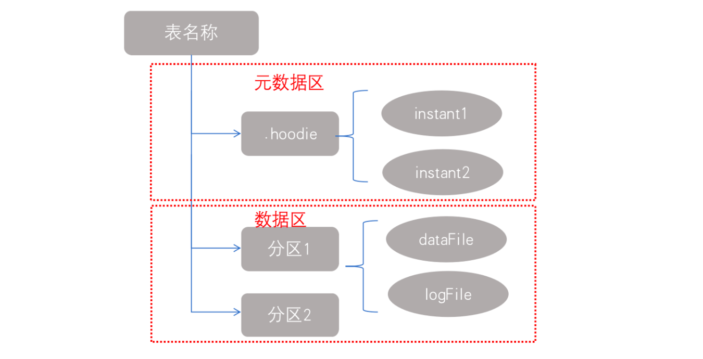
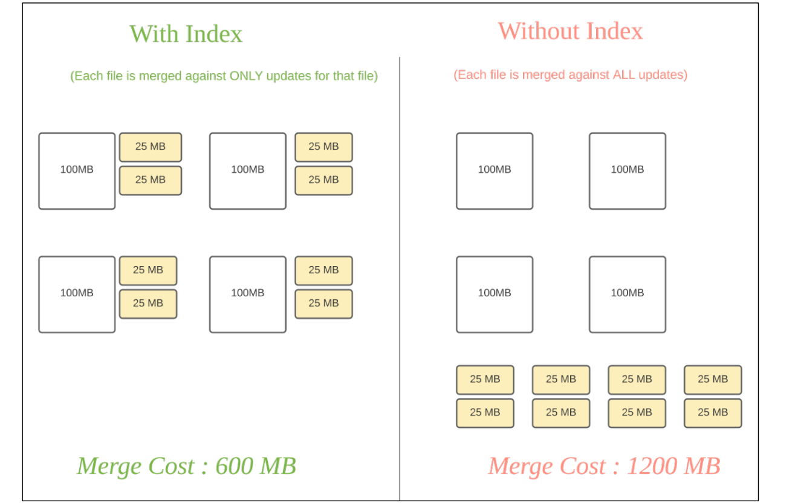

<center><font size='60'>Hudi</font></center>


[TOC]


## 1.概述

### 1.1 背景		

​		Hudi全称Hadoop Upsert Delete and Incremental。Hudi最初的设计目标：在Hadoop上实现update和delete操作。

​		为什么会有update和delete的需求？uber在开元Hudi的文章中解释了：

> 最初uber使用的是Lambda架构，但是有个问题是计算逻辑分为批量和实时两种，要保持两者的逻辑完全一致很困难（毕竟是两套代码）。
>
> 然后uber转向了Kappa架构，使得两套代码变为一套，但是存储依然有两套，分别支持实时写入和批量写入。

​		为了把存储统一起来，减少运维的压力，就需要**让负责批量写入的存储系统也能支持实时写入**，这就产生了update和delete的需求。

### 1.2 Hudi特性

- 可插拔索引机制支持快速Upsert/Delete

- 支持增量拉取表变更以进行处理

- 支持事务提交及回滚，并发控制

- 支持Spark、Presto、Trino、Hive、Flink等引擎的SQL读写。

- 自动管理小文件，数据聚簇，压缩，清理

- 流式摄入，内置CDC源和工具

- 内置可扩展存储访问的元数据跟踪

  

### 1.3 使用场景

1. 近实时写入
   - 减少碎片化工具的使用
   - CDC增量导入RDBMS
   - 限制小文件的大小和数量
2. 近实时分析
   - 相对于秒级存储（Druid，OpenTSDB），节省资源
   - 提供分钟级别时效性，支撑更高效的查询
   - Hudi作为lib，非常轻量
3. 增量pipeline
   - 区分arrivetime和event time处理延迟数据
   - 更短的调度interval减少端到端延迟（小时—>分钟）=> Incremental Processing。
4. 增量导出
   - 替代部分Kafka的场景，数据导出到在线服务存储 e.g. ES

## 2.基本概念

### 2.1 时间轴（TimeLine）


​		Hudi的核心是维护表上在不同的**即时时间（instants）**执行的所有操作的**时间轴（timeline）**，这有助于提供表的即时视图，同时还有效地支持按到达顺序检索数据。一个instant由以下三个部分组成：

1. **Instant action：在表上执行的操作类型**

   - commits：一次commit表示将一批数据原子性地写入一个表。
   - cleans：清除表中不再需要的旧版本文件的后台活动。
   - delta_commit：增量提交指的是将一批数据原子性地写入一个MergeOnRead类型的表，其中部分或所有数据可以写入增量日志。
   - compaction：合并Hudi内部差异数据结构的后台活动，例如：将更新操作从基于行的log日志文件合并到列式存储的数据文件。在内部，compaction体现为timeline上的特殊提交。
   - rollback：表示当commit/delta_commit不成功时进行会滚，其会删除在写入过程中产生的部分文件。
   - savepoint：将某些文件组标记为已保存，以便其不会被删除。在发生灾难需要恢复数据的情况下，它有助于将数据集还原到时间轴上的某个点。

2. **Instant time**

   通常是一个时间戳（例如：20230207010349），它按照动作开始时间的顺序单调增加。

3. **State**

   - requested：表示某个action已经调度，但尚未执行。
   - inflight：表示action当前正在执行
   - completed：表示timeline上的action已经完成。

4. **两个时间概念**

   区分两个重要的时间概念：

   - arrival time：数据到达Hudi的时间，commit time。
   - event time：record中记录的时间。

   

   ​		 上图中采用时间（小时）作为分区字段，从10:00开始陆续产生各种commits，10:20来一条9:00的数据，根据event time该数据仍然可以落到9:00对应的分区，通过timeline直接消费10:00（commit time）之后的增量更新（只消费有新commits的group），那么这条延迟的数据仍然可以被消费到。

   

### 2.2 文件布局（Flie Layout）

​		Hudi将一个表映射为如下文件结构



​		Hudi也是采用元数据日志基于地址链接的snapshot来维护自己的数据的。元数据存储在隐藏目录.hoodie中，数据文件则是和Hive类似采用分区目录的形式进行组织。每个分区文件被分为多个文件组，用一个filedid进行标识。每个文件组包含几个文件切片，每个切片包含一个在某个提交/压缩瞬间生成的base文件（.parquet），以及一组日志文件（.log）。其文件的命名方式：fileid+time

​		Hudi存储分为两个部分：

1. 元数据

   .hoodie目录对应着表的元数据信息，包括表的版本管理（Timeline）、归档目录（存放过时的instant也就是版本），一个instant记录了一次提交（commit）的行为、时间戳和状态，Hudi以时间轴的形式维护了在数据集上执行的所有操作的元数据

2. 数据

   和hive一样，以分区方式存放数据；分区里面存放着Base File（.parquet）和Log File（.log.*）

​		文件的具体管理结构如下：


1. Hudi将数据表组织成分布式文件系统基本路径（basepath）下的目录结构

2. 表被划分为多个分区，这些分区是包含该分区的数据文件的文件夹，非常类似于Hive表

3. 在每个分区中，文件被组织成文件组，由文件ID唯一标识

4. 每个文件组包含几个文件片（FileSlice）

5. 每个文件片包含：

   - 一个基本文件（.parquet）：在某个commit/compaction即时时间（instant time）生成的（MOR可能没有）
   - 多个日志文件（.log.*），这些日志文件包含自生成基本文件以来对基本文件的插入/更新（COW没有）

6. Hudi采用了多版本并发控制（Multi Version Concurrency Control，MVCC）

   - compaction操作：合并日志和基本文件以产生新的文件片
   - clean操作：清除不使用的/旧的文件片以收回文件系统上的空间

   

7. Hudi的base file（parquet文件）在footer的meta中记录了record key组成的BloomFilter，用于在file based index的实现中实现高效率的key contains检测。只有不在BloomFilter的key才需要扫描整个文件消灭假阳。

8. Hudi的log（avro文件）是自己编码的，通过积赞数据buffer以LogBlock为单位写出，每个LogBlock包含magic number、size、content、footer等信息，用于数据读、校验和过滤。

   

### 2.3 索引（Index）

#### 2.3.1 原理

​		Hudi通过索引机制提供高效的upserts，具体是将给定的hoodie key（record key + partition path）与文件id（文件组）建立唯一映射。这种映射关系，数据第一次写入文件后保持不变，所以，一个FileGroup包含了一批record的所有版本记录。**Index用于区分消息是insert还是update**。



​		Hudi未来消除不必要的读写，引入了索引的实现。在有了索引之后，更新的数据可以快速定位到对应的File Group。上图为例，白色是基本文件，黄色是更新数据，有了索引机制，可以做到：**避免读取不需要的文件、避免更新不必要的文件、无需将更新数据与历史数据做分布式关联，只需要在File Group内做合并。**

#### 2.3.2 索引选项

#### 2.3.3 全局索引与非全局索引

#### 2.3.4 索引的选择策略


### 2.4 表类型（Table Types）

#### 2.4.1 Copy on Write

​		在COW表中，只有数据文件/基本文件（.parquet），没有增量日志文件(.log.*)。

​		对每一个新批次写入都将创建相应数据文件的新版本（新的FileSlice），新版本文件包括旧版本文件的记录以及来自传入批次的记录（全量最新）

​		假设我们有3个文件组，其中包含如下数据文件


​		进行一批新的写入，在索引后，发现这些记录与File group1和File group2匹配，然后由新的插入，将为其创建一个新的文件组（File group4）。


​		因此data_file1和data_file2都将创建更新的版本，**data_file1 V2是data_file1 V1的内容与data_file1中传入批次匹配记录的记录合并。**

​		由于在写入期间进行合并，COW会产生一些写入延迟。但是COW的优势在于它的简单性，不需要其他表服务（如压缩），也相对容易调试。

#### 2.4.2 Merge On Read

​		MOR表中，包含列存的基本文件（.parquet）和行存的增量日志文件（基于行的avro格式，.log.*）

​		顾名思义，MOR表的合并成本在读取端。因此在写入期间不会合并或创建新的数据文件版本。标记/索引完成后，对于具有要更新记录的现有数据文件，Hudi创建增量日志文件并适当命名它们，以便它们都属于一个文件组。


​		**读取端将实时合并基本文件及其各自的增量日志文件。每次的读取延迟都比较高（因为查询时进行合并）**，所以Hudi使用压缩机制来将数据文件和日志文件合并在一起并创建更新版本的数据文件。

​		用户可以选择内联或异步模式运行压缩。Hudi也提供了不同的压缩策略供用户选择，最常用的一种是基于提交的数量。例如可以将压缩的最大增量日志配置为4，在进行4次增量写入后，将对数据文件进行压缩并创建更新版本的数据文件。压缩完成后，读取端只需要读取最新的数据文件，而不必关心旧版本文件。

​		MOR表的写入行为，依据index的不同会有细微的差别：

- 对于BloomFilter这种无法对log file生成index的索引方案，对于insert消息仍然会写base file（parquet format），只有update消息会append log 文件（因为base file已经记录该update消息的FileGroup ID）。
- 对于可以对logfile生成index的索引方案，例如Flink writer中基于state的索引，每次写入都是log format，并且会不断追加和roll over。

#### 2.4.3 COW与MOR对比

|                     | Copy on Write             | Merge on Read        |
| ------------------- | ------------------------- | -------------------- |
| 数据延迟            | 高                        | 低                   |
| 查询延迟            | 低                        | 高                   |
| Update(I/O)更新成本 | 高（重写整个Parquet文件） | 低（追加到增量日志） |
| Parquet文件大小     | 低（更新成本I/O高）       | 较大（低更新成本）   |
| 写放大              | 大                        | 低（取决于压缩策略） |

​		**COW适合读行为较多的场景，MOR适合写较多的场景。**


### 2.5 查询类型（Query Types）

#### 2.5.1 Snapshot Queries

​		快照查询，可以查询指定commit/delta commit即时操作后表的最新快照。

​		在读时合并（MOR）表的情况下，它通过**即时合并最新文件片的基本文件和增量文件来提供近实时表**（几分钟）。

​		对于写时复制（COW），它可以替代现有的parquet表（或相同基本文件类型的表），同时提供铺色如图/delete和其他写入方面的功能，可以理解为**查询最新版本的Parquet数据文件**。

​		下图是COW的快照查询：


#### 2.5.2 Incremental Queries

​		增量查询，可以查询给定commit/delta commit即时操作以来新写入的数据。有效的提供变更流来启用增量数据管道。

#### 2.5.3 Read Optimized Queries

​		读优化查询，可查看给定的commit/compact即时操作的表的最新快照。**只读取base文件，不读取log文件**。因此读取效率和COW表相同，但读取到的数据可能不是最新的。

​		下图是MOR表的快照查询与读优化查询的对比：


## 3.表类型

### 3.1 COW（Copy on Write）

​		COW进行update时先将要更新的数据文件进行copy，再对其内容进行更新，最后写入新文件。


​		无论是COW还是MOR，在流式数仓中都需要tagging和merge的操作。当Upsert事务到来的时候，首先需要从base数据库中进行查找，判断是insert操作还是update操作，如果没有重复数据，则追加写入文件，否则需要拷贝，对其内容更新后，再写入新的文件（COW）。

#### 3.1.1 举例COW表的upsert过程

​		首先，假设向一张Hudi表中预先写入5行数据：

| txn_id | user_id | item_id | amount | date     |
| ------ | ------- | ------- | ------ | -------- |
| 1      | 1       | 1       | 2      | 20230101 |
| 2      | 2       | 1       | 1      | 20230101 |
| 3      | 1       | 2       | 3      | 20230101 |
| 4      | 1       | 3       | 1      | 20230102 |
| 5      | 2       | 3       | 2      | 20230102 |

在hdfs的目录结构：

```
warehouse
├── .hoodie
├── 20220101
│   └── fileId1_001.parquet
└── 20220102
    └── fileId2_001.parquet
```

​		文件名分2部分：隐藏的.hoodie目录，分区目录，001时commitId。

​		画成图如下：

​		

​		属于20230101分区的3条数据保存一个parquet文件：fileId1_001.parquet，属于20230102分区的2条数据则保存在另一个parquet文件：fileId2_001.parquet

​		再写入3条新的数据，其中2条数据是新增，1条数据是更新

| txn_id | user_id | item_id | amount | date     |
| ------ | ------- | ------- | ------ | -------- |
| 3      | 1       | 2       | 5      | 20230101 |
| 6      | 1       | 4       | 1      | 20230103 |
| 7      | 2       | 3       | 2      | 20230103 |

​		写入完成后，hdfs文件目录变成：

```
warehouse
├── .hoodie
├── 20220101
│   ├── fileId1_001.parquet
│   └── fileId1_002.parquet
├── 20220102
│   └── fileId2_001.parquet
└── 20220103
    └── fileId3_001.parquet
```

​		画成图如下：


​		更新的那一条记录，被写入到了同一个分区下的新文件：fileId1_002.parquet，这个新文件的fileId和上一个相同，只不过commitId变成了002。同时还有一个新文件：fileId3_001.parquet

​		是如何读取更新后的数据呢？Hudi客户端在读取这张表时，会根据.hoodie目录下保存的元数据信息，获知需要读取的文件是：fileId1_002.parquet，fileId2_001.parquet， fileId3_002.parquet。**这些文件里保存的正式最新的数据**。


#### 3.1.2 COW Upsert步骤

​		Upsert的过程整体分为3步：

1. 根据partitionPath进行重新分区
2. 根据recordKey确定哪些记录需要插入，哪些记录需要更新。对于需要更新的记录，还需要找到旧的记录所在的文件。（这个过程被称为tagging）
3. 把记录写入实际的文件

**Step1. 重新分区**

​		重新分区的依据就是partitionPath，partitionPath相同的record都会被分到同一个partition，并交给一个executor负责写入。配置项partitionpath_field_opt_key就是用来制定record里面哪个字段作为partitionPath。

**Step2. Tagging**

​		tagging是写入过程中最重要的一步，核心逻辑是确定每条record是insert还是update，如果是update，则需要定位到上次写入到fileid（文件组id）。那么如何判断是否是update呢？首先，recordKey是用户写入时指定的，hudi**使用recordKey与base的数据进行对比，如果找到key相同的record则认为这次写入时update，否则是insert**，这个查询过程就是tagging。

​		当然在已有的数据中寻找相同的key是非常耗时的，所以hudi引入了索引。另外**对update的record在写入时会拷贝原有的旧文件的fileid，用其生产新的文件。**

**Step3. 写入文件**

​		写入文件的过程分区insert和update两部分，update会使用原来的fileid进行写入，insert生成新的fileid（uuid）进行写入。**如果是COW的方式则会拷贝原来的文件，并将其与新update数据进行merge后写入**。如果是MOR则是将update数据直接写入，然后再异步进行merge。

#### 3.1.3 过程优化

​		upsert或者delete都免不了两个过程：1.定位操作文件；2.合并更新文件

**定位文件**

​		定位文件，也就是tagging过程是非常耗时的，需要找到当前操作要影响哪些文件，再读取文件中的key进行依次对比。如果在查找中可以跳过大部分的文件，那么效率会变的很高，如何跳过绝大部分文件呢？

1. min-max索引

   不论是Delta Lake、Hudi还是Iceberg，都存在min-max索引，但是如果数据分布比较均匀，即每个文件文件列的upper_bounds和lower_bounds的range很大，那么min-max索引其实是失效的。但如果文件已排序，则会非常高效

2. BloomFilter索引

   BloomFilter虽然可以快速的判断record是否在文件中，但其存在假阳性的问题，如果随着数据量的增加，其性能也是下降的。

**合并文件**

​		合并文件的过程实质上就是join的过程：

1. 最高效的过程当然是BHJ（Broadcast Hash Join），但是其需要满足delta数据可以装入内存进行广播
2. 最常用的还是SMJ（Sort Merge Join），SMJ进行合并是代价比较大的，但如果数据的组织方式原本是有序的其实现也会变的高效。

### 3.2 MOR（Merge on Read）

​		MOR在进行update时直接写入新的文件，在读取时再将delta文件与base文件进行合并。

​		MOR是Hudi最初开源时尚处于“实验阶段”的新功能，在开源后的0.3.5版本开始才完成，**现在则是Hudi最常用的表类型**。

> Merge on Read是对Copy on Write的优化，优化了什么呢？**主要是写入性能**。

#### 3.2.1 分析COW瓶颈

​		导致COW表写入慢的原因，是COW每次写入时，会把新写入的数据和老数据合并以后，再写成新的文件。单单是写入过程（不包含前期的repatition和tagging过程），就包含至少3个步骤：

1. 读取老数据的parquet文件（涉及parquet文件解码，不轻松）
2. 将老数据和新数据合并
3. 将合并后的数据重新写成parquet文件（又涉及parquet文件编码，也不轻松）

种种原因导致COW表的写入速度始终快不起来，限制了其在时效性要求高，写入量巨大的场景下的应用。

#### 3.2.2 MOR Upsert过程

​		为了解决COW表写入速度上的瓶颈，Hudi采用了另一种写入方式：**upsert时把变更内容写入log文件，然后定期合并log文件和base文件**。这样的好处是避免了写入时读取老数据，也避免了parquet文件不轻松的编解码过程，只需要把变更记录写入一个文件即可（而且是顺序写入）

```
warehouse
├── .hoodie
├── 20220101
│   ├── fileId1_001.parquet
│   ├── .fileId1_20220312163419285.log
│   └── .fileId1_20220312172212361.log
└── 20220102
    ├── fileId2_001.parquet
    └── .fileId2_20220312163512913.log
```

​		log文件包含写入的时间戳

​		这样写入固然是轻松了，但怎么读取到最新的数据呢？为了解决读取最新数据的问题，Hudi提供了好几种机制，但从原理上来说只有两种：

- **读取数据时，同时从base文件和log文件读取，并把两边的数据合并**
- **定期地、异步地把log文件的数据合并到base文件（这个过程被称为compaction）**

​		Hudi默认配置就是同时使用这两种机制，即：**读取时merge，同时定期地compact。**

​		在读取时合并数据，听起来很影响效率，事实也是如此，因为实时合并的实现方式是把所有log文件读入内存，放在一个HashMap里，然后遍历base文件，把base数据和缓存在内存里的log数据进行join，最后才得到合并后的结果，难免会影响到读取效率。

​		COW影响写入，MOR影响读取，那有没有什么办法可以兼顾读写，鱼和熊掌能不能兼得？目前来说不能，好在Hudi把选择权留给了用户，让用户可以根据自身的业务需求，选择不同的query类型。

## 4.事务功能（Transactional）

​		Hudi事务功能被称为Timeline，因为Hudi把所有对一张表的操作都保存在一个时间线的对象里面。

### 4.1 Hudi提供的事务功能

​		从用户角度，Hudi提供的事务相关能力主要是这些：

| 特性     | 功能                                               |
| -------- | -------------------------------------------------- |
| 原子性   | 写入即时失败，也不会造成数据损坏                   |
| 隔离性   | 读写分离，写入不影响读取，不会读到写入中途的数据   |
| 回滚     | 可以回滚变更，把数据恢复到旧版本                   |
| 时间旅行 | 可以读取旧版本的数据（但太老的版本会被清理掉）     |
| 存档     | 可以长期保存旧版本数据（存档的版本不会被自动清理） |
| 增量读取 | 可以读取任意两个版本之间的差分数据                 |

### 4.2事务实现原理

​		以COW表为主分析一下事务的实现原理，还是以上面COW中demo进行分析。


​		Hudi在这张表的timeline（实际存放在.hoodie目录下）会记录v1和v2对应的文件列表。当client读取数据时，首先会查看timeline里最新的commit是哪个？从最新的commit里获得对应的文件列表，再去这些文件读取真正的数据。

​		Hudi通过这种方式实现了多版本隔离的能力。当一个client正在读取v1的数据时，另一个client可以同时写入新的数据，新的数据会被写入新的文件里，不影响v1用到的数据文件。只有当数据全部写完以后，v2才会被commit到timeline里面。后续client再读取时，读到的就是v2的数据。

​		尽管Hudi具备多版本数据管理的能力，但旧版本的数据不会无限制地保留下去。Hudi会在新的commit完成时开始清理旧的数据，默认的策略是**清理早于10个commit前的数据**。


