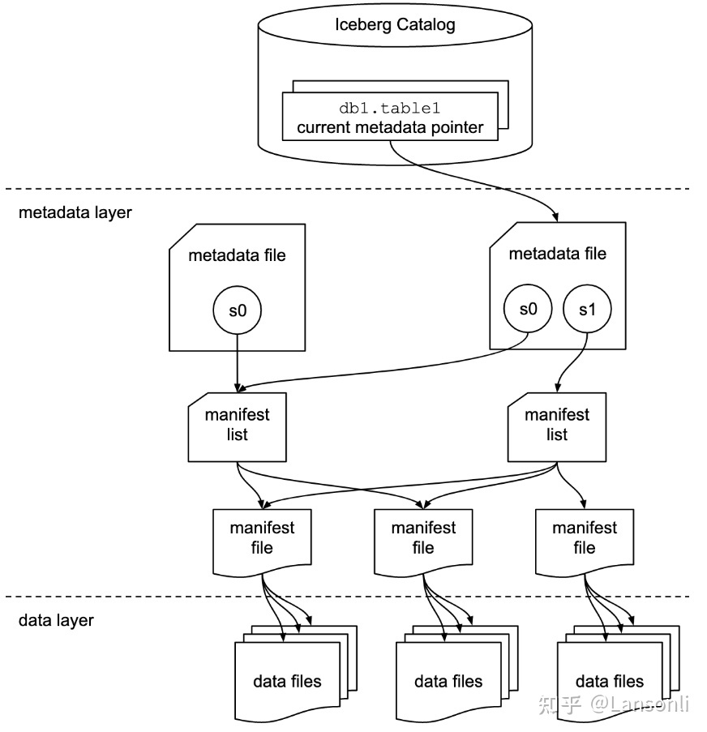
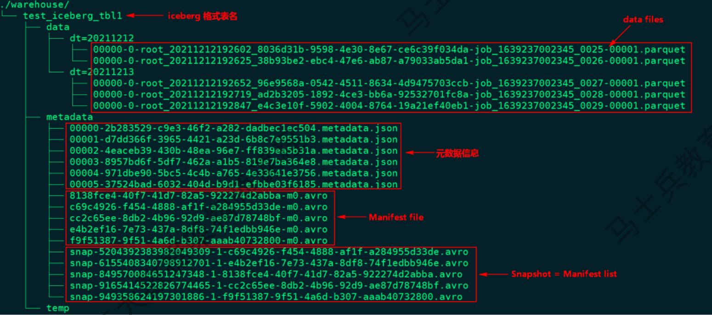
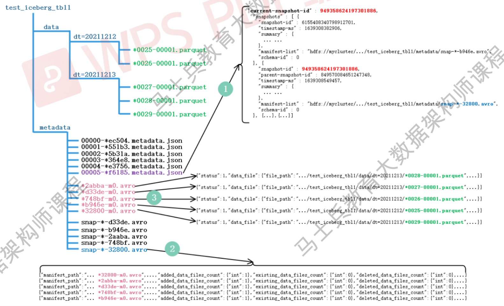
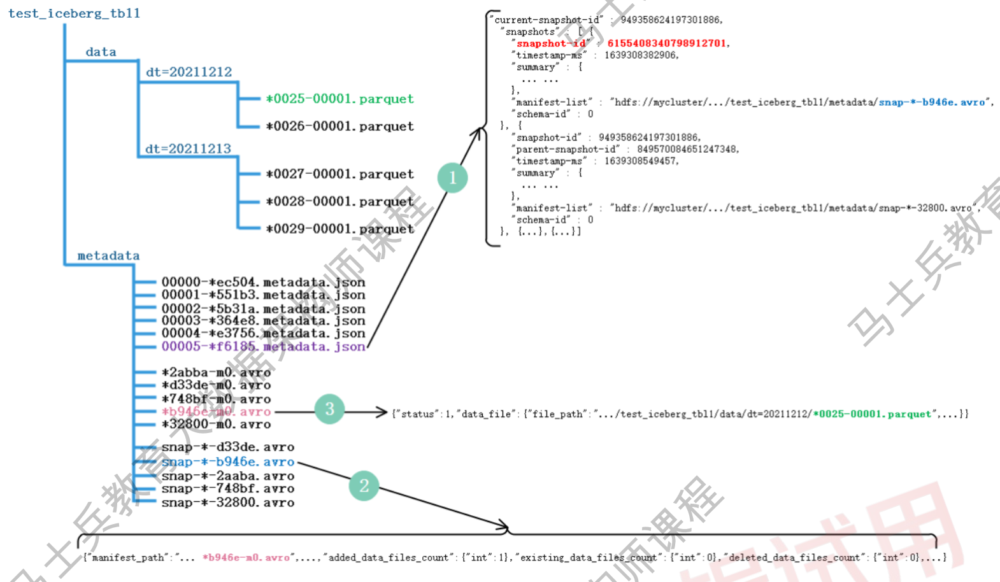
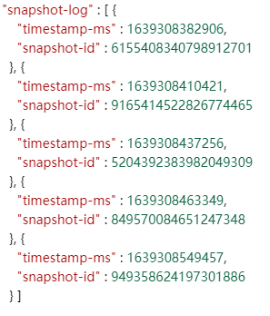

<center><font size='60'>Iceberg</font></center>

[TOC]

## 1.Iceberg解决什么问题

​		Iceberg是一种新型的用于大规模数据分析的开源表格式。

### 1.1 Iceberg核心希望解决的问题

​		Iceberg最核心希望解决的是Hive数仓遇到的问题：

- 没有ACID保证，无法读写分离

  Hive数仓只是文件系统是那个一系列文件的集合，而数据读写只是对文件的直接操作，没有关系型数据库常有的事务概念和ACID保证，所以会存在脏读等问题。

- 只能支持partition粒度的谓词下推

  Hive的文件结构只能通过partition和bucket对需要扫描哪些文件进行过滤，无法精确到文件粒度。所以尽管parquet文件里保存了max和min值可以用于进一步的过滤（即谓词下推），但是hive却无法使用。

- 确定需要扫描哪些文件时使用文件系统的list操作

  Hive在确定了需要扫描的partition和bucket之后，对于bucket下有哪些文件需要使用文件系统的list操作，而这个操作是O(n)级别的，会随着文件数量的增加而变慢。特别是对于像s3这样的对象存储来说，一次list操作需要几百毫秒，每次只能取1000条记录，对性能的影响无法忽略。

- partition字段必须显式出现在query里面

  query需要显示地指定partition

#### 1.1.1 ACID特性

​		ACID是指在数据库管理系统（DBMS）中事务所具有的四个特性：原子性（Atomicity）、一致性（Consistency）、隔离性（Isolation）、持久性（Durability）

1. 原子性（Atomicity）

   **（1）概念**

   整个事务中的所有操作，要么全部完成，要么全部不完成，不可能停滞在中间某个环节。事务在执行过程中发生错误，会被回滚（Rollback）到事务开始前的状态，就像这个事务从来没有执行过一样。

   **（2）举例**

   一个事务开始更新100行记录，但是在更新了20行之后（因为某种原因）失败了，那么此时数据库会回滚（撤销）对那20条记录的修改

2. 一致性（Consistency）

   **（1）概念**

   在事务开始之前和事务结束以后，数据库的完整性约束没有被破坏。

   **（2）举例**

   在一个银行事务（在描述关系数据库事务的特性时，基本上都是用银行事务来描述对象的）中，需要从存储账户扣除款项，然后在支付账户中增加款项。如果在这个中转的过程中发生了失败，那么绝对不能让数据库只执行其中一个账户的操作，因为这样会导致数据处于不一致的状态（这样的话，银行的账目上，借贷就不平衡了）。

3. 隔离性（Isolation）

   **（1）概念**

   两个事务的执行是户不干扰的，一个事务不可能看到其他事物运行时，中间某一个时刻的数据。这个特性是说，直到事务结束时（commit/rollback），其他事物（或者会话）对此事务所操作数据不可见（但并不是说其他会话的读取会被阻塞）

   **（2）举例**

   比如说，一个用户正在修改hr.employees表，但是没有提交，那么其他用户在这个修改没有提交之前是看不到这个修改的。

4. 持久性（Durability）

   **（1）概念**

   在事务完成以后，该事务对数据库所作的更改便持久的保存在数据库之中，并不会被回滚。
   
   指的是只要事务成功结束，它对数据库所做的更新就必须永久保存下来。即使发生系统崩溃，重新启动数据库系统后，数据库还能恢复到事务成功结束时的状态。

### 1.2 Iceberg具备的能力

​		Iceberg被设计用于存储移动缓慢的大型表格数据。它旨在改善Hive、Presto和Spark中内置的事实上的标准表布局。Iceberg可以屏蔽底层数据存储格式上的差异，向上提供统一的操作API，使得不同的引擎可以通过其提供的API接入。

​		Iceberg具备以下能力：

- 模式演化（Schema evolution）

  支持Add（添加）、Drop（删除）、Update（更新）、Rename（重命名）和Reorder（重排）表格式定义。

- 分区布局演变（Partition layout evolution）

  可以随着数据量或查询模式的变化而更新表的布局。

- 隐式分区（Hidden partition）

  查询不再取决于表的物理布局。通过物理和逻辑的分隔，Iceberg表可以随着数据量的变化和时间的推移发展分区方案。错误配置的表可以得到修复，无需进行昂贵的迁移。

- 时光穿梭（Time travel）

  支持用户使用完全相同的快照进行重复查询，或者使用户轻松检查更改。

- 版本回滚（Version rollback）

  使用户可以通过将表重置为良好状态来快速纠正问题。

#### 1.2.1 模式演化（Schema Evolution）

​		Iceberg支持以下几种Schema的演化：

- ADD：向表或者嵌套结构增加新列
- Drop：从表或嵌套结构中移除列
- Rename：重命名表中或者嵌套结构中的列
- Update：将复杂结构（Struct、Map<Key, Value>，list）中的基本类型扩展类型长度，比如tinyint修改为int
- Reorder：改变列的顺序，也可以改变嵌套结构中字段的排序顺序

注意：

​		Iceberg Scheam的改变只是元数据的操作改变，不会涉及到重写数据文件。Map结构类型不支持Add和Drop字段。

Iceberg保证Schema演化是没有副作用的独立操作，不会涉及到重写数据文件，具体如下：

- 增加列时不会从另一个列中读取已存在的数据
- 删除列或者嵌套结构中的字段时，不会改变任何其他列的值
- 更新列或者嵌套结构中字段时，不会改变任何其他列的值
- 改变列或者嵌套结构中字段顺序的时候，不会改变相关联的值

Iceberg实现以上的原因使用唯一的id来追踪表中的每一列，当添加一个列时，会分配新的ID，因此列对应的数据不会被错误使用。

#### 1.2.2 Iceberg分区与隐藏分区（Hidden Partition）

​		Iceberg支持分区来加快数据查询。在Iceberg中设置分区后，可以写入数据时将相似的行分组，在查询时加快查询速度。Iceberg中可以按照年、月、日和小时粒度划分时间戳组织分区。

​		在hive中也支持分区，但是想使用分区能加快查询速度，需要在写SQL时指定对应的分区条件过滤数据，在iceberg中写SQL查询时不需要在SQL中特别指定分区过滤条件，Iceberg会自动分区，过滤掉不需要的数据。

​		在iceberg中分区信息可以被隐藏起来，iceberg的分区字段可以通过一个字段计算出来，在建表或者修改分区策略之后，新的数据会自动计算所属于的分区，在查询的时候同样不用关心表的分区时什么字段，只需要关注业务逻辑，Iceberg会自动过滤不需要的分区数据。

​		正是由于Iceberg的分区信息和表数据存储目录是独立的，使得iceberg的表分区可以被修改，而且不会涉及到数据迁移。

#### 1.2.3 分区演化（partition Evolution）

​		Iceberg分区可以在现有表中更新，因为Iceberg查询流程并不和分区信息直接关联。

​		当改变一个表的分区策略时，对应修改分区之前的数据不会改变，依然会采用老的分区策略，新的数据会采用新的分区策略，也就是说同一个表会有两种分区策略，旧数据采用旧分区策略，新数据采用新分区策略，在元数据里两个分区策略相互独立，不重合。

​		在写SQL进行数据查询时，如果存在跨分区策略的情况，则会解析成两个不同执行计划，如iceberg官网提供图所示：


​		图中booking_table表2008年按月分区，进入2009年后改为按天分区，这两种分区策略共存于该表中。得益于iceberg的隐藏分区（Hidden Partition），针对上图中的SQL查询，不需要在SQL中特别指定分区过滤条件（时按照月还是按照天），Iceberg会自动分区，过滤掉不需要的数据。

## 2.Iceberg实现原理

### 2.1 Iceberg底层是如何存储的？

​		Iceberg设计为以快照（Snapshot）的形式来管理表个各个历史版本数据。快照代表一张表在某个时刻的状态。每个快照中会列出表在某个时刻的所有数据文件列表。



​		上图是Iceberg中表格式，s0、s1代表的是表snapshot信息，每个表示当前操作的一个快照，每次commit都会生成一个快照snapshot，每个snapshot快照对应一个manifest list元数据文件，每个manifest list中包含多个manifest元数据文件，manifest中记录了当前操作生成数据所对应的文件地址，也就是data file的地址。



- metadata

  - version metadata

    文件保存了 table schema、partition、snapshot信息，partition中的transform信息使得iceberg能够根据字段进行hidden partition，而无需像hive一样显示的指定分区字段。

    version metadata中记录了每次snapshot的id以及create_time，可以通过时间或snapshot查询相应的snapshot的数据，实现Time Travel。

    文件格式：version[number].metadata.json

  - snapshot（表快照）

    快照代表一张表在某个时刻的状态。每个快照里面会列出表在某个时刻的所有data files列表。data files是存储在不同的manifest files里面，manifest files是存储在一个manifest list文件里面，而一个manifest list文件代表一个快照。

    一个snapshot中可以包含多个manifest entry，一个manifest entry表示一个manifest，其中重点需要关注的是每个manifest中的partition字段，在根据filter进行过滤时可以首先通过该字段表示的分区范围对manifest进行过滤，避免无效的查询。

    文件格式：snap-[snapshotID]-[attemptID]-[commitUUID].avro

  - manifest list（清单列表）

    manifest list 是一个元数据文件，它列出构建表快照（Snapshot）的清单（manifest file）。这个元数据文件存储的是manifest file列表，每个manifest file占据一行。每行中存储了manifest file的路径、其存储的数据文件（data files）的分区范围，增加了几个数据文件、删除了几个数据文件等信息，这些信息可以用来查询时提供过滤，加快速度。

  - manifest file（清单文件）

    manifest file也是一个元数据文件，它列出组成快照（snapshot）的数据文件（data files）的列表信息。每行都是每个数据文件的详细描述，包括数据文件的状态、文件路径、分区信息、列级别的统计信息（比如每列的最大最小值、空值数等）、文件的大小以及文件里面数据行数等信息。其中列级别的统计信息可以扫描表数据时过滤掉不必要的文件。

    manifest管理多个data文件，一个DataFileEntry对一个data文件，DataFileEntry中记录了所属partition、value bounds等信息，value_counts和null_value_counts可以用于过滤null列，例：column a所对应的value_count为3，且对应的null_value_count也为3，此时如果select a，则可以根据value_count-null_value_count=0判断a全为null直接返回而无需再进行parquet文件的查询；除此之外，可以根据value bounds进行过滤，加速查询。

    文件格式：[commitUUID]-m-[manifestCount].avro

- data

  - data flies

    数据文件是iceberg表真实存储数据的文件，一般是在表的数据存储目录大data目录下，如果我们的文件格式选择的是parquet，那么文件是以“.parquet”结尾。

    iceberg每次更亲会产生多个数据文件（data files）。

    文件格式：[sparkPartitionID]-[sparkTaskID]-[UUID]-[fileCount].[parquet|avro|orc]

### 2.3查询原理

#### 2.3.1多种查询原理

##### 2.3.1.1 查询最新快照的数据



​		首先获取最新的metadata信息，这里先获取到“00000-ec504.metadata.json”元数据信息，解析当前元数据文件可以拿到当前表的快照id:“949358624197301886”以及这张表的所有快照信息，也就是json信息中snapshots数组对应的值。根据当前表的快照id值可以获取对应的snapshot对应的avro文件信息：“snap--32800.avro”，可以找到当前快照对应的路径，看到其包含的Manifest 清单文件有5个："*32800-m0.avro"、"*2abba-m0.avro"、"*d33dem0.avro"、"*748bf-m0.avro"、"*b946e-m0.avro"，读取该Iceberg格式表最新数据就是读取这几个文件中描述对应的parquet数据文件即可。
​		可以看到“snap-*-32800.avro”快照文件中不仅有包含的manifest路径信息，还有
“added_data_files_count”、“existing_data_files_count”、“deleted_data_files_count”三个属性，Iceberg 根据deleted_data_files_count 大于 0 来判断对应的manifest清单文件里面是不是被删除的数据，如果一个manifest清单文件该值大于0代表数据删除，读数据时就无需读这个manifest清单文件对应的数据文件。
​		根据Manifest list找到了各个对应的manifest 清单文件，每个文件中描述了对应parquet文件存储的位置信息，可以看到在对应的avro文件中有“status”属性，该属性为1代表对应的parquet文件为新增文件，需要读取，为2代表parquet文件被删除。

##### 2.3.1.2 查询某个快照的数据

​		Iceberg支持查询历史上任何时刻的快照，在查询时需要指定snapshot-id属性即可，这个只能通过spark/flink来查询实现，例如在spark中查询某个快照数据如下：

```scala
spark.read.option("snapshot-id", 6155408340798912701L).format("iceberg").load("path")
```



​		通过上图可以看出，实际读取历史快照数据和读取最新数据不同之处就是找到snapshot-id不同而已，原理都是一样。

##### 2.3.1.3 根据时间戳查询某个快照的数据

​		iceberg还支持通过as-of-timestamp参数执行时间戳来读取某个快照的数据，同样也是通过sparl/flink来读取，spark读取如下：

```scala
spark.read.option("as-of-timestamp", "时间戳").format("iceberg").load("path")
```

​		实际上通过时间戳找到对应数据文件的原理和通过snapshot-id找到数据文件原理一样，在*.metadata.json文件中，除了有“current-snapshot-id”、“snapshots”属性外还有“snapshot-log”属性，该属性对应的值如下：



​		可以看到其中有个timestamp-ms属性和snapshot-id属性，并且是按照timestamp-ms生序的。在iceberg内部实现中，它会将as-of-timestamp指定的时间和snamshot-log数组里面每个元素的timestamp-ms进行比较，找出最后一个满足timestamp-ms <= as-of-timestamp对应的snapshot-id，原理同上，通过snapshot-id再找到要读取的数据文件。

#### 2.3.2 Iceberg是如何提高查询性能的

### 2.4 写入原理

### 2.5 Iceberg是如何实现Update和Delete的？

​	


