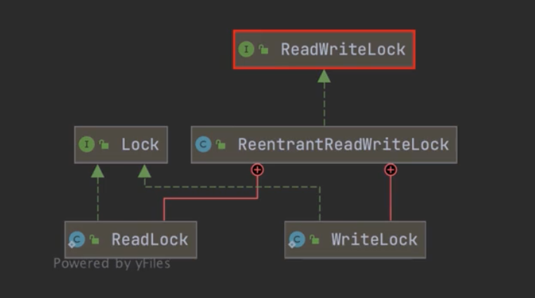
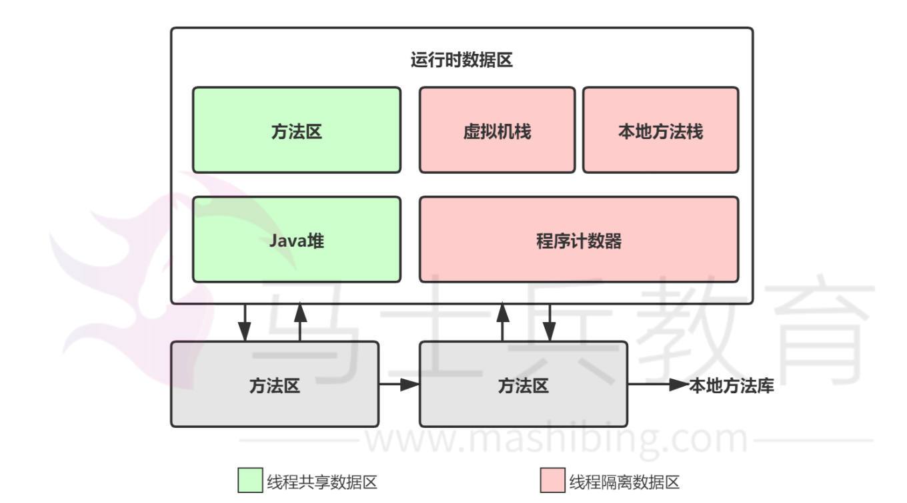

<center><font size='60'>Java</font></center>

[TOC]


## 1.基础

### 1.1 关键字理解

#### 1.1.1 final关键字

​		代表最终，用来修饰类、变量和方法

- final修饰类

  该类不能被继承（无子类，但是该类可以有父类）

- final修饰方法

  该方法不能被重写，但是可以被继承

- final修饰变量

  表明该变量是一个长量，不能被再次赋值（注意初始化问题）

  - final修饰成员变量

    该变量要么在定义时直接被初始化，要么在构造代码块中被初始化，要么在构造方法中被初始化。

    在对象创建完毕之前，被final修饰的成员变量一定要被赋值且被赋值一次

  - final修饰局部变量

    该变量在定义的时候可以不被赋值，但是在使用之前，该变量必须被初始化

  - final修饰引用数据类型（类、接口、数组）的变量

    不能改变的是变量存放的地址值，地址值上（对象）的内容可以改变

    ```java
    final int[] s = {5, 6, 7}
    s[0] = 7;
    ```

    

​		final修饰变量命名：单词全大写，每个单词用下划线_分隔

#### 1.1.2 this关键字

​		在Java中，有成员变量和局部变量，当成员变量和局部变量同名时，该如何区分？这时候，this关键字就能发挥作用。

​		this关键字的应用场景有4处：

- this.成员变量名

  当局部变量和成员变量同名时使用，Java使用变量的规则：就近原则

  当局部变量和成员变量同名时，如果要操作成员变量，最好使用this关键字

- this.成员方法名

  在一个成员方法中调用另一个成员方法

- this();

  在构造方法中调用类中的其他构造方法

  注意：（1）使用this()；调用构造方法，只能在构造方法中使用；（2）this()；必须放在第一行；（3）在一个构造方法中，只能调用一个构造方法。

- return this;

  指代所在类的对象，谁调用方法this就是那个对象

## 2. 封装、继承、多态

#### 2.1 Java对象有哪些特征

​		面向对象编程是利用类和对象编程的一种思想。万物可归类，类是对于世界事物的高度抽象，不同的事物之间有不同的关系，一个类自身与外界的封装关系，一个父类和子类的继承关系，一个类和多个类的多态关系。万物皆可对象，对象是具体的世界事物，面向对象的三大特征：封装、继承、多态。

**1.封装，说明一个类行为和属性与其他类的关系，低耦合，高内聚**

​		封装隐藏了类的内部实现机制，可以在不影响使用的情况下改变类的内部结构，同时也保护了数据。对外界它的内部细节是隐藏的，暴露给外界的只是它的访问方法。属性的封装：使用者只能通过事先定制好的方法来访问数据，可以方便地加入逻辑控制，限制对属性的不合理操作；方法的封装：使用者按照既定的方式调用方法，不必关心方法的内部实现，便于使用，便于修改，增强代码的可维护性。

**2.继承：父类和子类的关系**

​		继承是从已有的类中派生出新的类，新的类能吸收已有类的数据属性和行为，并能扩展新的能力。在本质上是特殊～一般的关系，即常说的is-a关系。子类继承父类，表明了子类是一种特殊的父类，并且具有父类所不具有的一些属性和方法。从多种实现类中抽象出一个基类，使其具备多种实现类的共同特征，当实现类用extends关键字继承类基类（父类）后，实现类就具备了这些相同的属性。继承的类叫做子类（派生类或者超类），被继承的类叫做父类（或者基类）。比如从猫类、狗类、虎类中可以抽象出一个动物类，具有和猫、狗、虎类的共同特性（吃、跑、叫等）。Java通过extends关键字来实现继承，父类中通过private定义的变量和方法不会被继承，不能在子类中直接操作父类通过private定义的变量以及方法。继承避免了对一般类和特殊类之间共同特征进行的重复描述，通过继承可以清晰地表达每一项共同特征所适应的概念范围，在一般类中定义的属性和操作适应于这个类本身以及它以下的每一层特殊类的全部对象。运用继承原则使得系统模型比较简练也比较清晰

**3.多态：类与类的关系**

​		多态指的是类和类的关系，两个类有继承关系，存在有方法的重写，故而可以在调用时有父类引用指向子类对象。多态必备三个要素：继承、重写、父类引用指向子类对象。

**总结：**

​		

## 3.集合

### 3.1 HashMap

#### 3.1.1 底层数据结构

​		数组+链表/红黑树，在Java7中使用的是数组+链表，在Java8中当链表长度大于8时会转换为红黑树。

##### 3.1.1.1 HashMap的底层数据结构？


hashmap最基础的几个点：

- 基础数据结构是数组+链表

  每一对key—>value的键值对组成Entity类以双向链表的形式存放到这个数组中

- 元素在数组的位置

  元素在数组的位置由key.hashCode()值决定，如果两个key的哈希值相等，即发生了哈希碰撞，则这两个key对应的entity将以链表的形式存放在数组中。

- get()方法

  调用HashMap.get()的时候会首先计算key的值，继而在数组中找到key对应的位置，然后遍历该位置上的链表找到相应的值

##### 3.1.1.2 jdk1.8之后为什么变成了红黑树

​		为了解决数据量过大、链表过长查询会降低的问题变成了数组+链表+红黑树的结构，利用的是红黑树自平衡的特点。

​		链表的平均查找时间复杂度是O(n) ，红黑树是 O(log(n))

##### 3.1.1.3 红黑树的实现

​		红黑树是一种近似平衡的二叉查找树，主要的优点就是“平衡”，即左右子树的高度几乎一致，以此来防止树退化为链表，通过这种方式来保障查找的时间复杂度为O(log(n))。

​		红黑树主要有以下特性：

1. 每个节点要么是红色，要么是黑色，但根节点永远是黑色的
2. 每个红色节点的两个子节点一定都是黑色
3. 红色节点不能连续（红色节点的孩子和父亲都不能是红色）
4. 从任一节点到其子树中每个叶子节点的路径都包含相同的数量的黑色节点
5. 所有的叶节点都是黑节点（叶子节点是图中的NIL节点）

​		在树的结构发生改变时（插入或者删除操作），往往会破坏上述条件3或4，需要通过调整使得查找树重新满足红黑树的条件。调整分为2类：一类是颜色调整，即改变某个节点的颜色，这种比较简单，直接将节点颜色进行转换即可；另一种是结构调整，改变检索树的结构关系。结构调整主要包含两个基础操作：左旋、右旋


#### 3.1.2 HashMap的属性

##### 3.1.2.1 默认初始化大小是多少？为什么是这么多？为什么大小都是2的幂？

​		HashMap对象被构造时，初始的默认容量为1<<4，也就是16，并且必须是2的幂

```java
static final int DEFAULT_INITIAL_CAPACITY = 1 << 4; // aka 16
```

​		最大容量 1 << 30 , 2^{30}

```java
static final int MAXIMUM_CAPACITY = 1 << 30;
```

​		默认负载因子为0.75

```java
static final float DEFAULT_LOAD_FACTOR = 0.75f;
```

**为什么是16？**

​		源码注释中，默认的初始容量—必须是2的幂，也就是说，HashMap的长度自己定义的时候，只要是2的次幂就行。


##### 3.1.2.2 HashMap的put方法


​		HashMap中put方法执行过程大体如下：

1. 判断键值对数组table是否为空或者lenght=0，是的话执行resize()方法进行扩容。
2. 不是就根据键值key计算hash值得到插入的数组索引i。
3. 判断table[i]==null，如果是true，直接新建节点进行添加，如果是false，判断table[i]的首个元素是否和key一样，一样就直接覆盖。
4. 判断table[i]是否为tree node，即判断是否是红黑树，如果是红黑树，直接在树中插入键值对。
5. 如果不是tree node，开始遍历链表，判断链表长度是否大于8，如果大于8就转成红黑树，在树中执行插入操作，如果不是大于8，就在链表中执行插入；遍历过程中判断key是否存在，存在就直接覆盖对应的value值
6. 插入成功后，就需要判断实际存在的键值对数量size是否超过了最大容量threshold，如果超过了，执行resize方法进行扩容。

##### 3.1.2.3 hash函数

​		hash算法中，首先将key计算出hashCode值，然后再将hashCode值与右移16位的hashCode值进行按位异或操作，得到一个新的哈希值，这样做的目的是为了增强哈希值的随机性。

```java
static final int hash(Object key){
  int h;
  return (key == null) ? 0 : (h = key.hashCode()) ^ (h >>> 16);
}
```

​		在进行put需要找到某个key所对应的数组索引的时候，HashMap不是通过直接取数组长度的模来得到对应的下标，使用h&(n-1)来获取对应table数组的索引（下标），其中n表示数组长度，h表示哈希值。


​		2的幂二进制数中只有一位位1，数组下标只会使用到2的幂数位为1的后面的位，这些位称为有效位。数组下标范围位0～63，有效的二进制位为后6位。

​		HashMap确定索引的方法是将h&(n-1)，毕竟按位与的效率大于取模，为了数组每个下标都可能被映射到，则n的每一位二进制有效位得均为1，所以数组的长度必须为2的幂，因为只有2的幂减1得到的有效二进制位均为1。

#### 3.1.3 HashMap线程安全

##### 3.1.3.1 put的时候多线程导致数据不一致

​		比如两个线程A和B，首先A希望插入一个key-valu对到HashMap中,首先计算记录所要落到的 hash桶的索引坐，然后获取到该桶里面的链表头结点，此时线程A的时间片用完了，而此时线程B被调度得以执行，和线程A一样执行，只不过线程B成功将记录插到了桶里面，假设线程A插入的记录计算出来的 hash桶索引和线程B要插入的记录计算出来的hash桶索引是一样的，那么当线程B成功插入之后，线程A再次被调度运行时，它依然持有过期的链表头但是它对此一无所知，以至于它认为它应该这样做，如此一来就覆盖了线程B插入的记录，这样线程B插入的记录就凭空消失了，造成了数据不一致的行为。

##### 3.1.1.2 什么情况下会扩容？

​		为了提升整个HashMap的读取效率，当HashMap中存储的元素大小等于桶数组大小乘以负载因子0.75的时候整个HashMap就要扩容，以减小哈希碰撞

##### 3.1.2 

##### 3.1.3 为什么重写equals方法的时候要重写hashCode方法呢？

##### 3.1.4 哈希冲突及解决方法？

##### 3.1.5 什么是Java集合中快速失败（fast-fail）机制？

##### 3.1.6 当个两个对象hashCode相同会发生什么？

##### 3.1.7 HashMap中put方法的过程？

##### 3.1.8 数组扩容的过程？

##### 3.1.9 数组扩容之后hash会重新计算吗？

##### 3.1.10 什么条件下会转成红黑树

##### 3.1.11 为什么是数组+链表+红黑树，为什么是链表？为什么是红黑树

##### 3.1.12 为什么不能是二叉树，平衡二叉树（AVL），为什么一定是红黑树

##### 3.1.13 为什么扩容一定是2的倍数

##### 3.1.14 为什么初始值是16，不能为其他的吗？

##### 3.1.15 为什么负载因子要为0.75，不能为其他的吗？

##### 3.1.16 为什么说hashmap不安全？

##### 3.1.17 有什么办法让hashmap安全？

##### 3.1.18 上锁，锁的力度呢？


## 4. 多线程

### 4.1 进程和线程

#### 4.1.1 进程和线程

​		进程：一个在内存中运行的应用程序。每个进程都有自己独立的一块内存空间，一个进程可以有多个线程。

​		线程：进程中一个执行任务（控制单元），负责当前进程中程序的执行。一个进程至少有一个线程，一个进程可以运行多个线程，多个线程可共享数据。

多个角度对比区别：

- 根本区别

  进程是操作系统资源分配的基本单位，而线程是处理器任务调度和执行的基本单位。

- 资源开销

  每个进程都有独立的代码和数据空间（程序上下文），程序之间的切换会有较大的开销；

  线程可以看作轻量级的进程，同一类线程共享代码和数据空间，每个线程都有自己独立的运行栈和程序计算器（PC），线程之间切换的开销小。

- 内存分配

  通一个进程的线程共享本进程的地址空间和资源

  进程之间的地址空间和资源是相互独立的

- 影响关系

  一个进程崩溃后，在保护模式下不会对其他进程产生影响，但是一个线程崩溃整个进程都死掉。所以进程要比多线程健壮。

- 执行过程

  每个独立的进程有程序运行的入口、顺序执行序列和程序出口。但是线程不能独立执行，必须依存在应用程序中，由应用程序提供多个线程执行控制，两者均可并发执行

#### 4.1.2 多线程的价值

1. 发挥多核CPU的优势

   多线程，可以真正发挥出多核CPU的优势来，达到充分利用CPU的目的，采用多线程的方式去同时完成几件事情而不互相干扰。

2. 防止阻塞

   从程序运行效率的角度来看，单核CPU不但不会发挥出多线程的优势，反而会因为在单核CPU上运行多线程导致线程上下文的切换，而降低程序整体的效率。

   但是单核CPU还是应用多线程，就是为了防止阻塞。如果单核CPU使用单线程，那么只要这个线程阻塞了，比方说远程读取某个数据吧，对端迟迟未返回又没有设置超时时间，那么整个程序在数据返回回来之前就停止运行。多线程可以防止这个问题，多线程同时运行，哪怕一条线程的代码执行读取数据阻塞，也不会影响其他任务的执行。

3. 便于建模

   假设有一个大的任务A，单线程编程，那么就要考虑很多，建立整个程序模型比较麻烦。但是如果把这个大的任务A分解成几个小任务，任务B、任务C、任务D，分别建立程序模型，并通过多线程分别运行这几个任务，那就简单很多了。

### 4.2 并发特性

1. 原子性

   原子性是指一个操作中CPU不可以在中途暂停然后再调度，即不被中断操作，要么全部执行完成，要么都不执行。

2. 可见性

   可见性指多个线程操作一个共享变量时，其中一个线程对变量进行修改后，其他线程可以立即看到修改的结果。

   操作系统底层有两个协议：（1）总线锁定（2）MESI（缓存一致性协议）。Java的可见性就是去调用操作系统底层的这两个协议。

3. 有序性

   虚拟机在执行代码的时候，可能会修改一些在单线程下改变顺序但是对最终结果不影响的代码（指令重排），实际上，一些代码在指令重排后虽然没有造成影响，但是可能会带来线程安全的问题。

### 4.3 线程安全

#### 4.3.1 i++为什么线程不安全

​		i++的执行分为4个步骤：

1. 将从主存读取i的值并且存放到自己的独立线程的内存中
2. 进行i++的运算
3. 将结果写回线程的独立线程内存中
4. 将独立线程的内存中i的值耍回主存中（刷回主存是由操作系统决定的）

#### 4.3.2 对线程安全的理解

​		线程安全其实指的是内存安全，当多个线程访问一个对象时，如果不进行额外的同步控制或者其他的协同操作，保证内存的调用能达到预期的结果，则称为线程安全。

​		在JVM中，堆事线程和进程共有的空间，堆分为全局堆和局部堆。全局堆就是没有分配的空间，局部堆就是用户分配的空间。堆事在操作系统进行初始化的时候分配，运行过程中也可以向操作系统要额外的堆，但是用完要还给操作系统，否则被称为内存泄露。

​		栈是每个线程独有的，是用来保存运行状态和局部变量的。栈在线程开始的时候初始化，每个线程相互独立，因此栈是线程安全的，操作系统切换线程的时候回自动切换栈。栈空间不需要在高级语言中进性分配和释放。

#### 4.3.3 如何保证线程安全

​		核心思想就是加锁，加锁有两种方式：

- 使用JVM提供的锁：比如synchronized关键字
- JDK提供的各种锁：公平锁、非公平锁，可重复锁

### 4.4 多线程的实现方式

​		多线程可以采用继承Thread类、实现Runnable接口、实现Callable接口、线程池等4种方式实现。

#### 4.4.1 继承Thread类

#### 4.4.2 实现Runnable类

#### 4.4.3 实现Callable接口

#### 4.4.4 线程池

#### 4.4.5 多种线程实现方式对比

### 4.5 多线程的常用方法函数

### 4.6 锁

#### 4.6.1 什么是锁

#### 4.6.2 synchronized

#### 4.6.3 Lock

​		同步锁对象Lock，又称“显示锁”，Lock可以手动的获取锁（lock）和释放锁（unlock），因此称为“显示锁”。synchronized则是自动获取锁和释放锁，因此被称为“隐式锁”。

​		Lock具备和synchronized一样的作用，可以实现线程同步，但比synchronized更强大，更灵活，可以自由地获取锁、释放锁。

​		Lock本身是一个接口，里面定义了一些和锁相关的操作，其中有六个方法：

1. lock()：获取锁
2. tryLock() ：尝试获取锁，非阻塞获取锁
3. tryLock(long time, TimeUnit unit)：尝试定时获取锁
4. unlock()：释放锁
5. lockInterruptibly()：中断锁上阻塞的线程
6. newCondition()：条件（wait、notify），专门用于线程等待和唤醒线程


​		Lock常用的子类：

- ReentrantLock：可重入锁
- ReentrantReadWriteLock.ReadLock：读锁
- ReentrantReadWriteLock.WriteLock：写锁

##### 4.6.3.1 非阻塞获取锁

采用tryLock()方法尝试获取锁：

```java
// 非阻塞式获取锁完整的书写格式
if (lock.tryLock()){
  try {
    // 同步代码
  }finally {
    // 释放锁
    lock.unlock();
  }
}else {
  // 当锁不可用时
}
```

##### 4.6.3.2 synchronized与lock的区别

1. 类型

   synchronized是关键字，lock是接口，里面定义和锁相关的接口

2. 格式

   synchronized格式：

   （1）synchronized(同步锁){}

   （2）访问修饰符 synchronized 返回值类型 方法名(参数列表){}

   （3）访问修饰符 static synchronized 返回值类型 方法名(参数类别){}

   Lock格式：

   ```java
   Lock lock ...;
   lock.lock();
   try{
     
   } finally {
     lock.unlock();
   }
   ```

   

3. 释放锁的方式

   synchronized隐式地自动获取（释放）锁，Lock显示地手动获取（释放）锁

4. 别名

   synchronized：隐式锁；Lock：显式锁

5. 连续释放锁的方式（多个锁嵌套之后，释放的顺序）

   synchronized：依次获取（释放）锁；Lock：自由获取（释放）锁

6. （非）公平锁

   synchornized：非公平锁；Lock：公平锁、非公平锁

7. 读写锁

   synchronized：没有读写锁之分；

   Lock：ReentrantReadWrite.ReadLock

   ​            ReentrantReadWrite.WriteLock

#### 4.6.4 锁类型

##### 4.6.4.1 公平锁与非公平锁

- 公平锁：每个线程获取锁的机会是平等的

  锁对象：new ReentrantLock(ture)

  ​               new ReetrantReadWriteLock(true)

- 非公平锁：每个线程获取锁的机会是不平等的

  锁对象：synchronized

  ​               new ReentrantLock(false)

  ​               new ReentrantReadWriteLock(false)


##### 4.6.4.2 读锁与写锁

- 读锁

  读：读取操作，例如：读取数据

  读锁是共享的，也被称为共享锁

  锁对象：ReentrantReadWriteLock.ReadLock

- 写锁

  写：写入操作，例如：写入数据

  写锁是独占的，也被称为独占锁

  锁对象：ReentrantReadWriteLock.WriteLock



## 5. JVM

​		Java能获得如此广泛的认可，除了它拥有一门结构严谨、面向对象的编程语言之外，还有很多优点：

1. 摆脱了硬件平台的束缚，实现一次编写，到处运行的理想
2. 提供了相对安全的内存管理和访问机制，避免了绝大部分的内存泄露
3. 实现了热点代码检测和运行时编译及优化，使得java应用能随着运行时间的增加而获得更高的性能
4. 有着良好的生态环境，还有这无数商业机构和开源社区的第三方类库来帮助它实现各种各样的功能

### 5.1 JVM的内存布局

#### 5.1.1 JVM主要组成部分及其作用

​		JVM包含2个子系统和2个组件，两个子系统为Class loader（类装载）、Execution engine（执行引擎）；两个组件为Runtime data area（运行时数据区）、Native Interface（本地接口）。


- Class loader(类装载)：根据给定的全限定类名（如：java.lang.Object）来装载class文件到Runtime data area中的method area。
- Execution engine（执行引擎）：执行classes中的命令
-  Native Interface（本地接口）：与native libraries交互，是其它编程语言交互的接口。
- Runtime data area（运行时数据区域）：JVM的内存

**作用：**首先通过编译器把Java代码转换成字节码，类加载器（Class Loader）再把字节码加载到内存中，将其放在运行时数据区（Runtime data area）的方法区内，而字节码文件只是JVM的一套指令集规范，并不能直接交给底层操作系统去执行，因此需要特定的命令解析器**执行引擎（Execution engine），将字节码翻译成底层系统指令**，再交由CPU去执行，而这个过程中需要调用其它语言的本地接口（Native Interface）来实现整个程序的功能。

**下面是Java程序运行机制的详细说明：**

- 编写Java源码

  首先利用IDE集成开发工具编写Java源代码，源文件的后缀为.java

- 编译成字节码文件

  再利用编译器（javac命令）将源代码编译成字节码文件，字节码文件的后缀为.class

- 类加载器将class文件加载到JVM中

  将类的.class文件中的二进制数据读入到内存中，将其放在运行时数据区的方法区内，然后再堆区创建一个java.lang.Class对象，用来封装类在方法区内的数据结构。


#### 5.1.2 JVM运行时数据区

​		Java虚拟机在执行Java程序的过程中会把它所管理的内存区域划分为若干个不同的数据区域。这些区域有各自的用途，以及创建和销毁的时间，有些区域随着虚拟机进程的启动而存在，有些区域是依赖线程的启动和结束而建立和销毁。Java虚拟机所管理的内存被划分为如下几个区域：



- 方法区（Methed Area）

  - 线程共享：所有线程共享的内存区域

  - 分配对象

    存储已被Java虚拟机加载的类信息、常量、静态变量、即时编译器编译后的代码数据

  - 异常：抛出OutOfMemoryError异常

- Java堆（Java Heap）

  Java虚拟机所管理的内存中最大的一块

  - 线程共享：共享

  - 分配对象

    对象实例、数组

  - 设置参数

    Java堆可以处于物理上不连续的内存空间，通过参数-Xmx和-Xms来设置

  - 抛出异常：OutOfMeroryError异常

- 程序计数器（Program Counter Register）

  程序计数器是一块较小的内存空间

  - 线程共享：线程私有

  - 分配对象：保存当前线程所正在执行的字节码指令的地址（行号）

    由于Java虚拟机的多线程是通过线程轮流切换并分配处理器执行时间的方式来实现的，一个处理器都只会执行一条线程中的指令。因此，为了线程切换后能恢复到正确的执行位置，每条线程都有一个独立的程序计数器，各个线程之间计数器互不影响，独立存储。

  - 举例

    在Java中最小的执行单位是线程，线程是要执行指令的，执行的指令最终操作CPU，在CPU上运行，有个非常不稳定的因素，叫做调度策略，这个调度策略是基于时间片的。

    假如线程A在看直播，突然，线程B来了一个视频电话，就会抢夺线程A的时间片，就会打断线程A，线程A就会挂起，然后视频电话结束，这时线程A究竟该干什么？线程是最小执行单位，不具备记忆功能，他只负责去干，记忆由程序计数器来记录。

- Java虚拟机栈（Java Virtual Machine Stacks）

  - 线程共享：线程私有的，它的生命周期和线程相同

  - 分配对象

    Java方法执行的内存模型，每个方法在执行的同时都会创建一个栈帧（Stack Frame）用于存储局部变量表、操作数栈、动态链接、方法出口等信息。

- 本地方法栈（Native Method Stack）

  - 线程共享：线程私有

  - 分配对象

    与虚拟机栈的作用是一样的，只不过虚拟机栈是服务Java方法的，而本地方法栈是为虚拟机调用Native方法服务的；


### 5.2 Java的类加载

### 5.3 垃圾回收机制（GC）


​		


