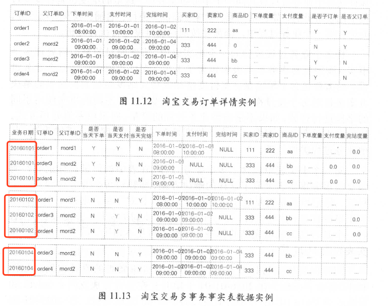
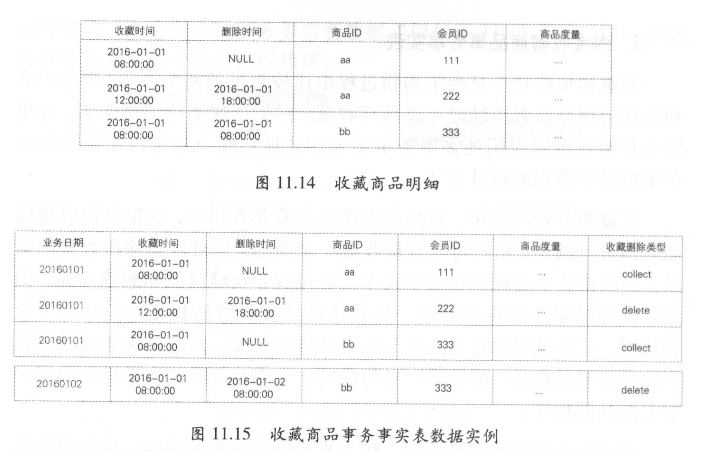
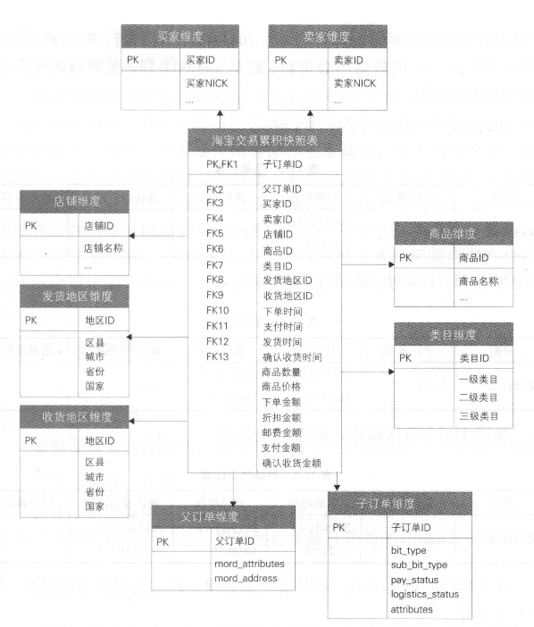
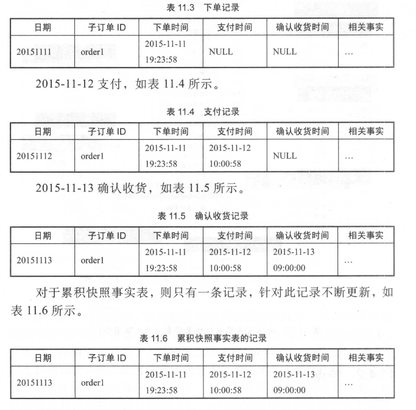
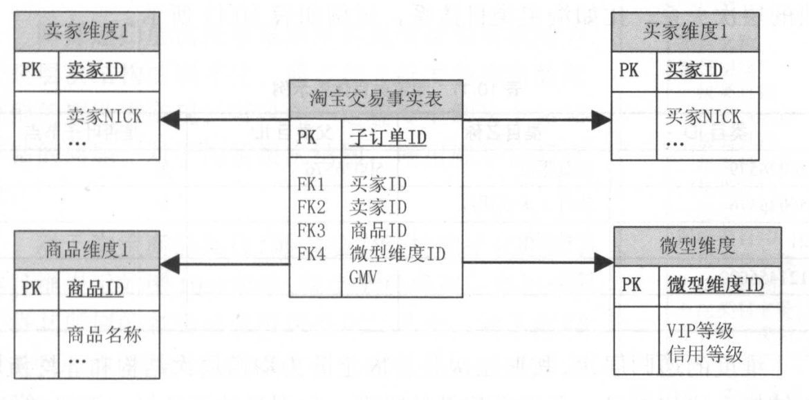
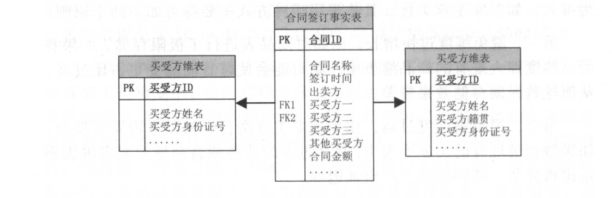
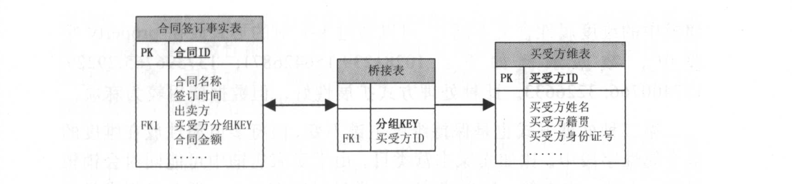

Kimball维度建模

[TOC]

## 1.基本概念

### 1.1 名称解释

**1.什么是业务过程？**

​		业务过程是组织完成的操作型活动，例如，获得订单，处理保险索赔、学生课程注册、每个月账单的快照。

​		每个业务过程对应企业数据仓库总线矩阵的一行

**2.交易域涉及哪些业务过程？**

**3.流量域涉及哪些业务过程？**

​		元素事件：加载、曝光、点击、关闭

​		页面浏览时长、视频观看时长

**4. 4步骤维度设计过程**

（1）选择业务过程

（2）声明粒度

（3）确认维度

（4）确认事实

**5. 粒度**

​		事实表中一条记录所表达的业务细节程度被称为粒度

​		在选择维度或事实前必须声明粒度，因为每个候选维度或事实必须与定义的粒度保持一致。

​		强烈建议从关注原子级粒度数据开始设计，因为原子粒度数据能够承受无法预期的用户查询。

**6.描述环境的维度**

​		维度提供围绕某一业务过程事件所涉及的“谁、什么、何处、何时、为什么、如何”等背景。

**7. 什么是度量？**

​		事实涉及来自业务过程事件的度量，基本上都是以数量值表示，例如：金额、用户数等

**8.什么是星型模型？什么是雪花模型？他们有什么区别？分布应用场景是什么？**

**9.订单表和订单明细表的理解**

​		在事务数据库中要分2张表存放：订单信息、订单明细表（订单对应商品的信息）

​		订单明细表：一把包括 商品的编号、商品的数量、商品的价格、商品的所属单号

​		订单表：一般包括 买家收货信息、支付金额

**10.维度退化**

​		维度属性存储到事实表中

**11.代理键和自然键**

​		都是用于标识某维度的具体值，

​		代理键：是不具有业务含义的键，一般用于处理缓慢变化维

​		自然键：是具有业务含义的键

**12.什么是事实**

​		表示某个业务的度量

### 1.2 事实表技术

**1.事实表结构**

​		发生在现实世界中的操作型事件，其所产生的可度量数值，存储在事实表中

​		从最低的粒度级别来看，事实表对应的一个度量事件

​		事实表除数字度量外，还包含外键，用于关联与之相关的维度，也包括可选的退化维度和日期/时间戳

​		查询请求的主要目标是基于事实表展开计算和聚集操作。

**2. 度量分类**

​		事实表中的数字度量可划分为三类：可加、半可加、不可加

​		可加：金额、用户数；最灵活、最有用，可以按照与事实表关联的任意维度汇总

​		半可加：差额；除时间维度外，可以跨所有维度进行加法操作

​		不可加：比率；对非可加事实，一种好的方式是，尽可能存储非可加度量的完全可加的分量，并在计算出最终的非可加事实前，将这些分量汇总到最终的结果集合中。

**3. 一致性事实**

​		如果某些度量出现在不同的事实表中，如果需要比较或计算不同事实表中的事实，应保证针对事实的技术定义是相同的。如果不同的事实定义是一致的，则这些一致性事实应该具有相同的命名。

**4. 事实表设计原则**

**（1）尽可能包含所有与业务过程相关的事实**

**（2）只选择与业务过程相关的事实**

**（3）分解不可加性事实为可加的组件**

​		比如订单优惠率，应该分解为订单原价金额与订单优惠金额两个事实存储在事实表中

**（4）在选择维度和事实之前必须先声明粒度**

**（5）在同一个事实表中不能有多种不同粒度的事实**

​		举例：机票支付成功事务事实表，粒度为票一级

​		在实际业务中，一个订单可以支付多张票，如ID为100901的订单包含三张机票，ID为100902的订单包含两张机票，ID为100903的订单包含一张机票。

​		在该事实表的设计中，票支付金额和票折扣金额两个事实与表定义的粒度一致，并且支持按表的任意维度汇总，可以添加进该事实表中。而订单支付金额和订单票数作为上一层粒度的订单级事实，与该票级事实表的粒度不一致，且不能进行汇总。

​		比如订单ID为100901的订单支付金额为3700元，订单票数为3张，如果这两个度量在该表进行汇总计算总订单金额和总票数，则会造成重复计算的问题，所以不能作为该表的度量选入。

**（6）事实的单位要保持一致**

​		比如原订单金额、订单优惠金额、订单运费金额，应采用一致的计量单位，统一为元或分，以方便使用

**（7）对事实的null值要处理**

​		事实表中的度量为null的值，建议用零值填充

**（8）使用退化维度提高事实表的易用性**

​		什么是退化维度：维度属性存储到事实表中

​		设计目的：减少下游用户使用时关联多个表的操作，直接通过退化维度实现对事实表的过滤查询、控制聚合层次、排序数据以及定义主从关系等。

​		通过增加冗余存储的方式减少计算开销，提高使用效率。

**5.事实表设计方法**

​		维度模型设计采用四步设计方法：选择业务过程、声明粒度、确定维度、确定事实

**（1）选择业务过程及确定事实表类型**

​		淘宝订单流转业务过程有4个：创建订单、买家付款、卖家发货、买家确认收货

​		在明确了流程所包含的业务过程后，需要根据具体的业务需求来选择与维度建模有关的业务过程

​		确定事实表类型：选择买家付款这个业务过程，则为单事务事实表；如果选择4个业务过程，并且需要分析个各个业务过程之间的时间间隔，则为包含4个业务过程的累积快照事实表。

**（2）声明粒度**

​		子订单级别（订单明细）

​		淘宝订单中有父子订单的概念，即一个子订单对应一个种商品，如果拍下了多个商品，则每种商品对应一个子订单；这些订单一同结算的话，则会生成一个父订单。

​		完成粒度声明之后，也就意味着确定了主键

**（3）确定维度**

​		相关维度有买家、卖家、商品、收货人信息、业务类型、订单时间等维度

**（4）确定事实**

​		事实可以通过回答“过程的度量是什么”来确定。

​		事实的粒度要与所声明的事实表的粒度一致

​		比如淘宝订单付款事务事实表中，同粒度的事实有子订单分摊的支付金额、邮费、优惠金额等。

**（5）冗余维度**

​		退化维度

​		订单付款事务事实表中，冗余产品险种、所属保险公司等维度信息

**6. 事务事实表**

**（1）定义**

​		事务事实表用来描述业务过程，跟踪空间和时间上某点的度量事件，保存的是最原子的数据，也称为“原子事实表”

（2）

**7. 多事务事实表**

​		将不同的事实放到同一个事实表中，即同一个事实表包含不同的业务过程

​		设计方法有2种：

（1）不同业务过程的事实使用不同的事实字段进行存放

​		举例：淘宝交易事务事实表同时包含下单、支付、成功完结三个业务过程，这三个业务过程拥有相同的粒度：子订单粒度，也比较适合放到同一个事实表中。

（2）不同业务过程的事实使用同一个事实字段进行存放，但增加一个业务过程标签

​		举例：淘宝收藏商品事务事实表，用户可以直接收藏一个商品，可以删除所收藏的商品，包含两个业务过程：收藏商品和删除商品

**多事务事实表的选择：**

- 当不同业务过程的度量比较相似，差异不大时，可以采用第二种多事务事实表的设计方式，使用同一个字段来表示度量数据。但这种方式存在一个问题：同一个周期内会存在多条记录
- 当不同业务过程的度量差异较大时，可以选择第一种多事务事实表的设计方式，将不同业务过程的度量使用不同字段冗余到表中，非当前业务过程则置零表示。这种方式存在的问题是度量字段零值较多。

**8. 单事务事实表和多事务事实表的比较**

|              | 单事务事实表                         | 多事务事实表                                                 |
| ------------ | ------------------------------------ | ------------------------------------------------------------ |
| 业务过程     | 一个                                 | 多个                                                         |
| 粒度         | 不相关                               | 相同粒度                                                     |
| 维度         | 相互间不相关                         | 一致                                                         |
| 事实         | 只取当前业务过程中的事实             | 保留多个业务过程中的事实，非当前业务过程中的事实需要置零处理 |
| 冗余维度     | 多个业务过程，则需要冗余多次         | 不同业务过程只需要冗余一次                                   |
| 理解程度     | 易于理解，不会混淆                   | 难以理解，需要通过标签来限定                                 |
| 计算存储成本 | 较多，每个业务过程都需要计算存储一次 | 较少，不同业务过程融合到一起，降低了存储计算量，但是非当前业务过程的度量存在大量零值 |

**9. 周期快照事实表**

**（1）定义**

​		周期快照事实表以具有规律性的、可预见的时间间隔记录事实，时间间隔如每天、每月、每年等。

​		快照事实表的粒度通常以维度形式声明

​		快照周期：天、周、月、季度、自然年、财年等

​		密度与稀疏性：事务事实表是稀疏的，快照事实表是稠密的

​		半可加性：半可加性事实不能根据时间维度获得有意义的汇总结果，但可以计算一下平均值

**（2）举例**

​		自然年至今或者历史至今的下单金额、支付金额、支付买家数、支付商品件数等状态度量

​		单维度的每天快照事实表：采样周期为每天，单个维度汇总

​		混合维度的每天快照事实表：在每天采用周期上针对多个维度进行采样

**（3）快照事实表设计步骤**

- 确定快照事实表的快照粒度
- 确定快照事实表采样的状态度量

**（4）应用场景**

​		周期快照事实表一般用于创建汇总指标，存储在DWS层

​		事务事实表与快照事实表往往都是成对设计，相互补充，以满足更多的下游统计分析需求，特别是在事务事实表的基础上可以加工快照事实表

**10. 累计快照事实表**

**（1）定义**

​		累计快照事实表用来表述过程开始和结束之间的关键步骤事件，覆盖过程的整个生命周期，通常具有多个日期字段来记录关键时间点，当过程随着生命周期不断变化时，记录也会随着过程的变化而被修改。

（2）举例

​		比如统计买家下单到支付的时长，买家支付到卖家发货的时长，买家从下单到确认收货的时长等

**11. 三种事实表的对比**

|            | 事务事实表             | 周期快照事实表                   | 累积快照事实表                       |
| ---------- | ---------------------- | -------------------------------- | ------------------------------------ |
| 时期/时间  | 离散事务时间点         | 已有规律的、可预测的间隔产生快照 | 用于时间跨度不确定的不断变化的工作流 |
| 时期维度   | 事务日期               | 快照日期                         | 相关业务过程涉及的多个日期           |
| 粒度       | 每行代表实体的一个事务 | 每行代表某时间周期的一个实体     | 每行代表一个实体的生命周期           |
| 事实       | 事务事实               | 累积事实                         | 相关业务过程事实和时间间隔事实       |
| 事实表加载 | 插入                   | 插入                             | 插入与更新                           |
| 事实表更新 | 不更新                 | 不更新                           | 业务过程变更时更新                   |

**12.无事实的事实表**

​		不包含事实或度量的事实表称为无事实的事实表。虽然没有明确的事实，但可以用来支持业务过程的度量。

​		常见的五事实的事实表有2种：

（1）事件类的，记录时间的发生

​		日志事件表，比如用户的浏览日志、点击、转发等行为

（2）条件、范围或资格类的，记录维度与维度多对多之间的关系

​		客户和销售人员的分配情况、产品的促销范围

**13. 聚集型事实表**

​		聚集主要是通过汇总明细粒度数据来获得改进查询性能的效果。

​		这类聚集汇总数据，叫做公共汇总层 DWS层

​		举例：卖家最近1天的交易汇总表，卖家最近N天的交易汇总表、卖家自然年交易汇总表等

​		**聚集的基本原则：**

- 一致性。

  聚集表必须提供与查询明细粒度数据一致的查询结果

- 避免单一表设计

  不要在同一个表中存储不同层次的聚集数据；否则将会导致双重计算或出现更糟糕的事实。

  在聚集表中有些行存放按天汇总的交易额，有些行存放按月汇总的交易额，这将会让使用者产生误用导致重复计算

  解决方法：按天与按月汇总的交易额用两列存放，但是需要在列名或者列注释上能辨别出来

- 聚集粒度可不同

### 1.3 维度表技术

**1.如何获取维度和维度属性？**

​		可以在报表中获取

​		可以在和业务人员的交谈中发现维度和维度属性

**2.维度的基本设计方法**

​		数仓的能力直接与维度属性的质量和深度成正比

商品维度设计方法：

（1）选择维度或新建维度

​		数仓中保证维度的唯一性，商品维度，有且只允许有一个维度定义

（2）确定主维表

​		主维表一般是ODS表，直接与业务系统同步

（3）确定相关维度表

​		根据对业务的梳理，确定哪些表和主维表存在关联关系，并选择其中的那些表用于生成维度属性

​		比如商品维度，可以得到商品与类目、SKU、卖家、店铺等维度存在关联关系

（4）确定维度属性

**3. 缓慢变化维**

​		在实现世界中，维度的属性并不是静态的，它会随着时间的流逝发生缓慢的变化

​		在Kimball理论中，有3种处理缓慢变化维的方式：

（1）重写维度值，不保留历史数据，始终取最新数据

（2）插入新的维度行，保留历史数据，维度值变化前的事实和过去的维度值关联，维度值变化后的事实和当前的维度值关联

（3）添加维度列

**4. 快照维表，处理缓慢变化维**

​		在Kimball的维度建模中，必须使用代理键作为每个维度的主键，用于处理缓慢变化维

​		在阿里数仓建设中，没有使用代理键。为什么不使用代理键？如何处理缓慢变化维？

**为什么不使用代理键？**

（1）阿里数据庞大，对每个表的记录生存稳定的全局唯一的代理键难度很大，此处稳定指某条记录每次生成的代理键都相同

（2）使用代理键会大大增加ETL复杂性，对ETL任务的开发和维护成本很高

**不使用代理键如何处理缓慢变化维**

​		采用快照方式，每天保留一份全量快照数据。

​		比如商品维度，每天保留一份全量商品快照数据。任意一天的事实均可以获取到当天的商品信息，也可以获取到最新的商品信息，通过限定日期，采用自然键进行关联即可。

​		优点：

- 简单有效，开发和维护成本低

- 使用方便，理解性好

  缺点：存储的极大浪费，需要设计对应的数据生命周期制度，清楚无用的历史数据

  

**5. 极限存储（拉链表）处理缓慢维度**

​		通过新增两个时间戳字段（start_dt和end_dt），将所有以天为粒度的变更数据都记录下来。

​		通常分区字段也是时间戳字段

​		优点：对于变化的数据，不再重复存储

​		缺点：

- 对于下游使用方存在一定的理解障碍，存在较高的解释成本

- 这种存储方式用start_dt和end_dt做分区，随着时间的推移，分区数量会极度膨胀。

  优化方法：分月做历史拉链表，每个月月初重新开始做历史拉链表

**6. 微型维度**

​		存在的问题：比如对于商品维表，每天20多亿条数据，如果在设计商品维度时，将值变化频繁的属性加入到商品维度中，极限情况是每天所有商品数据都发生变化，此时，极限存储没有意义；反之，每天所有商品数据都不发生变化，此时，只需要存储一天的数据即可。

​		微型维度：将一部分不稳定的属性从主维度表中移出，并将它们放置到拥有自己代理键的新表中来实现的，

**7. 维表递归层次如何处理**

​		维度属性以层次或一对多的方式相关关联；或者描述为不同维度之间的主从关系

​		比如商品和类目的关系、商品和品牌的关系、类目体系等

​		维度的递归层次分类：按照层级是否固定分为均衡层次结构和非均衡层次结构

- 均衡层次结构：比如类目、地区，有固定数量的级别
- 非均衡层次结构：比如公司之间的关系，每个公司可能存在一个母公司，但没有固定的一级、二级等层级关系

针对维表的递归层次有2种处理方法：

（1）层次结构扁平化

​		建立维度固定数量级别的属性来实现

（2）层次桥接表

**8. 行为维度**

**什么是行为维度？**

​		通过采用算法计算得到，或者进行统计得到的类似维度，都和事实相关，如交易、物流等，称之为“行为维度”或“事实衍生的维度”

​		如卖家主营类目维度、卖家主营品牌维度、用户常用地址维度等。其中卖家主营类目和主营品牌通过卖家的商品分布和交易分布情况，采用算法计算得到；卖家常用地址通过最近一段时间内物流中卖家的发货地址和买家的收货地址进行统计得到。

**常见的行为维度有哪些？**	

（1）另一个维度的过去行为

​		如买家最近一次访问淘宝的时间、买家最近一次发生淘宝交易的时间等

（2）快照事实行为维度

​		如买家从年初截止当前的淘宝交易金额、买家信用分值、卖家信用分值等

（3）分组事实行为维度，将数值类型事实转换为枚举值

​		如买家从年初截至到当前的淘宝交易金额按照金额划分的等级、买家信用分值按照分数划分得到的信用等级等

（4）复杂逻辑事实行为维度，通过复杂算法加工或多个事实综合加工得到。

​		如卖家主营类目，商品热度根据访问、收藏、加入购物车、交易等情况综合计算得到

**行为维度，2中处理方式：**

（1）将其冗余至现有的维表中

​		如将卖家信用等级冗余至卖家维表中

（2）加工成单独的行为维表

​		如卖家主营类目

具体采用哪种方式主要参考2个原则：

（1）避免过度过快增长

​		比如对商品表进行了极限存储（拉链存储），如果将商品热度加入现有商品维度表中，则可能会使每日商品变更占比过高，从而导致极限存储效果较差

（2）避免耦合度过高		

​		比如卖家主营类目，加工逻辑异常复杂，如果融合进现有的卖家维度表中，那么过多的业务耦合会导致卖家维度表刷新逻辑复杂、维护性差、产出延迟等。

​	

**9. 维表中多值维度的处理**

​		事实表的一条记录在某维表中有多条记录与之对应。

​		举例：淘宝交易订单，买家一次购买多种商品，如一件毛衣和两双袜子，称为交易父订单；对于每种商品的交易，称为交易子订单；此交易父订单有两个子订单与之对应。假设设计交易父订单事实表，则事实表的每条记录，在商品表中都有一到多条记录与之对应。

​		针对多值维度，有3种处理方法：

**（1）降低事实表的粒度**

​		将交易订单设为子订单粒度，对应每个子订单，只有一种商品与之对应

**（2）采用多字段**

​		很多时候事实表的粒度是不能降低的，比如在房地产销售中，每次合同签订都可能存在多个买受方的情况，如夫妻合买等。

​		对于合同签订事实表，每条记录可能对应多个买受方，而合同已经是此事实中的最细粒度，无法通过降低维度粒度的方式来解决。由于合同签订的买受人一般不会太多，可以采用多字段方式。

**（3）桥接表**

​		通过在事实表和维表之间开发一个分组表，通过此分组表建立连接。其中桥接表包含和事实表关联的分组Key，以及作为买受方维表外键的买受方ID。如果事实表的一条记录对应两个买受方，则桥接表针对这两个买受方建立两条记录，分组Key相同。

​		桥接表方式更加灵活、扩展性更好，但逻辑复杂、开发和维护成本较高，可能带来双重计算的风险，选择此方式需慎重。

**10. 维度表多值属性的处理**

​		维表中的某个属性字段同时有个多个值，称之为“多值属性”。

​		举例：每个商品均有一个到多个SKU、一到多个属性和一到多个标签，所以商品和SKU、属性、标签都是多对多的关系。

​		对于多值属性，常见有3中处理方法：

**（1）保持维度主键不变，将多值属性放在维度的一个属性字段中**

​		比如商品属性，可以通过k-v对的形式放在property字段中，数据示例：10281:134566；13739:245664；

​		优点：扩展性好

​		缺点：数据使用较为麻烦

**（2）保持维度主键不变，将多值属性放在维度的多个属性字段中**

​		比如卖家主营类目，由于卖家商铺中可能同时销售男装、女装、内衣等，所以主营类目有多个。

​		需要注意：如果多值属性字段具体值的数量固定，可以采用多个属性字段进行存储，如果数量不固定，则可以采用预留字段的方式，但扩展性较差

​		优点：方便数据统计分析和报表展示

​		缺点：扩展性较差

**（3）维度主键发生变化，一个维度值存放多条记录**

​		比如商品SKU维表，对于每个商品，有多少SKU，就有多少记录，主键是商品ID和SKU的ID

​		优点：扩展性好，使用方便

​		缺点：需要考虑数据的急剧膨胀，比如淘宝商品属性表采用了此种处理方法，数据记录达到几百万亿的级别

## 2.KimBall维度建模过程

## 3.建模案例

### 3.1 交易域建模

### 3.2 流量域建模

1.建模流程

2.涉及业务过程

3.度量指标

​	行为次数，行为时长

### 3.3 财务域建模

#### 3.3.1 基本概念

**1.财务分析涉及的财务应用**

​		包括总账、采购、应付账款明细、开票、应收账款、固定资产等

