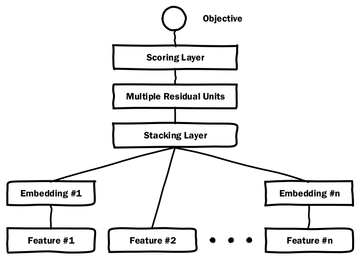
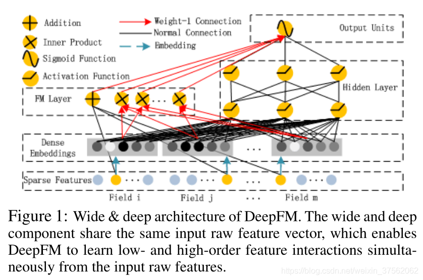
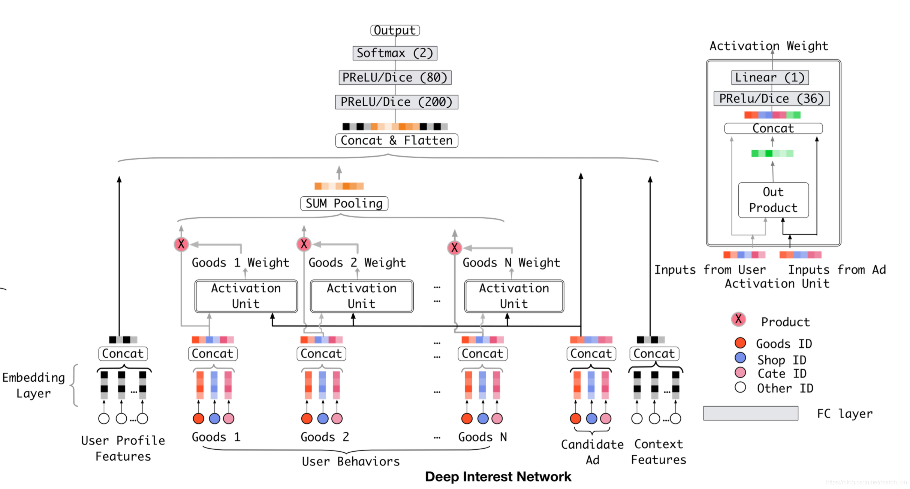
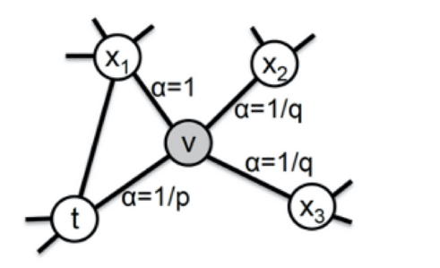

Recommendation

[TOC]

## 1 理论

### 1.1 check以下知识点

- NN、RNN、个别聚类算法，模型评估等知识理解程度
- spark的调优经验，model serving的主要方法， parameter server的原理
- GAN、LSTM、online learning的基本理解
- embedding方法、attention机制、multi task、reinforcement learning、online learning的基本理解

### 1.2 知识点

#### 1.2.1 推荐系统常用的损失函数

**1.binary_crossentropy二进制交叉熵**

​		损失函数的目的：评估预测属于某个类别概率的好坏，对于错误的预测，它应该返回高值，对于良好的预测，它应该返回低值。

#### 1.2.2 Batch Normalization

​		在深度神经网络训练中，Batch Normalization有诸多非常强大的作用和效果：无论使用哪种激活功能或优化器，BN都可加快训练过程并提高性能；解决替代消失的问题；规范权重；优化网络梯度流等。

**1.原理**

​		**深层神经网络存在的问题**：在深层升级网络中，中间层的输入是上一层神经网络的输出。因此，之前的层的神经网络参数的变化会导致当前层输入的分布发生较大差异。在使用随机梯度下降法来训练神经网络时，每次参数更新都会导致网络中每层的输入分别发生变化。越是深层的神经网络，其输入的分布会改变的越明显。

​		**解决方法**：对每一层神经网络都进行归一化操作，使其分布保持维稳定。

​		BN批量归一化：是一种有效的逐层归一化方法，可以对神经网络中任意的中间层进行归一化。对一个深层神经网络来说，令第i层的净输入为 $z^{(l)}$,  经过激活函数后的输出是$a^{(l)}$ 即：

​										$a^{(l)} = f(z^{(l)}) = f(Wa^{(l01)} + b)$

​		 其中，f(.)是激活函数，W和b是权重和偏置参数。

2.

​		BN算法好处：

- 省去参数选择问题

## 2 模型

1. 主流的推荐模型有哪些？主流的Embedding方法有哪些？

   排序模型：FM、DeepFM、Wide&Deep、DIN

   Embedding：u2i：矩阵分解ALS、DSSM；i2i：word2vec

### 2.1 FM

​	**Factor Machine：因子分解机**

**1.FM模型公式**

​		FM模型公式如下：

​				$y = w_0 + \sum_{i=1}^nw_ix_i + \sum_{i=1}^n\sum_{j=i+1}^n<v_i,v_j>x_ix_j$

​		其中二次项是1到n的所有特征两两组合，这一项可以变形如下：

​				$\sum_{i=1}^n\sum_{j=i+1}^n<v_i,v_j>x_ix_j = \frac{1}{2}\sum_{f=1}^k[(\sum_{i=1}^nv_{i,f}x_i)^2 - \sum_{i=1}^nv_{i,f}^2x_i^2]$

**2.为什么要引入隐向量？**

​		为了用两个隐向量的内积模拟二次项的参数，从而极大降低参数个数，并且缓解二次项稀疏的问题。

​		假设有1万个特征，特征的两两组合，那么二次项就有$C_10000^2=49995000$这么权重。

​		而加入隐向量后，可以看公式2的等号右边：中括号内只有N的复杂度，中括号外面是k的复杂度，因此总的复杂度降到了kN。考虑到k是隐向量的维度，可以根据效果和复杂度来人为指定，是远远小于特征数的，比如取k为16，则kN=16*10000=160000。

**3.在推荐系统里是怎么用的呢？**

​		举个电商的例子，每个样本包含四个特征，所有特征均为0或1的二值特征，分别是： 

​		$x_1=$用户性别男，$x_2用户性别女=$，$x_3=$商品类别化妆品，$x_4=$商品类别剃须刀

​		假设隐向量维度k=2，那么算出的隐向量可能是这样的：

​									$v_1 = [1, -1]$

​									$v_2 = [-1, 1]$

​									$v_3 = [-2, 2]$

​									$v_4 = [0.5, -0.5]$

​		假设某样本为{女，化妆品}，则样本为$x=[0, 1, 1, 0]$

​		$y = \frac{1}{2}[(v_{2,1}x_2+v_{3,1}x_3)^2 - (v_{2,1}^2x_2^2 + v_{3,1}^2x_3^2)]+\frac{1}{2}[(v_{2,2}x_2+v_{3,2}x_3)^2 -(v_{2,2}^2x_2^2 +v_{3,2}^2x_3^2)]$

​           $=\frac{1}{2}[(-3)^2 - 5] + \frac{1}{2}[(3)^2 -(5)] = 4$

​		如果是{男，化妆品}，则结果为-4，显然女性与化妆品组合的算出的分值更大。

​		如果是{男，剃须刀}，则结果为1，也要比{男，化妆品}得分高。

**3.加入隐向量降低复杂度可以理解了，可是为什么要做形如公式2的变换？**

​		原始的式子（等号左边）难以进行梯度反向传播，变换后的反向梯度计算就非常方便。

### 2.2 MLP

​		**Multi-layer Perceptron：多层感知机**

**1.Embedding+MLP的经典结构**

​		输入特征层：Feature层

​		Embedding层：把类型特征转化成Embedding

​		Stacking层：把所有特征连接起来，把不同的embedding特征和数值特征拼接在一起，形成新的包含全部特征的特征向量。

​		MLP层：多层神经网络，让特征向量不同维度之间做充分的交叉，让模型能够抓取更多的非线性特征和组合特征的信息

​		Scoring层：输出层，最终要预测的目标是一个分类的概率。如果是点击率预估，就是一个二分类问题，可以采用逻辑回归作为输出成神经元，如果是类似图像分类这样的多分类问题，采用softmax多分类模型。

### 2.3 Wide&deep

**1.Wide&deep模型结构？**

​		wide：是一个常见的线性模型，可以认为是LR。

​		deep：是一个前馈神经网络NN，将类别特征的Embedding输入，然后经过一系列的隐藏层。

​		Hidden Layers：为三个全连接层，每个layer后面连接Relu激活函数。

​		输出层：Logistic Loss逻辑损失函数

​		联合训练：将wide和deep模型组合在一起，在训练时同时优化所有参数，并且在训练时进行加权求和，根据最终的loss计算出gradient，反向传播到wide和deep两部分中，分别训练自己的参数。wide&deep模型的权重更新会受到wide侧和deep侧对模型训练误差的共同影响。在论文中，wide部分使用L1正则化Follow-the-regularized-leader（FTRL）算法进行优化，deep部分使用的是AdaGrad完成优化。

**2.谈谈你对Wide&deep模型的理解**

​		wide部分的主要作用是让模型具有较强的“记忆能力”（memorization），让模型学习历史数据中物品或者特征的“共现频率”，并且把它们直接作为推荐依据的能力。举例：看了A电影的用户经常喜欢看B电影。

​		deep部分主要作用是让模型具有“泛化能力”（generalization）。“泛化能力”指的是模型对于新鲜样本、以及从未出现过的特征组合的预测能力。举例：我们知道25岁**男性喜欢看电影A**，**35岁**女性也**喜欢看电影A**，那35岁男性喜不喜欢看电影A

​	对于Wide&deep来说，最重要的并不是这个模型结构，而是如何设计Deep特征和Wide特征，从而发挥这个模型的最大的功力

**3.哪些特征适用于wide侧，哪些特征适用于deep侧？**

- wide
  - 作用：记忆，学习样本特征中特征的共现性，产生的结果是和用户有过直接行为的item，通过少量的交叉特征转换来补充deep的弱点
  - 交叉特征、离散特征、部分连续特征
- deep
  - 作用：泛化，用于学习历史数据中不存在或者低频的特征组合
  - 用户行为特征、稠密连续特征、离散特征的embeding

**4.模型调优**

​		（1）防止模型过拟合，加入dropout与L2正则

​		（2）加快模型收敛，引入Batch Normalization（BN）；并且为了保证模型训练的稳定性和收敛性

​		（3）尝试不同的learning rate（wide=0.001，deep=0.01 效果较好）

​		（4）batch_szie = 2048

​		（5）优化器：对比了SGD、Adam、Adagrad等学习器，效果最好Adagrad

​	CTR = Click / Show content提升6.8%

​	CVR= 转化量/点击量 提升15%

**5.wide&deep是如何联合训练的？**

​		wide部分和deep部分使用其输出对数几率的加权和作为预测，然后将其输入到联合训练的一个共同的逻辑损失函数。

​				$P(Y=1|x)= \sigma(W_{wide}^T[x,\phi(X)] + W_{deep}^Ta^{l_f} + b)$

​				Y：二值分类标签

​				$\sigma(.)$：是sigmoid函数

​				$\phi(x)$：是原始特征x的跨产品变换

​				b：偏置项

​				$W_{wide}$：是wide模型的权重向量

​				$W_{deep}$：是用于最终激活函数$a^{l_f}$的权重

​		wide&deep模型的联合训练是通过使用小批量随机优化同时将输出的梯度反向传播到模型wide和deep部分来完成的。实验中，wide部分使用L1正则化Follow-the-regularized-leader（FTRL）算法进行优化，deep部分使用的是AdaGrad进行优化。

### 2.4 DeepFM

**1.DeepFM的模型结构？**

​		DeepFM分为两部分：FM和DNN，FM和DNN以并行方式组合，并且共享Embedding向量作为输入，预测公式为：$\hat{y} = sigmoid(y_{FM}+ y_{DNN})$。

​		DeepFM网络结构由输入层、Sparse Features层、Dense Embedding成、FM层和Hidden层、输出层组成。

- 输入层：输入的每个特征（包含连续特征和离散特征）

- Sparse Features：输入特征经过one-hot转换，由一列会变成多列，转变成稀疏矩阵；对应图中，每个连续特征对应一个点，离散特征经过one-hot转换对应n个点。

- Dense Embedding：对sparse features做特征转换，FM的二阶两两交互计算部分和Deep部分共享embedding结果。

- FM：FM Layer包含一个1阶特征的Addition和多个2阶组合特征Inner Product内积单元。

- Deep：普通的前馈神经网络，Activation Function：可以选择relu或者tanh。

  负责所有特征的深度拟合，提高整体的表达能力。

  Dense Embedding层的神经元个数=embedding vector * field_size。

- 输出层：$\hat{y} = sigmoid(y_{FM}+ y_{DNN})$

**2.如何理解DeepFM模型？**

​		DeepFM采用了FM部分加Deep部分的结构，其中FM部分解决特征交叉的问题，Deep部分使用多层神经网络模型的拟合能力。传统的MLP深度学习模型对特征交叉的处理没有针对性，特征交叉的学习效率低，所以要通过增加特征交叉层的方式增强深度学习模型的特征交叉能力。

​		举例：模型的输入有性别、年龄、电影风格这几个特征，在训练样本中我们发现有 25 岁男生喜欢科幻电影的样本，有 35 岁女生喜欢看恐怖电影的样本，那你觉得模型应该怎么推测“25 岁”的女生喜欢看的电影风格呢？

**3.模型调优**

（1）batch_size = 2048， 从64调整到2048，auc提升0.6%

（2）网络结构：使用2层全连接层(128, 64)比(256, 128)auc提升0.17%

（3）BN层：加入BN层，auc提升0.68%

（4）Embedding size：从32到64没有带来明显的效果提升，使用32维

**4.对比一下Wide&Deep和DeepFM模型，及它们的应用场景**

- 优势：	
  - DeepFM：在解决特征交叉问题上非常有优势，它会使用一个独特的FM层来专门处理特征之间的交叉问题。具体来说，就是使用点积、元素积等操作让不同特征之间进行两两组合，再把组合后的结构输入的输出神经元中，这会大大加强模型特征组合的能力。因此DeepFM模型相比于Embedding MLP、Wide&Deep等模型，具有更好的推荐效果。
  - 

### 2.5 DIN

​		Deep Interest Network 深度兴趣网络

#### 2.5.1 模型设计思路

**1.电商业务场景**

- 会有大量的用户历史行为信息
- 用户【兴趣】多种多样，并且变化多端
- 用户的【兴趣】往往蕴含在其【历史行为】中
- 对于用户点不点当前的商品广告，很大程度上依赖他的历史行为的

**2.模型设计思路**

（1）输入特征中，包含用户历史行为

​		并不是所有的历史特征，都对当前预估任务有效，必须筛选出有效特征，并按照重要程度，分配相应权重。

​		举例：

​			目标商品：键盘

​			用户历史行为中的商品有：【化妆品、包包、衣服、洗面奶】

​			用户历史行为中的商品有：【鼠标、电脑、iPad、手机】

​			用户历史行为中的商品有：【鼠标、化妆品、衣服、洗面奶】

（2）考虑用户的历史行为商品与当前商品广告的一个【关联性】（局部兴趣），模拟出用户对目标商品的感兴趣程度（注意力得分）

**3.解决方案**

​	在Embedding层与MLP之间加入注意力机制

​		不同的应用场景，特征的权重分配应该不一样

​		筛选出有用的特征，并划分好比重（哪些特征是重要特征）

#### 2.5.2 特征表示

​		工业上的CTR预测数据集一般都是multi-group categorial form的形式，就是类别特征最为常见：		

​		这里的亮点就是框出来的那个特征，这个包含丰富的用户兴趣信息。

​		特征编码说明，举例说明：[weekday=Friday, gender=Female, visited_cate_ids={Bag, Book}, ad_cate_id=Book]，一般使用one-hot对其编码，但是对于visited_cate_ids，也就是用户的历史商品列表，对于某个用户来讲，这个值是多值型的特征，而且还要知道这个特征的长度不一样长，也就是用户购买的历史商品个数不一样多。对于这个特征使用multi-hot编码。

​		

#### 2.5.3 Base模型及其缺点

**1.Base模型结构**

​		Base Model是一个典型的Embedding MLP的结构，输入特征有用户特征（User Proflie Features）、用户行为特征（User Behaviors）、候选广告特征（Candidate Ad）和场景特征（Context Features）。

​		用户行为特征是用户最近购买过的商品组成，把ID特征构建Embedding，把Embedding跟其他特征连接起来，输入MLP。

​		用户的行为序列是一组商品序列，可长可短，但是神经网络的输入向量的维度必须是固定的，图中采用Sum Pooling把这些商品Embedding叠加起来，把叠加的Embedding跟其他特征的输入结果输入MLP。

​		Sum Pooling的Embedding叠加操作是把所有历史行为一视同仁，没有任何重点地加起来，不符合真实习惯。

​		DIN模型把注意力机制应用在用户的历史行为序列处理上

**2.Base模型缺点**

- 用户的历史行为特征和当前的候选广告特征再全都拼起来喂给神经网络之前，是一点交互的过程都没有
- 拼起来之后给神经网络，虽然是有了交互了，但是即丢失了部分信息，也引入了一定的噪声
  - 丢失信息：已经没法再看出到底用户历史行为中哪个商品与当前商品比较相关，也就是丢失了历史行为中各个商品对当前预测的重要性程度
  - 引入噪声：因为当前候选广告商品交互的是池化后的历史特征embedding，这个embedding是综合了所有的历史商品信息，这个通过我们前面的分析，对于预测当前广告点击率，并不是所有历史商品都有用，综合所有商品信息反而会增加一些噪声性的信息。

**3.改进思路**

​		对于给定的候选广告，DIN通过考虑历史行为与其相关性，自适应地计算用户兴趣的表示向量，该表示向量随不同广告而变化。

#### 2.5.4 DIN模型网络结构

**1.DIN网络架构**

​		与Base Model相比，DIN为每个用户的历史购买商品加上了一个激活单元（Activation Unit），这里面是一个前馈神经网络，输入是用户历史行为商品和当前的候选商品，输出是它两之间的相关性，这个相关性相当于每个历史商品的权重，把这个权重与原来的历史行为embedding相乘求和就得到了用户兴趣表示$v_U(A)$，计算公式：

​			$v_U(A) =  f(v_A,e_1,e_2,...e_H) = \sum_{j=1}^Ha(e_j, v_A)e_j = \sum_{j=1}^Hw_je_j$

​	${v_A, e_1,e_2,...,e_H}$是用户U的历史行为特征embedding

​	$v_A$：表示候选广告A的embedding向量

​	$a(e_j, v_A) = w_j$：表示权重或者历史行为商品与当前广告A的相关程度

​	$a(.)$ ：表示前馈神经网络，注意力机制

需要注意是这里的权重和不是1，准确的说这里不是权重，而是直接算的相关的分数做了权重，这个是为了保留用户的兴趣强度。

​			

**2.激活单元（Activation Unit）结构**

​		激活单元内部结构：当前这个历史行为商品的Embedding和候选广告商品的Embedding作为输入，与它们的外积结果连接起来形成一个向量，再输入给激活单元的MLP层，最终会生成一个注意力权重，这就是激活单元的结构。

​	**激活单元就相当于一个小的深度学习模型，它利用两个商品的Embedding，生成了代表他们关联程度的注意力权重。**

（1）输入层：

​		key：user产生行为（例如点击、购买）的item embedding

​		query：候选item embedding

（2）Out Product层：

​		点积：计算矩阵之间的element-wise乘法

（3）Concat层：

​		将query，key，query-key，query * key（Out Product层，element-wise乘法）的结果进行拼接

（4）Dense层：

​		全连接层，并以PReLU或Dice作为激活函数

（5）Linear层（输出层）

​		全连接层，输出单元为1，即得到（query，key）相应的权重值

**3.损失函数**

损失函数用二分类交叉熵损失函数

​			$L = -\frac{1}{N}\sum_{(x,y) \in S}(ylogp(x)+(1-y)log(1-p(x)))$

#### 2.5.5 Dice激活函数

**1.PReLU存在的问题**

​		ICS问题：每层输入数据的分布可能不一样，从而引发一系列问题，举例：当数据分布集中在小于0的区间，梯度值小，参数更新将变得很缓慢（梯度消失）

​		解决ICS问题有2种方案：1种就是改变数据分布，这种方法对应BN的思想。另一种就是根据数据分布，来自行移动激活函数。

**2.优化激活函数的思路及方案**

​		PReLU激活函数的公式如下：

​													$f(s) = \begin{cases}s & if & s >0 \\ \alpha s & if & s<=0 \end{cases} = p(s)*s + (1-p(s)) * \alpha s$

​		其中p(s)为控制函数，其定义为p(s)=l(s>0)，l(.)为指示函数。

优化思路：

- 从公式中发现，分割点是由p(s)决定的，只要控制p(s)，就可以控制分割点左右移动
- 并且可以控制平滑度（当p(s)平滑的时候，f(s)也会变得平滑）

解决方案：

- 使用数据的均值E(s)来决定分割点的位置

- sigmoid函数作为p(s)，并让sigmoid根据数据分布进行移动

  - E(s)控制曲线左右移动
  - Var(s)控制曲线的胖瘦：Var(s)越大，就越胖；Var(s)越小，就越瘦

- sigmoid函数使得p(s)平滑化

  

**3.激活单元中的Dice激活函数**

​		Dice激活函数是PReLU的基础上进行改进的，首先PReLU激活函数的公式如下：

​													$f(s) = \begin{cases}s & if & s >0 \\ \alpha s & if & s<=0 \end{cases} = p(s)*s + (1-p(s)) * \alpha s$

​		其中p(s)为控制函数，其定义为p(s)=l(s>0)，l(.)为指示函数。

​		Dice激活函数把PReLu激活函数中的p(s)进行了修改：

​		

​		Dice激活函数的表达式如下：

​												$f(s) =  p(s) * s + (1-p(s)) * \alpha s$

​												$p(s) = \frac{1}{1+e^{-\frac{s - E[s]}{\sqrt{Var[s] + \xi}}}}$

​		E[s]：mini-batch输入的均值；

​		Var[s]：mini-batch输入的方差；		

​		$\xi$：非常小的尝试$10^{-8}$

​		Dice主要思想是根据输入数据的分布，自适应地调整校正点，使其值为输入的均值。当E[s]和Var[s]均为0时，Dice和PReLU是等价的。

#### 2.5.6 注意力机制

​		DIN模型在Base模型的基础之上，增加了一个local activation unit，这里面是一个前馈神经网络。

- 输入：用户历史行为商品和当前的候选商品
- 输出：它两之间的相关性，这个相关性相当于每个历史商品的权重
- Sum Pooling加权求和：把这个权重与原来的历史行为的embedding相乘求和就得到了用户的兴趣表示。

**2.注意力机制的三个步骤**

- Query：当前候选商品Candidate Ad
- Key：用户历史行为商品，Good1...Goodn
- Value：同Key，用户历史行为商品，Good1...Goodn
- F(Q, K)：Activation Unit
- 不做softmax归一化的原因：是为了保留用户兴趣强度

#### 2.5.7 训练方式

#### 2.5.8 评估指

（1）注意力机制具体指的是什么？

（2）DIN中注意力单元的具体结构是什么？

（3）能否写出注意力单元的形式化定义，并推导它的梯度下降更新过程？

### 2.6 DIEN

**1.DIEN解决的问题**

​		深度兴趣进化网络DIEN（Deep Interest Evolution Network）是DIN模型的演化版本。

​		用户的历史行为是一个随时间排序的序列，存在前后行为的依赖关系，这样的序列信息对于推荐过程非常有价值。对于电商来说，用户兴趣的迁移是非常快的：比如，上一周用户在挑一双篮球鞋，行为序列会集中在篮球鞋这个品类的各个商品，但完成这个购物目标之后，这周的兴趣可能就变成了买一个机械键盘，那购买行为会围绕机械键盘这个品类展开。

**2.DIEN模型结构**

​		DIEN模型整体上也是一个Embedding MLP的模型结构，与DIN不同的是，DIEN用“兴趣进化网络”也就是图中的彩色部分替换掉了原来带有激活单元的用户历史行为部分。它的输出是一个h'(T) 的Embedding向量，代表用户当前的兴趣向量，把这个兴趣向量与其他特征连接在一起，DIEN就能通过MLP做出最后的预测了。

​		DIEN模型是如何生成这个兴趣向量的：

- 最下面一层是行为序列层（Behavior Layer，浅绿色部分）

  主要作用和一个普通的Embedding层一样的，负责把原始的ID类行为序列转换成Embedding行为序列。

- 再上一层是兴趣抽取层（Interset Extractor Layer，浅黄色部分）

  主要作用是利用GRU组成的序列模型，来模拟用户兴趣迁移过程，抽取每个商品节点对应的用户兴趣。

- 最上面一层是兴趣进化层（Interest Evolving Layer，浅红色部分）

  主要作用是利用AUGRU（GRU with Attention Update Gate）组成的序列模型，在兴趣抽取层基础上加入注意力机制，模拟与当前目标广告（Target Ad）相关的兴趣进化过程，兴趣进化层的最后一个状态的输出就是用户当前的兴趣向量h'(T) 。

**序列模型：**

​		兴趣抽取层和兴趣进化层都用到了序列模型的结构。序列模型是“一串神经元”，其中每个神经元对应一个输入和输出。

​		在DIEN模型中，神经元的输入就是商品ID或者前一层序列模型的Embedding向量，而输出就是商品的Embedding或者兴趣Embedding，除此之外，每个神经元还会与后续神经元进行连接，用于预测下一个状态，放在DIEN里就是为了预测用户的下一个兴趣。

RNN模型的经典结构：

​		根据序列模型神经元结构的不同，最经典的有RNN、LSTM、GRU三种模型：

​		序列模型中的不同单元结构：

### 2.7 ESMM 完整空间多任务模型

**Entire Space Multi-task Model（ESMM）完整空间多任务模型**

**1.ESMM解决了什么问题**

​		ESMM是阿里算法团队提出的多任务训练方法，电商推荐系统，最大化场景商品交易总额（GMV）是平台的重要目标之一，GMV=流量 x 点击率 x 转化率 x 客单价，因此转化率是优化目标的重要因子之一。

​		传统的CVR预估任务通常采用类似于CTR预估技术，存在两个主要问题：**样本选择偏差**和**稀疏数据**

​		为了解决上面两个问题，阿里提出了完整空间多任务模型ESMM，ESMM模型利用用户行为序列数据在完整样本空间建模，避免了传统CVR模型经常遇到的样本选择偏差和训练数据稀疏问题，取得了显著成果。

**2.CTR和CVR预估中几个重要名词**

​		**impression：**用户观察到的曝光产品

​		**click：**用户对impression的点击行为

​		**conversion：**用户点击之后对物品的购买行为

​		**CTR：**从impression到click的比例

​		**CVR：**从click到conversation的比例

​		**CTCVR：**从impression到conversation的比例

​		**pCTR：**p(click=1 | impression)，曝光点击率

​		**pCVR：**p(conversion=1 | click=1, impression)，点击转化率

​		**pCTCVR：**p(conversion=1, click=1 | imoression) = p(click=1 | impression) * p(conversion=1 | click=1, impression) ，即pCTCVR = pCTR * pCVR（曝光后，点击转化率）

**3.ESMM网络结构**

​		为了解决样本选择偏差问题（SSB）数据稀疏问题（DS），ESMM提出了一个多任务学习的框架，**能够使用整个样本空间的数据；同时优化pCTCVR和pCTR，进而做到优化CVR的目的**。ESMM模型的目标函数如下：

​								$L(\theta_{cvr}\theta_{ctr}) = \sum_{i-1}^Nl(y_i, f(x_i, \theta_{ctr})) + \sum_{i=1}^Nl(y_i \& z_i, f(x_i, \theta_{ctr}) \times f(x_i, \theta_{cvr}))$

​		上式中，N代表样本数据量；$\theta_{cvr}, \theta_{ctr}$分布代表cvr网络，ctr网络的参数；$l(\cdot)$是交叉熵损失函数

​		计算公式：

​							$p(y=1, z=1|x) = p(y=1|x) \times p(z=1|y=1, x)$

​                                   pCTCVR                   pCTR                     pCVR

​		其中pCTCVR(曝光后，点击转化率)，pCTR曝光点击率，pCVR点击转化率，其中x表示特征向量，y=1表示点击数据，z=1表示转化数据。

​		ESMM模型由两个完全相同的子网络连接而成，子网络模型称之为Base模型：

​		Base模型结构：

- EMbedding Layer

  输入包括user field和item field。user field主要由用户的历史行为序列构成：包含用户浏览的产品ID列表、用户浏览的品牌ID列表、类目ID列表等；不同的实体ID列表构成不同的field。

  网络的embedding层，把这些实体ID都映射为固定长度的低维向量

- Field-wise Polling Layer

  把同一个field的所有实体embedding向量求和得到对应当前field的唯一向量；之后所有的field向量拼接（concat）在一起构成一个大的隐层向量

- MultiLayer Perception	

  MLP网络结构：隐层向量接入若干全连接层，最后再连接只有一个神经元的输出层。	

左边的网络结构为预测pCVR任务，右边的网络结构预测pCTR任务，最后pCTR * pCVR输出一个融合的结果pCTCVR；pCVR网络和pCTR网络，共享embedding层的参数。

**4.ESMM模型主要特点**

**（1）整个样本空间建模**

​		区别与传统的CVR预估方法通常使用“点击—>成交”日志构建训练样本，ESMM模型使用“曝光—>点击—>成交”日志数据来构建训练样本

**（2）共享特征表示**

​		两个子任务（CTR预估和CVR预估）之间共享各类实体（产品、品牌、类目、商家等）ID的embedding向量表示。

**5.ESMM模型样本选择**

​		CTR：曝光点击事件正样本；曝光未点击负样本

​		CVR：曝光点击购买事件正样本，否则标记为负样本

### 2.8 MMoE

**Multi-gate Mixture-of-Experts（MMoE）**

**Multi task Learning（MTL）多任务学习**

#### 2.8.1 模型简介

**1.MMoE解决了什么问题**

​		推荐系统中，希望提高用户的点击率，同时也希望提高视频的播放时长，视频点赞等。这些目标的达成并非是简单的相辅相成，更多的可能是相互竞争的关系，具有跷跷板现象，一个任务目标效果好后，可能另一个目标的效果会有所下降，需要多任务一起结合训练。

​		只让模型学习点击率，经过训练的模型推荐结构很可能导致标题党和封面党大行其道，如果一味追求高点赞，也可能就忽略了一些相对冷门的或新的佳作。

​		MMoe更像一个多任务的一个框架，提供了一个简单有具有一定可结实性的多任务解决思路。

#### 2.8.2 模型结构

**1.多目标问题模型结构升级过程**

**A：Shared-Bottom model**

​		最底层是输入层，然后是共享网络层，最上层每个单任务都对应一个单独的塔结构。

- 优点：

  共享底层模块，可以减少模型的参数，降低学习成本。若不同任务之间很相似，可以有较为不错的效果。

- 缺点：

  不同任务之间可能存在较大的差异，硬性共享容易产生较大的冲突，相互影响。限制了模型的表达能力，多个任务各自有不同的数据分布，而相同的特征输入会极大地削弱模型的多任务输出表达，而在某种程度上降低了多目标模型的泛化能力。

  

**B：One-gate MoE model**

​		与Shared-Bottom model结构相比，MoE将Shared-Bottom层替换成多个独立的Expert模型，其实就是多个独立的MLP模块，每个Expert模块可以认为是专注于学习特定领域的知识，其次引入一个门控机制，根据输入的不同，动态调整各个Expert对象的权重，根据权重加权求和，再接各个任务独立的Tower进行输出。

- 优点：

  将shared层划分为多个独立的Expert层，降低了多个任务之间的冲突影响，同时引入门控机制，动态调整输出。

- 缺点：

  不同任务之间共享一个门机制

**C：Multi-gate MoE model**

​		有一组底层网络，每个网络称之为专家，每个专家都是一个前向传播网络。MMoE为每个任务引入一个门网络，门网络的输入是特征，输出为专家的权重值，使得不同任务以不同的方式利用专家网络的输出。一般情况下专家网络输出的权重结果，作为任务对应的塔网络的输入。通过这种方式，门网络可以学习到专家的不同混合方式，建模任务间的关系。

​		相比于MoE结构，引入多个门控机制，**每个任务单独对应1个门控**，这样既可以根据不同输入进行动态调整输出，也可以根据不同的任务进行动态调整权重，进一步降低不同任务之间的冲突。

**2.不同模型结构的公式**

**（1）Shared-bottom**				

​	

​		假设input为x共享的底层网络为f(x)，该层被多个任务共用，然后将其输出喂到各任务独立输出层$h^k(x)$，其中k表示第k个任务的独立输出单元，那么，第k个任务的输出$y^k$即可表示为：

​									$y^k = h^k(f(x))$

**（2）MoE**

​		把第i个Expert网络的运算记为$f_i(x)$，Gate操作记为g(x)，是一个n元的softmax值（n是Expert的个数，有几个Expert，就有几元），之后把每个Expert输出的加权求和，假设MoE的输出为y:

​								 $y = \sum_{i=1}^ng(x)f_i(x)$

**（3）MMoE**

​								$y^k = h^k(f^k(x))$

​								$f^k(x) = \sum_{i=1}^ng^k(x)_if_i(x)$

​								$g^k(x) = softmax(W_{gk}x)$

​		$y^k$表示第k个任务输出，

​		$h^k(x)$表示各个任务输出层，tower network

​		$f_i$表示第i个专家，

​		$g_k$表示第k个任务的门网络，其中输入为input feature，输出就是所有Experts上的权重。x表示输入input，$W_{gk} \in R^{n * d}$表示一个可训练的矩阵，n是专家个数，d是特征的维度。

**3.MMoE模型维度分析**

参数含义：

​		d：输入特征的维度

​		h：每个expert输出的神经元数

​		n：专家expert数

​		k：子任务数量

专家网络的维度：$W_{n \times h \times d}$

门控网络的维度：$W_{k \times n \times d}$

n个专家网络的输入$y \in R^{n \times h}$

​																$y = f(x) = W_{n \times h \times d} x$

k个门控网络的输出$z \in R^{k \times n}$

​																$z = g(x) = softmax(W_{k \times n \times d} x)$

**4.MMoE模型实现步骤**

#### 2.8.3 优缺点

- 优点

  ​		MMoE其实是MoE针对MTL的变种和优化，相对于MoE的结构所有的任务共享一个门控网络，MMoE的结构优化为每个任务都单独使用一个门控网络。这样的改进可以针对**不同任务得到不同的Experts权重，从而实现对Experts的选择性利用**，不同任务对应的门控网络可以学习到不同的Experts组合模式，因此模型更容易捕捉到子任务间的相关性和差异性。

- 缺点

  - MMoE中所有的Expert是被所有任务共享的，这可能无法捕捉到任务之间更复杂的关系，从而给部分任务带来一定的噪声
  - 不同的Expert之间没有交互，联合优化的效果有所折扣

### 2.9 PLE

**Progressive Layered Extraction**

#### 2.9.1模型简介

**1.PLE解决什么问题？**

​		MMoE所有参数都是所有任务共享的，没有显示定义不同任务的私有参数，当不同任务的关系较弱时，可能会导致不同任务的跷跷板现象，即两个任务无法同时达到最好，一个任务效果提升，伴随着另一个任务效果下降。

​		PLE模型将参数显示的划分为所有部分和公有部分，提升多任务学习的鲁棒性，缓解私有知识和公有知识之间的负向影响。

​		PLE和MMoE的主要区别在于，将多个专家分成公共部分和每个Task独有部分。

**2.PLE相对于MMoE的改进**

- PLE每个任务有独立的Expert，同时保留了共享的Expert，称之为Customized Gate Control（CGC）
- PLE模型是CGC的一个generalization，有多层的extraction networks来提取高级别的共享信息。

#### 2.9.2 模型结构

**2.PLE模型结构**

​		PLE将多个专家分成公共部分和每个Task独有的部分，在网络最初阶段并不能真正确定哪些Expert需要共用哪些Expert独有。论文提出了多层次的信息提取方法，在网络的最底层增加了Extraction Layer全局Gate，用来给所有Expert打分，在上层再区分公共和独有部分。其实可以理解底层先通过MoE不区分公共/私有提取基础特征，在上层再逐渐将公共/私有部分区分开。

### 2.10 DeepWalk

#### 2.10.1 简介

​		DeepWalk的算法中心思想是在途中随机游走生成节点序列，之后用Word2vec的方式得到节点embedding，然后利用节点embedding做下游任务，例如计算相似度排序得到近邻推荐

**1.图数据是如何应用到推荐系统的**

​		用户和物品之间的相互行为生成路**行为关系图**，借助这样的图关系，利用embedding技术发掘出**物品和物品之间、用户和用户之间、用户和物品之间的关系**，从而应用于推荐系统的进一步推荐。

**2.DeepWalk网络结构**

​		Deepwalk是**一种随机游走（random walk）和word2vec**两种算法相结合的图结构数据挖掘算法。该算法能够学习网络的隐藏信息，能够将图中的节点表示为一个包含潜在信息的向量。

​		DeepWalk基于原始的用户行为序列来构建物品关系图，然后采用随机游走的方式随机选择起始点，重新产生物品序列，最后将这些随机游走生成的物品序列输入Word2vec模型，生成最终的物品embedding向量。

**Deepwalk算法流程：**

（1）基于原始的用户行为序列（图a），比如用户的购买物品序列、观看视频序列等等，来构建物品关系图（图b），可以根据用户的购买次数加强有向边权重。在将所有用户行为序列都转换成物品相关图中的边后，全局的物品相关图就建立起来了。

（2）采用随机游走的方式随机选择起始点，重新产生物品序列（图c），其中，随机游走采样的次数、长度等都属于超参数，需要我们根据具体应用进行调整。

（3）将这些随机游走生成的物品序列输入图d的Word2vec模型，生成最终的物品embedding向量。

**3.DeepWalk算法实现**

​		**DeepWalk = 随机游走生成器 + 一个更新过程**

​		（1）Deepwalk采用随机游走的方式，通过人为定义游走访问的序列长度，获得不同的节点访问序列，以此作为基于图的“语料库”。

​		（2）DeepWalk采用了word2vec中Skip-gram结构（词预测上下文），采用哈夫曼树以及hierarchical softmax算法，通过路径概率连乘形式的条件概率最大化，来实现模型的训练。

 		算法1中3-9行显示了算法的核心。将每次迭代看作是对数据进行“传递”，迭代次数由输入数$\gamma$指定。每次循环中，先生成一个随机排序来遍历顶点；再得到从每个顶点开始的长度t的随机游走$W_{v_i}$；最后，根据$W_{v_i}$，利用SkipGram算法实现表示更新。

**4.随机游走**

​		随机游走（random walk）就是在网络上不断重复地随机选择游走路径，最终形成一条贯穿网络的路径。从某个特定的端点开始，游走的每一步都从与当前节点相连的边中随机选择一条，沿着选定的边移动到下一个顶点，不断重复这个过程。

**4.随机游走的spark实现**

**4.Embedding是如何应用在推荐系统的特征工程中的？**

**（1）直接应用**

​		得到embedding向量之后，直接利用embedding向量的相似性实现某些推荐系统的功能。利用物品embedding间的相似性实现相似物品的推荐，利用物品embedding和用户embedding的相似性实现“猜你喜欢”等经典推荐功能，还可以利用物品embedding实现推荐系统中的召回层等。				

**（2）预训练应用**

​		预训练好物品和用户embedding之后，不直接应用，而是**把这些embedding向量做为特征向量的一部分，跟其余的特征向量拼接起来**，作为推荐模型的输入参与训练。这样做能够**更好的把其他特征引入进来**，让推荐模型作出更为全面且准确的预测。

**（3）End2End应用**

​		不预先训练embedding，而是把embedding的训练和深度学习模型结合起来，采用统一的、端到端的方式一起训练，直接得到包含embedding层的推荐模型。比如Wide&deep。

**5.对比一下embedding预训练和embedding end2end两种应用方法，说出它们之间的优缺点？**

- embedding预训练

  - 优点

    更快：相对于end2end的方式，embedding层的优化还受推荐算法的影响，会增加计算量

  - 缺点

    难收敛：

- embedding 端到端

  - 优点

    收敛到更好的结果：end2end将embedding和推荐算法连接起来训练，那么embedding层可以学习到最有利于推荐目标的embedding结果。

    

**6.deepwalk优化经验**

**（1）用deepwalk的时候生成比原序列样本少，才能降低噪音，抓住主要关联**

​		问题描述：用户浏览内容的序列数据，来做内容的embedding，原来有50万条序列，一开始用deepwalk生成原数据两倍的样本的samples，结果训练出来的embedding，内容之间的similarity很低（每个内容跟它最近的内容的similarity值为0.5左右，如果直接用原样本可以到达0.7），接着尝试降低deepwalk生成样本的数量到5万，通过随机抽查，效果特别好（可以达到0.9以上，而且效果不错）

​		deepwalk的抽样过程保留转移矩阵的“主要框架”，但同时当抽样次数不太高的时候，item embedding的覆盖率反而没有item2vec好。

**（2）筛选出来的高分内容，部分内容没有被随机游走出来**

​		问题描述：筛选出来的高分内容有9000多个，随机游走出来的序列embedding后，只有5000多个。

​		原因：由于一些长尾。冷门内容的存在（毕竟热门内容还是极少数的），导致概率转移矩阵中游走到冷门电影的概率其实非常小，所以游走次数比较小的时候，很容易覆盖不到。

​		解决：增加采样次数，增加游走长度，保证生成结果的稳定性和覆盖率。

### 2.11 Node2vec

**1.Node2vec的概念**

​		相比于DeepWalk，Node2vec增加了随机游走过程中跳转概率的倾向性。如果倾向于宽度优先搜索，则Embedding结构更加体现“结构性”。如果倾向于深度优先搜索，则更加体现“同质性”。

​		同质性：指的是距离相近的节点的embedding应该尽量近似，下图节点u与其相连的节点s1、s2、s3、s4的embedding表达应该是接近的，这就是网络的“同质性”的体现。在电商中，同质性的物品很可能是同品类、同属性、或者经常被一同购买的物品。

​		结构性：指的是结构上相似的节点embedding应该尽量接近。下图中节点u和节点s6都是各自局域网络的中心节点，它们在结构上相似。在电商中，结构相似的物品一般是各类的爆款、最佳凑单商品等拥有类似趋势或者结构性属性的物品。

**2.Node2vec是怎样控制BFS和DFS的倾向性的？**

​		通过节点间的跳转概率来控制跳转的倾向性。从当前节点v跳转到下一节点x的概率：

​							$\pi_{vx} = \alpha_{pq}(t, x) * \omega_{vx}$

​		其中$\omega_{vx}$是边vx的原始权重， $\alpha_{pq}(t, x)$是Node2vec定义的一个跳转权重。到底是倾向于DFS还是BFS，主要就与这个跳转权重的定义有关。

​		$\alpha_{pq}(t, x)$里的$d_{tx}$是指节点t到节点x的距离，比如节点$x_1$与节点t直接相连$d_{tx}=1$	， 节点t与节点t自己的距离$d_{tx}=0$	， 	节点$x_2、x_3$与不与节点t直接相连$d_{tx}=2$。

​		**$\alpha_{pq}(t, x)$中的参数p和q共同控制着随机游走的倾向性。**

### 2.12 矩阵分解ALS

### 2.13 DSSM

​		Deep Structured Semantic Models：

如何构建user和item的特征？[双塔模型](https://www.zhihu.com/search?q=双塔模型&search_source=Entity&hybrid_search_source=Entity&hybrid_search_extra={"sourceType"%3A"answer"%2C"sourceId"%3A1708540603})的结构？

### 2.14 Word2vec

#### 2.14.1 模型简介

​		word2vec的目的是将词数字化以向量表示，实现的手段是用相邻的词预测中间词，例如我们有一句由[w1, w2,w3,w4,w5,w6,w7,w8]组成的句子。我们可以取w1,w2,w4,w5去预测一下w3，然后滑动一下窗口接着用w2,w3,w5,w6去预测一下w4 。

​		所谓的预测就是取输入词的随机初始化embedding，进行拼接操作然后走一个全连接层得到的值通过softmax建立损失函数，进行多分类的预测，类别就是所有的候选词，然后反向传播更新输入词的embedding，通过不断的迭代最终得到每个词的词向量。

**1.Word2vec的两种模型**

​		Word2vec模型分为两种：CBOW（Continuous Bag-of-Word Model）连续词袋模型、Skip-gram

​		CBOW：输入是$w_t$周边的词，预测的输出是$w_t$

​		Skip-gram：输入是$w_t$，预测的输出是$w_t$的周边词

​		按照一般的经验，Skip-gram模型的效果会更好一些

**2.Word2vec的样本是怎么生成的？**

​		从预料库中抽取一个句子，选取一个长度为 2c+1（目标词前后各选c个词）的滑动窗口，将滑动窗口由左至右滑动，每移动一次，窗口中的词组就形成了一个训练样本。

​		举例：Embedding技术对深度学习推荐系统的重要性

​					Embedding｜技术｜对｜深度学习｜推荐系统｜的｜重要性

​		输入输出：滑动窗口=3

​						技术               —>    Embedding， 深度学习

​						深度技术       —>    技术， 推荐系统

​						推荐系统       —>    深度学习， 重要性

**3.Word2vec模型结构**

​		Word2vec是一个三层的神经网络，

​		输入层：输入层和输出层的维度都是V，这个V是预料词典的大小，假设语料库一共使用了10000个词，那么V=10000。**输入向量是由输入词转换而来的One-hot编码向量**。基于Skip-gram框架的Word2vec模型解决的是一个多分类问题。

​		隐藏层：维度为N，N的选择需要一定的调参能力，需要对模型效果和模型复杂度进行权衡。 **每次词的embedding向量维度由N来决定**

​		输出层：输出层维度也是V，**输出向量是由多个词转换而来的Multi-hot编码向量**

​		激活函数：隐藏神经元没有激活函数，而输出层神经元采用softmax作为激活函数

**4.为什么选择softmax作为激活函数**

​		神经网络其实是为了表达输入向量到输出向量这样一个条件概率关系：

​		                         $p(w_o | w_i) = \frac{exp(v_{w_o}^{\prime} v_{w_i})} {\sum_{i=1}^V exp(v_{w_i}^{\prime}\top v_{w_i})}$

​		这个**由输入词$w_i$预测输出词$w_o$的条件概率**，其实就是Word2vec神经网络要表达的东西。通过极大似然的方法去最大化这个条件概率，就能够让相似的词的内积距离更接近，这就是我们系统Word2vec神经网络学到的。

​	

**5.词向量是如何从Word2vec模型中提取出来的？**

​		Embedding就是输入层到隐层层的权重矩阵$W_V \times N$，输入向量矩阵$W_V \times N$的每一行向量对应的就是我们要找的“词向量”。比如我们要找词字典第i个词对应的Embedding，因为输入向量是采用One-hot编码，所以输入向量的第i维就应该是1，那么**输入向量矩阵$W_V \times N$中的第i行的向量就是该词的embedding**。

**6.Negative Sampling负采样**

​		有一个包含10万个单词的词汇表，向量特征为300维，神经网络将会有两个weights矩阵：一个隐藏层和一个输出层，这两层都会有一个300 * 100000 = 30000000的weights矩阵。如此大的神经网络上进行梯度下降是非常慢的，更加严重的是，需要大量的训练数据去调整weights和避免over-fitting。

​		Word2vec解决这些问题，主要有3种措施：

- 在模型中将共同出现的单词对或者短语当作单个“词”
- 二次采样经常出现的单词，以减少训练数据的数量
- 改变优化目标函数—使用Negative Sampling，将会使训练样本跟新少量模型的weights

在训练神经网络时，**每个训练样本都将会调整所有神经网络中的参数**，词汇表的大小决定了skip-gram神经网络将会有一个非常大的权重参数，并且所有的权重参数会随着数十亿训练样本不断调整。

​		negative sampling每次让一个训练样本仅仅跟新一小部分的权重参数，降低梯度下降过程中的计算量。

​		如果vocabulary大小为1万时，当输入样本（”fox“， ”quick“）到神经网络时，”fox“经过one-hot编码，在输出层期望对应”quick“单词的那个神经元节点输出1，其余9999个都应该输出0。**这9999个期望输出0的神经元节点所对应的单词为negative word**。negative sample的想法将随机选择一小部分的negative words，比如10个negative words来更新对应的权重参数。共计11个神经元，相当于每次只更新300 * 11 = 3300个权重参数，对于3百万的权重来说，相当于只计算量千分之一的权重，这样计算效率就大幅提高了。

**7.Selecting Negative Samples**

​		使用一元模型分布（unigram distribution）来选择negative words，一个单词被选作negative sample的概率跟它出现的频次有关，**出现频次越高的单词越容易被选作negative words**，公式：

​									$P(w_i) = \frac{f(w_i)^{3/4}}{\sum_{j=0}^n(f(w_j)^{3/4})}$  

​		其中f(w)代表每个单词被赋予的一个权重，即单词出现的词频，分母代表所有单词的权重和。3/4基于经验。		

## 3 特征处理

## 4 效果评估

**1.说说自己在项目中具体负责的模块中用到的技术细节，遇到了什么问题？你使用的模型的损失函数、如何优化、怎么训练模型的、用的什么数据集？优化算法的选择做过哪些？为啥这么做？**

（1）采用multi-hot向量计算的方法进行标签召回，用户可以计算出来多个兴趣标签，内容本身也打了多个标签。使用multi-hot向量计算用户和内容的相似度，可以加入用户兴趣标签的权重、内容标签level权重

（2）用户标签的权重计算 = 行为类型权重  * 时间衰减 * TF-IDF计算标签权重  * 行为次数

​		精细化设计：有效阅读/播放

​		时间衰减：使用ES的指数衰减函数Exponential Decay（exp），先剧烈衰减后变缓

​		SELECT exp( (log(0.5) / 90.0) * greatest(0, abs(datediff(from_unixtime(unix_timestamp(),'yyyy-MM-dd'),'2021-05-01')) - 7))

​		TF-IDF：TF=标签t打在某个item的次数/某个item标签个数           1/4

​                       IDF = log (打标签的item总算+1/包含标签t的item条数+1)   log(1000+1/50+1)

（3）内容质量模型：曝光转化率（30%）、用户行为计算评分（40%）、内容发布时间（30%）

（4）多路召回设计：兴趣标签召回、优质内容召回、类目召回、关注作者召回、公司召回等

（5）Embedding召回采用DSSM模型实现，将训练好的user embedding、item embedding存入到redis中，模型预测时使用Faiss构建Index，然后分别基于item2item、user2item进行召回

（6）损失函数：binary_crossentropy二进制交叉熵

**2.模型调优**

（1）batch_size = 2048， 从64调整到2048，auc提升0.6%

batch_size大小决定了深度学习训练过程中完成每个epoch所需的时间、每次迭代之间梯度的平滑程度。

深度学习框架出来mini-batch的反向传播时，先将每个mini-batch中每个instance得到loss平均化之后再反向求梯度。

b太小，相邻mini-batch间的差异相对过大，那么相邻两次迭代的梯度震荡情况会比较严重，不利于收敛；

b越大，相邻mini-batch间的差异相对越小，虽然梯度震荡情况会比较小，一定程度上利于模型收敛，但如果b极端大，相邻mini-batch间的差异过小，相邻两个mini-batch的梯度没有区别了，整个训练过程就是沿着一个方向蹭蹭蹭往下走，很容易陷入到局部最小值出不来。

较小的batch size要设置小lr，batch size越小，相邻iter之间的loss震荡就越厉害，异常值对结果造成巨大扰动。较大的batch size，要设置大一点的lr，原因是大batch size每次迭代的梯度方向相对固定，大lr可以加速其收敛过程。

（2）网络结构：使用2层全连接层(128, 64)比(256, 128)auc提升0.17%

（3）BN层：加入BN层，auc提升0.68%

（4）Embedding size：从32到64没有带来明显的效果提升，使用32维

1. 
2. 

## 5 架构设计

### 5.1 冷启动

### 5.2 多目标优化

#### 5.2.1 多目标联合建模方法

​		用一个模型同时优化多个目标，这种方案在深度学习网络里面比较容易实现

​		通过深度学习的网络共享机制，可以实现目标之间的信息共享，也称之为在feature-target，通过底层网络的信息共享来达到目标之间关系的刻画。

​		目标都是通过用户行为来反馈的，而在推荐场景下，用户的行为有一定的时序关系，比如先有点击，再有点赞、评论等等其他互动行为，所以在做多目标联合建模的时候，也需要去考虑目标时序关系，也就是target-target层面。

​		基于上面的考虑，业界有两种做法：

- 目标之间的独立性假设

  没有刻画目标之间的联系，而是通过底层的共享机制来完成，像这种原生的Multi-task Learning也称为share-bottom的这种方法，谷歌提出的MMoE的方法，腾讯提出的PLE方法。

- 做建模目标关系

  阿里巴巴提出的ESMM，lazada提出的GMSL模型

#### 5.2.2 在线预估方式

​		在线预估的时候，会拿到每个目标的预估分数，然后去做融合，融合的方式有两种：

- 加法公式

  得到每一个目标的预估值之后，直接做线性的加权和

- 乘法公式

  

​		现在有5个目标，它满足的关系是t1, t2, t3, t4, t5，t1指向t2、t3，然后两外两个会指向t4、t5。在这个网络关系下，定义网络的每一条边是一个乘积的关系，同一层网络之间是一个加法关系，则乘法公式

​		$f(t1, t2, t3, t4, t5) = (w1*f(t1)) * (w2*f(t2) + w3*f(t3)) * (w4*f(t4) + w5*f(t5)$

**效果：**

​		这套多目标框架在淘宝直播落地实验。最初的优化目标是点击率到时长，点击率到点赞，到评论，到关注，到宝贝袋点击，到宝贝加购这几个目标

​		线上效果，**加法公式**对比原生的MTL（Multi-task Learning），在一跳的点击率和二跳的一些相关指标都有比较明显的效果提升：pctr +4.4%，人均时长 +5.0%， 关注率 +2.9%，宝贝袋点击率 +3.1%

​		乘法公式对比加法公式，在点击率基本持平的情况下，二跳指标有了进一步提升：人均时长 +5.4%，关注率 +3.3%，宝贝袋点击率 +3.1%，点赞率 +5.1%， 评论率+3.2%。

3. 探索与利用
4. 实时推荐系统如何设计
5. 如何迭代更新推荐模型

## 6 项目

### 6.1 微信视频号推荐

**1.比赛背景**

​		本次比赛基于脱敏和采样后的数据信息，对于给定的一定数量到访过微信视频号“热门推荐”的用户，根据这些用户在视频号内的历史n天的行为数据，通过算法在测试集上预测出这些用户对于不同视频内容的互动行为（包括点赞、点击头像、收藏、转发等）的发生概率。本次比赛以多个行为预测结果的加权uAUC值进行评分。

**2.比赛任务**

​		多目标预测：给定user与feed，要求预测用户是否读评论、点赞、点击头像、收藏、转发、发表评论、关注

​		其中发生行为为1，未发生行为为0

​		是一个 点击率预测 任务（click through rate prediction）

**3.训练集与测试集**

​		训练集：1～14天用户行为数据

​		测试集：15天用户行为数据，要求预测7个行为

**4.比赛名次**

​		初赛A榜：0.675，70左右

​		初赛B榜：0.668，67

​		复赛A榜：0.697，60左右

​		复赛B榜：0.692，55

**5.特征值**

（1）feed侧特征

（2）user侧特征，缺少年龄、性别

​			解决方案：通过用户的视频交互历史来刻画用户

#### 6.1.2 特征工程

1.统计特征

- 用户统计特征
  - 用户在各视频、各视频属性ID上，7种行为的target mean（平滑）
  - 计算完播率、停留率
  - 
- 视频统计特征
  - 
- embedding特征
  - 由w2v生成视频、视频作者、各个list的embedding（取平均）
- 交叉特征
  - user x feed   user x author  user x bgm

2.重要的两个feedID特征融合

- 基于feed embedding初始化的FeedID embedding

- 基于展现信息w2v初始化的FeedID embedding

  

3.DIN Attention

