<center><font size='60'>你能撕多久</font></center>

[TOC]

## 1.推荐系统

### 1.1 理论

#### 1.1.1 推荐系统常用的损失函数

**1.binary_crossentropy二进制交叉熵**

​		损失函数的目的：评估预测属于某个类别概率的好坏，对于错误的预测，它应该返回高值，对于良好的预测，它应该返回低值。


#### 1.1.2 Batch Normalization

​		在深度神经网络训练中，Batch Normalization有诸多非常强大的作用和效果：无论使用哪种激活功能或优化器，BN都可加快训练过程并提高性能；解决替代消失的问题；规范权重；优化网络梯度流等。

**1.原理**

​		**深层神经网络存在的问题**：在深层升级网络中，中间层的输入是上一层神经网络的输出。因此，之前的层的神经网络参数的变化会导致当前层输入的分布发生较大差异。在使用随机梯度下降法来训练神经网络时，每次参数更新都会导致网络中每层的输入分别发生变化。越是深层的神经网络，其输入的分布会改变的越明显。

​		**解决方法**：对每一层神经网络都进行归一化操作，使其分布保持维稳定。

​		BN批量归一化：是一种有效的逐层归一化方法，可以对神经网络中任意的中间层进行归一化。对一个深层神经网络来说，令第i层的净输入为 $z^{(l)}$,  经过激活函数后的输出是$a^{(l)}$ 即：

​										$a^{(l)} = f(z^{(l)}) = f(Wa^{(l01)} + b)$

​		 其中，f(.)是激活函数，W和b是权重和偏置参数。


2.

​		BN算法好处：

- 省去参数选择问题

### 1.2 模型

1. 主流的推荐模型有哪些？主流的Embedding方法有哪些？

   排序模型：FM、DeepFM、Wide&Deep、DIN

   Embedding：u2i：矩阵分解ALS、DSSM；i2i：word2vec

#### 1.2.1 FM

**1.FM模型公式**

​		FM模型公式如下：

​				$y = w_0 + \sum_{i=1}^nw_ix_i + \sum_{i=1}^n\sum_{j=i+1}^n<v_i,v_j>x_ix_j$

​		其中二次项是1到n的所有特征两两组合，这一项可以变形如下：

​				$\sum_{i=1}^n\sum_{j=i+1}^n<v_i,v_j>x_ix_j = \frac{1}{2}\sum_{f=1}^k[(\sum_{i=1}^nv_{i,f}x_i)^2 - \sum_{i=1}^nv_{i,f}^2x_i^2]$


**2.为什么要引入隐向量？**

​		为了用两个隐向量的内积模拟二次项的参数，从而极大降低参数个数，并且缓解二次项稀疏的问题。

​		假设有1万个特征，特征的两两组合，那么二次项就有$C_10000^2=49995000$这么权重。

​		而加入隐向量后，可以看公式2的等号右边：中括号内只有N的复杂度，中括号外面是k的复杂度，因此总的复杂度降到了kN。考虑到k是隐向量的维度，可以根据效果和复杂度来人为指定，是远远小于特征数的，比如取k为16，则kN=16*10000=160000。


**3.在推荐系统里是怎么用的呢？**

​		举个电商的例子，每个样本包含四个特征，所有特征均为0或1的二值特征，分别是： 

​		$x_1=$用户性别男，$x_2用户性别女=$，$x_3=$商品类别化妆品，$x_4=$商品类别剃须刀

​		假设隐向量维度k=2，那么算出的隐向量可能是这样的：

​									$v_1 = [1, -1]$

​									$v_2 = [-1, 1]$

​									$v_3 = [-2, 2]$

​									$v_4 = [0.5, -0.5]$

​		假设某样本为{女，化妆品}，则样本为$x=[0, 1, 1, 0]$

​		$y = \frac{1}{2}[(v_{2,1}x_2+v_{3,1}x_3)^2 - (v_{2,1}^2x_2^2 + v_{3,1}^2x_3^2)]+\frac{1}{2}[(v_{2,2}x_2+v_{3,2}x_3)^2 -(v_{2,2}^2x_2^2 +v_{3,2}^2x_3^2)]$

​           $=\frac{1}{2}[(-3)^2 - 5] + \frac{1}{2}[(3)^2 -(5)] = 4$

​		如果是{男，化妆品}，则结果为-4，显然女性与化妆品组合的算出的分值更大。

​		如果是{男，剃须刀}，则结果为1，也要比{男，化妆品}得分高。


**3.加入隐向量降低复杂度可以理解了，可是为什么要做形如公式2的变换？**

​		原始的式子（等号左边）难以进行梯度反向传播，变换后的反向梯度计算就非常方便。


#### 1.2.2 MLP

**1.Embedding+MLP的经典结构**


​		输入特征层：Feature层

​		Embedding层：把类型特征转化成Embedding

​		Stacking层：把所有特征连接起来，把不同的embedding特征和数值特征拼接在一起，形成新的包含全部特征的特征向量。

​		MLP层：多层神经网络，让特征向量不同维度之间做充分的交叉，让模型能够抓取更多的非线性特征和组合特征的信息

​		Scoring层：输出层，最终要预测的目标是一个分类的概率。如果是点击率预估，就是一个二分类问题，可以采用逻辑回归作为输出成神经元，如果是类似图像分类这样的多分类问题，采用softmax多分类模型。


#### 1.2.3 Wide&deep

**1.Wide&deep模型结构？**

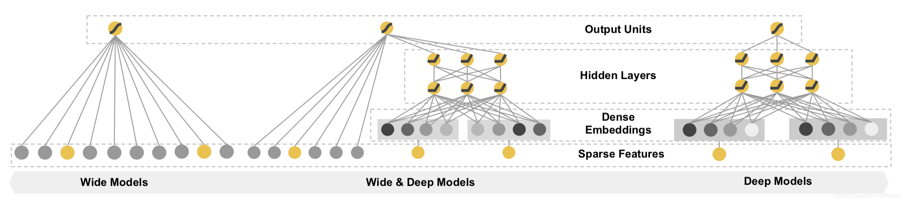

​		wide：是一个常见的线性模型，可以认为是LR。

​		deep：是一个前馈神经网络NN，将类别特征的Embedding输入，然后经过一系列的隐藏层。

​		Hidden Layers：为三个全连接层，每个layer后面连接Relu激活函数。

​		输出层：Logistic Loss逻辑损失函数

​		联合训练：将wide和deep模型组合在一起，在训练时同时优化所有参数，并且在训练时进行加权求和，根据最终的loss计算出gradient，反向传播到wide和deep两部分中，分别训练自己的参数。wide&deep模型的权重更新会受到wide侧和deep侧对模型训练误差的共同影响。在论文中，wide部分使用L1正则化Follow-the-regularized-leader（FTRL）算法进行优化，deep部分使用的是AdaGrad完成优化。


**2.谈谈你对Wide&deep模型的理解**

​		wide部分的主要作用是让模型具有较强的“记忆能力”（memorization），让模型学习历史数据中物品或者特征的“共现频率”，并且把它们直接作为推荐依据的能力。举例：看了A电影的用户经常喜欢看B电影。

​		deep部分主要作用是让模型具有“泛化能力”（generalization）。“泛化能力”指的是模型对于新鲜样本、以及从未出现过的特征组合的预测能力。举例：我们知道25岁**男性喜欢看电影A**，**35岁**女性也**喜欢看电影A**，那35岁男性喜不喜欢看电影A

​	对于Wide&deep来说，最重要的并不是这个模型结构，而是如何设计Deep特征和Wide特征，从而发挥这个模型的最大的功力


**3.哪些特征适用于wide侧，哪些特征适用于deep侧？**

- wide
  - 作用：记忆，学习样本特征中特征的共现性，产生的结果是和用户有过直接行为的item，通过少量的交叉特征转换来补充deep的弱点
  - 交叉特征、离散特征、部分连续特征
- deep
  - 作用：泛化，用于学习历史数据中不存在或者低频的特征组合
  - 用户行为特征、稠密连续特征、离散特征的embeding


**4.模型调优**

​		（1）防止模型过拟合，加入dropout与L2正则

​		（2）加快模型收敛，引入Batch Normalization（BN）；并且为了保证模型训练的稳定性和收敛性

​		（3）尝试不同的learning rate（wide=0.001，deep=0.01 效果较好）

​		（4）batch_szie = 2048

​		（5）优化器：对比了SGD、Adam、Adagrad等学习器，效果最好Adagrad

​	CTR = Click / Show content提升6.8%

​	CVR= 转化量/点击量 提升15%


**5.wide&deep是如何联合训练的？**

​		wide部分和deep部分使用其输出对数几率的加权和作为预测，然后将其输入到联合训练的一个共同的逻辑损失函数。

​				$P(Y=1|x)= \sigma(W_{wide}^T[x,\phi(X)] + W_{deep}^Ta^{l_f} + b)$

​				Y：二值分类标签

​				$\sigma(.)$：是sigmoid函数

​				$\phi(x)$：是原始特征x的跨产品变换

​				b：偏置项

​				$W_{wide}$：是wide模型的权重向量

​				$W_{deep}$：是用于最终激活函数$a^{l_f}$的权重

​		wide&deep模型的联合训练是通过使用小批量随机优化同时将输出的梯度反向传播到模型wide和deep部分来完成的。实验中，wide部分使用L1正则化Follow-the-regularized-leader（FTRL）算法进行优化，deep部分使用的是AdaGrad进行优化。


#### 1.2.4 DeepFM

**1.DeepFM的模型结构？**


​		DeepFM分为两部分：FM和DNN，FM和DNN以并行方式组合，并且共享Embedding向量作为输入，预测公式为：$\hat{y} = sigmoid(y_{FM}+ y_{DNN})$。

​		DeepFM网络结构由输入层、Sparse Features层、Dense Embedding成、FM层和Hidden层、输出层组成。

- 输入层：输入的每个特征（包含连续特征和离散特征）

- Sparse Features：输入特征经过one-hot转换，由一列会变成多列，转变成稀疏矩阵；对应图中，每个连续特征对应一个点，离散特征经过one-hot转换对应n个点。

- Dense Embedding：对sparse features做特征转换，FM的二阶两两交互计算部分和Deep部分共享embedding结果。

- FM：FM Layer包含一个1阶特征的Addition和多个2阶组合特征Inner Product内积单元。

- Deep：普通的前馈神经网络，Activation Function：可以选择relu或者tanh。

  负责所有特征的深度拟合，提高整体的表达能力。

  Dense Embedding层的神经元个数=embedding vector * field_size。

- 输出层：$\hat{y} = sigmoid(y_{FM}+ y_{DNN})$


**2.如何理解DeepFM模型？**

​		DeepFM采用了FM部分加Deep部分的结构，其中FM部分解决特征交叉的问题，Deep部分使用多层神经网络模型的拟合能力。传统的MLP深度学习模型对特征交叉的处理没有针对性，特征交叉的学习效率低，所以要通过增加特征交叉层的方式增强深度学习模型的特征交叉能力。

​		举例：模型的输入有性别、年龄、电影风格这几个特征，在训练样本中我们发现有 25 岁男生喜欢科幻电影的样本，有 35 岁女生喜欢看恐怖电影的样本，那你觉得模型应该怎么推测“25 岁”的女生喜欢看的电影风格呢？


**3.模型调优**

（1）batch_size = 2048， 从64调整到2048，auc提升0.6%

（2）网络结构：使用2层全连接层(128, 64)比(256, 128)auc提升0.17%

（3）BN层：加入BN层，auc提升0.68%

（4）Embedding size：从32到64没有带来明显的效果提升，使用32维


**4.对比一下Wide&Deep和DeepFM模型，及它们的应用场景**

- 优势：	
  - DeepFM：在解决特征交叉问题上非常有优势，它会使用一个独特的FM层来专门处理特征之间的交叉问题。具体来说，就是使用点积、元素积等操作让不同特征之间进行两两组合，再把组合后的结构输入的输出神经元中，这会大大加强模型特征组合的能力。因此DeepFM模型相比于Embedding MLP、Wide&Deep等模型，具有更好的推荐效果。
  - 


#### 1.2.5 DIN

​		Deep Interest Network 深度兴趣网络

**1.什么是“注意力机制”，对构建推荐模型有什么价值**

​		“注意力机制”来源于人类天生的“选择性注意”的习惯。最典型的例子是用户在浏览网页时，会有选择地注意页面的特定区域，而忽视其他区域。


**2.Deep Interest Network（DIN）深度兴趣网络基础模型Base Model**


​		Base Model是一个典型的Embedding MLP的结构，输入特征有用户特征（User Proflie Features）、用户行为特征（User Behaviors）、候选广告特征（Candidate Ad）和场景特征（Context Features）。

​		用户行为特征是用户最近购买过的商品组成，把ID特征构建Embedding，把Embedding跟其他特征连接起来，输入MLP。

​		用户的行为序列是一组商品序列，可长可短，但是神经网络的输入向量的维度必须是固定的，图中采用Sum Pooling把这些商品Embedding叠加起来，把叠加的Embedding跟其他特征的输入结果输入MLP。

​		Sum Pooling的Embedding叠加操作是把所有历史行为一视同仁，没有任何重点地加起来，不符合真实习惯。

​		DIN模型把注意力机制应用在用户的历史行为序列处理上


**3.DIN网络架构**


​		与Base Model相比，DIN为每个用户的历史购买商品加上了一个激活单元（Activation Unit），这个激活单元生成了一个权重，这个权重就是用户对这个历史商品的注意力得分，权重的大小对应用户注意力的高低。

​		激活单元内部结构：当前这个历史行为商品的Embedding和候选广告商品的Embedding作为输入，与它们的外积结果连接起来形成一个向量，再输入给激活单元的MLP层，最终会生成一个注意力权重，这就是激活单元的结构。

​		**激活单元就相当于一个小的深度学习模型，它利用两个商品的Embedding，生成了代表他们关联程度的注意力权重。**

**4.激活单元（Activation Unit）结构**

（1）输入层：

​		key：user产生行为（例如点击、购买）的item embedding

​		query：候选item embedding

（2）Out Product层：

​		计算矩阵之间的element-wise乘法

（3）Concat层：

​		将query，key，query-key，query * key（Out Product层，element-wise乘法）的结果进行拼接

（4）Dense层：

​		全连接层，并以PReLU或Dice作为激活函数

（5）Linear层（输出层）

​		全连接层，输出单元为1，即得到（query，key）相应的权重值


**5.激活单元中的Dice激活函数**

​		Dice激活函数是PReLU的基础上进行改进的，首先PReLU激活函数的公式如下：

​													$f(s) = \begin{cases}s & if & s >0 \\ \alpha s & if & s<=0 \end{cases} = p(s)*s + (1-p(s)) * \alpha s$

​		其中p(s)为控制函数，其定义为p(s)=l(s>0)，l(.)为指示函数。

​		Dice激活函数把PReLu激活函数中的p(s)进行了修改：

​		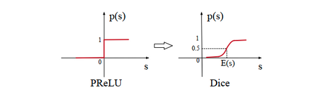

​		Dice激活函数的表达式如下：

​												$f(s) =  p(s) * s + (1-p(s)) * \alpha s$

​												$p(s) = \frac{1}{1+e^{-\frac{s - E[s]}{\sqrt{Var[s] + \xi}}}}$

​		E[s]：mini-batch输入的均值；

​		Var[s]：mini-batch输入的方程；		

​		$\xi$：非常小的尝试$10^{-8}$

​		Dice主要思想是根据输入数据的分布，自适应地调整校正点，使其值为输入的均值。当E[s]和Var[s]均为0时，Dice和PReLU是等价的。

**6.损失函数**

损失函数用二分类交叉熵损失函数

​			$L = -\frac{1}{N}\sum_{(x,y) \in S}(ylogp(x)+(1-y)log(1-p(x)))$


**4.DIEN网络结构**


（1）注意力机制具体指的是什么？

（2）DIN中注意力单元的具体结构是什么？

（3）能否写出注意力单元的形式化定义，并推导它的梯度下降更新过程？


#### 1.2.6 DIEN

**1.DIEN解决的问题**

​		深度兴趣进化网络DIEN（Deep Interest Evolution Network）是DIN模型的演化版本。

​		用户的历史行为是一个随时间排序的序列，存在前后行为的依赖关系，这样的序列信息对于推荐过程非常有价值。对于电商来说，用户兴趣的迁移是非常快的：比如，上一周用户在挑一双篮球鞋，行为序列会集中在篮球鞋这个品类的各个商品，但完成这个购物目标之后，这周的兴趣可能就变成了买一个机械键盘，那购买行为会围绕机械键盘这个品类展开。


**2.DIEN模型结构**


​		DIEN模型整体上也是一个Embedding MLP的模型结构，与DIN不同的是，DIEN用“兴趣进化网络”也就是图中的彩色部分替换掉了原来带有激活单元的用户历史行为部分。它的输出是一个h'(T) 的Embedding向量，代表用户当前的兴趣向量，把这个兴趣向量与其他特征连接在一起，DIEN就能通过MLP做出最后的预测了。

​		DIEN模型是如何生成这个兴趣向量的：

- 最下面一层是行为序列层（Behavior Layer，浅绿色部分）

  主要作用和一个普通的Embedding层一样的，负责把原始的ID类行为序列转换成Embedding行为序列。

- 再上一层是兴趣抽取层（Interset Extractor Layer，浅黄色部分）

  主要作用是利用GRU组成的序列模型，来模拟用户兴趣迁移过程，抽取每个商品节点对应的用户兴趣。

- 最上面一层是兴趣进化层（Interest Evolving Layer，浅红色部分）

  主要作用是利用AUGRU（GRU with Attention Update Gate）组成的序列模型，在兴趣抽取层基础上加入注意力机制，模拟与当前目标广告（Target Ad）相关的兴趣进化过程，兴趣进化层的最后一个状态的输出就是用户当前的兴趣向量h'(T) 。


**序列模型：**

​		兴趣抽取层和兴趣进化层都用到了序列模型的结构。序列模型是“一串神经元”，其中每个神经元对应一个输入和输出。

​		在DIEN模型中，神经元的输入就是商品ID或者前一层序列模型的Embedding向量，而输出就是商品的Embedding或者兴趣Embedding，除此之外，每个神经元还会与后续神经元进行连接，用于预测下一个状态，放在DIEN里就是为了预测用户的下一个兴趣。

RNN模型的经典结构：


​		根据序列模型神经元结构的不同，最经典的有RNN、LSTM、GRU三种模型：

​		序列模型中的不同单元结构：


#### 1.2.7 ESMM 完整空间多任务模型

**Entire Space Multi-task Model（ESMM）完整空间多任务模型**

**1.ESMM解决了什么问题**

​		ESMM是阿里算法团队提出的多任务训练方法，电商推荐系统，最大化场景商品交易总额（GMV）是平台的重要目标之一，GMV=流量 x 点击率 x 转化率 x 客单价，因此转化率是优化目标的重要因子之一。

​		传统的CVR预估任务通常采用类似于CTR预估技术，存在两个主要问题：**样本选择偏差**和**稀疏数据**

​		为了解决上面两个问题，阿里提出了完整空间多任务模型ESMM，ESMM模型利用用户行为序列数据在完整样本空间建模，避免了传统CVR模型经常遇到的样本选择偏差和训练数据稀疏问题，取得了显著成果。


**2.CTR和CVR预估中几个重要名词**

​		**impression：**用户观察到的曝光产品

​		**click：**用户对impression的点击行为

​		**conversion：**用户点击之后对物品的购买行为

​		**CTR：**从impression到click的比例

​		**CVR：**从click到conversation的比例

​		**CTCVR：**从impression到conversation的比例

​		**pCTR：**p(click=1 | impression)，曝光点击率

​		**pCVR：**p(conversion=1 | click=1, impression)，点击转化率

​		**pCTCVR：**p(conversion=1, click=1 | imoression) = p(click=1 | impression) * p(conversion=1 | click=1, impression) ，即pCTCVR = pCTR * pCVR（曝光后，点击转化率）


**3.ESMM网络结构**

​		为了解决样本选择偏差问题（SSB）数据稀疏问题（DS），ESMM提出了一个多任务学习的框架，**能够使用整个样本空间的数据；同时优化pCTCVR和pCTR，进而做到优化CVR的目的**。ESMM模型的目标函数如下：

​								$L(\theta_{cvr}\theta_{ctr}) = \sum_{i-1}^Nl(y_i, f(x_i, \theta_{ctr})) + \sum_{i=1}^Nl(y_i \& z_i, f(x_i, \theta_{ctr}) \times f(x_i, \theta_{cvr}))$

​		上式中，N代表样本数据量；$\theta_{cvr}, \theta_{ctr}$分布代表cvr网络，ctr网络的参数；$l(\cdot)$是交叉熵损失函数

​		计算公式：

​							$p(y=1, z=1|x) = p(y=1|x) \times p(z=1|y=1, x)$

​                                   pCTCVR                   pCTR                     pCVR

​		其中pCTCVR(曝光后，点击转化率)，pCTR曝光点击率，pCVR点击转化率，其中x表示特征向量，y=1表示点击数据，z=1表示转化数据。


​		ESMM模型由两个完全相同的子网络连接而成，子网络模型称之为Base模型：

​		Base模型结构：

- EMbedding Layer

  输入包括user field和item field。user field主要由用户的历史行为序列构成：包含用户浏览的产品ID列表、用户浏览的品牌ID列表、类目ID列表等；不同的实体ID列表构成不同的field。

  网络的embedding层，把这些实体ID都映射为固定长度的低维向量

- Field-wise Polling Layer

  把同一个field的所有实体embedding向量求和得到对应当前field的唯一向量；之后所有的field向量拼接（concat）在一起构成一个大的隐层向量

- MultiLayer Perception	

  MLP网络结构：隐层向量接入若干全连接层，最后再连接只有一个神经元的输出层。	

左边的网络结构为预测pCVR任务，右边的网络结构预测pCTR任务，最后pCTR * pCVR输出一个融合的结果pCTCVR；pCVR网络和pCTR网络，共享embedding层的参数。


**4.ESMM模型主要特点**

**（1）整个样本空间建模**

​		区别与传统的CVR预估方法通常使用“点击—>成交”日志构建训练样本，ESMM模型使用“曝光—>点击—>成交”日志数据来构建训练样本

**（2）共享特征表示**

​		两个子任务（CTR预估和CVR预估）之间共享各类实体（产品、品牌、类目、商家等）ID的embedding向量表示。


**5.ESMM模型样本选择**

​		CTR：曝光点击事件正样本；曝光未点击负样本

​		CVR：曝光点击购买事件正样本，否则标记为负样本


#### 1.2.8 MMoE

**Multi-gate Mixture-of-Experts（MMoE）**

**1.MMoE解决了什么问题**

​		推荐系统中，希望提高用户的点击率，同时也希望提高视频的播放时长，视频点赞等。这些目标的达成并非是简单的相辅相成，更多的可能是相互竞争的关系，具有跷跷板现象，一个任务目标效果好后，可能另一个目标的效果会有所下降，需要多任务一起结合训练。

​		只让模型学习点击率，经过训练的模型推荐结构很可能导致标题党和封面党大行其道，如果一味追求高点赞，也可能就忽略了一些相对冷门的或新的佳作。

​		MMoe更像一个多任务的一个框架，提供了一个简单有具有一定可结实性的多任务解决思路。


**2.模型结构对比**

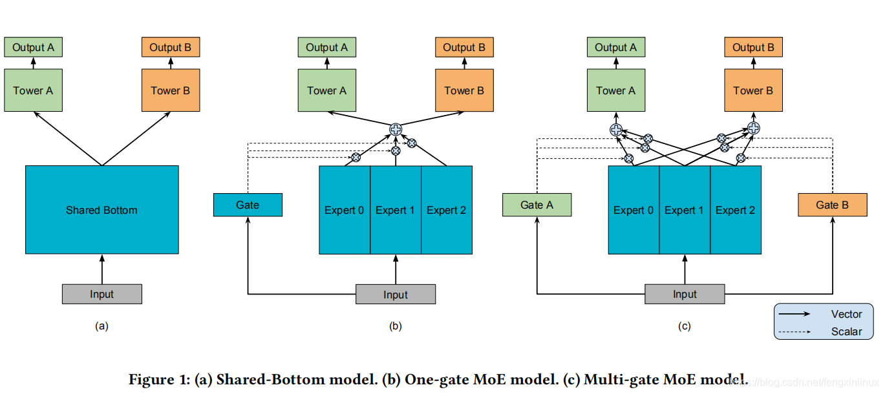

**A：Shared-Bottom model**

​		最底层是输入层，然后是共享网络层，最上层每个单任务都对应一个单独的塔结构。

- 优点：

  共享底层模块，可以减少模型的参数，降低学习成本。若不同任务之间很相似，可以有较为不错的效果。

- 缺点：

  不同任务之间可能存在较大的差异，硬性共享容易产生较大的冲突，相互影响。限制了模型的表达能力，多个任务各自有不同的数据分布，而相同的特征输入会极大地削弱模型的多任务输出表达，而在某种程度上降低了多目标模型的泛化能力。

  

**B：One-gate MoE model**

​		与Shared-Bottom model结构相比，MoE将Shared-Bottom层替换成多个独立的Expert模型，其实就是多个独立的MLP模块，每个Expert模块可以认为是专注于学习特定领域的知识，其次引入一个门控机制，根据输入的不同，动态调整各个Expert对象的权重，根据权重加权求和，再接各个任务独立的Tower进行输出。

- 优点：

  将shared层划分为多个独立的Expert层，降低了多个任务之间的冲突影响，同时引入门控机制，动态调整输出。

- 缺点：

  不同任务之间共享一个门机制

**C：Multi-gate MoE model**

​		有一组底层网络，每个网络称之为专家，每个专家都是一个前向传播网络。MMoE为每个任务引入一个门网络，门网络的输入是特征，输出为专家的权重值，使得不同任务以不同的方式利用专家网络的输出。一般情况下专家网络输出的权重结果，作为任务对应的塔网络的输入。通过这种方式，门网络可以学习到专家的不同混合方式，建模任务间的关系。

​		相比于MoE结构，引入多个门控机制，**每个任务单独对应1个门控**，这样既可以根据不同输入进行动态调整输出，也可以根据不同的任务进行动态调整权重，进一步降低不同任务之间的冲突。


**3.不同模型结构的数据公式**

**（1）Shared-bottom**					

​		假设input为x共享的底层网络为f(x)，然后将其输出喂到各任务独立输出层$h^k(x)$，其中k表示第k个任务的独立输出单元，那么，第k个任务的输出$y^k$即可表示为：

​									$y^k = h^k(f(x))$

**（2）MoE**

​		把第i个Expert网络的运算记为$f_i(x)$，Gate操作记为g(x)，是一个n元的softmax值（n是Expert的个数，有几个Expert，就有几元），之后把每个Expert输出的加权求和，假设MoE的输出为y:

​								 $y = \sum_{i=1}^ng(x)f_i(x)$

**（3）MMoE**

​								$y^k = h^k(f^k(x))$

​								$f^k(x) = \sum_{i=1}^ng^k(x)_if_i(x)$

​								$g^k(x) = softmax(W_{gk}x$

​		其中，$y^k$表示第k个任务输出，$h^k(x)$表示各个任务输出层，$f_i$表示第i个专家，$g_k$表示第k个任务的门网络

**4.MMoE模型实现步骤**


**2.MMoE模型结构**

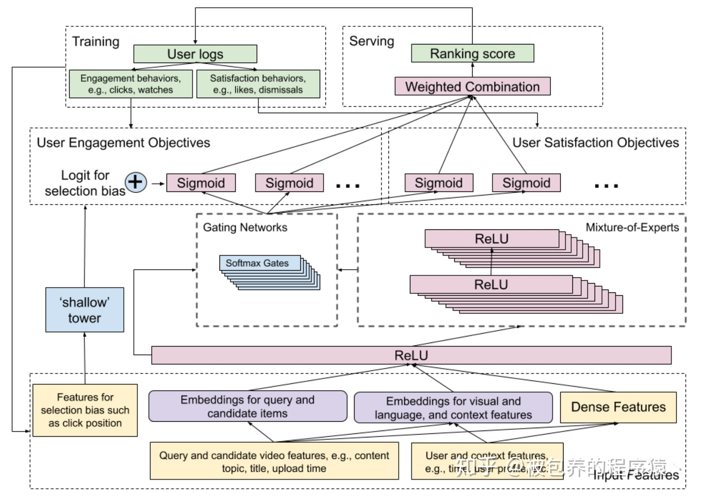


3.

#### 1.2.9 PLE

**Progressive Layered Extraction**

**1.PLE解决什么问题？**

​		MMoE所有参数都是所有任务共享的，没有显示定义不同任务的私有参数，当不同任务的关系较弱时，可能会导致不同任务的跷跷板现象，即两个任务无法同时达到最好，一个任务效果提升，伴随着另一个任务效果下降。

​		PLE模型将参数显示的划分为所有部分和公有部分，提升多任务学习的鲁棒性，缓解私有知识和公有知识之间的负向影响。

​		PLE和MMoE的主要区别在于，将多个专家分成公共部分和每个Task独有部分。


**2.PLE模型结构**

​		PLE将多个专家分成公共部分和每个Task独有的部分，在网络最初阶段并不能真正确定哪些Expert需要共用哪些Expert独有。论文提出了多层次的信息提取方法，在网络的最底层增加了Extraction Layer全局Gate，用来给所有Expert打分，在上层再区分公共和独有部分。其实可以理解底层先通过MoE不区分公共/私有提取基础特征，在上层再逐渐将公共/私有部分区分开。


#### 1.2.9 DeepWalk

**1.图数据是如何应用到推荐系统的**

​		用户和物品之间的相互行为生成路**行为关系图**，借助这样的图关系，利用embedding技术发掘出**物品和物品之间、用户和用户之间、用户和物品之间的关系**，从而应用于推荐系统的进一步推荐。


**2.DeepWalk网络结构**

​		Deepwalk是**一种随机游走（random walk）和word2vec**两种算法相结合的图结构数据挖掘算法。该算法能够学习网络的隐藏信息，能够将图中的节点表示为一个包含潜在信息的向量。

​		DeepWalk基于原始的用户行为序列来构建物品关系图，然后采用随机游走的方式随机选择起始点，重新产生物品序列，最后将这些随机游走生成的物品序列输入Word2vec模型，生成最终的物品embedding向量。

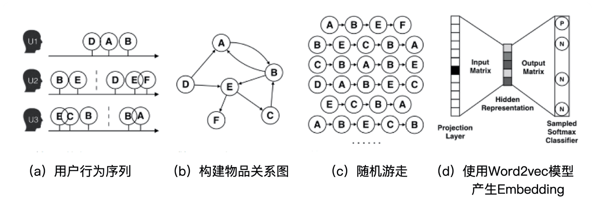

**Deepwalk算法流程：**

（1）基于原始的用户行为序列（图a），比如用户的购买物品序列、观看视频序列等等，来构建物品关系图（图b），可以根据用户的购买次数加强有向边权重。在将所有用户行为序列都转换成物品相关图中的边后，全局的物品相关图就建立起来了。

（2）采用随机游走的方式随机选择起始点，重新产生物品序列（图c），其中，随机游走采样的次数、长度等都属于超参数，需要我们根据具体应用进行调整。

（3）将这些随机游走生成的物品序列输入图d的Word2vec模型，生成最终的物品embedding向量。


**3.DeepWalk算法实现**

​		**DeepWalk = 随机游走生成器 + 一个更新过程**

​		（1）Deepwalk采用随机游走的方式，通过人为定义游走访问的序列长度，获得不同的节点访问序列，以此作为基于图的“语料库”。

​		（2）DeepWalk采用了word2vec中Skip-gram结构（词预测上下文），采用哈夫曼树以及hierarchical softmax算法，通过路径概率连乘形式的条件概率最大化，来实现模型的训练。


 		算法1中3-9行显示了算法的核心。将每次迭代看作是对数据进行“传递”，迭代次数由输入数$\gamma$指定。每次循环中，先生成一个随机排序来遍历顶点；再得到从每个顶点开始的长度t的随机游走$W_{v_i}$；最后，根据$W_{v_i}$，利用SkipGram算法实现表示更新。


**4.随机游走**

​		随机游走（random walk）就是在网络上不断重复地随机选择游走路径，最终形成一条贯穿网络的路径。从某个特定的端点开始，游走的每一步都从与当前节点相连的边中随机选择一条，沿着选定的边移动到下一个顶点，不断重复这个过程。


**4.随机游走的spark实现**


**4.Embedding是如何应用在推荐系统的特征工程中的？**

**（1）直接应用**

​		得到embedding向量之后，直接利用embedding向量的相似性实现某些推荐系统的功能。利用物品embedding间的相似性实现相似物品的推荐，利用物品embedding和用户embedding的相似性实现“猜你喜欢”等经典推荐功能，还可以利用物品embedding实现推荐系统中的召回层等。				

**（2）预训练应用**

​		预训练好物品和用户embedding之后，不直接应用，而是**把这些embedding向量做为特征向量的一部分，跟其余的特征向量拼接起来**，作为推荐模型的输入参与训练。这样做能够**更好的把其他特征引入进来**，让推荐模型作出更为全面且准确的预测。

**（3）End2End应用**

​		不预先训练embedding，而是把embedding的训练和深度学习模型结合起来，采用统一的、端到端的方式一起训练，直接得到包含embedding层的推荐模型。比如Wide&deep。


**5.对比一下embedding预训练和embedding end2end两种应用方法，说出它们之间的优缺点？**

- embedding预训练

  - 优点

    更快：相对于end2end的方式，embedding层的优化还受推荐算法的影响，会增加计算量

  - 缺点

    难收敛：

- embedding 端到端

  - 优点

    收敛到更好的结果：end2end将embedding和推荐算法连接起来训练，那么embedding层可以学习到最有利于推荐目标的embedding结果。

    

**6.deepwalk优化经验**

**（1）用deepwalk的时候生成比原序列样本少，才能降低噪音，抓住主要关联**

​		问题描述：用户浏览内容的序列数据，来做内容的embedding，原来有50万条序列，一开始用deepwalk生成原数据两倍的样本的samples，结果训练出来的embedding，内容之间的similarity很低（每个内容跟它最近的内容的similarity值为0.5左右，如果直接用原样本可以到达0.7），接着尝试降低deepwalk生成样本的数量到5万，通过随机抽查，效果特别好（可以达到0.9以上，而且效果不错）

​		deepwalk的抽样过程保留转移矩阵的“主要框架”，但同时当抽样次数不太高的时候，item embedding的覆盖率反而没有item2vec好。


**（2）筛选出来的高分内容，部分内容没有被随机游走出来**

​		问题描述：筛选出来的高分内容有9000多个，随机游走出来的序列embedding后，只有5000多个。

​		原因：由于一些长尾。冷门内容的存在（毕竟热门内容还是极少数的），导致概率转移矩阵中游走到冷门电影的概率其实非常小，所以游走次数比较小的时候，很容易覆盖不到。

​		解决：增加采样次数，增加游走长度，保证生成结果的稳定性和覆盖率。


#### 1.2.10 Node2vec

**1.Node2vec的概念**

​		相比于DeepWalk，Node2vec增加了随机游走过程中跳转概率的倾向性。如果倾向于宽度优先搜索，则Embedding结构更加体现“结构性”。如果倾向于深度优先搜索，则更加体现“同质性”。

​		同质性：指的是距离相近的节点的embedding应该尽量近似，下图节点u与其相连的节点s1、s2、s3、s4的embedding表达应该是接近的，这就是网络的“同质性”的体现。在电商中，同质性的物品很可能是同品类、同属性、或者经常被一同购买的物品。

​		结构性：指的是结构上相似的节点embedding应该尽量接近。下图中节点u和节点s6都是各自局域网络的中心节点，它们在结构上相似。在电商中，结构相似的物品一般是各类的爆款、最佳凑单商品等拥有类似趋势或者结构性属性的物品。


**2.Node2vec是怎样控制BFS和DFS的倾向性的？**

​		通过节点间的跳转概率来控制跳转的倾向性。从当前节点v跳转到下一节点x的概率：

​							$\pi_{vx} = \alpha_{pq}(t, x) * \omega_{vx}$

​		其中$\omega_{vx}$是边vx的原始权重， $\alpha_{pq}(t, x)$是Node2vec定义的一个跳转权重。到底是倾向于DFS还是BFS，主要就与这个跳转权重的定义有关。


​		$\alpha_{pq}(t, x)$里的$d_{tx}$是指节点t到节点x的距离，比如节点$x_1$与节点t直接相连$d_{tx}=1$	， 节点t与节点t自己的距离$d_{tx}=0$	， 	节点$x_2、x_3$与不与节点t直接相连$d_{tx}=2$。

​		**$\alpha_{pq}(t, x)$中的参数p和q共同控制着随机游走的倾向性。**


#### 1.2.10 矩阵分解ALS


#### 1.2.11 DSSM

如何构建user和item的特征？[双塔模型](https://www.zhihu.com/search?q=双塔模型&search_source=Entity&hybrid_search_source=Entity&hybrid_search_extra={"sourceType"%3A"answer"%2C"sourceId"%3A1708540603})的结构？


#### 1.2.12 Word2vec

**1.Word2vec的两种模型**

​		Word2vec模型分为两种：CBOW（Continuous Bag-of-Word Model）连续词袋模型、Skip-gram

​		CBOW：输入是$w_t$周边的词，预测的输出是$w_t$

​		Skip-gram：输入是$w_t$，预测的输出是$w_t$的周边词

​		按照一般的经验，Skip-gram模型的效果会更好一些


**2.Word2vec的样本是怎么生成的？**

​		从预料库中抽取一个句子，选取一个长度为 2c+1（目标词前后各选c个词）的滑动窗口，将滑动窗口由左至右滑动，每移动一次，窗口中的词组就形成了一个训练样本。

​		举例：Embedding技术对深度学习推荐系统的重要性

​					Embedding｜技术｜对｜深度学习｜推荐系统｜的｜重要性

​		输入输出：滑动窗口=3

​						技术               —>    Embedding， 深度学习

​						深度技术       —>    技术， 推荐系统

​						推荐系统       —>    深度学习， 重要性


**3.Word2vec模型结构**

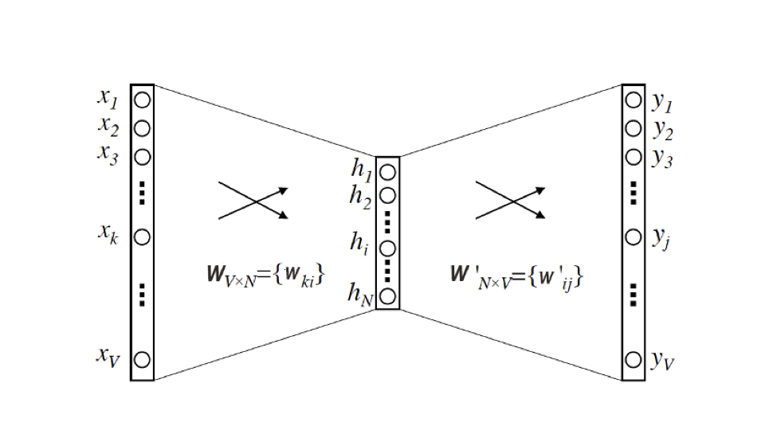

​		Word2vec是一个三层的神经网络，

​		输入层：输入层和输出层的维度都是V，这个V是预料词典的大小，假设语料库一共使用了10000个词，那么V=10000。**输入向量是由输入词转换而来的One-hot编码向量**。基于Skip-gram框架的Word2vec模型解决的是一个多分类问题。

​		隐藏层：维度为N，N的选择需要一定的调参能力，需要对模型效果和模型复杂度进行权衡。 **每次词的embedding向量维度由N来决定**

​		输出层：输出层维度也是V，**输出向量是由多个词转换而来的Multi-hot编码向量**

​		激活函数：隐藏神经元没有激活函数，而输出层神经元采用softmax作为激活函数


**4.为什么选择softmax作为激活函数**

​		神经网络其实是为了表达输入向量到输出向量这样一个条件概率关系：

​		                         $p(w_o | w_i) = \frac{exp(v_{w_o}^{\prime} v_{w_i})} {\sum_{i=1}^V exp(v_{w_i}^{\prime}\top v_{w_i})}$

​		这个**由输入词$w_i$预测输出词$w_o$的条件概率**，其实就是Word2vec神经网络要表达的东西。通过极大似然的方法去最大化这个条件概率，就能够让相似的词的内积距离更接近，这就是我们系统Word2vec神经网络学到的。

​	

**5.词向量是如何从Word2vec模型中提取出来的？**


​		Embedding就是输入层到隐层层的权重矩阵$W_V \times N$，输入向量矩阵$W_V \times N$的每一行向量对应的就是我们要找的“词向量”。比如我们要找词字典第i个词对应的Embedding，因为输入向量是采用One-hot编码，所以输入向量的第i维就应该是1，那么**输入向量矩阵$W_V \times N$中的第i行的向量就是该词的embedding**。


**6.Negative Sampling负采样**

​		有一个包含10万个单词的词汇表，向量特征为300维，神经网络将会有两个weights矩阵：一个隐藏层和一个输出层，这两层都会有一个300 * 100000 = 30000000的weights矩阵。如此大的神经网络上进行梯度下降是非常慢的，更加严重的是，需要大量的训练数据去调整weights和避免over-fitting。

​		Word2vec解决这些问题，主要有3种措施：

- 在模型中将共同出现的单词对或者短语当作单个“词”
- 二次采样经常出现的单词，以减少训练数据的数量
- 改变优化目标函数—使用Negative Sampling，将会使训练样本跟新少量模型的weights

在训练神经网络时，**每个训练样本都将会调整所有神经网络中的参数**，词汇表的大小决定了skip-gram神经网络将会有一个非常大的权重参数，并且所有的权重参数会随着数十亿训练样本不断调整。

​		negative sampling每次让一个训练样本仅仅跟新一小部分的权重参数，降低梯度下降过程中的计算量。

​		如果vocabulary大小为1万时，当输入样本（”fox“， ”quick“）到神经网络时，”fox“经过one-hot编码，在输出层期望对应”quick“单词的那个神经元节点输出1，其余9999个都应该输出0。**这9999个期望输出0的神经元节点所对应的单词为negative word**。negative sample的想法将随机选择一小部分的negative words，比如10个negative words来更新对应的权重参数。共计11个神经元，相当于每次只更新300 * 11 = 3300个权重参数，对于3百万的权重来说，相当于只计算量千分之一的权重，这样计算效率就大幅提高了。


**7.Selecting Negative Samples**

​		使用一元模型分布（unigram distribution）来选择negative words，一个单词被选作negative sample的概率跟它出现的频次有关，**出现频次越高的单词越容易被选作negative words**，公式：

​									$P(w_i) = \frac{f(w_i)^{3/4}}{\sum_{j=0}^n(f(w_j)^{3/4})}$  

​		其中f(w)代表每个单词被赋予的一个权重，即单词出现的词频，分母代表所有单词的权重和。3/4基于经验。		

#### 1.2.13 DNN


### 1.3 特征处理

### 1.4 效果评估

**1.说说自己在项目中具体负责的模块中用到的技术细节，遇到了什么问题？你使用的模型的损失函数、如何优化、怎么训练模型的、用的什么数据集？优化算法的选择做过哪些？为啥这么做？**

（1）采用multi-hot向量计算的方法进行标签召回，用户可以计算出来多个兴趣标签，内容本身也打了多个标签。使用multi-hot向量计算用户和内容的相似度，可以加入用户兴趣标签的权重、内容标签level权重

（2）用户标签的权重计算 = 行为类型权重  * 时间衰减 * TF-IDF计算标签权重  * 行为次数

​		精细化设计：有效阅读/播放

​		时间衰减：使用ES的指数衰减函数Exponential Decay（exp），先剧烈衰减后变缓

​		SELECT exp( (log(0.5) / 90.0) * greatest(0, abs(datediff(from_unixtime(unix_timestamp(),'yyyy-MM-dd'),'2021-05-01')) - 7))

​		TF-IDF：TF=标签t打在某个item的次数/某个item标签个数           1/4

​                       IDF = log (打标签的item总算+1/包含标签t的item条数+1)   log(1000+1/50+1)

（3）内容质量模型：曝光转化率（30%）、用户行为计算评分（40%）、内容发布时间（30%）

（4）多路召回设计：兴趣标签召回、优质内容召回、类目召回、关注作者召回、公司召回等

（5）Embedding召回采用DSSM模型实现，将训练好的user embedding、item embedding存入到redis中，模型预测时使用Faiss构建Index，然后分别基于item2item、user2item进行召回

（6）损失函数：binary_crossentropy二进制交叉熵


**2.模型调优**

（1）batch_size = 2048， 从64调整到2048，auc提升0.6%

batch_size大小决定了深度学习训练过程中完成每个epoch所需的时间、每次迭代之间梯度的平滑程度。

深度学习框架出来mini-batch的反向传播时，先将每个mini-batch中每个instance得到loss平均化之后再反向求梯度。

b太小，相邻mini-batch间的差异相对过大，那么相邻两次迭代的梯度震荡情况会比较严重，不利于收敛；

b越大，相邻mini-batch间的差异相对越小，虽然梯度震荡情况会比较小，一定程度上利于模型收敛，但如果b极端大，相邻mini-batch间的差异过小，相邻两个mini-batch的梯度没有区别了，整个训练过程就是沿着一个方向蹭蹭蹭往下走，很容易陷入到局部最小值出不来。

较小的batch size要设置小lr，batch size越小，相邻iter之间的loss震荡就越厉害，异常值对结果造成巨大扰动。较大的batch size，要设置大一点的lr，原因是大batch size每次迭代的梯度方向相对固定，大lr可以加速其收敛过程。

（2）网络结构：使用2层全连接层(128, 64)比(256, 128)auc提升0.17%

（3）BN层：加入BN层，auc提升0.68%

（4）Embedding size：从32到64没有带来明显的效果提升，使用32维

1. 
2. 

### 1.5 架构设计

1. 冷启动
2. 多目标优化
3. 探索与利用
4. 实时推荐系统如何设计
5. 如何迭代更新推荐模型


## 2. NLP

### 2.1 理论

### 2.2 模型

####  2.2.1 Transformer

**1.Transformer模型结构**

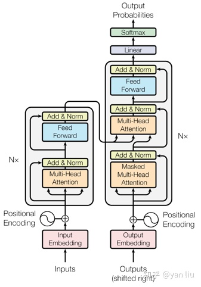

​	Transformer是一个encoder-decoder结构，由若干个编码器和解码器堆叠形成。左侧部分为编码器，由Multi-Head Attention和一个全连接组成，用于输入语料转化成特征向量。右侧部分是解码器，其输入为编码器的输出及已经预测的结果，由Masked Multi-Head Attention，Multi-Head Attention以及一个全连接组成，用于输出最后结果的条件概率。


2. **attention机制**


#### 2.2.2 Bert（Bidirectional Encoder Representations from Transformer）

**1. Bert模型目标是什么？**

​		从名字中可以看出，BERT模型的目标是**利用大规模无标注预料训练、获得文本的包含丰富语义信息的Representation**，即：文本的语义表示，然后将文本的语义表示在特定NLP任务重作微调，最终应用于该NLP任务。


**2. Bert模型结构**


​		BERT基于**Transformer的双向编码**表示，它是一个预训练模型，模型训练时的两个任务是**预测句子中被掩盖的词**以及**判断输入两个句子是不是上下句**。在预训练好的BERT模型后面根据特定任务加上相应的网络，可以完成NLP的下游任务，比如文本分类、机器翻译等。

​		BERT网络结构是由输入Embedding，多层双向的Transformer block（Transformer 左侧encoder单元）连接：

- Embedding：wordpiece token embedding + segment embedding + position embedding

  - wordpiece embedding：单词本身的向量表示
  - position embedding：单词位置信息编码成特征向量
  - segment embedding：区分两个句子的向量表示

- Transformer endcoder

  一个Transformer的encoder单元由一个multi-head-Attention + Layer Normalization + Feed Forword + Layer Normalization 叠加产生。

- 模型层数

  $BERT_{base}$ ：L=12， H=768，A=12，参数总量110M

  $BERT_{large}$ ：L=24， H=1024，A=16， 参数总量340M

  L表示网络的层数（即Transformer blocks的数量），A表示Multi-Head Attention中self-Attention的数量，H表示词向量的维度（隐藏层数）。

  

**3. Self-Attention出现的原因**

​		a.为了解决RNN、LSTM等常用于处理序列化数据的网络结构无法在GPU中并行加速计算的问题

​		b.由于每个目标词是直接与句子中所有词分别计算相关度（attention）的，所以解决了传统的RNN模型中长距离依赖的问题。通过attention，可以将两个距离较远的词之间的距离拉近为1直接计算词的相关度，而传统的RNN模型，随着距离的增加，词之间的相关度会被削弱。


**4. Bert模型输入**

​		X=(batch_size, max_len, embedding)，假设batch_size=1，输入的句子长度为512，每个词的向量表示的长度为768，那么整个模型的输入就是一个512 * 768的tensor


**5. 单个self-attention的计算过程**

​		

​		self-attention的计算涉及到三个中间权重矩阵$W_q, W_k, W_v$，他们分别对输入X进行线性变换，生成query、key、value这三个新的tensor，整个计算步骤如下：

​		step1:  输入X分别与$W_q, W_k, W_v$矩阵相乘，得到Q，K，V

​			q：query（to match others），它要去match的

​			k：key（to be matched），用来被q match的

​			v：value（information to be extracted），要被抽取出来的information

​		step2:  拿每个query去对每个key做attention，按比例缩小的点积（Scaled Dot-Product Attention）  $\frac{Q * K^T}{\sqrt{d}}$得到x中各个词之间的相关度（d is the dim of q and k）。

​					$\alpha_{1, i} = \frac{q^1 * k^i }{\sqrt{d}}$

​		attentuon有许多算法，本质是两个向量，输出一个分数，这个分数表明两个向量有多匹配

​		step3:  将step2相关度通过softmax函数归一化，得到归一化后各个词与其他词的相关度。

​					$\hat{\alpha_{1, i} }= \frac{exp(\alpha_{1, i})}{\sum_{j}exp(\alpha_{1, j})}$

​		step4:  将step3相关度矩阵与V相乘，即加权求和，得到每个词新的向量编码

​					$ b^1= \sum_{i}\hat{\alpha_{1, i} } v^i$

​	self-attention输入是一个sequence，输出也是sequence，可以并行计算

​					$Attention(Q, K, V) = Softmax(\frac{QK^T}{\sqrt{d_k}})V$


**6. 矩阵维度看self-attention计算过程**

​		在Bert base模型中，每个head的神经元个数64，12个head总的神经元的个数即为786，也就是H=786。单个$W_q, W_k, W_v$都是768 × 64的矩阵，X(512 × 768)  *   $W_q$(768 × 64) = 512 *×64，那么Q，K，V则都是512 × 64的矩阵，Q(512 × 64) * $K^T$(64 × 512) = 512 × 512，归一化后跟V相乘后的z矩阵的大小则为512 × 64。

​		12个attention则是将12个512 × 64大小的矩阵横向concat，得到一个512 × 768大小的多头输出，这个输出再接一层768的全连接层，最后就是整个multi-head-attentuin的输出。


**7. multi-head attention的计算**

​	Multi-Head Self-Attention将多个不同单头的Self-Attention输出Concat成一条，然后再经过一个全连接层降维输出。

​		例如：一个self-attention计算的输出为output_0 = (batch_size, max_len, w_length)，那么n个attention进行concat之后，输出就为output_sum = (batch_size, max_len, n * w_length)，这个concat的结果再连一层全连接层即为整个multi-head attention的输出。


**8. 为什么选择Layer Normalization而不是Batch Normalization？**

​		此时，我们应该先对我们的数据形状有个直观的认识，当一个batch的数据输入模型的时候，形状是长方体如图所示，大小为(batch_size, max_len, embedding)，其中batch_size为batch的批数，max_len为每一批数据的序列最大长度，embedding则为每一个单词或者字的embedding维度大小。而Batch Normalization是在batch间选择同一个位置的值做归一化，相当于是对batch里相同位置的字或者单词embedding做归一化，**Layer Normalization是在一个Batch里面的每一行做normalization，相当于是对每句话的embedding做归一化**。显然，LN更加符合我们处理文本的直觉。


**9. masked language model**

​		随机掩盖掉一些单词，然后通过上下文预测该单词。Bert中有15%的wordpiece token会被随机掩盖，这15%的token中80%用[MASK]来代替，10%用随机的一个词来代替，10%保持这个词不变。这种设计使得模型具有捕捉上下文关系的能力，同时能够有利于token-level tasks，例如序列标注。


**10. 为什么选中的15%的wordpiece token不能全部用 [MASK]代替，而要用 10% 的 random token 和 10% 的原 token**

​		[MASK]是以一种显式的方式告诉模型『这个词我不告诉你，你自己从上下文里猜』，从而防止信息泄露。如果[MASK] 以外的部分全部都用原token，模型会学到『如果当前词是[MASK]，就根据其他词的信息推断这个词；如果当前词是一个正常的单词，就直接抄输入』。这样一来，在finetune阶段，所有词都是正常单词，模型就照抄所有词，不提取单词间的依赖关系了。

​		以一定的概率填入random token，就是让模型时刻堤防着，在任意token的位置都需要把当前token的信息和上下文推断出的信息相结合。这样一来，在finetune阶段的正常句子上，模型也会同时提取这两方面的信息，因为它不知道它所看到的『正常单词』到底有没有被动过手脚的。

​		**在后续微调任务中语句中并不会出现[MASK]标记，而且这么做的另一个好处是：预测一个词汇时，模型并不知道输入对应位置的词汇是否为正确的词汇（10%概率），这就迫使模型更多地依赖上下文信息去预测词汇，并且赋予模型一定的纠错能力。**


**11. 最后怎么利用[MASK] token做的预测？**

​		最终的损失函数只计算被mask掉的token的，每个句子里[MASK]的个数是不定的。实际代码实现是每个句子有一个 maximum number of predictions，取所有[MASK]的位置以及一些PADDING位置的向量拿出来做预测（总共凑成 maximum number of predictions这么多个预测，是定长的），然后再用掩码把PADDING盖掉，只计算[MASK]部分的损失。


**12. 模型特点**

​		使用transformer作为算法的主要框架，transformer能更彻底的捕捉语句中的双向关系

​		使用预测句子中被掩盖的词和判断输入两个句子是不是上下句多任务训练目标，是一个自监督的过程，不需要数据标注。

​		使用tpu这种强大的机器训练大规模语料，使NLP的很多任务达到全新的高度


**13. 可优化空间**

​		如何让模型捕捉token序列关系的能力，而不是简单依靠位置嵌入

​		模型太大，太耗机器


**14.残差连接（ResidualConnection）**

​		将模块的输入与输出直接相加，作为最后的输出。这种操作背后的一个基本考虑：修改输入比重构整个输出更容易（“锦上添花”比“雪中送碳”容易多了！）。这样一来，可以使网络更容易训练。


**15.线性转换**

​		对每个字的增强语义向量再做两次线性变换，以增强整个模型的表达能力。变换后向量与原向量保持长度相同。


**16.单文本分类任务**

​		Bert模型在文本前插入一个[CLS]符号，并将该符号对应的输入向量作为整篇文本的语义表示，用于文本分类，如下图，可以理解为：与文本中已有的其它字/词相比，这个无明显语义信息的符号会更“公平”地融合文本中各个字/词的语义信息。

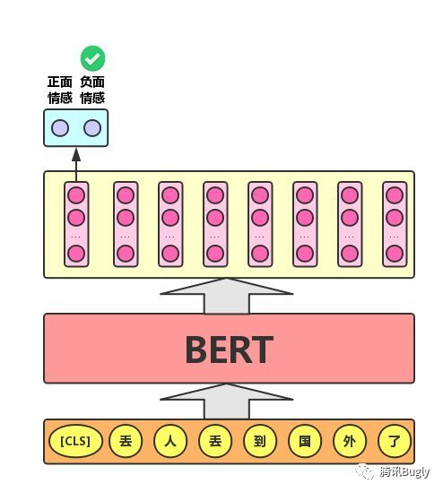


**（17）语句对分类任务**

​		该任务的实际应用场景包括：问答（判断一个问题与一个答案是否匹配）、语句匹配（两句话是否表达同一个意思）等。对于该任务，Bert模型出来添加[CLS]符号并将对应的输出作为文本的语义表示，还对输入的两句话用一个[SEP]符号作为分割，并分别对两句话附加两个不同的文本向量以作区分。


**（18）序列标注任务**

​		该任务的实际应用场景包括：中文分词&新词发现（标注每个字时词的首字、中间字或末字）、答案抽取（答案的起止位置）等。对于该任务，Bert模型利用文本中每个字对应的输出向量对该字进行标注（分类），如下图（B、I、E分别表示一个词的第一个字、中间字和最后一个字）。


（4）Bert、GPT、ELMo的区		

#### 2.2.3 JointBert

1. **为什么选择JointBert**

   ​		意图分类和插槽填充是自然语言的两个基本任务。他们经常受到小规模的人工标签训练数据的影响，导致泛化能力差，尤其是对于低频单词。基于Bert的联合意图分类和插槽填充模型，旨在解决传统NLU模型泛化能力差的问题。实验结果表明，联合Bert模型优于分别建模意图分类和插槽填充的Bert模型，证明了利用这两个任务之间关系的有效性。

   

2. **JointBert模型是如何实现的？**

   先简要描述Bert模型，然后介绍基于Bert的联合模型：

   

   （1）Bert

   ​		Bert模型架构是基于Transform model中的多层双向Transformer encoder编码器。输入表示形式是WordPiece embedding + position embedding + segment embedding。特别地，对于单句分类和标记任务，segment embedding没有区别，特殊embedding([CLS])作为第一个token，embedding([SEP])作为最终token。给定输入序列$x= (x_1, ..., x_T)$，Bert的输出为$H = (h_1, ..., h_T)$。

   ​		Bert模型在大型未标记文本上使用两个策略进行预测训练，即**屏蔽语言模型**和**下一句预测**。预训练的Bert模型提供了功能强大的上下文相关语句表示形式，可通过微调过程用于各种目标任务，例如意图分类和空位填充，类似于用于其他NLP任务的方式。

   （2）Joint Intent Classification and Slot Filling

   ​		Bert可以轻松扩展到意图分类和插槽填充联合模型。基于第一个特殊token([CLS])的隐藏状态，其表示为$h_1$，其意图预测为：

   ​								$y^i = softmax(W^ih_1 + b^i)$,                     (1)

   ​		对于插槽填充，我们为其他token的隐藏状态$h_2, ..., h_T$准备了softmax layer，以对插槽填充标签进行分类。为了使该过程与workPiece tokenization兼容，我们将每个标记化的输入词送入WordPiece标记器，并使用与第一个子标记相对应的隐藏状态作为softmax分类器的输入。

   ​								$y_n^s = softmax(W^sh_n + b^s), n \in 1 ... N$         (2)

   ​		$h_n$是与单词$x_n$的第一个子标记相对应的隐藏状态。

   ​		为了联合建模意图分类和插槽填充，目标公式：

   ​								$p(y^i, y^s|x) = p(y^i|x)\prod_{n=1}^Np(y_n^s|x)$                 (3)

   ​		学习目标是最大化条件概率p，通过最小化交叉熵损失来对模型进行端到端微调。

   

3. **JointBert模型效果**

   下图为Snips和ATIS数据集的模型性能，如果插槽填充F1，意图分类准确率和句子级语义框架精度。

   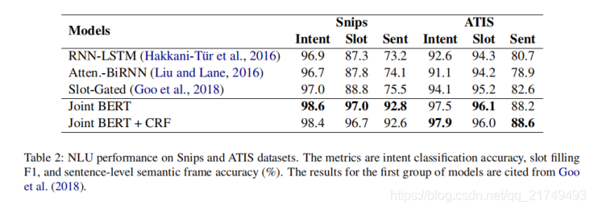

   ​		联合Bert+CRF用户CRF取代了softmax分类器，它的性能与Bert相当，这可能是由于Transformer中的自注意机制可能已经对标签结构进行了充分建模。

4. JointBert是如何实现的？

5. 

6. 

#### 2.2.4 CRF

**3.CRF和HMM区别**

（1）HMM

​		HMM是有向图，HMM是生成式模型，对P(X, Y)建模

​		HMM做了下面相关假设：

​			一阶马尔科夫假设、隐藏状态假设、转换函数稳定性假设

（2）CRF

​		CRF是无向图，是判别式模型，对P(Y|X)建模

​		CRF能提取到更多上下文信息

#### 2.2.5 Rase Core

1. 


​	自然语言处理技术近几年发展非常快，像BERT、GPT-3、图神经网络、知识图谱等技术被大量应用于项目实践中。经常会被揪着细节一步一步让你解释：“**为什么这么做？效果如何？你如何调整模型，你思考的逻辑是什么**？”

​	“说说自己在项目中具体负责的模块中用到的技术细节，遇到了什么问题？你使用的模型的损失函数、如何优化、怎么训练模型的、用的什么数据集？优化算法的选择做过哪些？为啥这么做？”	

​	我们罗列了一些常见的大厂NLP项目深度考察问题：

- BERT模型太大了，而且效果发现不那么好比如next sentence prediction, 怎么办？
- 文本生成评估指标，BLUE的缺点
- loss设计 triplet loss和交叉熵loss各自的优缺点，怎么选择
- attention机制
- ernie模型
- 介绍一下flat及对于嵌套式语料的融合方式
- 为什么使用lightGBM，比起xgboost的优点是什么
- 样本不均衡问题的解决办法有哪些？具体项目中怎么做的？
- 长文本的处理
- 引入词向量的相似性对于结果有什么不好的影响
- 如何引入知识图谱
- 词向量中很稀疏和出现未登录词，如何处理
- kmeans的k怎么选择
- 新词发现怎么做
- 模型选取、数据增强
- 从数据标注的制定标准，到选取模型，再到改进模型、错误分析
- NER数据中没有实体标注的句子过多解决方式
- 同一句话两个一样字符串如何消岐
- 模型好坏的评估,如何衡量模型的性能
- 方面级情感分析的模型结构
- 模型学习中，正负样本的训练方式不同有什么影响
- 减轻特征工程的手段

## 3.深度学习

### 3.1 理论

### 3.2 常用模型

#### 3.2.1 全连接网络

#### 3.2.2 CNN

#### 3.2.3 RNN

**1.RNN解决什么问题**

​		在前馈神经网络中，信息传递是单向的，前馈神经网络可以看作一个复杂的函数，每次输入都是独立的，即网络的输出只依赖于当前的输入。**但在很多现实任务中，网络的输入不仅和当前时刻的输入相关，也和过去一段时间的输出相关。**

​		循环神经网络（Recurrent Neural Network，RNN）是一类具有短期记忆能力的神经网络，可以适应不同长度/尺寸的输入数据。

​		RNN的参数学习可以通过随时间反向传播算法实现，即按照时间的逆序将错误信息一步步地往前传递。

​		当输入序列较长时，会存在**梯度爆炸和消失问题**，为解决该问题，对循环神经网络进行了很多的改进，其中最有效的改进方式引进**门控机制**


**2.RNN模型结构**

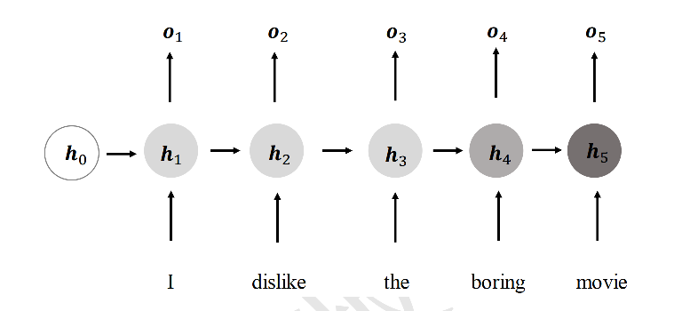

​		展开的RNN网络结构，在每个时间戳t，网络层接受**当前时间戳的输入$x_t$**和**上一个时间戳的网络状态向量$h_{t-1}$**，经过 

​										$h_t = f_\theta(h_{t-1}, x_t)$

​		变换后得到**当前时间戳的新状态向量$h_t$**，并写入内存状态中，其中$f_\theta$代表了网络的运算逻辑， 𝜃为网络参数集。在每个时间戳上，网络层均有输出产生$o_t, o_t=g_\phi(h_t)$，即将网络的状态向量变换后输出。

​		上述网络结构在时间戳上折叠，网络循环接受序列的每个特征向量$x_t$，并刷新内部状态向量$h_t$，同时形成输出$o_t$：

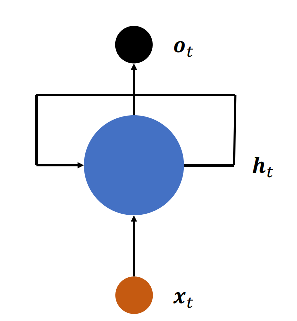

​		如果使用张量$W_{xh}、W_{hh}$和偏置b来参数化$f_\theta$网络，并按照

​								$h_t = \sigma(W_{xh}x_t + W_{hh}h_{t-1} + b)$

​		的方式更新内存状态。在循环神经网络中，激活函数更多采用tanh函数。


**3.RNN为什么有记忆功能**

​		由RNN的结构可知，RNN在每个时间步都会将前一步的激活值传递给当前步。RNN的状态取决于当前输入和先前输入，而先前状态又取决于它的输入和它之前的状态，因此状态可以间接访问序列的所有先前输入，RNN正是以这种方式保存着过去的记忆

**4.RNN的损失函数**

**5.RNN存在梯度消失/爆炸问题的原因是什么**

​		梯度消失：是指在做方向传播，计算损失函数对权重的梯度时，随着越向后传播，梯度变得越来越小，这就意味着在网络的前面一些层的神经元，会比后面的训练要慢很多，甚至不会变化。至使结果不准确，训练时间非常长。

​		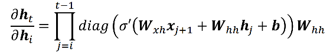

​		从时间戳i到时间t的梯度$\frac{\partial h_t}{\partial h_i}$包含了$W_{hh}$的连乘运算。当$W_{hh}$ 的最大特征值小于1时，多次连乘运算会使得$\frac{\partial h_t} {\partial h_i}$的元素值接近于零；当$\frac{\partial h_t}{\partial h_i}$的值大于1时，多次连乘运算会使得$\frac{\partial h_t}{\partial h_i}$的元素值爆炸式增长。


#### 3.2.4 LSTM

**1.LSTM可以解决的问题**

​		RNN有一个严重问题就是短时记忆，对于较长范围类的有用信息往往不能够很好的利用起来。LSTM长短时记忆网络（Long Short-Term Mermory）相对于基础的RNN网络来说，记忆能力更强，更擅长处理较长的序列信号数据。

**2.LSTM网络结构**

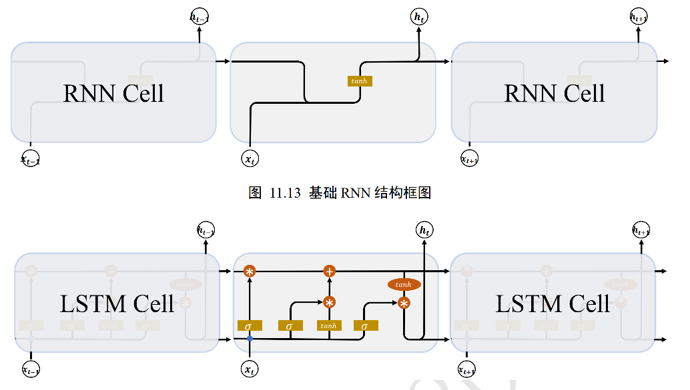

​		基础的RNN网络结构，上一个时间戳的状态向量$h_{t-1}$与当前时间戳的输入$x_t$经过线性变换后，通过激活函数tanh后得到新的状态向量$h_t$。相对于基础的RNN网络只有一个状态向量$h_t$，**LSTM新增了一个状态向量$C_t$，同时引入了门控（Gate）机制，通过门控单元来控制信息的遗忘和刷新**。

​		在LSTM中，有两个状态向量c和h，其中c做为LSTM的内部状态向量，可以理解为LSTM的内存状态向量Memory，而h表示LSTM的输出向量。

​		**门控机制：**可以理解为控制数据流通的一种手段，类比于水阀门：当水阀门全部打开时，水流畅通无阻地通过；当水阀门全部关闭时，水流完全被隔断。

​		在LSTM中，阀门开和程度利用门控值向量g表示，通过$\sigma(g)$激活函数将门控制压缩到[0,1]之间区间，**当$\sigma(g) = 0$时，门控全部关闭，输出o=0；当$\sigma(g) = 1$时，门控全部打开，输出o=x**。通过门控机制可以较好地控制数据的流量程度。

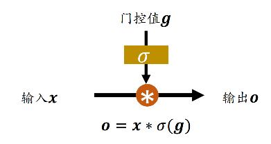


遗忘门、输入门、输出门：

**（1）遗忘门**

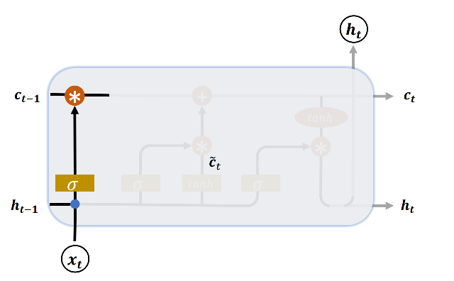

**（2）输入门**

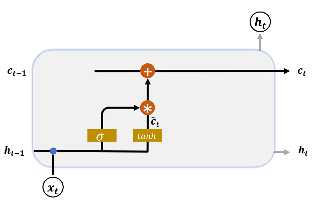

**（3）刷新Memory**

**（4）输出门**

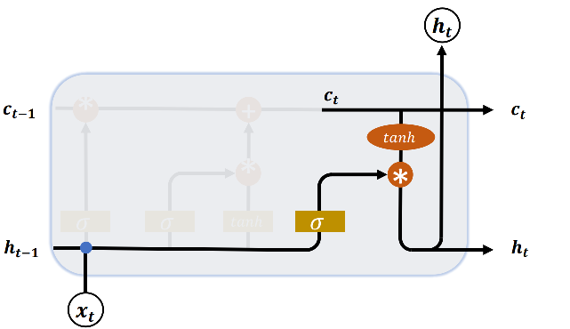

#### 3.2.5 GRU

**1.GRU网络结构**

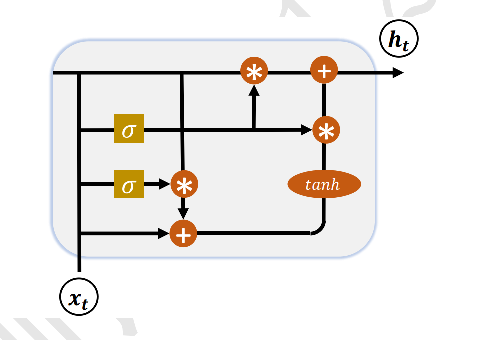

​		GRU把内部状态向量和输出向量合并，统一为状态向量h，门控数量也减少到2个：复位门（Reset Gate）和更新门（Update Gate）

**（1）复位门**

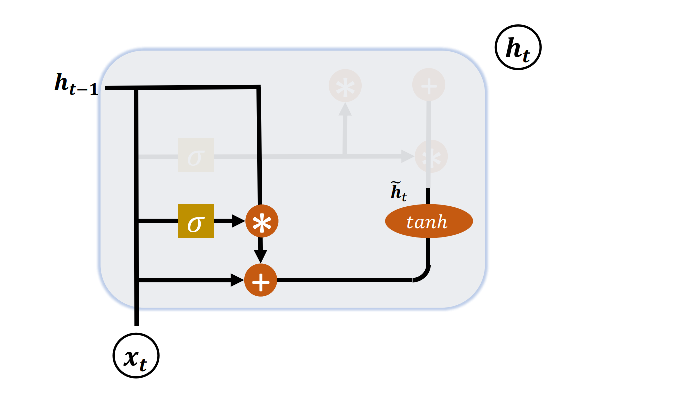

**（2）更新门**

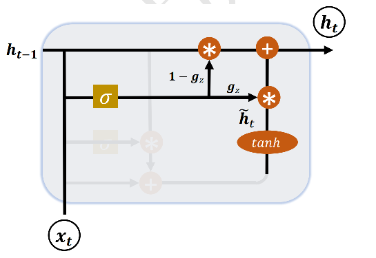

### 3.3 算法调优

1.过拟合的解决方式


### 3.4 算法评估

1.AUC的意义，ROC的绘制方式，AUC的优势（不平衡数据集的情况）


## 4.Spark

#### 4.1 spark核心概念和架构

1. **Spark特点是什么？**

   ​		Spark是一个基于内存的，用于大规模数据处理（离线计算、实时计算、快速查询-交互式查询）的统一分析引擎。它内部的组成模块：SparkCore、SparkSQL、SparkStreaming、SparkMlib、SparkGraghX等。

   ​		快：Spark计算速度是MapReduce计算速度的10～100倍

   ​		易用：MR支持1种计算模型，Spark支持更多的计算模型（算法多）

   ​		通用：Spark能够进行离线计算、交换式查询（快速查询）、实时计算、机器学习、图计算

   ​		兼容性：Spark支持大数据中的Yarn调度，支持mesos。可以处理hadoop计算的数据。

   

2. **Spark提交作业的参数**

   使用spark-submit  提交任务，会涉及到几个重要那个的参数：

   num-executors: 启动executors的数量，默认为2

   executor-cores: 每个executor使用的内核数，默认为1，官方建议2—5个，我们使用是4个

   executor-memory: executor内存大小，默认1G

   diver-cores: driver使用内核数，默认为1

   driver-memory: driver内存大小，默认512M

   

3. **Spark on Yarn的作业的提交流程**

   Spark客户端直接连接Yarn，不需要额外构建Spark集群。有yarn-client和yarn-cluster两种模式，主要区别在于：Driver程序的运行节点。

   **Driver**：是spark驱动器节点，主要用于执行spark任务中的main方法，负责实际代码的执行。

   ​	a.将用户程序转化为作业（Job）

   ​	b.在Executor之间调度任务（task）

   ​	c.跟踪Executor的执行情况

   ​	d.通过UI展示查询运行情况

   Executor：Executor并不是一个进程，而是ExecutorBackend的一个进程，Executor是它的执行类，负责spark作业中运行具体的任务，任务之间是彼此相互独立的。Spark应用启动时，Executor节点同时启动，并且始终伴随整个spark应用中的生命周期存在，如果executor节点发生故障或者崩溃，spark会将故障节点的任务调度到其它executor节点上执行。

   ​	a.运行组成spark应用的任务，并将结果返回给驱动器进程

   ​	b.通过自身的块管理器（Block Manager）为用户程序中要求缓存的RDD提供内存式存储。RDD时直接缓存在executor进程内的，因此任务可以在运行时充分利用缓存数据加速计算。

   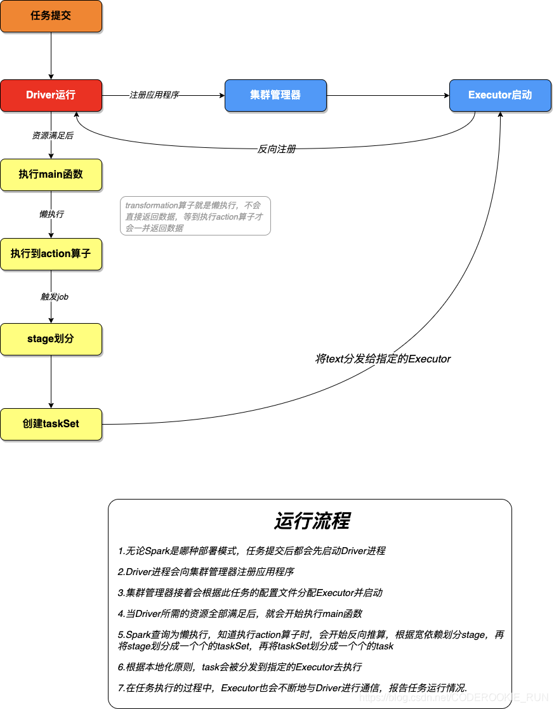

   

   

   **（1）yarn client运行模式**

   

   

   **（2）yarn cluster运行模式**

   

   

4. **spark的容错机制**

   一般而言，对于分布式系统，数据集的容错性通常有两种方式：

   ​	a.数据检查点（在Spark中对应的Checkpoint机制）

   ​	b.记录数据的更新（在Spark中对应Lineage血缘机制）

   ​		对于大数据而言，数据检查点操作（一般是将RDD写入持久存储，如HDFS）成本较高，可能涉及大量数据复制操作，消耗 I/O资源。而通过血统机制则不需要存储正在的数据，容错的成本比较低。但是问题在于如果血缘很长（即依赖的关联链路很长），如果失败重算，那代价也是很高的，所以spark提供了checkpoint的API，将恢复代价更小的选择交给用户，进一步控制容错的时间。

   ​		通常在含有宽依赖的容错中，使用Checkpoint机制设置检查点，这样就不至于重新计算父RDD而产生冗余计算了。

   

5. **如何理解Spark中血统（RDD）的概念？它的作用是什么？**

   概念：RDD是弹性分布式数据集，是Spark中最基本的数据抽象，代表一个不可变、可分区、里面的元素可并行计算的集合。

   作用：提供了一个可抽象的数据模型，将具体的应用逻辑表达为一系列转换操作（函数）。另外不同RDD之间的转换操作之间还可以形成依赖关系，进而实现管道化，从而避免了中间结果的存储，大大降低了数据复制、磁盘IO和序列化开销，并且还提供了更多的API（map/reduce/filter/groupBy）。

   RDD在lineage依赖方面分为两种窄依赖和宽依赖，用来解决数据容错时的高效性以及划分任务时候起到重要作用。

   

6. **简述Spark的宽窄依赖，以及Spark如何划分stage，每个stage又根据什么决定task个数**

   窄依赖：父RDD的一个分区只会被子RDD的一个分区依赖

   宽依赖：父RDD的一个分区会被子RDD的多个分区依赖（涉及到shuffle）

   Stage是如何划分的呢？

   根据RDD之间的依赖关系的不同将Job划分成不同的stage，遇到一个宽依赖则划分一个stage

   每个stage又根据什么决定task个数？

   Stage是一个taskSet，将stage根据分区数划分成一个个的task

   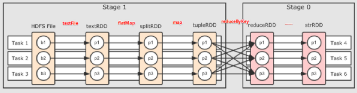

   

7. **列举Spark常用的transformation和action算子，有哪些算子会导致shuffle**

   spark的运算操作有两种类型：transformation和action：

   transformation：代表的是转化操作，就是计算流程，然后是RDD[T]，可以是一个链式的转化，并且是延迟触发的。

   action：代表是一个具体的行为，返回的值非RDD类型，可以是object，或是一个数值，也可以是Unit代表无返回值，并且action会立即触发job的执行。

   Transformation的官方文档方法集合如下：

   ```
   map
   filter
   flatMap
   mapPartitions
   mapPartitionsWithIndex
   sample
   union
   intersection
   distinct
   groupByKey
   reduceByKey
   aggregateByKey
   sortByKey
   join
   cogroup
   cartesian
   pipe
   coalesce
   repartition
   repartitionAndSortWithPartitions
   ```

   Action的官方文档方法集合如下：

   ```
   reduce
   collect
   count
   first
   take
   takeSample
   takeOrdered
   saveAsSequenceFile
   saveAsObject
   ```

   有哪些会引起shuffle过程的算子：

   ```
   reduceByKey
   groupByKey
   ...ByKey
   ```

   

8. **foreachPartition和mapPartitions的区别**

   从官网文档的api可以看出foreachPartition返回值为空，应该属于action运算操作，而mapPartitions是在tranformation中，所以是转化操作。此外在应用场景上区分是mapPartitions可以获取返回值，继续在返回RDD上做其它操作，而foreachPartition因为没有返回值并且是action操作，所以使用它一般都是在程序末尾比如说要落地数据到存储系统中如mysql、es、hbase中。

   

9. **reduceByKey与groupByKey的区别，哪一种更具优势？**

   reduceByKey：按照key进行聚合，在shuffle之前有combine（预聚会操作），返回结果是RDD[k,v]。聚合操作可以通过函数自定义。

   groupByKey：按照key进行分组，直接进行shuffle。对每个key进行操作，但只生成一个sequence，如果需要对sequence进行aggregation操作（注意，groupByKey本身不能自定义操作函数），那么选择reduceByKey/aggregateByKey更好。因为groupByKey不能自定义函数，需要先用groupByKey生成RDD，然后才能对此RDD通过map进行自定义函数操作。

   ```
   val words = Array("one", "two", "two", "three", "three", "three")
   
   val wordPairsRDD = sc.parallelize(words).map(word => (word, 1))
   
   val wordCountsWithReduce = wordPairsRDD.reduceByKey(_ + _)
   
   val wordCountsWithGroup = wordPairsRDD.groupByKey().map(t => (t._1, t._2.sum))
   ```

   对大数据进行复杂计算时，reduceByKey优于groupByKey。

   

10. **Repartition和Coalesce的关系与区别？**

    关系：两者都是用来改变RDD的partition数量的，repartition底层调用的就是coalesce方法：coalesce(numPartitions, shuffle=true)

    区别：repartition一定会发生shuffle，coalesce根据传入的参数来判断是否发生shuffle。一般情况下增大rdd的partition数量使用repartition，减少partition数量时使用coalesce。

    

11. **简述spark中的缓存（cache和persist）与checkpoint机制，并指出两者的区别和联系**

    位置：Persist和Cache将数据保存在内存，Checkpoint将数据保存在HDFS

    生命周期：Presist和Cache程序结束后会被清除或手动调用unpersist方法，Checkpoint永久存储不会被删除。

    RDD依赖关系：Presist和Cache，不会被丢掉RDD间的依赖链关系，CheckPoint会斩断依赖链。

    

12. **spark中共享变量（广播变量和累加器）的基本原理与用途**

    广播变量：广播变量是在每个机器上缓存一份，不可变，只读的，相同的变量，该节点每个任务都能访问，起到节省资源和优化的作用。它通常用来高效分发较大的对象。

    累加器：是spark提供的一种分布式的变量机制，其原理类似于mapreduce，即分布式的改变，然后聚合这些改变。累加器的一个常见用途是在调试时对作业执行过程中的事件进行计数。

    

13. **当spark涉及到数据库的操作时，如何减少spark运行中的数据连接数？**

    使用foreachPartition代替foreach，在foreachPartition内获取数据库的连接

    

14. **能介绍下你所知道和使用过的spark调优吗？**

    **资源参数调优：**

    ​		num-executors: 设置spark作业总共要用多少个executor进程来执行

    ​		executors-memory: 设置每个executor进程的内存

    ​		executors-cores: 设置每个executor进程的cpu core数量

    ​		driver-memory: 设置driver进程的内存

    ​		spark.default.parallelism: 设置每个stage的默认task数量

    **开发调优：**

    ​	避免创建重复的RDD

    ​	尽可能复用同一个RDD

    ​	对多次使用的RDD进行持久化

    ​	尽量避免使用shuffle类算子

    ​	使用map-side预聚合的shuffle操作		

    ​	使用高性能的算子：

    ​		a.使用reduceByKey/aggregateByKey替代groupByKey

    ​		b.使用mapPartition替代普通map

    ​		c.使用foreachPartitions替代foreach

    ​		d.使用filter之后进行coalesce操作

    ​		e.使用repartitionAndSortWithinPartitions替代repartition与sort类操作

    ​	广播大变量：在算子函数中使用到外部变量时，默认情况下，Spark会将该变量复制多个副本，通过网络传输到task中，此时每个task都有一个变量副本。如果变量本身比较大的话（比如100M，甚至1G），那么大量的变量副本在网络中传输的性能开销，以及在各个节点的executor中占用过多内存导致的频繁GC，都会极大影响性能。

    

15. **如何使用spark实现topN的获取**

    （1）按照key对数据进行聚合（groupByKey）

    （2）将value转换为数组，利用scala的sortBy或者sortWith进行排序（mapValues）

    

16. **spark从HDFS读入文件默认是怎样分区的？**

    spark从HDFS读入文件的分区数默认等于HDFS文件的块数（blocks），HDFS中的block是分布式存储的最小单元。如果我们上传一个30GB的非压缩文件到HDFS，HDFS默认的容量大小128MB，因此文件在HDFS上会被分为235块（30GB/128MB）；spark读取SparkContent.textFile()读取该文件，默认分区等于块数即235。

    

17. **spark如何设置合理分区数**

    （1）分区越多越好吗？

    不是的，分区数太多意味着任务数太多，每次调度任务也是很耗时的，所以分区太多会导致总统耗时增多。

    （2）分区数太少又什么影响？

    分区太少的话，会导致一些节点没有分配到任务；另一方面，分区数少则每个分区要处理的数据量就会增大，从而对每个结点的内存要求就会提高；还有分区数不合理，会导致数据倾斜的问题。

    （3）合理的分区数是多少？如何设置？

    总核数=executor-cores * num-executor

    一般合理的分区数设置为总核数的2～3倍

    （4）partition和task的关系

    Task是spark的任务运行单元，通常一个partition对应一个task。有失败时另行恢复。

18. 

19. 

20. 


#### 4.2 spark编程


## 5. Flink

#### 5.1 核心概念和基础考察

1. Flink的特性

   支持高吞吐、低延迟、高性能的流处理

   支持带有事件时间的窗口（Window）操作

   支持有状态计算的Exactly-once语义

   支持高度灵活的窗口（Window）操作，支持基于time、count、session以及data-driven的窗口操作

   支持基于轻量级分布式快照（Snapshot）实现的容错

   一个运行时同时支持Batch on Streaming处理和Streaming处理

   Flink在JVM内部实现了自己的内存管理

   支持迭代计算

   支持程序自动优化：避免特定情况下Shuffle、排序等昂贵操作、中间结果有必要进行缓存

2. 

3. 

#### 5.2 应用架构

1. **怎么提交实时任务的，有多少Job Manager？**

   使用yarn session模式提交任务。每次提交都会创建一个新的Flink集群，为每个job提供一个yarn-session，任务之间相互独立，互不影响，方便管理。任务执行完成之后创建的集群也会消失。

   线上命令脚本如下：

   bin/yarn-session.sh -n 7 -s 8 -jm 3072 -tm 32768 -qu root.\*.* -nm \*-* -d 

   其中申请7个taskManager，每个8核，每个taskmanager有32768M内存。

   集群默认只有一个Job Manager。但为了防止单点故障，我们配置了高可用。我们一般配置一个主Job Manager，两个备用Job Manager，然后结合Zookeeper的使用，来达到高可用。

   

2. **Flink最大并行度是如何确定的**

   Spark：Executor数 * 每个Executor中cup core

   Flink：TaskManager数 * 每个TaskManager中Task Slot

   

3. **集群部署模式类型对比**

   根据以下两种条件将集群部署模式分为三种类型：

   ​	a.集群的生命周期和资源隔离

   ​	b.根据程序main()方法执行在Client还是JobManager

   （1）**Seesion Mode**

   ​		共享JobManager和TaskManager，所有提交的Job都在一个Runtime中运行，JobManager的生命周期不受提交的Job的影响，会长期运行

   ​		优点：资源充分分享，提升资源利用率；Job在Flink Session集群中管理，运维简单。

   ​		缺点：资源隔离相对较差，非Native类型部署，TM不易拓展，Slot计算资源伸缩较差

   ​		提交任务脚本：

   ```shell
   $./bin/yarn-seesion.sh -jm 1024m -tm 4096m
   ```

   （2）**Per-Job Mode**

   ​		独享JobManager与TaskManger，好比为每个Job单独启动一个Runtime；TM中Slot资源根据Job指定；JobManager的生命周期和Job生命周期绑定。

   ​		优点：Job和Job之间资源隔离充分；资源根据Job需要进行申请，TM Slots数量可以不同

   ​		缺点：资源相对比较浪费，JobManager需要消耗资源；Job管理完全交给ClusterManger，管理复杂

   ​		提交任务脚本：

   ```shell
   $./bin/flink run -m yarn-cluster -p 4 -yjm 1024m -ytm 4096m ./examples/batch/WordCount.jar
   ```

   （3）**Application Mode（1.11版本提出）**

   ​		Application的main()运行在Cluster上，而不在客户端；每个Application对应一个Runtime，Application中可以含有多个Job；

   ​		a.每个Application对应一个JobManager，且可以运行多个Job

   ​		b.客户端无需将Dependencies上传到JobManager，仅负责管理Job的提交与管理

   ​		c.main()方法运行JobManager中，将JobGraph的生成放在集群上运行，客户端压力降低

   ​		优点：有效降低带宽消耗和客户端负载；Application实现资源隔离，Application中显现资源共享

   ​		缺点：仅支持Yarn和Kubunetes

   ​		提交任务脚本：

   ```shell
   $./bin/flink run-application -t yarn-application \
   ​			-Djobmanager.memory.process.size=2048m \
   ​			-Dtaskmanager.memory.process.size=4096m \
   ​			-Dyarn.provided.lib.dirs="hfs://node02:8020/flink-training/flink-1.11.1" \
   ​			./MyApplication.jar
   ```

4. 

5. 

#### 5.3 压测和监控

#### 5.4 Flink编程


## 6.Tensorflow


