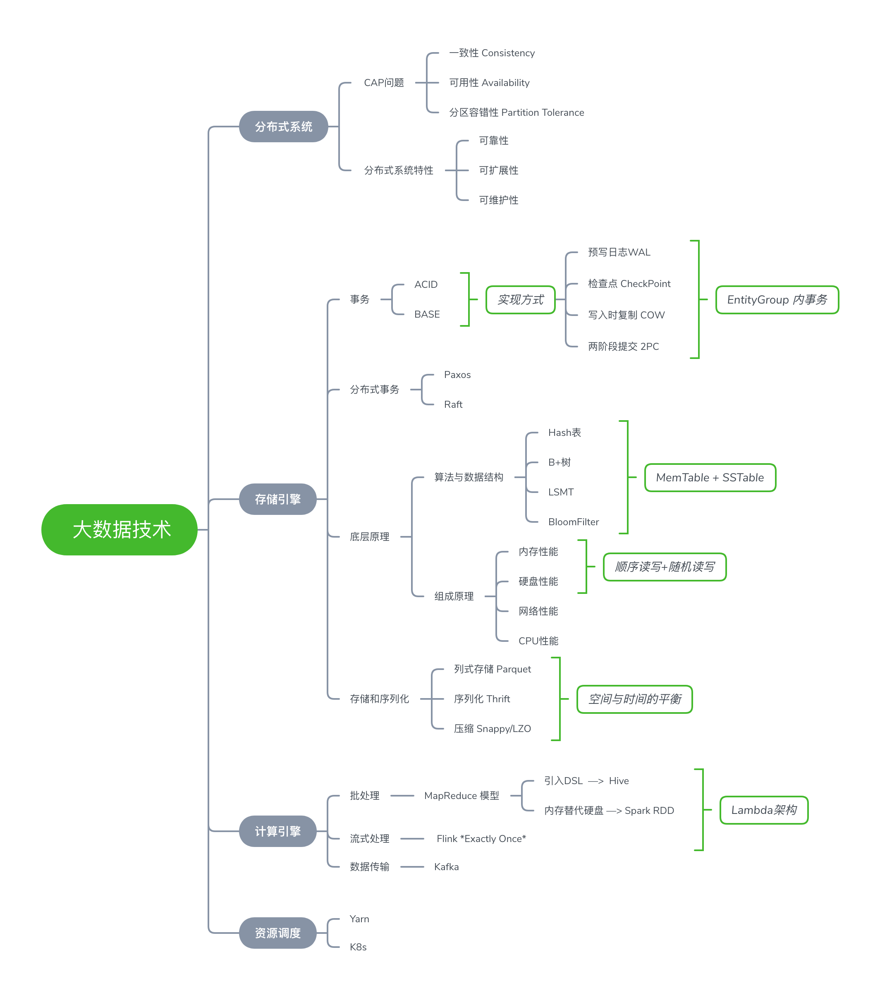
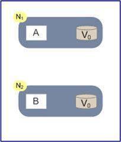
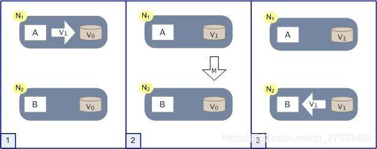
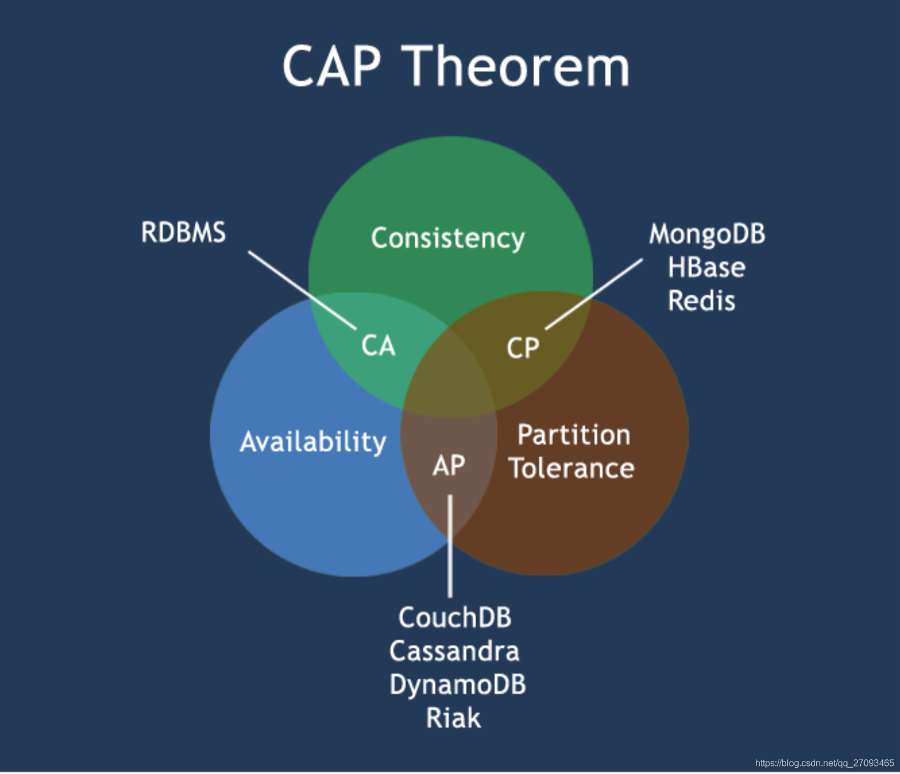

大数据技术架构

## 1.整体架构

## 2.分布式系统

### 2.1 什么是分布式系统

​		分布式系统是由一组通过**网络进行通信**、为了完成共同的任务而协调工作的计算机节点组成的系统。分布式系统的出现是为了用廉价的、普通的机器完成单个计算机无法完成的计算、存储任务。其目的是**利用更多的机器、处理更多的数据**。

​		分布式系统要解决的问题本身是单机系统一样的，而由于分布式系统多节点、通过网络通信的拓扑结构，会引入很多单机系统没有的问题，为了解决这些问题又会引入更多的机制、协议，带来更多的问题。。。

### 2.2 CAP理论

​		CAP理论指的是一个分布式系统最多只能同时满足一致性（Consistency）、可用性（Availability）、分区容错性（Partition tolerance）这三项中的两项。

​		但“三选二”的说法有一定的误导性，三种特性都是可以在一定程度上平衡的，一致性可以分为多级别（强一致性、弱一致性、最终一致性），可用性在一定区间连续变化，分区也可以分不同含义（网络故障分区、网络延迟等）。

#### 2.2.1举例说明

​                                                 		

​		现在网络中有两个节点N1和N2，他们之间网络可以连通，N1中有一个应用程序A和一个数据库V，N2中有一个应用程序B和数据库V。现在，A和B是分布式系统的两个部分，V时分布式系统的两个子数据库。

​		突然有两个用户小明和小华分别同时访问了N1和N2，理想中的操作是这样的：

- 小明访问N1节点，小华访问N2节点。同时访问的
- 小明把N1节点上的数据V0改成了V1
- N1节点一看自己的数据有变化，立马执行M操作，告诉N2节点。
- 小华读取到的就是最新的数据。也是正确的数据

​		上面这是一种最理想的情景，它满足了CAP理论的三个特性。

#### 2.2.2 详细说明CAP

- **一致性 Consistency**

  **一致性指的是所有节点在同一时间的数据完全一致。**

  上面例子中，小明和小华读取的都是正确的数据，对他们用户来说，就好像是操作了同一个数据库的同一个数据一样。

  对于一致性，可以分从客户端和服务端两个不同的视角来理解：

  - 客户端

    从客户端来看，一致性主要指的是多并发访问时更新过的数据如何获取的问题，也就是**小明和小华同时访问，如何获取更新的最新的数据**。

  - 服务端

    从服务端来看，则是更新如何分布到整个系统，以保证数据最终一致。也就是**N1节点和N2节点如何通信保持数据的一致**。

  对于一致性，一致性的程度不同大体可以分为强、弱、最终一致性：

  - 强一致性

    对于关系型数据库，要求更新过的数据能被后续的访问都能看到，这是强一致性。比如小明更新V0到V1，那么小华读取的时候也应该是V1。

  - 弱一致性

    如果能容忍后续的部分或全部访问不到，则是弱一致性。比如小明更新V0到V1，可以容忍小华读取的时候是V0。

  - 最终一致性

    如果经过一段时间后要求能访问到更新后的数据，则是最终一致性。比如小明更新V0到V1，可以使得小华在一段时间后读取的时候是V1。

- **可用性 Availability**

  reads and writes always succeed，**用户访问数据时，系统是否能在正常响应时间返回结果。**

  好的可用性主要是指系统能够很好地为用户服务，不出现用户操作失败或者访问超时等用户体验不好的情况。

  在通常情况下，**可用性与分布式数据冗余、负载均衡等有很大的关联。**

  可用性定义中的三个关键点：100%可用、有限时间内、返回结果

  

- **分区容错性 Partition tolerance**

  the  system continue to operate despite arbitrary message loss or failure of part of the system，**分布式系统在遇到某节点或网络分区故障时，仍然能够对外提供满足一致性和可用性的服务。**

  分区容错可视为在系统中采用多副本策略。

#### 2.2.3 常见的CAP系统

​		CAP理论认为分布式系统只能兼顾其中的两个特性，即出现CA、CP、AP三种情况

- **CA without P**

  放弃分区容错性，即不进行分区，不考虑由于网络不通或节点挂掉的问题，则可以实现一致性和可用性

  不再是标准的分布式系统

  常见系统：mysql、oracle等关系型数据库

- **CP without A**

  如果不要求可用性，相当于每个请求都需要在各服务器之间强一致，而分区容错性会导致同步时间无限延长，如此CP也是可以保证的。很多传统的数据库分布式事务都属于这种模式。

  常见系统：Hbase、redis、MongoDB

  业务场景：跨行转账，一次转账请求要等待双方银行系统都完成整个事务才能算完成。

- **AP without C**

  放弃一致性，一旦分区发生，节点之间可能会失去联系，为了实现高可用，每个节点只能用本地数据提供服务，而这样会导致全局数据的不一致性。

  大多数网站架构的选择

  业务场景：订单退款（今日退款成功，明日账号到账，只要用户可以接受在一定时间内到账就可以）

  12306火车票系统，本来你看到还有一张票，其实这个时刻已经被买走了，牺牲了一致性。

**注意：**分布式架构的时候必须作出取舍。一致性和可用性之间取一个平衡。大多数web应用，其实并不要强一致性。

#### 2.2.4 BASE理论

​		是由eBay架构师提出的。**BASE是对CAP中一致性和可用性权衡的结果**，其来源于对大规模互联网分布式系统实践的总结，是基于CAP定律逐步演化而来。

​		核心思想是即使无法做到强一致性，但每个应用都可以根据自身业务特点，采用适当的方式来使系统达到最终一致性。

​		BASE理论是Basically Available（基本可用）、Soft State（软状态）、Eventually Consistent（最终一致）三个短语的缩写：

- 基本可用 Basically Available

  基本可用是指分布式系统在出现故障时，允许损失部分可用性（例如响应时间、功能上的可用性），基本可用绝不等价于系统不可用。

  - 响应时间损失

    正常情况下，处理用户请求需要0.5s返回结果，但是由于系统出现故障，处理用户请求时间变成3s。

  - 功能上的损失

    正常情况下，用户可以使用系统的全部功能，但是由于系统访问量突然剧增，系统的非核心功能无法使用。例如双十一时，为了保护系统的稳定性，部分消费者可能会被引导到一个降级页面。

- 软状态 Soft State

  数据同步允许一定的延迟

  软状态是指允许系统存在中间状态，而该中间状态不会影响系统的整体可用性。

  分布式存储中一般一份数据会有多个副本，允许不同副本同步的延时就是软状态的体现。

- 最终一致 Eventually Consistent

  系统中所有的数据副本，经过一段时间的同步后，最终能够达到一致的状态，不要求实时。

**基于BASE理论涌现出的一些关于一致性的算法和协议：两阶段提交、三阶段提交、paxos算法、zab协议。**

### 2.3 分布式系统需要解决的问题

​		分布式系统分为分布式计算（computation）与分布式存储（storage）

​		基于CAP理论，分布式系统一定包含P分区容错性，首先要考虑的问题是**数据分区**？为了保障分布式系统数据的高可用和可靠性，避免单点故障，可行的方法就是**数据冗余**，将一份数据放在不同的物理节点，甚至不同的数据中心。如果数据存在多个副本，还要考虑多副本的一致性问题。

#### 2.3.1 数据分区（分片）

扩展性

#### 2.3.2 数据冗余

#### 2.3.3 多副本一致性问题

#### 2.3.2 分布式系统挑战

一致性

可用性

#### 2.3.3需要解决的问题

节点信任

节点协调

数据网络协议

### 2.4 一致性算法

Paxos

raft

### 2.5 分布式事务

