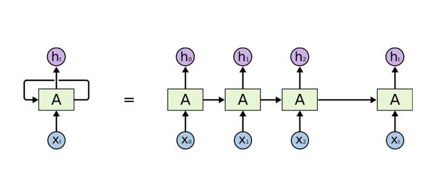

Transformer

## 1.Transformer简介

​		2017年Google的机器翻译团队在NIPS上发表了attention is all need的文章，开创性地提出了在序列转录领域，完全抛弃了cnn和rnn，只依赖attention注意力结构的简单的网络架构，名为transformer；论文实现的任务是机器翻译。

​		2021年的今天，Transformer已经是继MLP，CNN， RNN之后的第四大类深度学习模型。斯坦福大学100多位研究人员共同编写了一篇212页的综述文章，将以transformer为基础的一系列模型定义为foundation models。

## 2.应用场景

​		2018年Google提出的基于transformer的预训练语言模型BERT的问世，该模型在11项NLP任务中获得了SOTA的成绩。

​		2020年Google提出了使用transformer进行图像分类的Vision Transformer（ViT）的backbone。

​		2021年华为诺亚实验室提出了通过内外两个Transformer联合提取图像局部和全局特征的网络架构，实验表现优于ViT。

​		阿里的BST用于淘宝电商推荐。

​		2019年FaceBook提出Transformer-Transducer实现流式语音识别。

- 自然语言处理
  - 自动摘要
  - 机器翻译
  - 文本分类
  - 多轮对话
- 推荐系统
  - 用户行为序列模型
  - 用户短期兴趣模型
- 计算机视觉
  - 目标检测
  - 视频追踪
  - 图像语义分割
- 语音
  - 流式语音识别

### 2.1 赢过RNN/CNN的地方

- 并行效率高

  RNN第t时间步的隐藏状态$h_t$要等前一个时间步$h_{t-1}$的隐藏状态输出之后才能处理；难以并行。

  Transformer同时提取所有上下文的信息

- 信息传递损失小

  RNN在序列过长会导致梯度爆炸、梯度消失、遗忘，RNN改进模型LSTM和GRU能够部分解决梯度消失的问题。Transformer获取所有位置的信息距离都是1.

  

- 信息融合效率高

  卷积每次看比较小的窗口，对于距离较远的像素，需要很多层卷积一层一层扩大感受野才能把两个像素融合起来。Transformer获取所有位置的信息的距离都是1.

  

## 3.模型架构

- Encoder-Decoder

- Multi-Head Attention

- Point-wise Feed-forward NetWork

- Embedding & positional encoding

  

### 3.1.Encoder-Decoder框架

​		Encoder-Decoder框架可以看作是一种深度学习领域的研究模式，应用场景非常广泛，下图是文本处理领域常用的Encoder-Decoder框架最抽象的一种表示：

​		Encoder-Decoder框架可以看作处理一个句子（或篇章）生成另外一个句子（或篇章）的通用处理模型。对于句子对<Source，Target>，目标是给定输入句子Source，期待通过Encoder-Decoder框架来生成目标句子Target。Source和Target可以是同一种语言，也可以是两种不同的语言。而Source和Target分别由各自的单词序列构成：

​													**$Source = <x_1, x_2...x_m>$**

​													**$Target = <y_1, y_2...y_n>$**

​		**Encoder顾名思义就是对输入句子Source进行编码，将输入句子通过非线性变换转化为中间语义表示C：**

​													**$C = F(x_1, x_2...x_m)$**

​		**对于Decoder来说，其任务是根据句子Source的中间语义表示C和之前已经生成的历史信息$y_1, y_2, ...y_{i-1}$来生成i时刻要生成的单词$y_i$:**

​													**$y_i = g(C, y_1, y_2, ... y_{i-1})$**

​		每个$y_i$都依次这么产生，那么整个系统根据输入句子Source生成了目标句子Target。

Encoder-Decoder框架应用任务：

- **机器翻译**

​		Source是中文句子，Target是英文句子，解决机器翻译问题

- **文本摘要**

  Source是一篇文章，Target是概括性的几句描述语句

- **问答系统**

  Source是一句问句，Target是一句答句，这是问答系统或者对话机器人的Encoder-Decoder框架

- **语音识别**

  Encoder输入是语音流，输出是对应的文本信息

- **图像描述**

​		Encoder输入是一副图片，输出是能够描述图片语义内容的一句描述语

**文本处理和语音处理识别的Encoder部分通常采用RNN模型，图像处理Encoder一般采用CNN模型。**
