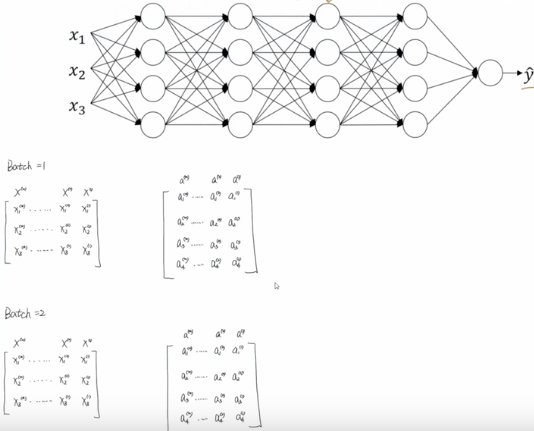
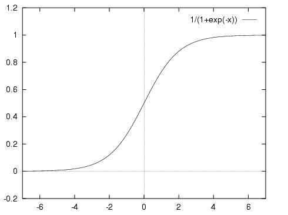
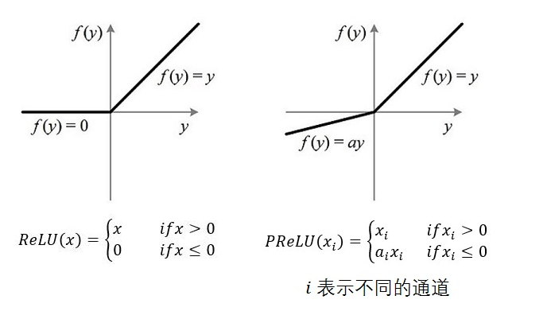
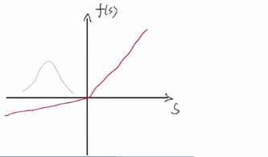
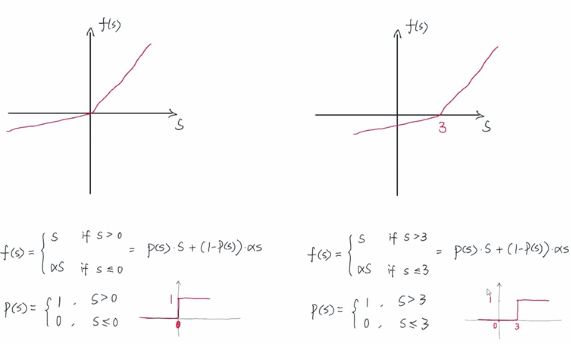
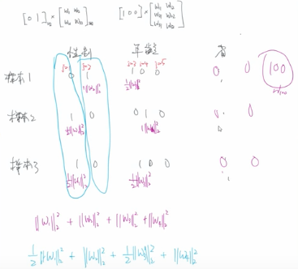
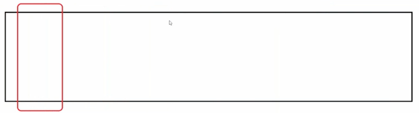
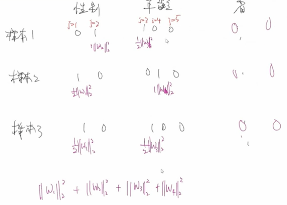
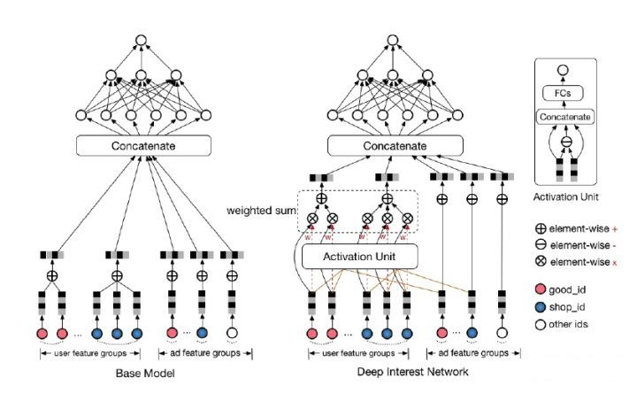

DIN（Deep Interest Network）

[TOC]

## 1.DIN背景介绍

### 1.1 背景分析

​		对于电商广告的推荐大体主要是需要及时的捕捉用户的兴趣爱好，但是用户的兴趣爱好多种多样并随时变化，这就需要根据用户历史行为来进行学习预测。

​		但是并不是用户所有历史的行为都能够代表用户的兴趣爱好，比如广告中的商品是键盘， 如果用户历史点击的商品中有化妆品， 包包，衣服， 洗面奶等商品， 那么大概率上该用户可能是对键盘不感兴趣的， 而如果用户历史行为中的商品有鼠标， 电脑，iPad，手机等， 那么大概率该用户对键盘是感兴趣的， 而如果用户历史商品中有鼠标， 化妆品， T-shirt和洗面奶， 鼠标这个商品embedding对预测“键盘”广告的点击率的重要程度应该大于后面的那三个。所以基于之前那种将Embedding稠密向量进行暴力拼接的模型在这里并不是很好的实用。

### 1.2 解决思路

​		需要自适应的去捕捉对用户兴趣预测起一个积极作用的历史行为，这样才能有更加有效的对用户进行商品的推荐。

​		谈起自适应性，那肯定是能用得上**注意力机制**，作者把注意力引入到了模型，设计了一个"local activation unit"结构，利用候选商品和历史问题商品之间的相关性计算出权重，这个就代表了对于当前商品广告的预测，用户历史行为的各个商品的重要程度大小， 而加入了注意力权重的深度学习网络，就是DIN。

### 1.3 论文

​		《Deep Interest Network for Click-Through Tate Prediction》是阿里妈妈18年的论文，和后续的DIEN在ctr预估推荐场景效果显著。

原文链接：https://arxiv.org/pdf/1706.06978.pdf

#### 1.3.1 论文核心思想

​		论文针对电子商务CTR预测问题，认为不同用户通常有多样兴趣，提出DIN模型，基于注意力机制的思想，设计局部激活函数单元，利用用户历史行为自适应学习用户的兴趣向量表示，在不同的广告中，这个兴趣向量不同。

#### 1.3.2 论文贡献

- 指出了经典网络中把用户兴趣映射到固定长度向量在用户多元兴趣表达上的局限性。提出DIN模型，**通过局部激活单元，根据用户行为自适应学习不同的兴趣向量表示**，实验证明，DIN可以改善模型的表达能力，更好的捕捉用户的多元兴趣。
- 针对实际应用领域，提出两种改进训练方法
  - min-batch aware regularizer正则化方法，降低模型复杂度，避免过拟合
  - a data adaptive activation function扩展了PReLU，考虑输入的分布情况
- 在公开数据集和阿里数据集上分布进行实验

#### 1.3.3 模型直观理解

​		论文中的核心观点是，用户的兴趣是**diverse**的，很好理解，用户可能喜欢运动、美妆、美食、家具等等，而这些兴趣用单一向量无法很好的表达，所以对于一个用户想针对不同广告有不同的向量表示，而这种表示方法是基于local activation局部激活思想的。

​		举个例子，一个用户最近买了鞋、衣服、零食、泳衣，现在点击了一个为他推荐的泳镜广告，这个推荐是基于【泳衣】的购买记录，和其他购买商品无关，因此在建模过程中，针对【泳镜】只需要重点关注【泳衣】这个购买行为就好，集利用局部激活思想。

## 2.特征表示

​		工业上的CTR预测数据集一般都是multi-group categorial form的形式，就是类别特征最为常见：		

​		这里的亮点就是框出来的那个特征，这个包含丰富的用户兴趣信息。

​		特征编码说明，举例说明：[weekday=Friday, gender=Female, visited_cate_ids={Bag, Book}, ad_cate_id=Book]，一般使用one-hot对其编码，但是对于visited_cate_ids，也就是用户的历史商品列表，对于某个用户来讲，这个值是多值型的特征，而且还要知道这个特征的长度不一样长，也就是用户购买的历史商品个数不一样多。对于这个特征使用**multi-hot编码**，也就是可能不止1个1，有那个商品，对应位置就是1，所以经过编码后的数据长下面这个样子：

​		

## 3.Base模型

### 3.1 模型结构

​		基准模型的结构相对比较简单，分为三大模块：Embedding layer、Pooling & Concat layer和MLP，如下图：

- **特征输入**		

  Base Model是一个典型的Embedding MLP的结构，输入特征有用户特征（User Proflie Features）、用户行为特征（User Behaviors）、候选广告特征（Candidate Ad）和场景特征（Context Features）。

  用户行为特征是用户最近购买过的商品组成，把ID特征构建Embedding，把Embedding跟其他特征连接起来，输入MLP。

  用户的行为序列是一组商品序列，可长可短，但是神经网络的输入向量的维度必须是固定的，图中采用Sum Pooling把这些商品Embedding叠加起来，把叠加的Embedding跟其他特征的输入结果输入MLP。

- **Embedding layer：把高维稀疏的输入转成低维稠密向量**

  每个离散特征下面都会对应着一个embedding词典，维度是D x K，D：隐向量的维度，K：当前离散特征的唯一值个数unnique()。

  举例说明：假设某个用户的weekday特征就是周五，化成one-hot编码的时候，就是[0,0,0,0,1,0,0]表示，这里如果再假设隐向量维度是D，那么这个特征对应的embedding词典是一个D × 7的一个矩阵(每一列代表一个embedding，7列正好7个embedding向量，对应周一到周日)，那么该用户这个one-hot向量经过embedding层之后会得到一个 D × 1 的向量，也就是周五对应的那个embedding，怎么算的？其实就是$embedding矩阵 \cdot [ 0 , 0 , 0 , 0 , 1 , 0 , 0 ]^T$ 。其实也就是直接把embedding矩阵中one-hot向量为1的那个位置的embedding向量拿出来。 这样就得到了稀疏特征的稠密向量了。

  对于multi-hot编码的离散特征，会得到一个embedding向量的列表，multi-hot向量不止有一个1，乘以embedding矩阵，就得到了一个列表。

- **Pooling layer & Concat layer**

  **Pooling层的作用将用户的历史行为embedding最终变成一个定长的向量**，因为每个用户历史购买的商品数是不一样的，也就是每个multi-hot中的1不一致，这样经过embedding层，得到的用户的历史行为embedding的个数不一样多，那么这样的话，每个用户的历史行为特征拼起来就不一样长了。而后面如果加全连接网络的话，需要定长特征输入。所以往往用一个pooling layer先把用户历史行为embedding变成固定长度（同一长度）。公式：

  ​								$e_i = pooling(e_{i1,}, e_{i2,}, ..., e_{ik})$

  其中，$e_{ik}$是用户历史行为embedding。$e_i$就变成了定长向量。i表示第i个历史特征组（历史商品id，历史商品类别id等），k表示历史特征组里面用户购买过的商品数量，也就是历史embedding数量。

  Concat layer层的作用就是拼接，把所有特征的embedding向量丛特征维度拼接整合，作为MLP的输入。

- **MLP**

  普通的全连接，用于学习特征之间的各种交互

- **Loss**		

  点击预测任务，二分类问题，损失函数：负的log对数似然

  ​										$L = -\frac{1}{N}\sum_{(x,y)\in S}(ylog p(x) + (1 - y)log(1-p(x)))$

​		Sum Pooling的Embedding叠加操作是把所有历史行为一视同仁，没有任何重点地加起来，不符合真实习惯。

​		DIN模型把注意力机制应用在用户的历史行为序列处理上

### 3.2 Base模型缺点

- 用户的历史行为特征和当前的候选广告特征再全都拼起来喂给神经网络之前，是**一点交互的过程都没有**
- 拼起来之后给神经网络，虽然是有了交互了，但是即**丢失了部分信息，也引入了一定的噪声**
  - 丢失信息：已经没法再看出到底用户历史行为中哪个商品与当前商品比较相关，也就是丢失了历史行为中各个商品对当前预测的重要性程度
  - 引入噪声：因为当前候选广告商品交互的是池化后的历史特征embedding，这个embedding是综合了所有的历史商品信息，这个通过我们前面的分析，对于预测当前广告点击率，并不是所有历史商品都有用，综合所有商品信息反而会增加一些噪声性的信息。

### 3.3 改进思路

​		对于给定的候选广告，DIN通过考虑历史行为与其相关性，自适应地计算用户兴趣的表示向量，该表示向量随不同广告而变化。

## 4.DIN模型架构

### 4.1 模型结构		

​		DIN通过考虑候选广告的历史行为相关性，自适应的计算用户兴趣的表示向量，这个表示向量因不同的广告而不同。

​		DIN采用了基模型的结构，只不过在这个基础上加了一个注意力机制来学习用户兴趣与当前广告间的关联程度，用论文里面的话是，引入了一个新的local activation unit，**能够根据用户历史行为特征和当前广告的相关性给用户历史行为特征embedding进行加权**。

​		Activation Unit是一个前馈神经网络，输入是用户历史行为商品和当前的候选商品，输出是它两之间的相关性，这个相关性相当于每个历史商品的权重，把这个权重与原来的历史行为embedding相乘求和就得到了用户兴趣表示$v_U(A)$，计算公式：

​			$v_U(A) =  f(v_A,e_1,e_2,...e_H) = \sum_{j=1}^Ha(e_j, v_A)e_j = \sum_{j=1}^Hw_je_j$

​	$e_1,e_2,...,e_H$：是用户U的历史行为特征embedding

​	$v_A$：表示候选广告A的embedding向量

​	$a(e_j, v_A) = w_j$：表示权重或者历史行为商品与当前广告A的相关程度

​	$a(.)$ ：表示前馈神经网络，注意力机制

需要注意是这里的权重和不是1，准确的说这里不是权重，而是直接算的相关的分数做了权重，这个是为了保留用户的兴趣强度。

​			

### 4.2 激活单元（Activation Unit）结构

​		激活单元内部结构：当前这个历史行为商品的Embedding和候选广告商品的Embedding作为输入，与它们的外积结果连接起来形成一个向量，再输入给激活单元的MLP层，最终会生成一个注意力权重，这就是激活单元的结构。

​	**激活单元就相当于一个小的深度学习模型，它利用两个商品的Embedding，生成了代表他们关联程度的注意力权重。**

（1）输入层：

​		key：user产生行为（例如点击、购买）的item embedding

​		query：候选item embedding

（2）Out Product层：

​		点积：计算矩阵之间的element-wise乘法

（3）Concat层：

​		将query，key，query-key，query * key（Out Product层，element-wise乘法）的结果进行拼接

（4）Dense层：

​		全连接层，并以PReLU或Dice作为激活函数

（5）Linear层（输出层）

​		全连接层，输出单元为1，即得到（query，key）相应的权重值

### 4.3 损失函数

损失函数用二分类交叉熵损失函数

​			$L = -\frac{1}{N}\sum_{(x,y) \in S}(ylogp(x)+(1-y)log(1-p(x)))$

### 4.4 Dice激活函数

#### 4.4.1 ICS问题

​		深度学习网络模型训练为什么会很困难？其中一个重要的原因是，深度神经网络设计到很多层的叠加，而每一层的参数更新会导致上一层的输入数据分布发生变化。通过层层叠加，高层的输入分布变化会非常剧烈，这就使得高层需要不断去重新适应底层的参数更新。为了训练好模型，我们需要非常谨慎地设定学习率、初始化权重以及尽可能细致的参数更新策略。

##### 4.4.1.1 现象

​		**由于参数更新的原因，导致每层输入的特征分布，不再独立同分布。**

​		深度神经网络涉及到很多层的叠加，而每一层的参数更新会导致【上层的输入数据分布】发生变化，通过层层叠加，【高层的输入分布变化会非常剧烈】，这就使得高层需要不断去【重新适应底层的参数更新】

##### 4.4.1.2 导致问题

- 不符合【独立同分布假设】，影响模型准确性

  机器学习中有个很重要的假设：独立同分布假设，就是假设训练数据和测试数据是满足相同分布的，这是通过训练数据获得的模型能够在测试集获得好的效果的一个基本保障。

  举例：在训练的时候用的都是黑猫的图片来训练模型，让它判断图片是否是猫。但是在验证时却全给的白猫，这就是训练集和验证集不符合独立同分布的一种情况。而在神经网络中，每一次上一层的输出都可以当成是当前层的输入。而随着网络层数的增加，越往后网络的参数变化越大，越容易不满足独立同分布的情况。

- 下层输入的变化可能趋向于变大或者变小，所带来的分布不确定性，可能导致上层输入落入【激活函数的饱和区】，导致梯度消失

  举例，sigmoid函数，$f(x) = \frac{1}{1+e^{-x}}$，神经元的非线性作用函数

  

  该函数有如下特性：当x趋近于负无穷时，y趋近于0；当x趋近于正无穷时，有趋近于1；当x=0时，y=1/2

  **当y值变化不大时，激活函数属于饱和区，梯度消失**。

- 上层网络需要不断适应新的输入数据分布，降低学习速度

##### 4.4.1.3 解决思路

在不影响数据性质的前提下，使得每次参数更新前后：

- 每层每个神经元的输入依然满足独立同分布

- 尽可能避免该分布下的数据，落入激活函数的饱和区

  让改变后的数据分布，尽可能的落在激活函数收敛比较快的区域

##### 4.4.1.4 解决方法

- **归一化 / 标准化**

  - 解决问题：不同特征之间的量级不一样，导致各自对应的w范围或者比率不一样

    

  - 原理：归一化/标准化本质上都是线性变换，这决定了对数据改变后不会造成“失效”，反而能提高数据的表现

  - 归一化

    将数据变换为0～1之间的范围，公式：$x^\prime = \frac{x-min}{max-min}$，其中max为样本数据的最大值，min为样本数据的最小值

  - 标准化

    将数据变换到均值为0方差为1，公式：$x^\prime = (x - \mu) / \sigma$，其中$ \mu$为均值，$\sigma$为方差

    

  - 作用：加速收敛的过程

- **Normalization**

  - 原理

    对每层输入数据进行【标准化】处理，将分布变换至均值为0方差为1的标准正态分布，同时使得激活输入值落在非线性函数对输入比较敏感的区域

  - 缺点

    如果使用标准化，那就相当于把非线性激活函数替换成线性函数了，那么使用非线性激活函数的意义在哪里呢？多层线性网络跟一层线性网络是等价的，也就是网络的表达能力下降了。

  - 改进方案

    为了保证非线性表达能力，后面又对此打了个补丁，对变换后的满足均值为0方差为1的x进行了scale加上shift操作，形成类似y = scale * x + shift这种形式，参数通过训练进行学习，把标准正态分布左移或者右移一点，并且长胖一点或者变瘦一点，将分布从线性区往非线性区稍微移动，希望找到一个线性和非线性的较好平衡点，既能享受非线性的较强表达能力，又能享受线性区域较大的下降梯度。

- **Batch Normalization**

  参考Batch Normalization理论详解

- **自适应激活函数**

  上面都是改变输入数据的分布

  另一种方案是改变激活函数，让激活函数自适应输入数据，通过调整激活函数来解决数据分布不同分布的问题

  

#### 4.4.2 PReLU存在的问题

​		PReLU（Parametric Rectified Linear Unit），带参数的ReLU

​		

- ICS问题

  - 每层输入数据的分布可能不一样，从而引发一系列问题
  - 举例：当数据分布集中在小于0的区间，梯度值小，参数更新将变得很缓慢（梯度消失）

- PReLU存在问题

  - 当数据分布集中在小于0的区间，梯度值小，参数更新将变得很缓慢（梯度消失）

    

- 解决ICS问题有2种方案
  - 1种就是改变数据分布，这种方法对应BN的思想
  - 另一种就是根据数据分布，来自行移动激活函数

#### 4.4.2 优化激活函数的思路及方案

​		PReLU激活函数的公式如下：

​													$f(s) = \begin{cases}s & if & s >0 \\ \alpha s & if & s<=0 \end{cases} = p(s)*s + (1-p(s)) * \alpha s$

​		其中p(s)为控制函数，其定义为p(s)=l(s>0)，l(.)为指示函数。

**优化思路：**

- 从公式中发现，分割点是由p(s)决定的，只要控制p(s)，就可以控制分割点左右移动

  

  

  通过控制x的值，来控制f(x)的值，只需要控制好x的值，这个x的值，让我们的数据分布来决定即可达到自适应。

- 并且可以控制平滑度（当p(s)平滑的时候，f(s)也会变得平滑）

**解决方案：**

- 使用数据的均值E(s)来决定分割点x的位置

- sigmoid函数作为p(s)，并让sigmoid根据数据分布进行移动

  - E(s)控制曲线左右移动
  - Var(s)控制曲线的胖瘦：Var(s)越大，就越胖；Var(s)越小，就越瘦

- sigmoid函数使得p(s)平滑化

  

#### 4.4.3 激活单元中的Dice激活函数

​		Dice激活函数是PReLU的基础上进行改进的，首先PReLU激活函数的公式如下：

​													$f(s) = \begin{cases}s & if & s >0 \\ \alpha s & if & s<=0 \end{cases} = p(s)*s + (1-p(s)) * \alpha s$

​		其中p(s)为控制函数，其定义为p(s)=l(s>0)，l(.)为指示函数。

​		Dice激活函数把PReLu激活函数中的p(s)进行了修改：

​		

​		Dice激活函数的表达式如下：

​												$f(s) =  p(s) * s + (1-p(s)) * \alpha s$

​												$p(s) = \frac{1}{1+e^{-\frac{s - E[s]}{\sqrt{Var[s] + \xi}}}}$

​		E[s]：mini-batch输入的均值；

​		Var[s]：mini-batch输入的方差；		

​		$\xi$：非常小的尝试$10^{-8}$

​		Dice主要思想是根据输入数据的分布，自适应地调整校正点，使其值为输入的均值。当E[s]和Var[s]均为0时，Dice和PReLU是等价的。

## 5.训练方式

### 5.1 Mini-batch Aware Regularization

​		基于mini-batch自适应正则化，mini-batch aware regularization主要解决的是在大规模稀疏场景下，采用SGD对引入L2正则的loss进行更新时计算开销过大的问题。mini-batch aware regularization是基于L2做的改进，在真实场景中L2正则会对所有参数都起作用，但实际上，每个mini-batch的样本特征都是非常稀疏的，加入全部参数只会让计算量加大，只对每个mini-batch中参数不为0的进行梯度更新就可以。

#### 5.1.1 L2正则化存在的问题

​		为了防止过拟合，通常做法是L1、L2、Dropout等，但是论文中尝试之后效果都不是很好，以L2正则化为例，对于阿里大规模稀疏场景，计算L2正则项时，会导致非常繁重的计算，并且是不可接受的扩展到数亿参数。造成复杂度的主要原因是每个特征对应的embedding字典矩阵的更新，复杂度是巨大的。

特征非常多，将它们进行one-hot编码之后，维度可以达到上亿级别，在转化成embedding之后，需要训练embedding参数矩阵，每个特征域都需要训练一个embedding参数矩阵，需要更新的w总数肯能会达数亿参数。导致了L2正则化不太可行。

​		用户数据符合长尾定律，在数据集中，出现次数很多的往往是一小部分特征，大多数特征（比较冷门、比较偏的）只出现了几次，容易加重过拟合。

​		在训练过程中，如果对稀疏数据也给予同样的重视程度的话，容易加重过拟合。

#### 5.1.2 L2正则改进

- 只对每个小批量中【出现过的稀疏特征参数】进行L2范数的计算

​		假设这个是一个batch数据，每一列是一个特征项（上亿特征项），在一个mini-batch中，可能存在一个特征项从上到下都是0，对于0的特征项不需要更新参数，只更新不为0的特征参数。

- 自适应正则：针对特征出现的频率，来自适应的调整他们的正则化强度
  - 对于出现频率高的，给与较小的正则化强度
  - 对于出现频率低的，给与较大的正则化强度

#### 5.1.3 数学表示

- 全局表示

  针对所有样本

  ​                                  $L_2(W) = ||W||_2^2 = \sum_{j=1}^K||w_j||_2^2 = \sum_{(x,y) \in S}\sum_{j=1}^K \frac{I(x_j \not= 0)}{n_j}||w_j||_2^2$

  S：全局样本

  j：one-hot编码之后的特征项维度（1,...,K）

  $x_j$：第j个特征项对应的具体的值

  $n_j$：$x_j$在全局的数据样本里面出现的总次数（$x_j$=1的总次数）

  L2正则化是对每个特征权重做惩罚，传统的L2是对所有的w都做惩罚，对于改进的L2正则化，是过滤掉x都为0的特征项，他们的权重就不进行更新了，只更新一小部分

- mini-batch

  针对一个mini-batch的样本

  ​								 $L_2(W) = \sum_{j=1}^K\sum_{m=1}^B \sum_{(x, y) \in B_m} \frac{I(x_i \not= 0)}{n_j}||w_j||_2^2$

  B：小批量的数量

  $B_m$：第m个batch的样本数量

  

  

- 近似等价

  ​							$L_2(W) \approx \sum_{j=1}^K \sum_{m=1}^B \frac{\alpha_{mj}}{n_j}||w_j||_2^2$

  ​                            $\alpha_{mj} = max_{(x, y) \in B_m I(x \not= 0)}$  

  $\alpha_{mj}$表示是否在小批量$B_m$中至少有一个实例拥有特征id j，$\alpha$要么是0，要么是1.

  

  ​		由图看出，前面的比重跟出现的次数是有关系的，出现的次数越多，分母越大，权重越小，惩罚越小；对于出现次数很多的特征，权重就小，惩罚力度就小，对于出现次数比较少的，惩罚力度就大。实现了自适应的效果。

  #### 5.1.4 梯度更新

  ​							$w_j \leftarrow w_j - \eta [\frac{1}{|B_m|} \sum_{(x, y) \in B_m} \frac{\partial L(p(x), y)}{\partial w_j} + \lambda \frac{\alpha_{mj}}{n_j}w_j]$

  

## 6.评估指标

​		阿里自己提出的Group AUC（GAUC）评估指标，并且实践证明了GAUC相比AUC更加稳定、可靠。**GAUC实现了用户级别的AUC计算，在单个用户基础上，按照点击次数或展示次数进行加权平均，消除了用户偏差对模型的影响**，更准确的描述了模型的表现效果。

### 6.1 AUC

​		AUC本质上是一个概率值，**AUC表示正样本得分比负样本得分高的概率**。简单来说就是随机抽取一对样本（一个正样本，一个负样本），然后用训练得到的分类器来对这两个样本进行预测，预测得到正样本的概率大于负样本概率的概率。

​											$AUC = P(P_{正样本} > P_{负样本})$

​		

| ID   | label | pro  |
| ---- | ----- | ---- |
| A    | 0     | 0.1  |
| B    | 0     | 0.4  |
| C    | 1     | 0.35 |
| D    | 1     | 0.8  |

#### 6.1.1 计算方法1

​								$AUC = \frac{\sum I(P_{正样本}, P_{负样本})}{M \cdot N}$

​                               $$I(P_{正样本}, P_{负样本}) = \begin{cases} 1, \text {$P_{正样本} $ > $P_{负样本}$} \\ 0.5, \text {$P_{正样本} $ = $P_{负样本}$} \\ 0, \text {$P_{正样本} $ < $P_{负样本}$} \end{cases}$$

计算步骤：

- 在有M个正样本，N个负样本的数据集里，一共有M * N对样本（一对样本即一个正样本一个负样本）
- 统计这M * N对样本里，正样本的预测概率大于负样本的预测概率的个数

计算上面表格样本的AUC：4条样本，2个正样本，2个负样本，即总共有4个样本对，分别是：（D,B）（D,A）（C,A）（C,B）。在（D,B）样本对中，正样本D预测的概率大于负样本B预测概率（D的得分比B高），记为1，同理，对于（C,B）正样本C的预测高了小于负样本B预测概率，记为0。总共有3个符合正样本得分高于负样本得分，故最后的AUC为：$\frac{1+1+1+0}{4} = 0.75$

### 6.1.2 计算方式2

​								$AUC = \frac{\sum_{ins_i \in positiveclass} rank_{ins_i} - \frac{M \cdot (M+1)}{2}}{M \cdot N}$

​		$rank_{ins_i}$ ：代表第i条样本的序号，（概率得分从小到大排序，排在第rank个位置）

​		M, N：分别是正样本的个数和负样本的个数

​		$\sum_{ins_i \in positiveclass}$：只把正样本的序号加起来

计算步骤：

- 所有样本的概率得分从小到大排序，得到rank值

  | ID   | label | pro  | rank |
  | ---- | ----- | ---- | ---- |
  | A    | 0     | 0.1  | 1    |
  | C    | 1     | 0.35 | 2    |
  | D    | 0     | 0.4  | 3    |
  | B    | 1     | 0.8  | 4    |

- 把正样本筛选出来

  只把正样本的序号加起来也就是把样本C、D的rank值加起来后减去一个常数项$\frac{M \cdot (M+1)}{2}$

- 代入公式计算

  $\frac{(4+2) - \frac{2 \cdot (2+1)}{2}}{2 \cdot 2} = \frac{6-3}{4}=0.75$，和我们上面计算的一样

  

#### 6.1.3 AUC的理解

​		**为什么AUC这么受欢迎？**

- 它反应的是模型的排序能力，它不关心具体的打分score的绝对值，只关心排序的相对顺序

  比如AUC是0.75，随机选一个正样本和一个负样本，模型打分正样本高于负样本的概率是0.75。

- 它对采样不敏感，在样本分布不变的情况下，正样本占比10%和占比50%计算的AUC结果差异不大，怎么理解？

  随机拿一个正样本，模型预估值为score1，因为是随机采样，小于score1的负样本和大于score1的负样本比例不会变化，反之也是。

所以AUC反应的是模型预估样本的排序关系，正负样本的gap越大，AUC越大，如果正负样本完全分开，且特征充分，那么理论上AUC能达到1.0，但是这仅仅是理想情况。

​		**为什么离线AUC=0.75，而正常线上AUC=0.7？**

​		因为在线上用户特征集合完全一致，但label不同的item数据，学术上称作Bayes Error Rate，为什么要做很多特征工程的事情，就是因为想通过在这些数据集合中找到一些特征能够区分开这些样本。

​		**点击和转化/购买两个行为，一般谁的AUC更高？**

​		正常情况下点击的AUC比转化/购买的AUC低，原因是点击的成本更低，或者说决策成本更低，决策路径更短，看懂了稍微有点兴趣就会点击，可能是因为标题中一个词很吸引人。但是转化/购买正好相反，需要付出的成本更大，决策路径更长，所以更能反应用户的真实兴趣。用前面的话说就是GAP更大，所以AUC更高。

​		**点击和转化/购买两个行为，在AUC相同的情况下，那个的线上表现更好？**

​		相同AUC，点击会比转化/购买表现更好，首先点击的数据量更充足，模型训练更充分。另外转化/购买受场外印象因素较多，比如别人的建议，自己的预算，网上评测等，这些都是没有办法表示在模型中的。所以决策链路长，就会导致中间信息丢失的多，而线上可能更线上AUC表现越不好。

#### 6.1.4 AUC的缺点

​		【线下】AUC提升不一定带来【线上】效果提升，原因：AUC反映整体样本间的排序能力，表示正样本得分比负样本得分高的概率，对样本不区分用户地计算整体样本的AUC。AUC计算的时候，不仅会涉及同一个用户的不同item，也会涉及不同用户的不同item，而线上排序系统每次排序只针对同一个用户的不同item进行打分。

​		举例：两个模型A、B分别预测出不同的效果，计算模型A、B的总体AUC和用户AUC。

**总体AUC：**

| 模型A | 模型B |
| :---: | :---: |

| ID   | label | pro  | rank | ID   | label | pro  | rank |
| ---- | ----- | ---- | ---- | ---- | ----- | ---- | ---- |
| 甲   | 0     | 0.1  | 1    | 甲   | 0     | 0.1  | 1    |
| 甲   | 1     | 0.2  | 2    | 甲   | 1     | 0.2  | 2    |
| 乙   | 0     | 0.3  | 3    | 甲   | 1     | 0.7  | 3    |
| 甲   | 1     | 0.7  | 4    | 乙   | 0     | 0.3  | 4    |
| 乙   | 1     | 0.8  | 5    | 乙   | 1     | 0.8  | 5    |

模型A：M=3     N=2         $AUC_{总体,A} = \frac{(2+4+5) - \frac{3 \cdot (3 +1)}{2}}{ 3 \cdot 2} = \frac{11 - 6}{6} = 0.833$

模型B： M=3     N=2         $AUC_{总体,B} = \frac{(2+3+5) - \frac{3 \cdot (3 +1)}{2}}{ 3 \cdot 2} = \frac{10 - 6}{6} = 0.667$

**甲AUC值**：

| 模型A | 模型B |
| :---: | :---: |

| ID   | label | pro  | rank | ID   | label | pro  | rank |
| ---- | ----- | ---- | ---- | ---- | ----- | ---- | ---- |
| 甲   | 0     | 0.1  | 1    | 甲   | 0     | 0.1  | 1    |
| 甲   | 1     | 0.2  | 2    | 甲   | 1     | 0.2  | 2    |
| 甲   | 1     | 0.7  | 3    | 甲   | 1     | 0.7  | 3    |

模型A： $AUC_{甲,A} = 1$

模型B：$ AUC_{甲,B} = 1$

**乙AUC值**：

| 模型A | 模型B |
| :---: | :---: |

| ID   | label | pro  | rank | ID   | label | pro  | rank |
| ---- | ----- | ---- | ---- | ---- | ----- | ---- | ---- |
| 乙   | 0     | 0.3  | 1    | 乙   | 0     | 0.3  | 1    |
| 乙   | 1     | 0.8  | 2    | 乙   | 1     | 0.8  | 2    |

模型A： $AUC_{乙,A} = 1$

模型B：$AUC_{乙,B} = 1$

​		从总体AUC的表现来看，模型A的表现优于模型B，从用户级别的AUC实际情况来看，模型B的效果和模型A的效果是一样好的。

​		用户推荐之间的排序是个性化的，不同用户的排序结果不太好比较，这可能导致全局auc并不能反映真实情况。

### 6.2 GAUC

​		$GAUC = \frac{\sum_{i-1}^n w_i \cdot AUC_i}{\sum_{i=1}^n w_i} = \frac{\sum_{i=1}^n impression_i \cdot AUC_i}{\sum_{i=1}^n impression_i}$

​		其中，权重$w$即可以是展示次数（impression）也可以是点击次数（clicks），n是用户数量。在单个用户AUC基础上，按照点击次数或展示次数进行加权平均，消除用户偏差对模型的影响，更准确的描述了模型的表现效果。

分别计算一下上面模型A和模型B的GAUC：

模型A：        $GAUC_A = \frac{w_甲 \cdot AUC_{甲,A} + w_乙 \cdot AUC_{乙,A}}{5} = \frac{3 \cdot 1 + 2 \cdot 1}{5} = 1$

模型B：        $GAUC_B = \frac{w_甲 \cdot AUC_{甲,B} + w_乙 \cdot AUC_{乙,B}}{5} = \frac{3 \cdot 1 + 2 \cdot 1}{5} = 1$

优缺点：

- 优点：实现了用户级别的AUC计算

- 注意点：用户行为没有那么多的时候，GAUC会抖动，大部分公司还是用AUC比较

  

## 7.DIN模型复现

## 8.常见问题

### 8.1 算法工程师技能雷达图

算法工程师的4个技能点：

- 知识

  只要是指你对matching learning相关知识和理论的储备

- 工具

  将你的matching learning知识应用于实际业务的工具

- 逻辑

  你的举一反三的能力，你解决问题的条理性，你发散思维的能力，你的聪明程度

- 业务

  深入理解所在行业的商业模型，从业务中发现motivation并进而改进模型算法的能力

具体到计算广告算法工程师职位，具体能力：

- 知识：

  主流CTR模型以及预算控制，流量预估，bidding策略等模型算法的原理和技术细节

- 工具：

  coding能力，spark、flink、tensorflow、ps-lite等模型训练，serving相关工具

- 逻辑：

  算法题，模型之间的演化关系

- 业务：

  展示广告和搜索广告在构建模型时的区别联系，如何根据公司的business model制定模型的objective

### 8.2 DIN的CTR预估模型

#### 8.2.1 softmax函数的定义是什么？（知识）

[softmax](../jupyter/dl/softmax.html)

#### 8.2.2 神经网络为什么会产生梯度消失现象？（知识）

#### 8.2.3 常见的激活函数有哪些？都有什么特点？（知识）

#### 8.2.4 挑战一种激活函数推导梯度下降的过程（知识+逻辑）

#### 8.2.5 Attention机制是什么？（知识）

#### 8.2.6 阿里是如何将attention机制引入推荐模型的？（知识+业务）

​		目的：利用用户历史行为自适应学习用户的兴趣向量表示

​		每个用户的兴趣是多样的，在预测大衣的CTR这件事情上，用户浏览过被子，跟用户浏览过另一件大衣两个行为的重要程度不一样。为了解决这件事情，引入了注意力机制，对用户不同行为的注意力是不一样的，“相关”的行为历史看重一些，“不相关”的历史甚至可以忽略。

​		先介绍了Base model，把用户的行为序列转化成embedding，但是神经网络的输入向量的维度必须是固定的，采用Sum Pooling把这些商品Embedding叠加起来，把叠加的Embedding跟其他特征的输入结果输入MLP。但是用户行为特征和当前候选广告特征**没有交互过程**，

​		阿里妈妈引入了attention机制，就是在模型预测的时候，**对用户不同行为的注意力是不一样的**，在模型的计算公式：

​								$V_u = f(V_a) = \sum_{i=1}^Nw_i \cdot V_i = \sum_{i=1}^Ng(V_i, Va) \cdot V_i$

​		其中，$V_u$是用户行特征计算好的embedding向量， $V_a$是候选广告商品的embedding向量， $V_i$是用户u的第i次行为embedding向量，因为这里用户的行为就是浏览商品或店铺，所以行为的embedding的向量就是那次浏览的商品或店铺的embedding向量。

​		因为加入了注意力机制，$V_u$从过去$V_i$的加和变成了$V_i$的加权和，$V_i$的权重$w_i$就由$V_i$与$V_a$的关系决定，也就是上式中的$g(V_i, V_a)$ ，这个$g(V_i, V_a)$的加入就是本文70%的价值所在。

​		相比Base model，DIN在生成用户embedding vector的时候加入了一个activation unit层，这一层产生了每个用户行为$V_i$的权重，下面我们仔细看一下这个权重是怎么生成的，也就是$g(V_i, V_a)$是如何定义的。

​		传统的attention机制，给到两个item embedding，比如u和v，通常是直接做点积或者uWv，其中W是一个$|u|\cdot|v|$的权重矩阵，但这篇paper中阿里显然做了进一步改进，着重看上图右上角的activation unit，**首先是把u和v以及u v的element wise差值向量合并起来作为输入，然后喂给全连接层，最后得出权重**，这样的方法显然损失信息更少。但如果你自己想方便引入attention机制的话，不妨先从点积方法做起尝试一下，因为这样连训练都不用训练。

​		上面的部分是70%价值所在，剩余30%应该还有这么几点：

- 用GAUC这个离线metric替代AUC
- 用Dice方法替代经典的PReLU激活函数
- 介绍一种Adaptive的正则方法
- 介绍阿里的X-deep Learning深度学习平台

​		

#### 8.2.7 DIN是基于什么业务逻辑引入attention机制的？（业务）

​		充分利用和挖掘用户行为历史数据提升CTR预估指标

​		对于电商广告推荐需要及时的捕捉用户的兴趣爱好，但是用户的兴趣爱好多种多样并随时变化，这就需要根据用户历史行为来进行学习预测。

​		attention机制可以自适应的去**捕捉对用户兴趣预测起一个积极作用的历史行为**，这样才能有更加有效的对用户进行商品的推荐。

#### 8.2.8 DIN中将用户和商品进行了embedding，请讲清楚两项你知道的embedding方法（知识）

#### 8.2.9 你如何serving类似DIN这样的深度学习模型（工具+业务）

