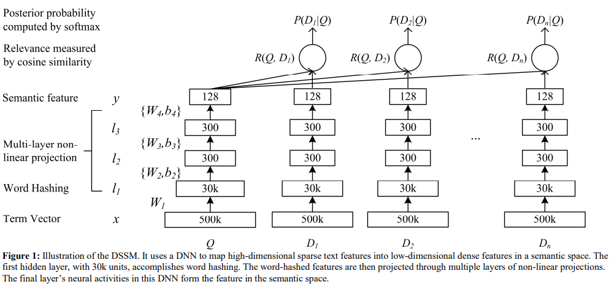
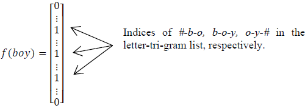
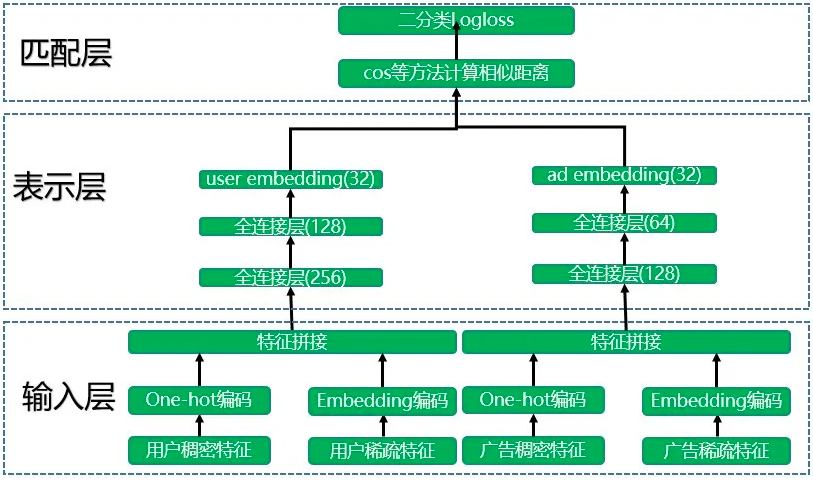

DSSM模型

## 1.DSSM模型原理

### 1.1 DSSM模型简介

​	DSSM模型的全称是Deep Structured Semantic Model，由微软研究院开发，利用深度神经网络把文本（句子，Query，实体等）表示成向量，应用于文本相似度匹配场景下的算法。

​	DSSM模型在信息检索、文本排序、问答、图片描述、机器翻译等中有广泛的应用。该模型是为了衡量搜索的关键词和被点击的文本标题之间的相关性。

​	DSSM模型的原理比较简单，通过搜索引擎里Query和Document的海量点击曝光日志，用DNN深度网络把Query和Document表达为低纬语义向量，并通过余弦相似度来计算两个语义向量的距离，最终训练出语义相似度模型。该模型既可以用来预测两个句子的语义相似度，又可以获得某句子的低纬语义Embedding向量。

### 1.2 模型结构

​	DSSM模型的整体结构图：Q代表Query信息，D表示Document信息

- Term Vector

  表示文本embedding向量

- Word Hashing

  为了解决Term Vector太大问题，对bag-of-word向量降维

  使用word hashing方法将句子50w的one-hot表示降低到了3w，原理是对句子做letter level的trigrim并累加

  如下图：#boy#会被切成#-b-o, b-o-y, o-y#

  

  选用trigrim而不用bigrim或者unigrim的原因是为了权衡表示能力和冲突，两个单词冲突表示和两个单词编码后的表示完全相同。

- Multi-layer nonlinear projection

  表示深度学习网络的隐藏层

  第二层到第四层是典型的MLP网络，最终得到128维的句子表示

  ​					$l_1=W_1x$

  ​					$l_i = f(W_il_{i-1} + b_i),  i = 2,...,N-1$

  ​					$y = f(W_Nl_{N-1} + b_N)$

  激活函数是tanh

  ​					$f(x) = \frac{1 - e^{-2x}}{1 + e^{-2x}}$

- Semantic feature

  表示query和document最终的embedding向量

- Relevance measured by cosine similarity

  表示计算query与document之间的余弦相似度

  对正负样本计算cosine距离

  ​					$R(Q,D) = cosine(y_Q, y_D)=\frac{y_Q^Ty_D}{||y_Q||  ||y_D||}$

- Posterior probability computed by sofamax

  表示通过softmax函数把query与正样本document的语义相似性转化为一个后验概率

  ​					$P(D^+|Q)=\frac{exp(\gamma R(Q,D^+))}{\sum_{D` \in D}exp(\gamma R(Q,D^+))}$

  其中：$\gamma$为softmax的平滑因子，$D^+$为query下的正样本，$(D^, - D^+)$为query的随机采取的负样本，D为query下的整个样本空间。

  在训练阶段，通过极大似然估计，最小化损失函数：

  ​					$L\Lambda = -log\prod_{(Q,D_+)}p(D^+|Q)$

## 2.DSSM在推荐中的结构

​	DSSM模型总的来说可以分层三层结构，分别是输入层、表示层和匹配层。

### 2.1输入层

​	模型训练分层两座不同的“塔”分别进行，其实也就是不同的神经网络。其中一座塔是用于生成user embedding。输入用户特征训练数据，用户特征包括用户稠密特征和用户稀疏特征，其中用户稠密特征进行one-hot编码操作，用户稀疏特征进行embedding降维到低维空间（64或者32维），然后进行特征拼接操作。广告侧和用户侧类似。

​	稠密特征的处理较为简单，稀疏特征的处理较为复杂，这里我们将稀释特征划分为两类：

- 单类别稀释特征（sparse_feature_columns）：该类特征主要是指user_id、gender、age和occupation等类别编码的特征，每个客户只有唯一取值，因此只需要使用nn.Embedding进行编码，输出低维表示。
- 变长稀疏特征（varlen_sparse_feature_columns）：该类特征一般为变长序列特征，比如用户观看点用的历史行为序列user_hist，每个客户的行为序列长度不一，因此需要将每个电影的embedding进行pooling(get_varlen_pooling_list)，输出低维表示。

### 2.2 表示层

​	将拼接好的特征提供给各自的深度学习网络模型。用户特征和广告特征经过各自的两个全连接层后会转化成了固定长度的向量，这里得到了维度相同的user embedding和ad embedding。各塔内部的网络层数和维度可以不同，但是输出的维度必须是一样的，这样才能匹配层进行运算。图 user embedding 和 ad embedding 维度都是 32。

​	图中表示层的结构是比较简单的实现方式，只使用了两层全连接网络来作为特征抽取器，实际使用中有很多变种，比如 CNN-DSSM、LSTM-DSSM  等，现在深度学习领域公认最强的特征抽取器是 Transformer，也可以考虑在表示层中加入 Transformer。

### 2.3 匹配层

​	模型训练好了之后会分别得到user embedding 和ad embedding，将它们存储到 Redis 这一类内存数据库中。如果要为某个特定的广告推荐人群，则将该广告的ad embedding 分别和所有人群的user embedding 计算cos相似度。选择距离最近的N个人群子集作为广告投放人群，这样就完成了广告推荐任务。**模型训练过程中将cos函数得到的结果进入sigmoid函数和真实标签计算logloss，查看网络是否收敛。模型评估主要使用auc指标。**

