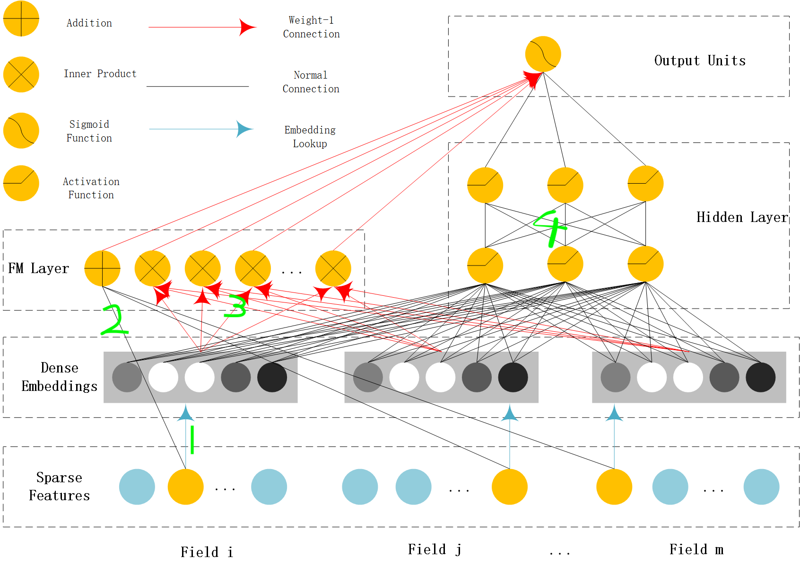
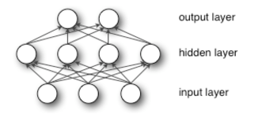
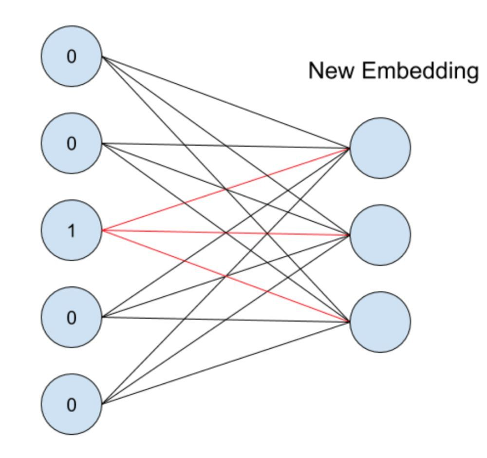
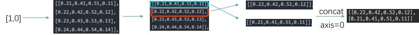
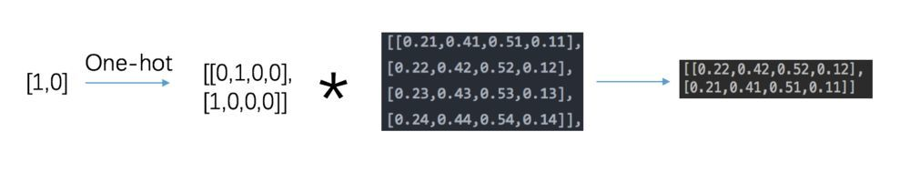
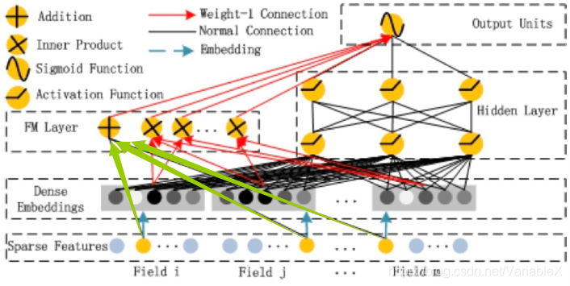
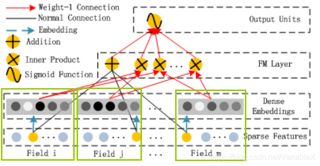

<center><font size='60'>DeepFM模型</font></center>

[TOC]

## 1. DeepFM原理

### 1.1 特征交叉

​		模型的输入有性别、年龄、电影风格这个几个特征，在训练样本中我们发现25岁男生喜欢科幻电影的样本，有35岁女生喜欢看恐怖电影的样本，那么模型应该怎么推测“25岁女生”喜欢看的电影风格呢？

​		事实上，这类特征组合和特征交叉问题非常常见，而且在实际应用中，特征的种类还要多得多，特征交叉的复杂程度也要大得多。**解决这类问题的关键，就是模型对于特征组合和特征交叉的学习能力，因为它决定了模型对于未知特征组合样本的预测能力，而这对于复杂的推荐问题来说，是决定其推荐效果的关键点之一**。

​		为什么深度学习模型需要加强处理特征交叉的能力？对于Embedding MLP和Wide&Deep模型都没有针对性的处理特征交叉问题。但是，我们之前不是一直说，多层神经网络有很强的拟合能力，能够在网络内部任意地组合特征吗？这两个说法不是相互矛盾吗？

​		对于MLP有拟合任意函数的能力，这没有错，但这是建立在MLP有任意多层网络，以及任意多个神经元的前提下。在训练资源有限，调参时间有限的现实情况下，MLP对于特征交叉的处理其实还是比较低效。

### 1.2 FM

​		FM（Factorization Machine）因子分解机模型，可以**全自动化**地做特征组合。FM的提出主要是为了解决稀疏数据下的特征组合问题。下面我们通过一个例子来说明FM模型。

根据用户的基本属性，预测用户是否点击来广告，有下面这样的数据（one-hot编码）

|        | **age** | **city=bj** | **city=sh** | **city=sz** | **sex=man** | **sex=woman** | **label** |
| ------ | ------- | ----------- | ----------- | ----------- | ----------- | ------------- | --------- |
| user_1 | 20      | 1           | 0           | 0           | 0           | 1             | 1         |
| user_2 | 25      | 0           | 0           | 0           | 1           | 0             | 0         |

​		经过one-hot编码之后的特征是比较稀疏的，城市和性别特征一共5维，但只有两个维度有非零值。在实际应用中CTR/CVR预测时，用户的性别、职业、教育水平、品类偏好，商品的品类等，经过One-Hot编码转换后都会导致样本数据的稀疏性。特别是商品品类这种类型的特征，如商品的末级品类约有550个，采用One-Hot编码生成550个数值特征，但每个样本的这550个特征，有且仅有一个是有效的（非零），这也说明了One-Hot编码的另一个特点就是导致特征空间大。

假设我们用最简单的线性拟合来预测y值：

​                                                             $\hat{y} = w_0 + \sum_{i=1}^nw_ix$

​		上述这个模型的不足之处在于没有考虑到“北京的男性用户”、“上海的女性用户”这种特征组合特征可能是有用的，即 $x_i,x_j$ ，（ $x_i,x_j$ 都是one-hot特征）同时为1时可能是一个很有用的特征，这种特征组合是 $x_i,x_j$ 和线性组合所无法表示的。所以，我们必须在模型中引入 $x_i,x_j$ 的组合特征。直接将二者乘积 $x_i,x_j$ 作为一个新的特征，即 $x_i$ 和 $x_j$ 都非零时，组合特征 $x_i,x_j$ 才有意义。

​		这种关联特征与label的正向相关性在实际问题中是普遍存在的，如“化妆品”类商品与“女”性，“球类运动配件”的商品与“男”性，“电影票”的商品与“电影”品类偏好等。因此，引入两个特征的组合是非常有意义的。同样道理我们组合任意三个特征、四个特征，随着阶数的提高，样本会显得非常稀疏，而且额外引入的参数呈指数增长。

新的模型公式：

​						$\hat{y} = w_0 + \sum_{i=1}^nw_ix + \sum_{i=1}^n\sum_{j=i+1}^nw_{ij}x_ix_j$                   

​		**我们穷举所以i,j组合，若某些 $x_i,x_j$的组合不是有用特征，经过大量样本训练，模型会把那些无用特征的系数训练为0**。

​		从上式可以看出组合特征的参数一共有n(n-1)/2个，任意两个参数都是独立的，**训练每个参数$w_{ij}$ 需要大量的 $x_i$、$x_j$  都不为0的样本，如果训练样本不足，容易导致 $w_{ij}$不准确**。

#### 1.2.1 FM模型基础

FM推导需要的数学基础：

1. FM模型提出

   2010年，FM模型由Steffen Rendle在论文《Factorization Machines》提出。

2. 共轭转置矩阵

   转置矩阵（Transpose）：将矩阵的行与列对换。

   共轭转置矩阵（Conjugate Transpose）：将矩阵的行与列对换，并且每个元素共轭。共轭就是将形如$a+b_i$的数变成$a-b_i$，实数的共轭是它本身。

   **实数矩阵的共轭转置矩阵就是转置矩阵**

3. 正定矩阵（Positive Definite Matrix）

   对称矩阵，并且所有特征值都大于0。

4. Cholesky分解

   即楚列斯基分解（Cholesky Decomposition），也称为乔里斯基分解。将一个对成正定矩阵化为一个下三角矩阵与共轭转置矩阵的积的分解。

   设A是n阶对称正定矩阵，则存在唯一的对角元均为正数的下三角矩阵L，使得

   ​										$A = LL^T$ 

   则，分解$A = LL^T$ 被称为Cholesky分解。

#### 1.2.2 FM推导

##### 1.2.2.1 线性回归模型

​		线性回归（Linear Regression）模型的方程式如下：

​							$y = w_0 + w_1x_1 + w_2x_2 + ··· + w_nx_n$

​		则：

​						    $y = w_0 + \sum_{i=1}^n w_ix_i   \quad\quad\quad\quad (1)$

​		线性回归模型的假设：

- **特征之间相互独立不相关**
- 特征的作用是可以叠加的

​        线性回归模型假设特征之间是相互独立的、不相关。但是现实的某些场景中，特征之间往往是相关的，而不是相互独立的。比如<女性，化妆品>、<程序员，计算机书籍>等。

​		所以有些场景需要特征组合，怎么组合？升级为**二阶多项式回归模型**：

​		假设有n个特征，分别是 $x_1, x_2, ···, x_{n-1}, x_n$，则两两关联，则组合方式如下表所示：

|           |    $x_1$     |    $x_2$     | ···  |    $x_{n-1}$     |    $x_n$     |
| :-------: | :----------: | :----------: | :--: | :--------------: | :----------: |
|   $x_1$   |   $x_1x_1$   |   $x_1x_2$   | ···  |   $x_1x_{n-1}$   |   $x_1x_n$   |
|   $x_2$   |   $x_2x_1$   |   $x_2x_2$   | ···  |   $x_2x_{n-1}$   |   $x_2x_n$   |
|    ···    |     ···      |     ···      | ···  |       ···        |     ···      |
| $x_{n-1}$ | $x_{n-1}x_1$ | $x_{n-1}x_2$ | ···  | $x_{n-1}x_{n-1}$ | $x_{n-1}x_n$ |
|   $x_n$   |   $x_nx_1$   |   $x_nx_2$   | ···  |   $x_nx_{n-1}$   |   $x_nx_n$   |

共有$\frac{n(n-1)}{2}$种组合，即构成一个n x n的对称矩阵。

​		特征两两组合，得到二阶多项式回归模型，方程式如下：

​										$y = w_0 + \sum_{i=0}^nw_ix_i + \sum_{i=1}^n\sum_{j>=i}^nw_{ij}x_ix_j   \quad\quad\quad\quad (2)$

​		其中：**n代表样本的特征数量，$x_i$是第i个特征的值，$w_0, w_i, w_{ij}$是模型参数。**则组合特征的参数一个有$n^2$个，任意两个参数是独立的。

##### 1.2.2.2 FM推导

**FM模型方程式：**

​		将特征关系向量化，则得到FM模型。方程(2)的二项式参数$w_{ij}$可以组成一个对称矩阵W。根据Cholesky分解，则可以分解成：

​									   $W = VV^T$

​		V的第j列便是第j维特征的隐向量。即每个参数

​									  $w_{ij} = <V_i, V_j>$

​									  $<v_i, v_j> = \sum_{f=1}^kv_{i,f}v_{j,f} = \underbrace{1 \quad 0 \quad 1}_{v_i}\quad \left.\begin{array}{l} \text{1}\\ \text{0}\\ \text{1}\end{array}\right\}v_j$

​		这就是FM模型的核心思想。

​		即方程（2）可以写成：

​									 $y = w_0 + \sum_{i=1}^nw_ix_i + \sum_{i=1}^n\sum_{j=i+1}^n<v_i, v_j>x_ix_j     \quad\quad\quad\quad(3)$

​		其中，==$v_i$是第i维特征的隐向量， <·,·>代表向量的点积==。隐向量的长度为k(k << n)，包含k个描述的特征的因子。

**代数推导组合关系：**

​		两个元素的两两组合：

​								$ab = \frac{(a+b)^2 - a^2 -b^2}{2}$

​		三个元素的两两组合：

​								$ab + ac + bc = \frac{(a+b+c)^2 - a^2 - b^2 - c^2}{2}$

​		n个元素的两两组合：

​								$ab + ac + bc + ··· = \frac{(a+b+c+···+n)^2 - a^2 -b^2 - c^2 - ··· - n^2}{2}$

​		可得关系式如下：

​								$\sum_{i=1}^n\sum_{j=i+1}^nx_ix_j = \frac{1}{2}(\sum_{i=1}^n\sum_{j=1}^nx_ix_j - \sum_{i=1}^nx_ix_i)$

**矩阵推导组合关系：**

​		利用矩阵直观化推导FM模型的计算，具体推导如下：

矩阵天然具有两两组合特性，表格可视化易理解

|     $<v_1,v_1>x_1x_1$     |     $<v_1,v_2>x_1x_2$     | ···  |     $<v_1,v_{n-1}>x_1x_{n-1}$     |     $<v_1,v_n>x_1x_n$     |
| :-----------------------: | :-----------------------: | :--: | :-------------------------------: | :-----------------------: |
|     $<v_2,v_1>x_2x_1$     |     $<v_2,v_2>x_2x_2$     | ···  |     $<v_2,v_{n-1}>x_2x_{n-1}$     |     $<v_2,v_n>x_2x_n$     |
|            ···            |            ···            | ···  |                ···                |            ···            |
| $<v_{n-1},v_1>x_{n-1}x_1$ | $<v_{n-1},v_2>x_{n-1}x_2$ | ···  | $<v_{n-1},v_{n-1}>x_{n-1}x_{n-1}$ | $<v_{n-1},v_n>x_{n-1}x_n$ |
|     $<v_n,v_1>x_nx_1$     |     $<v_n,v_2>x_nx_2$     | ···  |     $<v_n,v_{n-1}>x_nx_{n-1}$     |     $<v_n,v_n>x_nx_n$     |

​		矩阵的**上三角元素和**为：

​									$\sum_{i=1}^n\sum_{j=i+1}^n<v_i,v_j>x_ix_j$

​		等于矩阵的**全部元素之和**减去矩阵的**对角线元素之和**的一半：

​									$\sum_{i=1}^n\sum_{j=i+1}^n<v_i,v_j>x_ix_j = \frac{1}{2}(\sum_{i=1}^n\sum_{j=1}^n<v_i, v_j>x_jx_j - \sum_{i=1}^n<v_i,v_i>x_ix_i)$

**FM模型二次项推导过程：**

​		$\sum_{i=1}^n\sum_{j=i+1}^n<v_i,v_j>x_ix_j = \frac{1}{2}(\sum_{i=1}^n\sum_{j=1}^n<v_i, v_j>x_jx_j - \sum_{i=1}^n<v_i,v_i>x_ix_i)$

​			        $\color{#008000}{上三角元素和}$                             $\color{#008000}{矩阵全部元素之和  -  矩阵对角线元素之和}$

​              												 $=\frac{1}{2}(\sum_{i=1}^n\sum_{j=1}^n\sum_{f=1}^kv_{i,f}v_{j,f}x_ix_j - \sum_{i=1}^n\sum_{f=1}^kv_{i,f}v_{j,f}x_ix_i)$

​																		$\color{#008000}{向量内积<v_i,v_j>展开成累加和形式\sum_{f=1}^kv_{i,f}v_{j,f}}$

​															  $=\frac{1}{2}\sum_{f=1}^k[(\sum_{i=1}^nv_{i,f}x_i)(\sum_{j=1}^nv_{j,f}x_j) - \sum_{i=1}^nv_{i,f}^2x_i^2]$

​																		$\color{#008000}{提出公共部分}$

​															  $=\frac{1}{2}\sum_{f=1}^k[(\sum_{i=1}^nv_{i,f}x_i)^2 - \sum_{i=1^nv_{i,f}^2x_{i}^2}]$

​											    						$\color{#008000}{i和j的累加和是相等的，统一用i的形式}$

**时间复杂度：**

​		FM模型方程：

​						 $y = w_0 + \sum_{i=0}^nw_ix_i + \sum_{i=1}^n\sum_{j=i+1}^n<v_i·v_j>x_ix_j  \;\;\;\;时间复杂度O(kn^2)$

​		等价转化为：

​						 $y = w_0 + \sum_{i=0}^nw_ix_i + \frac{1}{2}\sum_{f=1}^k[(\sum_{i=1}^nv_{i,f}x_i)^2 - \sum_{i=1}^nv_{i,f}^2x_i^2]\;\;\;\;时间复杂度O(kn)$

​		即降到线性复杂度，提高模型的实用性。FM稀疏数据场景下：很多特征为0，所以需要计算非零特征就行，极大提高计算效率。


### 1.3 模型结构

​		DeepFM包含两部分：神经网络部分与因子分解机部分，FM模型提取低阶特征，DNN提取高阶特征。DeepFM的预测结果可以写为：

​	                             			    **$\hat{y} = sigmoid(y_{fm} + y_{dnn})$**               




#### 1.3.1 Features处理

​		DeepFM的输入可由连续型变量(Dense)和离散型变量(Sparse)共同组成，且离散型变量需要进行one-hot编码，而正是由于one-hot编码，导致输入特征变得高纬且稀疏。解决办法是：针对高纬稀疏的输入特征，采用Embedding思想，把高纬稀疏的向量映射到相对低纬且向量元素不为零的空间向量中。

模型架构从下往上看，每部分操作细节：

- Field

  输入的每个特征（包含连续特征和离散特征）

- Sparse Features

  - 输入特征经过one-hot转换，由一列会变成多列，转变成稀疏矩阵
  - 对应图中，每个连续特征对应一个点，离散特征经过one-hot转换对应n个点

- Dense Embedding

  - 对Sparse Features做embedding转换，包括两部分embedding
  - 1序号针对不同特征做的embedding：FM的二阶两两交互计算部分和Deep部分共享这个embedding结果
  - 2序号是FM的一阶计算部分：使用权重weights[feature_bias]、直接对原始特征做的一阶计算
  - Dense Embedding层的神经元个数由embedding vector和field_size共同确定。= embedding vector*field_size

  大稀疏矩阵的存储方法，转换成两个小矩阵和一个字典存储：

- 小字典
  - 为离散特征每个特征值都添加索引标识
  - 连续特征只给一个特征索引
  -  {'missing_feat': 0, 'ps_car_01_cat': {10: 1, 11: 2, 7: 3, 6: 4, 9: 5, 5: 6, 4: 7, 8: 8, 3: 9, 0: 10, 2: 11, 1: 12, -1: 13}, 'ps_car_02_cat': {1: 14, 0: 15}

- 特征索引矩阵
  - 长度=原特征长度field_size
  - 每列值=样本特征值所对应在字典中的索引值
  - [180, 186, 200, 202, 205, 213, 215, 217, 219, 221, 223]

- 特征值矩阵
  - 长度=原特征长度field_size
  - 每列值=对应索引位置含义的特征值
  - [1.0, 1.0, 1.0, 1.0, 1.0, 1.0, 1.0, 1.0, 1.0, 1.0, 1.0]

#### 1.3.2 FM部分详细结构

​		FM使用一个独特的层FM Layer来专门处理特征之间的交叉问题。FM在保留一阶特征信息的基础上，通过利用隐向量内积的方式来挖掘特征的二阶交叉信息，理论上可以将FM模型推广到N阶，但是通常考虑到计算复杂度我们通常只是用二阶的FM模型。对应图中FM层中有多个内积操作单元对不同特征向量进行两两组合，这些操作单元会把不同特征的内积操作的结果输入最后的输出神经元。

#### 1.3.3 Deep部分详细结构

​		Deep部分的模型结构比较简单，和现在通用的DNN模型是类似的，就是采用Embedding+MLP的组合。

​		MLP：Multilayer perceptron，多层感知机的缩写，也就是多层神经网络。如下图就是最简单的MLP，除了输入输出层，中间可以有多个隐藏层，层与层之间是全连接的（全连接：上一层的任何一个神经元与下一层的所有神经元都有连接）。MLP层的特点就是全连接，不同层的神经元两两之间都有连接，连接的权重会在梯度反向传播的学习过程中发生改变。

​                               

​		MLP层的作用是让特征向量不同维度之间做充分的交叉，让模型能够抓取到更多的非线性特征和组合特征的信息，这就使深度学习模型在表达能力上较传统机器学习模型大为增强。

​		Embedding部分需要注意的是，由于采用FM和Deep模型联合训练的方式，同时FM和Deep部分共享Embedding，这里共享有两个好处：

- 能够从原始信息中同时学习低纬交叉信息和高纬交叉信息
- 不需要类似于Wide&Deep模型中的特征工程

### 1.4 总结

​		DeepFM模型的精华部分在于，它的Deep和FM是共享Embedding层输入的，这样做的优点是Embedding层的权重向量在训练学习时可以同时接受Deep侧和FM侧的信息，从而使Embedding层的表征信息学习的更加快速与准确，进而达到提升推荐效果。


## 2.基于Tensorflow2的实现

​		从DeepFM结构图中，可以归纳出DeepFM的输出公式：

​									**$\hat{y} = sigmoid(y_{fm} + y_{dnn})$**     

​		就是FM和DNN输出的加和。对于FM部分，可以将其拆分为一阶线性加和部分与二阶特征交叉部分    

​									$y_{fm} = w_0 + \sum_{i=1}^nw_ix + \sum_{i=1}^n\sum_{j=i+1}^nw_{ij}x_ix_j$        

​		所以实现DeepFM可以分为三部分：FM一阶线性部分、FM二阶特征交叉部分、DNN部分。

### 2.1 Embedding介绍

​		DeepFM中，很重要的一项就是embedding操作，所以我们先来看看什么是embedding，可以简单的理解为，将一个特征转化为一个向量。在推荐系统当中，我们经常会遇到离散变量，如userid、itemid。对于离散变量，我们一般的做法是将其转化为one-hot，但对于itemid这种离散变量，转换为one-hot之后维度非常高，但是里面只有一个是1，其余都为0。这种情况下，我们通常就是将其转化为embedding。



​		假设一个离散变量共有5个取值，也就是说one-hot之后会变成5维，我们想将其转化为embedding表示，**其实就是接入了一层全连接神经网络。由于只有一个位置是1，其余位置是0，因此得到的embedding就是与其相连的图中红线上的权重。**

**tf.nn.embedding_lookup函数介绍：**

```python
import tensorflow as tf
embedding = tf.constant(
    [[0.21, 0.41, 0.51, 0.11],
     [0.22, 0.42, 0.52, 0.12],
     [0.23, 0.43, 0.53, 0.13],
     [0.24, 0.44, 0.54, 0.14]]
)
feature_batch = tf.constant([[2, 3, 1, 0],
                             [1, 2, 3, 0]])
get_embedding1 = tf.nn.embedding_lookup(embedding, feature_batch)
```

​		在embedding_lookup中，第一个参数相当于一个二维的词表，并根据第二个参数中指定的索引，去词表中寻找并返回对应的行。



​		注意这里的维度的变化，假设我们的feature_batch是1维的tensor，长度为4，而embedding的长度为4，那么得到的结果是4 * 4的，同理，假设featrur_batch是2 * 4的，embedding_lookup后的结果是2 * 4 * 4。每一个索引返回embeddig table中的一行，自然维度会+1。

​		embedding层其实是一个全连接神经网络层，那么其过程等价于：



```python
import tensorflow as tf
embedding = tf.constant(
    [[0.21, 0.41, 0.51, 0.11],
     [0.22, 0.42, 0.52, 0.12],
     [0.23, 0.43, 0.53, 0.13],
     [0.24, 0.44, 0.54, 0.14]]
)
feature_batch = tf.constant([[2, 3, 1, 0],
                             [1, 2, 3, 0]])
get_embedding1 = tf.nn.embedding_lookup(embedding, feature_batch)
feature_batch_one_hot = tf.one_hot(feature_batch, depth=4)
get_embedding2 = tf.matmul(feature_batch_one_hot, embedding)

print(get_embedding1)
print(get_embedding2)
--------------------------------------------------------------------------------------
tf.Tensor(
[[[0.23 0.43 0.53 0.13]
  [0.24 0.44 0.54 0.14]
  [0.22 0.42 0.52 0.12]
  [0.21 0.41 0.51 0.11]]

 [[0.22 0.42 0.52 0.12]
  [0.23 0.43 0.53 0.13]
  [0.24 0.44 0.54 0.14]
  [0.21 0.41 0.51 0.11]]], shape=(2, 4, 4), dtype=float32)
tf.Tensor(
[[[0.23 0.43 0.53 0.13]
  [0.24 0.44 0.54 0.14]
  [0.22 0.42 0.52 0.12]
  [0.21 0.41 0.51 0.11]]

 [[0.22 0.42 0.52 0.12]
  [0.23 0.43 0.53 0.13]
  [0.24 0.44 0.54 0.14]
  [0.21 0.41 0.51 0.11]]], shape=(2, 4, 4), dtype=float32)
```

​		二者得到的结果是一致的，因此，使用embedding_lookup的话，我们不需要将数据转化为one-hot形式，只需要传入对应的feature的index即可。

### 2.2 FM一阶线性部分

​		要构建此模型，第一步是要**构造模型的输入并且对各个输入进行加权求和**，如下图绿色箭头所示：




​		对于每个sparse特征，一般都是进行one-hot以后再转化为embedding特征，但实际上由于稀疏性的存在，很多位置的$x_i$取0时，对应的$w_ix_i$也为0。因此，可以将sparse特征embedding到1维，然后通过embedding_lookup的方式来找到对应的$w_i$。

​		举例：假设我们的性别特征取值有-1，0，1三种，某个样本的取值为1，则其one-hot以后为[0, 0, 1]向量，我们进行线性回归时会得到$w_1 × 0 + w_2 × 0 + w_3 × 1$ ，仅仅只有$w_3$被保留下来。因此，可以对性别构造一个 3*1 的 embedding 向量，然后通过 embedding lookup 得到系数。

​		对每个embedding lookup的结果$w_i$求和。到这里为止，分别完成了对Dense特征与Sparse特征到加权求和，接下来就是将二者的结果再求和。

**代码实现逻辑：**

- 构造模型的输入

  - 特征列定义

    - 定义稀疏特征SparseFeat、数值特征DenseFeat、变长特征VarLenSparseFeat

    - linear_feature_columns

      An iterable containing all the features used by linear part of the model.

    - dnn_feature_columns

      An iterable containing all the features used by deep part of the model.

  - 定义model的输入特征

    将所有的特征转化为keras tensor，结果以OrderedDict形式返回

- FM一阶线性部分

  - 将SpareFeat和VarLenSparseFeat的embedding_dim强制置换为1
  - 为稀疏特征（SpareFeat、VarLenSparseFeat）创建可训练的embdding
  - 对每个稀疏特征（SpareFeat、VarLenSparseFeat）做embedding_lookup
  - 对VarLenSparseFeat特征做池化
  - 分别将sparse、dense特征拼接到一起tf.keras.layers.Concatenate
  - 分别对sparse、dense特征加权求和，最后将二者结果求和

- 

### 2.3 FM二阶特征交叉部分

​		对于FM模型而言，在进行特征组合之前，**每个sparse特征需要先进行embedding**，如下图中绿色方框所示：



​		接下来就是进行特征组合，如果对n个sparse特征两两组合，那么复杂度应该是$O(n2)$，但是可以对特征组合的公式加以简化，这样一来，复杂度将为：$O(kn)$。由于只对sparse特征进行特征组合，因此$x_i$非0即1，因此实际需要计算的只有$x_i = 1$的数据，于是公式又可以表述为：

​		$\sum_{i=1}^n\sum_{j=i+1}^n<v_i,v_j>x_ix_j = \frac{1}{2}\sum_{f=1}^k[(\sum_{i=1}^nv_{i,f}x_i)^2 - \sum_{i=1}^nv_{i,f}^2x_i^2]$

**代码实现逻辑：**

- sparse特征embedding
- 计算$(\sum_{i=1}^2v_{i,f})^2$部分
- 计算$\sum_{i=1}^nv_{i,f}^2$部分
- 完成整个公式计算

### 2.4 DNN部分

​		这部分结构如下图所示：


​	这部分主要是全连接层为主，用于实现高阶的特征组合：


### 2.5 完善模型

将FM和DNN部分的输出组合起来，构成完整的模型：


## 3.思考的问题

<font color=Blue>我是蓝色</font>


