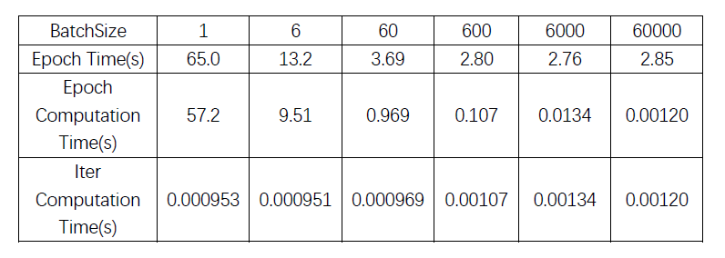
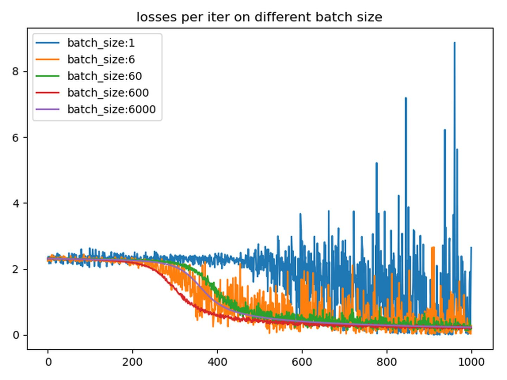
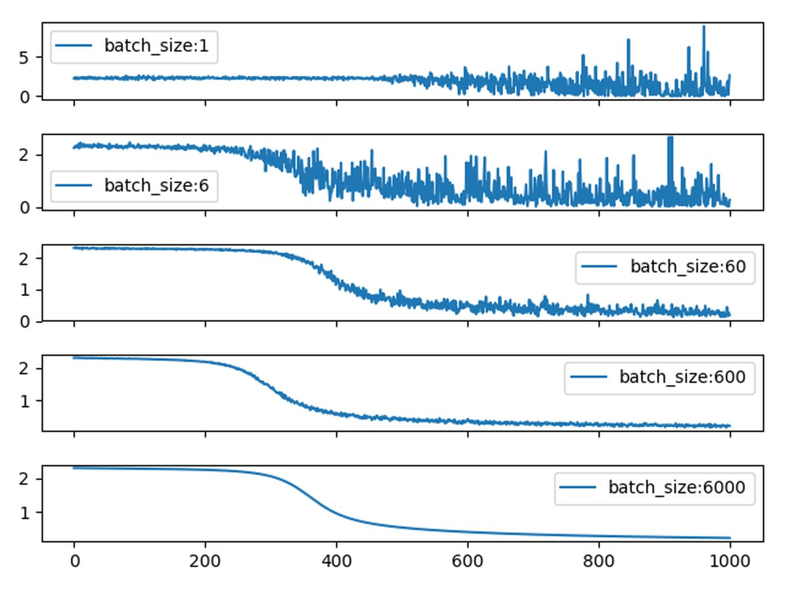
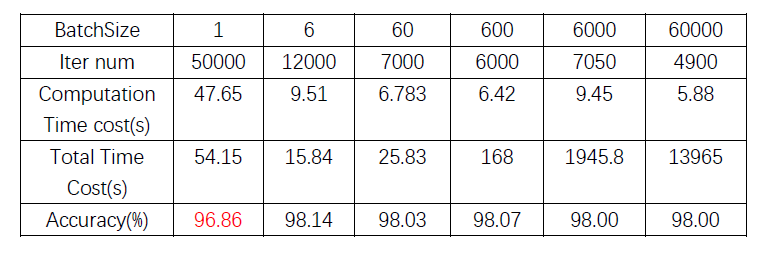

深度学习Batch Size如何调参

# 1.Batch size如何调参

------

## 1.1 浅析batch size影响

​		深度学习中batch size的大小对训练过程的影响是什么样的？

​		不考虑 batch normalization的情况下，batch size的大小决定了深度学习训练过程中的**完成每个epoch所需的时间和每次迭代（iteration）之间梯度的平滑程度。**

## 1.2 原理说明

​		对于一个大小为N的训练集，如果每个epoch中mini-batch的采样方法采用最常规的N个样本每个都采样一次，设mini-batch大小为b，那么每个epoch所需的迭代次数(正向+反向)为 $\frac{N}{b}$ , **因此完成每个epoch所需的时间大致也随着迭代次数的增加而增加。**

​		由于目前主流深度学习框架处理mini-batch的反向传播时，**默认都是先将每个mini-batch中每个instance得到的loss平均化之后再反求梯度**，也就是说每次反向传播的梯度是对mini-batch中每个instance的梯度平均之后的结果，所以b的大小决定了相邻迭代之间的梯度平滑程度，**b太小，相邻mini-batch间的差异相对过大，那么相邻两次迭代的梯度震荡情况会比较严重，不利于收敛；b越大，相邻mini-batch间的差异相对越小，虽然梯度震荡情况会比较小，一定程度上利于模型收敛，但如果b极端大，相邻mini-batch间的差异过小，相邻两个mini-batch的梯度没有区别了，整个训练过程就是沿着一个方向蹭蹭蹭往下走，很容易陷入到局部最小值出不来。**

​		总结下来：**batch size过小，话费时间多，同时梯度震荡严重，不利于收敛；batch size过大，不同batch的梯度方向没有任何变化，容易陷入局部极小值。**

## 1.3 Batch size与learning rate的关系

​		较小的batch size要设置小lr，batch size越小，相邻iter之间的loss震荡就越厉害，异常值对结果造成巨大扰动。较大的batch size，要设置大一点的lr，原因是大batch size每次迭代的梯度方向相对固定，大lr可以加速其收敛过程。

# 2.实验证明

------

​		用MINST做一下实验，超参数：SGD(lr = 0.02, momentum=0.5)，看一下不同batch size之间的区别：

## 2.1 迭代速度

​		表中 Epoch Time是在此batch size下完成一个epoch所需的所有时间，包括加载数据和计算的时间，Epoch Computation Time抛去了加载数据所需的时间。

 		其实纯粹cuda计算的角度来看，完成每个iter的时间大batch和小batch区别并不大，这可能是因为**本次实验中，反向传播的时间消耗要比正向传播大得多，所以batch size的大小对每个iter所需的时间影响不明显，未来将在大一点的数据库和更复杂的模型上做一下实验。**（因为反向的过程取决于模型的复杂度，与batchsize的大小关系不大，而正向则同时取决于模型的复杂度和batch size的大小。而本次实验中反向的过程要比正向的过程时间消耗大得多，所以batch size的大小对完成每个iter所需的耗时影响不大。）

​		完成每个epoch运算的所需的全部时间主要卡在：1. load数据的时间，2. 每个epoch的iter数量。 因此对于每个epoch，不管是纯计算时间还是全部时间，大体上还是大batch能够更节约时间一点，但随着batch增大，iter次数减小，完成每个epoch的时间更取决于加载数据所需的时间，此时也不见得大batch能带来多少的速度增益了。

## 2.2 梯度平滑度

​	不同batch size下的梯度平滑度，选取每个batch size下前1000个iter的loss，来看一下loss的震荡情况：

如果感觉这张图片不太好看，可以看一下这张图：

​		由于现在绝大多数的框架在进行mini-batch的反向传播的时候，默认都是将batch中每个instance的loss平均化之后在进行反向传播，所以相对大一点的batch size能够防止loss震荡的情况发生。从这两张图中可以看出batch size越小，相邻iter之间的loss震荡就越厉害，相应的，反传回去的梯度的变化也就越大，也就越不利于收敛。同时很有意思的一个现象，batch size为1的时候，loss到后期会发生爆炸，这主要是lr=0.02设置太大，所以某个异常值的出现会严重扰动到训练过程。**这也是为什么对于较小的batchsize，要设置小lr的原因之一，避免异常值对结果造成的扰巨大扰动。而对于较大的batchsize，要设置大一点的lr，原因则是大batch每次迭代的梯度方向相对固定，大lr可以加速其收敛过程。**

## 2.3 收敛速度

​		在衡量不同batch size的优劣这一点伤，我选用衡量不同batch size在同样参数下的收敛速度快慢的方法。

​		下表中可以看出，在minst数据集上，从整体时间消耗上来看（考虑了加载数据所需的时间），同样的参数策略下 (lr = 0.02, momentum=0.5 ），要模型收敛到accuracy在98左右，batch size在 6 - 60 这个量级能够花费最少的时间，而batch size为1的时候，收敛不到98；batch size过大的时候，因为模型收敛快慢取决于梯度方向和更新次数，所以大batch尽管梯度方向更为稳定，但要达到98的accuracy所需的更新次数并没有量级上的减少，所以也就需要花费更多的时间，当然这种情况下可以配合一些调参策略比如warmup LR，衰减LR等等之类的在一定程度上进行解决（这个先暂且按下不表），但也不会有本质上的改善。

​		不过单纯从计算时间上来看，大batch还是可以很明显地节约所需的计算时间的，原因前面讲过了，主要因为本次实验中纯计算时间中，反向占的时间比重远大于正向。

​		**直接比较不同batch size下的绝对收敛精度来衡量batch size的好坏是没有太大意义的，因为不同的batch size要配合不同的调参策略用才能达到其最佳效果，而要想在每个batch size下都找到合适的调参策略那可太难了，所以用这种方法来决定batch size未免有点武断。**

