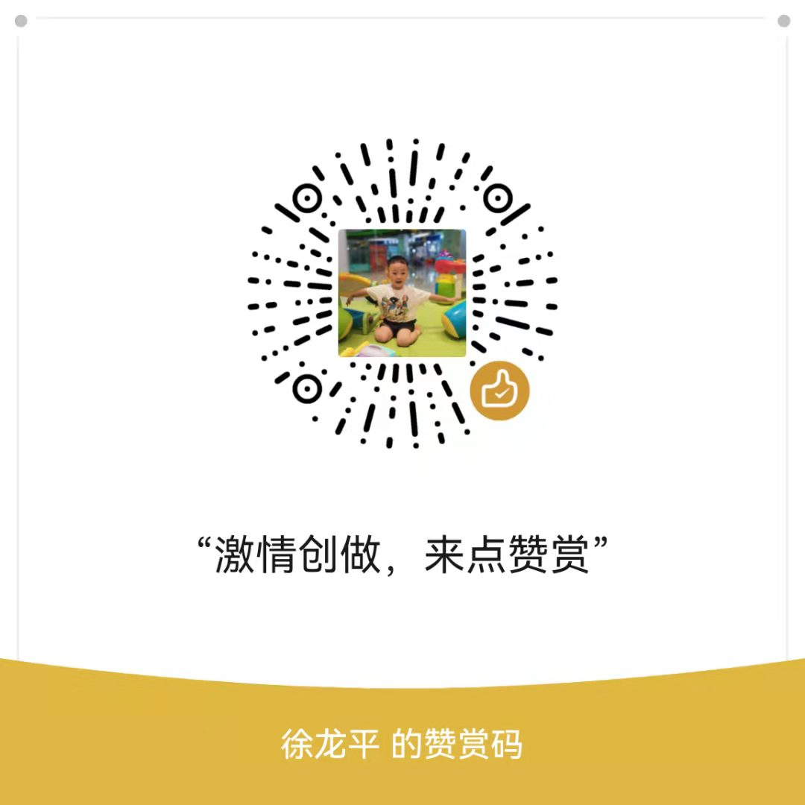

用户画像构建方法

## 1.用户画像建模步骤

​	精细化运营将是长久主题，有数据，有数据分析能力才能让用户得到更好的体验。

​	用户画像建模要解决三个问题，第一：用户从哪里来？需要统一标识用户ID，方便我们对用户后续行为进行跟踪。第二：这些用户是谁？需要对这些用户进行标签化，方便我们对用户行为进行理解。第三：用户要到哪里去？要将这些用户画像与我们业务相关联，提升我们的转化率，或者降低我们的流失率。

​	

### 1.1 用户打标签

​	标签有很多，且不同的产品，标签的选择范围也不同，这么多的标签，怎么划分能既方便记忆，又能保证用户画像的全面性呢？

​	**用户消费行为分析**，从4个维度来进行标签划分：	

1. 用户标签

   性别、年龄、地狱、收入、学历、职业等，包括了用户的基础属性

2. 消费标签

   消费习惯、购买意向、是否对促销敏感，这些统计用户的消费习惯

3. 行为标签

   时间段、频次、时长、访问路径，这些是通过分析用户行为，来得到他们使用App的习惯

4. 内容分析

   对用户平时浏览的内容，尤其是停留时间长、浏览次数多的内容进行分析，分析出用户对那些内容感兴趣，比如金融、娱乐、教育、体育、时尚、科技等。

用户画像可以为企业带来什么价值？从用户生命周期的三个阶段来划分业务价值，包括：获客、粘客和留客。

- 获客：如何进行拉新，通过更精准的营销获取客户
- 粘客：个性化推荐，搜索排序，场景运营等
- 留客：流失率预测，分析关键点降低流失率

## 1.2 数据处理阶段划分用户建模过程

​	按照数据处理阶段来划分用户画像的建模过程，可以分为数据层、算法层、业务层。

- 数据层

  用户消费行为里的标签，事实标签：作为数据客观记录

- 算法层

  透过行为算出的用户建模，模型标签：作为用户画像的分类标识

- 业务层

  获客、粘客、留客的手段，预测标签：作为业务关联的结果

所以这个标签化的流程，就是通过数据层的“事实标签”，在算法层进行计算，打上“模型标签”的分类结果，最后指导业务层，得出“预测标签”

## 1.3 用户画像构建方法

​	如何构建用户画像？按照对用户向量化的手段来分，用户画像构建方法分三类：

1. 第一类就是查户口

   直接使用原始数据作为用户画像的内容，如注册资料等人口统计学信息，或者购买历史，阅读历史等，除了数据清洗等工作，数据本身并没有做任何抽象和归纳。这就跟查户口一样，没什么技术含量，但通常对于用户冷启动等场景非常有用。

2. 第二类就是堆数据

   方法就是堆积历史数据，做统计工作，这是最常见的用户画像数据，**常见的兴趣标签，从历史行为数据中去挖掘出标签，然后在标签维度上做数据统计，用统计结果作为量化结果**。这一类数据贡献了常见的炫酷用户画像。

3. 第三类就是黑盒子

   用户机器学习方法，学习出人类无法直观理解的稠密向量，也最不被非技术人员重视，但实际上在推荐系统中承担的作用非常大。

比如使用潜语义模型构建用户阅读兴趣，或者使用矩阵分解得到的隐因子，或者使用深度学习模型学习用户的Embedding向量。这一类用户画像数据因为通常是不可解释，不能直接被人看懂。

# 2.美团外卖的用户画像如何设计

​	按照**用户消费行为分析**的准则来进行设计：

1. 用户标签

   性别、年龄、家乡、居住地、收获地址、婚姻、宝宝信息、通过何种渠道进行的注册

2. 消费标签

   消费口味、消费均价、团购等级、预定使用等级、排队使用等级、外卖等级

3. 行为标签

   点外卖时间段、使用频次、平均点餐用时、访问路径

4. 内容分析

   基于用户平时浏览的内容进行统计，包括餐饮的口味、优惠券敏感度等。

当有了“用户消费行为分析”的标签之后，就可以更好地理解业务：

比如一个经常买沙拉的人，一般很少吃夜宵。同样，一个经常吃夜宵的人，吃小龙虾的概率可能远高于其他人。这些结果都是通过数据挖掘中的**关联分析**得出的。

具体在业务层上，可以基于标签产生哪些业务价值呢？

- 在获客上

  我们可以找到优势的宣传渠道，如何通过个性化的宣传手段，吸引有潜在需求的用户，并刺激其转化。

- 在粘客上

  **如何提升用户的单价和消费频次**，方法可以包括购买后的个性化推荐、针对优质用户进行优质高价商品的推荐、以及重复购买，比如**通过红包、优惠等方式激励对优惠敏感的人群，提升购买频次**。

- 在留客上

  预测用户是否可能会从平台上流失。在营销领域，关于用户留存有一个观点——如果将顾客流失降低5%，公司利润将提升25%～85%，可以看出留存率是多么重要。用户流失的可能会包括多种情况，比如用户体验、竞争对手、需求变化等，通过预测用户的流失率可以大幅降低用户留存的运营成本。

# 3.保险代理人画像

1. 用户标签

   性别、年龄、最高学历、是否兼职、服务年限、公司、活动率、保单件数、继续率、

2. 交易标签

   险种类型、交易均价、优惠券敏感度、

3. 行为标签

4. 内容分析

<big><b>赞赏码</b></big>

------

<b>写文不易，欢迎各种花式赞赏：</b>
																					

